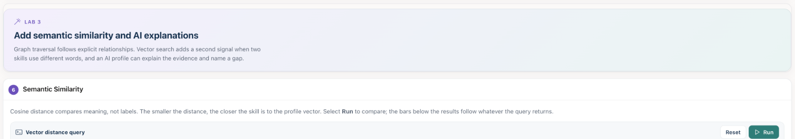
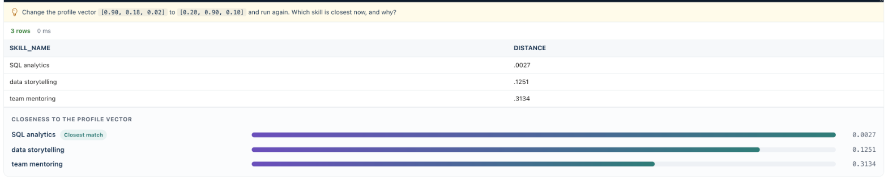
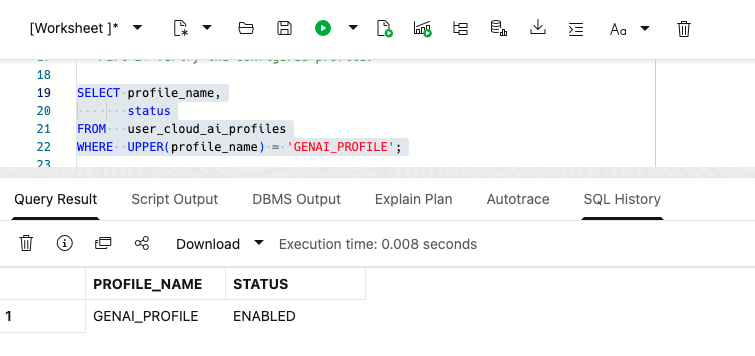
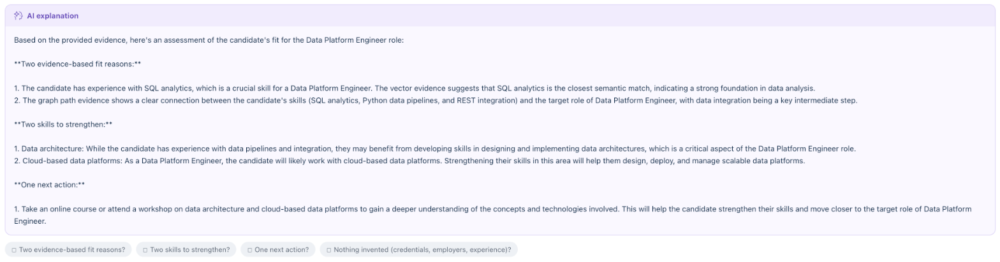

# Add Semantic Similarity and AI Explanations

## Introduction

Graph traversal follows explicit relationships. Vector search adds a second signal when two skills use different words. An AI profile can explain the evidence and name a gap.

Estimated Time: 15 minutes

### Objectives

In this lab, you will:

- Compare a profile vector with skill vectors using cosine distance.
- Check the AI profile available to `GHC_USER`.
- Request an evidence-based explanation for one candidate role.

## Task 1: Compare semantically related skills

1. Switch back to Career Explorer and scroll to the **Lab 3** section.

    

2. In **Semantic Similarity**, review the query. It uses small illustrative vectors.

    ```sql
    <copy>
    WITH candidate_skills (skill_name, skill_embedding) AS (
      SELECT 'SQL analytics',     TO_VECTOR('[0.96, 0.12, 0.01]') FROM dual UNION ALL
      SELECT 'data storytelling', TO_VECTOR('[0.72, 0.61, 0.04]') FROM dual UNION ALL
      SELECT 'REST integration',  TO_VECTOR('[0.15, 0.08, 0.98]') FROM dual UNION ALL
      SELECT 'team mentoring',    TO_VECTOR('[0.54, 0.86, 0.09]') FROM dual
    ), profile_vector AS (
      SELECT TO_VECTOR('[0.90, 0.18, 0.02]') AS embedding
      FROM dual
    )
    SELECT c.skill_name,
           ROUND(VECTOR_DISTANCE(c.skill_embedding, p.embedding, COSINE), 4) AS distance
    FROM   candidate_skills c
           CROSS JOIN profile_vector p
    ORDER BY distance
    FETCH FIRST 3 ROWS ONLY;
    </copy>
    ```

3. Select **Run**.

4. Read the results from the smallest distance to the largest. A smaller cosine distance means a closer match in this example. The bars below the results show the same distances.

    

5. Change the profile vector `[0.90, 0.18, 0.02]` to `[0.20, 0.90, 0.10]` and select **Run** again. Note which skill is closest now. Select **Reset** to restore the query.

6. Compare the signals:

    - The graph follows explicit relationships.
    - Vector search finds related meaning even when labels differ.
    - A useful recommendation combines both signals with role and position filters.

## Task 2: Check the AI profile

1. Switch back to OCI and click Database actions -> SQL.

    

2. Ensure you are logged in with your GHC_USER account. If you're logged in with ADMIN, log out and log back in using your GHC_USER account.

3. Run the profile query.

    ```sql
    <copy>
    SELECT profile_name,
           status
    FROM   user_cloud_ai_profiles
    WHERE  UPPER(profile_name) = 'GENAI_PROFILE';
    </copy>
    ```

4. Confirm that `GENAI_PROFILE` is enabled in the `GHC_USER` schema. `USER_CLOUD_AI_PROFILES` shows profiles in the connected user's schema.

    

## Task 3: Explain one role with evidence

1. Return to Career Explorer. In **AI Explanation**, review the evidence the AI profile receives: the target role, observed skills, graph path, and vector match.

    

2. Select **Generate explanation**, the sparkle icon at the top right of **AI Explanation**. The app sends this explanation request to `GENAI_PROFILE`:

    ```sql
    <copy>
    SELECT DBMS_CLOUD_AI.GENERATE(
             prompt       => q'[
        Using only the evidence below, explain whether the candidate has a plausible
        path toward the target role. Return: (1) two evidence-based fit reasons,
        (2) two skills to strengthen, and (3) one next action. Do not invent
        credentials, employers, or experience.

        Target role: Data Platform Engineer
        Observed skills: SQL analytics; Python data pipelines; REST integration
        Graph path evidence: skill -> data integration -> data platform engineer
        Vector evidence: SQL analytics is the closest semantic match.
        ]',
             profile_name => 'GENAI_PROFILE',
             action       => 'chat'
           ) AS explanation
    FROM dual;
    </copy>
    ```

3. Check for three parts:

    - Two evidence-based reasons for fit.
    - Two skills to strengthen.
    - One concrete next action.

    

4. Compare the answer with the graph. Treat the explanation as interpretation, not proof. Keep the graph paths and vector distances visible.

5. Write down one role to investigate, one skill to strengthen, and one data point you still need.

## Learn More

- [AI Vector Search in Oracle Database](https://docs.oracle.com/en/database/oracle/oracle-database/26/vecse/overview-ai-vector-search.html)
- [Use Retrieval-Augmented Generation and Vectors](https://docs.oracle.com/en/database/oracle/oracle-database/26/selai/use-retrieval-augmented-generation-and-vectors.html)
- [Manage AI Profiles](https://docs.oracle.com/en-us/iaas/autonomous-database-serverless/doc/select-ai-manage-profiles.html)

## Acknowledgements

- **Authors** - Denise Myrick, Ramu Murakami Gutierrez, Ruiqi Jiang
- **Last Updated By/Date** - Denise Myrick, Oracle AI Database Product Management, October 2026
