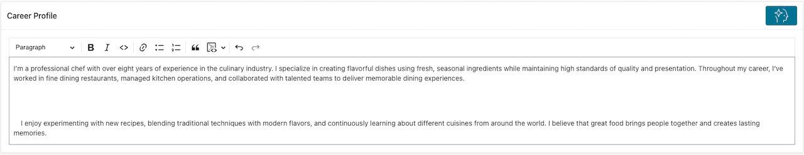
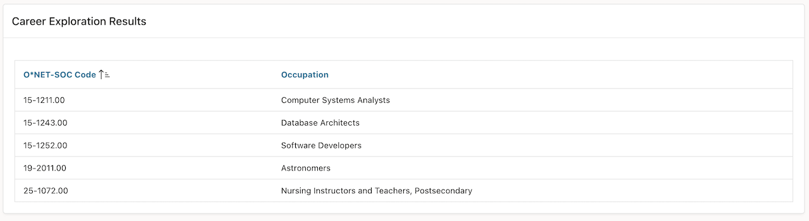
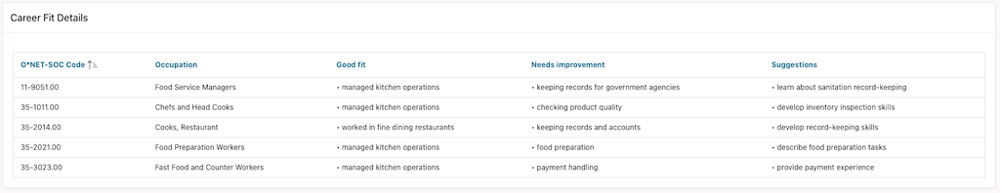
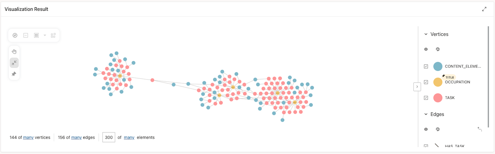
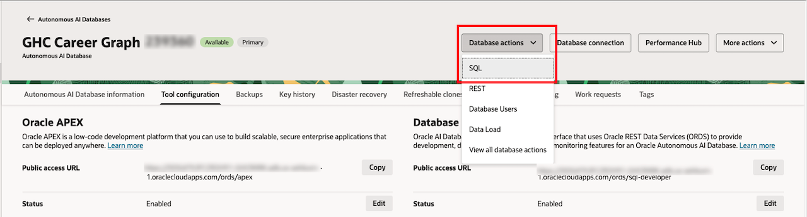
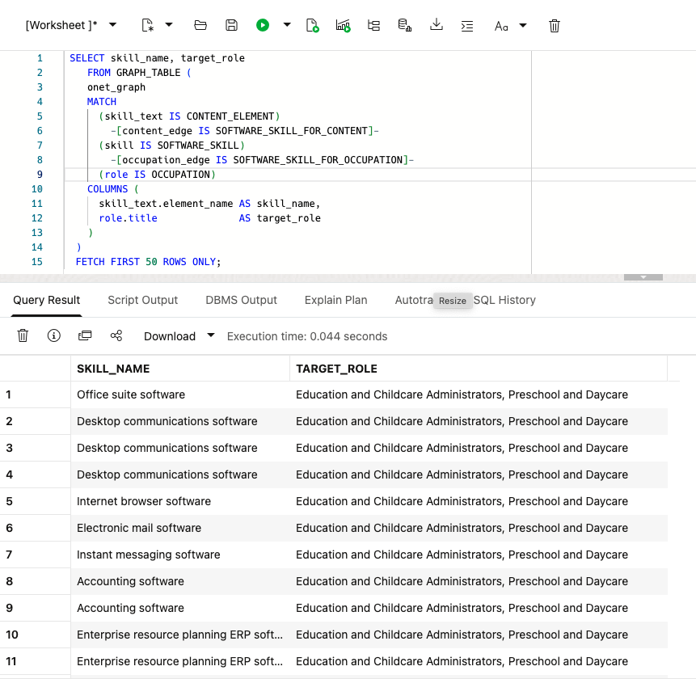

# Traverse Skills to Discover Roles

## Introduction

Now turn your experience into graph evidence. The Career Explorer submits your profile, returns candidate occupations, and shows the path behind each result.

Estimated Time: 15 minutes

### Objectives

In this lab, you will:

- Submit a personal or sample skills profile.
- Read the role results and graph visualization.
- Inspect the stored query and its one-to-three-hop pattern.

## Task 1: Submit a skills profile

1. In **Career Explorer**, enter your experience or use one of these samples:

    ```text
    I’m a professional chef with over eight years of experience in the culinary industry. I specialize in creating flavorful dishes using fresh, seasonal ingredients while maintaining high standards of quality and presentation. Throughout my career, I’ve worked in fine dining restaurants, managed kitchen operations, and collaborated with talented teams to deliver memorable dining experiences.

    I enjoy experimenting with new recipes, blending traditional techniques with modern flavors, and continuously learning about different cuisines from around the world. I believe that great food brings people together and creates lasting memories.
    ```

    ```text
    I’m a Marketing Manager with over six years of experience in developing and executing marketing strategies that drive brand awareness, customer engagement, and business growth. I have experience managing both digital and traditional marketing campaigns, conducting market research, and working closely with sales and product teams to achieve organizational goals.

    I’m passionate about understanding customer behavior and using data-driven insights to create effective marketing campaigns. Throughout my career, I’ve led successful product launches, managed social media and content marketing initiatives, and optimized campaign performance to maximize return on investment.
    ```

    ```text
    I build SQL data models and Python data pipelines, create dashboards, work with REST APIs, and explain technical results to business stakeholders. I mentor teammates and turn ambiguous questions into practical solutions.
    ```

    ```text
    I have experience planning and delivering engaging music lessons for children
    and adults in school and private settings. I teach guitar, voice, piano, music
    theory, choral conducting, general music, and classroom music. I have experience
    with lesson planning, classroom management, Google Classroom, Google Meet,
    Microsoft Teams, and educational technology. I enjoy music education and
    lifelong learning.
    ```

2. Select **Explore career options**. Wait for the results to refresh.

    

3. In **Career Exploration Results**, record one role that interests or surprises you.

    

## Task 2: Explore the graph result

1. In **Visualization Result**, move the network and select a vertex. Identify the starting skills, intermediate relationships, and target roles.

    

2. Find an indirect path. A two-hop or three-hop path shows how a skill reaches a role through an intermediate relationship.

3. Review **Career Fit Details**. Note the **Good fit**, **Needs improvement**, and **Suggestions** sections.

    

## Task 3: Inspect the query behind the visualization

1. Switch back to OCI and click Database actions -> SQL.

    

2. Ensure you are logged in with your GHC_USER account. If you're logged in with ADMIN, log out and log back in using your GHC_USER account.

3. Review the variable-length pattern below.

    ```sql
    SELECT skill_name, target_role
    FROM GRAPH_TABLE (
    onet_graph
    MATCH
      (skill_text IS CONTENT_ELEMENT)
        -[content_edge IS SOFTWARE_SKILL_FOR_CONTENT]-
      (skill IS SOFTWARE_SKILL)
        -[occupation_edge IS SOFTWARE_SKILL_FOR_OCCUPATION]-
      (role IS OCCUPATION)
    COLUMNS (
      skill_text.element_name AS skill_name,
      role.title              AS target_role
      )
    )
    FETCH FIRST 50 ROWS ONLY;
    ```

    

4. Return to APEX and answer: **Which role became visible because the graph followed an intermediate connection?**

## Learn More

- [Graph Pattern in Oracle Database 26ai](https://docs.oracle.com/en/database/oracle/oracle-database/26/sqlrf/graph-pattern.html)
- [Explore Operational Property Graphs in Oracle AI Database](https://livelabs.oracle.com/ords/r/dbpm/livelabs/view-workshop?P0_REDIRECT=Y&wid=3978)

## Acknowledgements

- **Last Updated By/Date** - Denise Myrick, Oracle Database Product Management, October 2026
