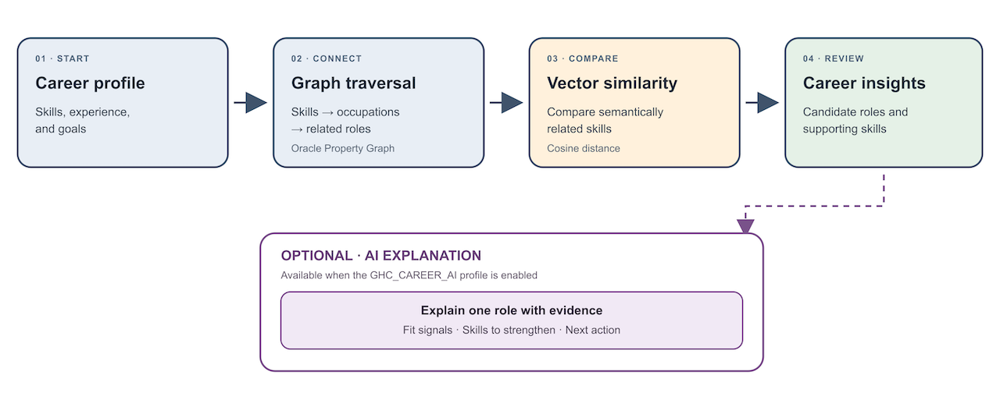

# Find Roles Hidden in Your Skills using Graphs

## Introduction

### About this Workshop

Your job title describes where you work today. It does not show every role your experience can support. This workshop uses a career skills graph to connect skills, occupations, and open positions.

You will use Oracle Autonomous AI Database, Database Actions, and an APEX Career Explorer. You will follow multi-hop paths, compare related skills with vector search, and review an AI explanation.

### Prerequisites

- An Oracle Autonomous AI Database 26ai environment with the career tables, property graph, and task packages already provisioned in the `GHC_USER` schema.
- Database Actions access as `GHC_USER`, an enabled APEX workspace, and its APEX runtime account.
- For the AI explanation in Lab 3, an enabled `GENAI_PROFILE` AI profile and provider access.
- Basic SQL familiarity. No graph experience is required.

### Objectives

In this workshop, you will:

- Verify `GHC_USER` access and import the Career Explorer application.
- Follow multi-hop graph paths to find connected roles.
- Compare semantic neighbors with Oracle AI Vector Search.
- Ask an AI profile to explain fit and identify a skill gap.

Estimated Workshop Time: 45 minutes

## Workshop Flow

1. **Lab 1: Prepare the Career Graph Environment** (15 minutes): Verify the user, APEX app, and support objects.
2. **Lab 2: Traverse Skills to Discover Roles** (15 minutes): Submit a profile and inspect the graph query.
3. **Lab 3: Add Semantic Similarity and AI Explanations** (15 minutes): Compare vectors and explain one role.

Career Explorer follows the same structure. Each lab has its own section on one page, and the numbered steps 1 to 7 match the tasks in Labs 2 and 3.

## Acknowledgements

- **Authors** - Denise Myrick, Ramu Murakami Gutierrez, Ruiqi Jiang
- **Last Updated By/Date** - Denise Myrick, Oracle AI Database Product Management, October 2026
