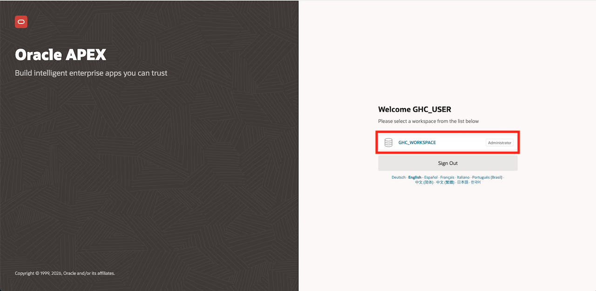
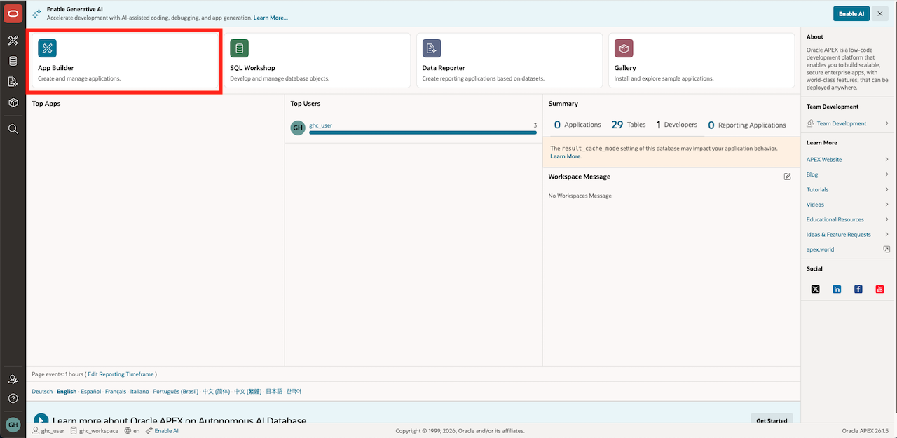
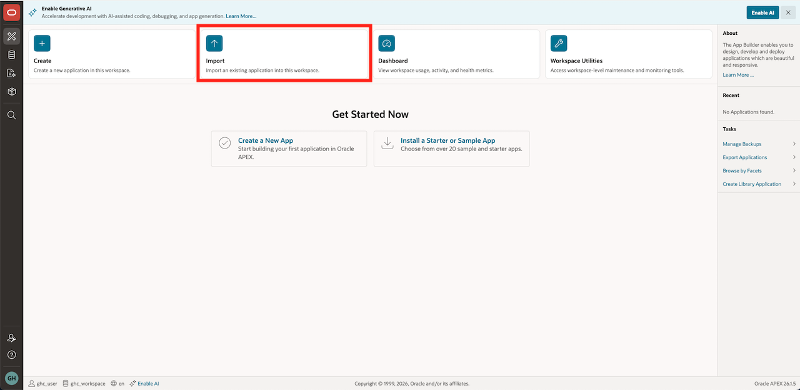
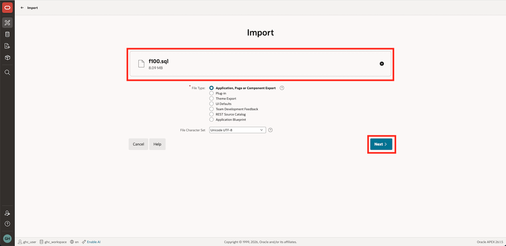
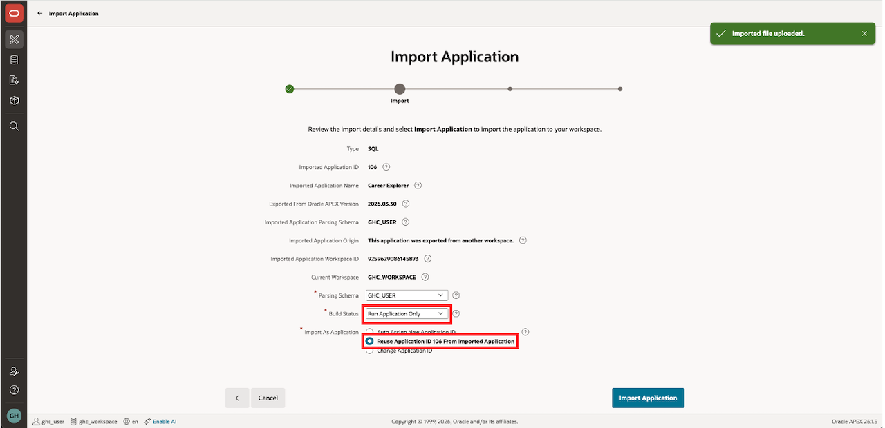
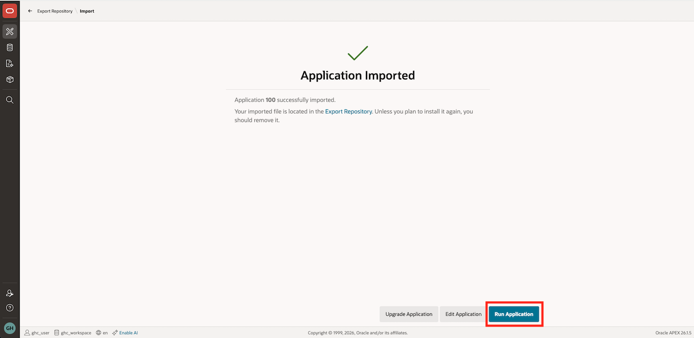
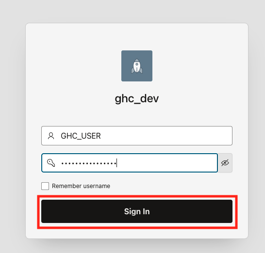
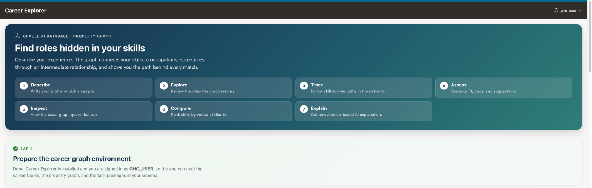

# Prepare the Career Graph Environment

## Introduction

The Career Explorer runs in an APEX application backed by Oracle Autonomous AI Database. Import the application and confirm that its support objects exist.

Estimated Time: 10 minutes

### Objectives

In this lab, you will:

- Import the Career Explorer application into the enabled APEX workspace.
- Open the Career Explorer entry page.

## Task 1: Download application from Github

1. Navigate to [GitHub](https://github.com/oracle-samples/oracle-graph/tree/master/shared/demos) and download the Career Explorer application to your desktop.

## Task 2: Log into APEX

1. Click the **Navigation Menu** in the upper left, navigate to **Oracle AI Database**, and select **Autonomous AI Database**.

    

2. Select the compartment provided on **View Login Info**, and click on the **Display Name** for the **Autonomous AI Database**.

    

3. Click Tool configuration then **Copy** the Public access URL under Oracle APEX. Paste this link in a new tab in your browser.

    

4. Click **GHC_WORKSPACE** to log into the APEX workspace.

    

## Task 3: Import and launch the APEX application

1. Select **App Builder > Import**.

    

    

2. Upload the application that you downloaded in Task 1. Click **Next**.

    

3. Review the settings. Use the `ghc_dev` application name, map the parsing schema to `GHC_USER`, under Build Status, click `Run Application`, and under Import As Application, select `Reuse Application ID 100 From Imported Application`. Click **Import Application**.

    

4. Click **Run Application**.

    

5. Use your GHC_USER and password to log into the application

    

6. Career Explorer opens on one page. The numbered steps in the banner map to the tasks in Labs 2 and 3. The **Lab 1** section confirms that setup is complete and shows the signed-in user.

    

## Acknowledgements

- **Authors** - Denise Myrick, Ramu Murakami Gutierrez, Ruiqi Jiang
- **Last Updated By/Date** - Denise Myrick, Oracle AI Database Product Management, October 2026
