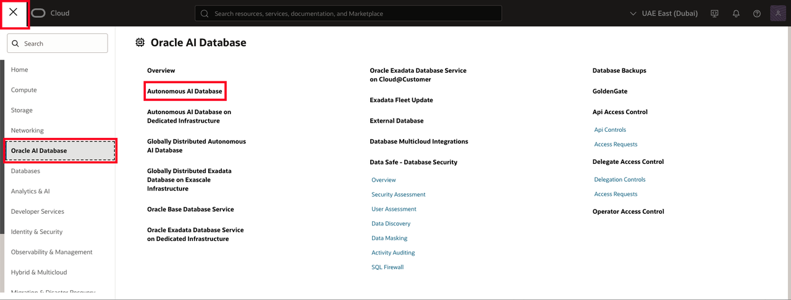
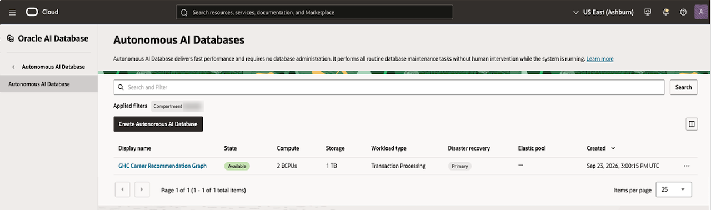
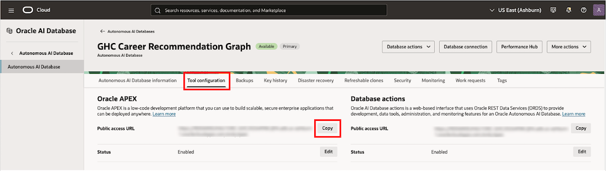

# Prepare the Career Graph Environment

## Introduction

The Career Explorer runs in an APEX application backed by Oracle Autonomous AI Database. Verify the pre-provisioned `GHC_USER` schema and its privileges, then import the application. The supplied application export does not install the career data, property graph, or task packages.

Estimated Time: 15 minutes

### Objectives

In this lab, you will:

- Verify the pre-provisioned `GHC_USER` account and its required privileges.
- Import application 100 into the enabled APEX workspace.
- Open the Career Explorer entry page and confirm its support objects are available.

## Task 1: Verify the database account

1. In LiveLabs, open **View Login Info** and select **Launch OCI**. In the OCI Console navigation menu, select **Oracle AI Database > Autonomous AI Database**.

    Use the region listed in **View Login Info** for your database; the region names in these screenshots are examples.

    

2. Select the compartment provided in **View Login Info**, then select the **GHC Career Recommendation Graph** database.

    

3. On the database details page, select **Database Actions**, open the SQL Worksheet, and sign in as `GHC_USER`. Run [verify-ghc-user.sql](files/verify-ghc-user.sql).

4. Confirm these results:

    - The connected user is `GHC_USER`.
    - The `GRAPH_DEVELOPER` role or required graph privilege appears.
    - `EXECUTE` on `DBMS_CLOUD_AI` appears in the received grants.
    - `GHC_CAREER_AI` is enabled if you plan to complete the optional AI task in Lab 3.

5. If the account or graph access is missing, stop and ask the instructor to provision it. If the `DBMS_CLOUD_AI` grant or `GHC_CAREER_AI` profile is missing, skip the standalone AI explanation in Lab 3 and ask the instructor whether the Career Explorer task packages need those settings. Do not create a blank replacement schema; the Career Explorer depends on the preloaded objects in `GHC_USER`.

## Task 2: Confirm the application support objects

1. Ask the instructor to confirm that the `GHC_USER` schema contains these objects:

    - `CAREER_PROFILE_TASK_HISTORY`
    - `CAREER_PROFILE_AGENT_TOOLS.RUN_PROFILE_TASKS`
    - `CAREER_PROFILE_TASK4_RUNNER.RUN`
    - The career tables and property graph used by the application

2. Stop if any object is missing. The APEX import does not install these dependencies.

## Task 3: Import and launch the APEX application

1. On the database details page, open **Tool configuration**. Under **Oracle APEX**, copy the **Public access URL** and open it in a new browser tab.

    

2. Sign in to the enabled APEX workspace with the workshop APEX account. Select **App Builder > Import**. Ask the workspace administrator for an account if one has not been provided.

3. Upload [f100.sql](files/f100.sql). Keep application **100**, use the `ghc_dev` application name, and map the parsing schema to `GHC_USER`.

    The exported APEX application keeps the name `ghc_dev`; its parsing schema is `GHC_USER`.

4. Under **Import As Application**, select **Reuse Application ID 100 From Imported Application**. Click **Import Application**.

5. Open application 100 and select **Run**. Sign in with the APEX account.

    The APEX account and the `GHC_USER` database user are separate accounts.

6. Open **Career Explorer**. Confirm that the page shows a profile editor and an **Explore career options** button.

## Learn More

- [Create a Graph User](https://docs.oracle.com/en/cloud/paas/autonomous-database/csgru/create-graph-user.html)
- [Create and Manage Users on Autonomous AI Database](https://docs.oracle.com/en/cloud/paas/autonomous-database/serverless/adbsb/manage-users-create.html)
- [Manage AI Profiles](https://docs.oracle.com/en-us/iaas/autonomous-database-serverless/doc/select-ai-manage-profiles.html)

## Acknowledgements

- **Oracle documentation** - [Create a Graph User](https://docs.oracle.com/en/cloud/paas/autonomous-database/csgru/create-graph-user.html).
- **Last Updated By/Date** - Denise Myrick, Oracle AI Database Product Management, September 2026
