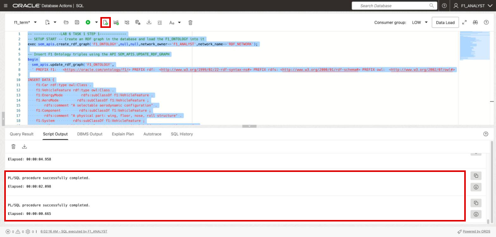
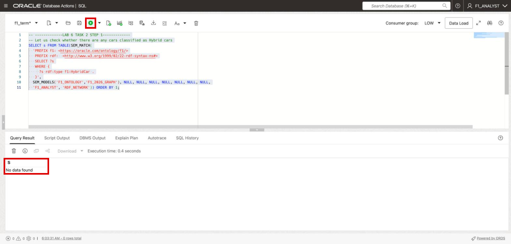
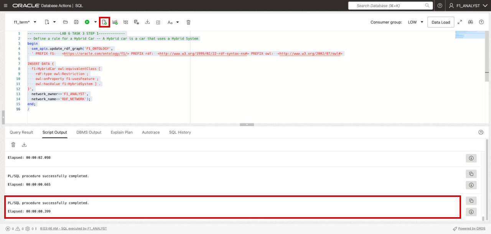
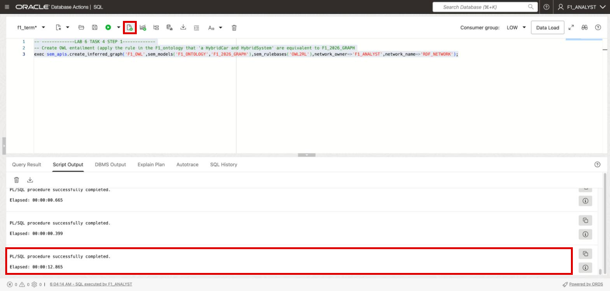
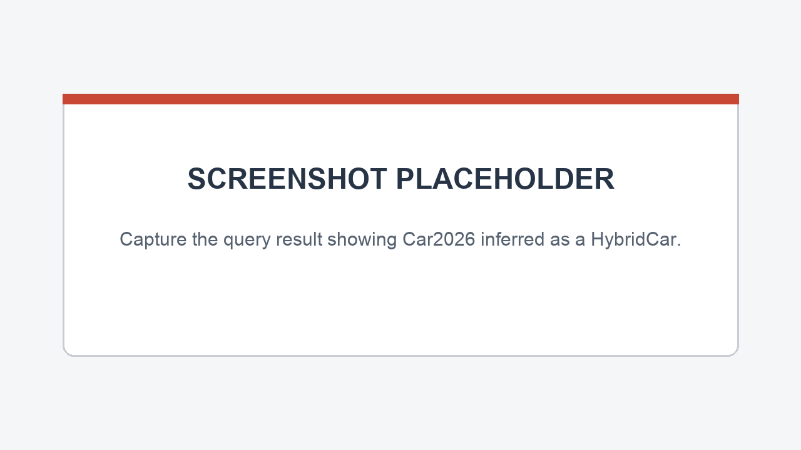

# Bonus Lab: Use OWL Inference to Classify a Hybrid Car

## Introduction

The Lab 2 prompt included the F1 ontology and used it to guide fact extraction. In this bonus lab, load the same terms into the RDF model `F1_ONTOLOGY`. Add an OWL rule and infer a class from facts in `F1_2026_GRAPH`.

This lab is optional. Complete Lab 3 first so `F1_2026_GRAPH` is available.

Estimated Time: 10 minutes

### Objectives

In this lab, you will:

- Load the F1 ontology into an RDF model.
- Define a `HybridCar` using an OWL restriction.
- Apply OWL 2 RL inference and query the inferred type.

## Task 1: Load the F1 ontology

1. Create the RDF graph `F1_ONTOLOGY` and insert the ontology triples. It holds the vocabulary from the Lab 2 prompt. Run both statements with **Run Script**.

    ```sql
    <copy>
    -- -------------LAB 6 TASK 1 STEP 1-------------
    -- SETUP START -- Create an RDF graph in the database and load the F1_ONTOLOGY into it
    exec sem_apis.create_rdf_graph('F1_ONTOLOGY',null,null,network_owner=>'F1_ANALYST',network_name=>'RDF_NETWORK');

    -- Insert F1 Ontology triples using the API SEM_APIS.UPDATE_RDF_GRAPH
    begin
      sem_apis.update_rdf_graph('F1_ONTOLOGY',
      ' PREFIX f1:   <https://oracle.com/ontology/f1/> PREFIX rdf:  <http://www.w3.org/1999/02/22-rdf-syntax-ns#> PREFIX rdfs: <http://www.w3.org/2000/01/rdf-schema#> PREFIX owl:  <http://www.w3.org/2002/07/owl#>

    INSERT DATA {
        f1:Car rdf:type owl:Class .
        f1:VehicleFeature rdf:type owl:Class .
        f1:EnergyMode         rdfs:subClassOf f1:VehicleFeature .
        f1:AeroMode         rdfs:subClassOf f1:VehicleFeature ;
            rdfs:comment "A selectable aerodynamic configuration" .
        f1:Component         rdfs:subClassOf f1:VehicleFeature ;
            rdfs:comment "A physical part: wing, floor, nose, roll structure" .
        f1:System         rdfs:subClassOf f1:VehicleFeature ;
            rdfs:comment "A technical system: power unit, hybrid system, active aero" .
        f1:LegacySystem         rdfs:subClassOf f1:VehicleFeature .
        f1:Tyre         rdf:type owl:Class .
        f1:FrontTyre         rdfs:subClassOf f1:Tyre .
        f1:RearTyre         rdfs:subClassOf f1:Tyre .
        f1:Measurement         rdf:type owl:Class .
        f1:LengthMeasurement         rdfs:subClassOf f1:Measurement .
        f1:WidthMeasurement         rdfs:subClassOf f1:Measurement .
        f1:WeightMeasurement         rdfs:subClassOf f1:Measurement .
        f1:EnergyMeasurement         rdfs:subClassOf f1:Measurement .
        f1:PowerMeasurement         rdfs:subClassOf f1:Measurement .
        f1:Unit         rdf:type owl:Class .
        f1:MeasurementKind         rdf:type owl:Class .
        f1:Minimum         rdf:type f1:MeasurementKind .
        f1:Maximum         rdf:type f1:MeasurementKind .
        f1:Reduction         rdf:type f1:MeasurementKind .
        f1:DRS         rdf:type f1:LegacySystem .
        f1:ActiveAero         rdf:type f1:System .
        f1:PowerUnit         rdf:type f1:System .
        f1:HybridSystem         rdf:type f1:System .
        f1:usesFeature         rdf:type owl:ObjectProperty .
        f1:usesEnergyMode         rdf:type owl:ObjectProperty ;
            rdfs:subPropertyOf f1:usesFeature .
        f1:usesAeroMode         rdf:type owl:ObjectProperty ;
            rdfs:subPropertyOf f1:usesFeature .
        f1:replacesSystem         rdf:type owl:ObjectProperty ;
            owl:inverseOf f1:systemReplacedBy .
        f1:disables         rdf:type owl:ObjectProperty .
        f1:hasMeasurement         rdf:type owl:ObjectProperty .
        f1:hasUnit         rdf:type owl:ObjectProperty .
        f1:measurementKind         rdf:type owl:ObjectProperty .
        f1:hasValue         rdf:type owl:DatatypeProperty .
    }',
      network_owner=>'F1_ANALYST',
      network_name=>'RDF_NETWORK');
    end;
    /
    -- SETUP END
    </copy>
    ```

    

## Task 2: Check for a HybridCar before inference

1. Run the query. It searches the ontology and data graphs for resources with type `f1:HybridCar`.

    ```sql
    <copy>
    -- -------------LAB 6 TASK 2 STEP 1-------------
    -- Let us check whether there are any cars classified as Hybrid cars
    SELECT s FROM TABLE(SEM_MATCH(
      'PREFIX f1: <https://oracle.com/ontology/f1/>
       PREFIX rdf:  <http://www.w3.org/1999/02/22-rdf-syntax-ns#>
       SELECT ?s
       WHERE {
         ?s rdf:type f1:HybridCar .
       }',
      SEM_MODELS('F1_ONTOLOGY','F1_2026_GRAPH'), NULL, NULL, NULL, NULL, NULL, NULL, NULL,
      'F1_ANALYST', 'RDF_NETWORK')) ORDER BY 1;
    </copy>
    ```

    The query returns no rows because the graph has no `HybridCar` type yet.

    

## Task 3: Define a HybridCar in the ontology

1. Add an OWL restriction that says a `HybridCar` uses a `HybridSystem` as a feature.

    ```sql
    <copy>
    -- -------------LAB 6 TASK 3 STEP 1-------------
    -- Define a rule for a Hybrid Car -- A Hybrid car is a car that uses a Hybrid System
    begin
      sem_apis.update_rdf_graph('F1_ONTOLOGY',
      ' PREFIX f1:   <https://oracle.com/ontology/f1/> PREFIX rdf:  <http://www.w3.org/1999/02/22-rdf-syntax-ns#> PREFIX owl:  <http://www.w3.org/2002/07/owl#>

    INSERT DATA {
      f1:HybridCar owl:equivalentClass [
        rdf:type owl:Restriction ;
        owl:onProperty f1:usesFeature ;
        owl:hasValue f1:HybridSystem ] .
    }',
      network_owner=>'F1_ANALYST',
      network_name=>'RDF_NETWORK');
    end;
    /
    </copy>
    ```

    

## Task 4: Create the inferred graph

1. Apply the OWL 2 RL rulebase to the ontology and the 2026 car graph.

    ```sql
    <copy>
    -- -------------LAB 6 TASK 4 STEP 1-------------
    -- Create OWL entailment (apply the rule in the F1_ontology that 'a HybridCar and HybridSystem' are equivalent to F1_2026_GRAPH
    exec sem_apis.create_inferred_graph('F1_OWL',sem_models('F1_ONTOLOGY','F1_2026_GRAPH'),sem_rulebases('OWL2RL'),network_owner=>'F1_ANALYST',network_name=>'RDF_NETWORK');
    </copy>
    ```

    

## Task 5: Query with OWL inference

1. Run the same query with the OWL 2 RL rulebase included.

    ```sql
    <copy>
    -- -------------LAB 6 TASK 5 STEP 1-------------
    -- Run the same query again, this time with the added fact
    SELECT s FROM TABLE(SEM_MATCH(
      'PREFIX f1: <https://oracle.com/ontology/f1/>
       PREFIX rdf:  <http://www.w3.org/1999/02/22-rdf-syntax-ns#>
       SELECT ?s
       WHERE {
         ?s rdf:type f1:HybridCar .
       }',
      SEM_MODELS('F1_ONTOLOGY','F1_2026_GRAPH'), SEM_RULEBASES('OWL2RL'), NULL, NULL, NULL, NULL, NULL, NULL,
      'F1_ANALYST', 'RDF_NETWORK')) ORDER BY 1;
    </copy>
    ```

    The query returns `Car2026`. The graph says `Car2026` uses `HybridSystem`. The OWL restriction lets the database infer its `HybridCar` type.

    <!-- Screenshot placeholder: capture the result showing Car2026 as a HybridCar. -->
    

## Learn More

- [Oracle RDF Graph documentation](https://docs.oracle.com/en/database/oracle/oracle-database/26/rdfrm/)

## Acknowledgements

* **Author** - Ramu Murakami Gutierrez, Denise Myrick, Shreya Pandey, Matthew Perry
* **Last Updated By/Date** - Ramu Murakami Gutierrez, October 2026
