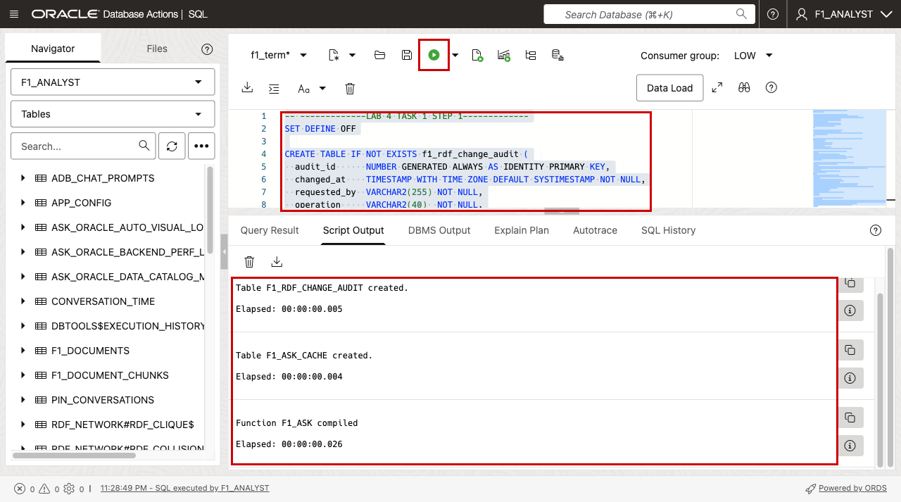
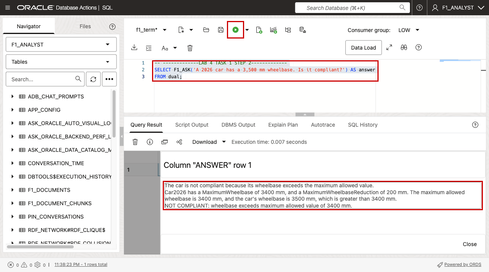
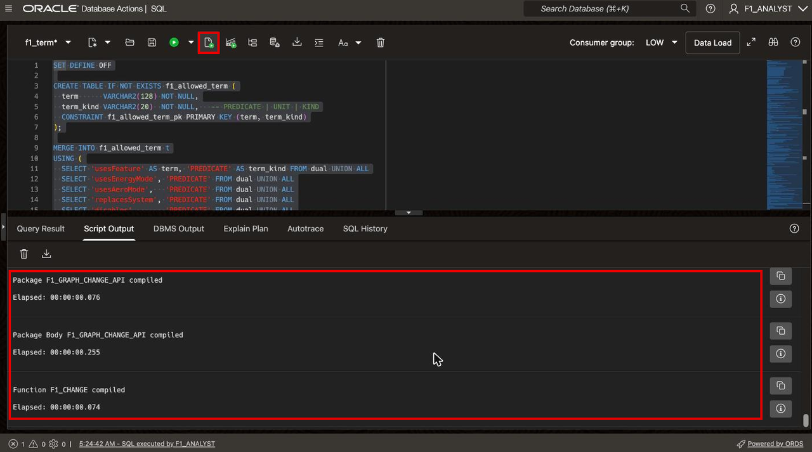
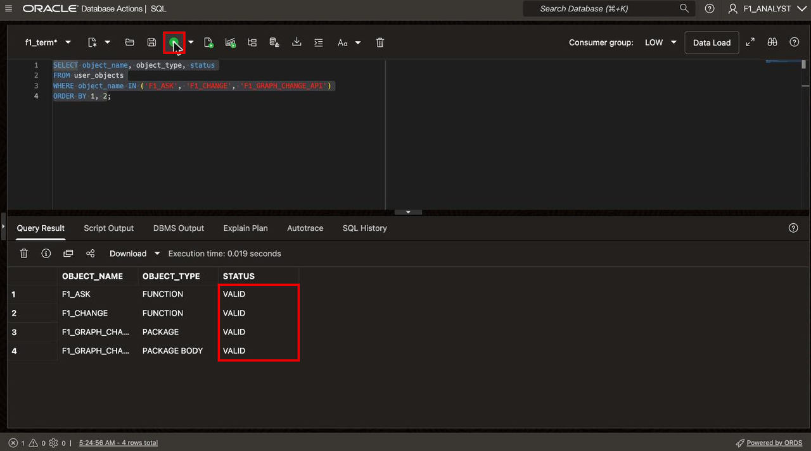
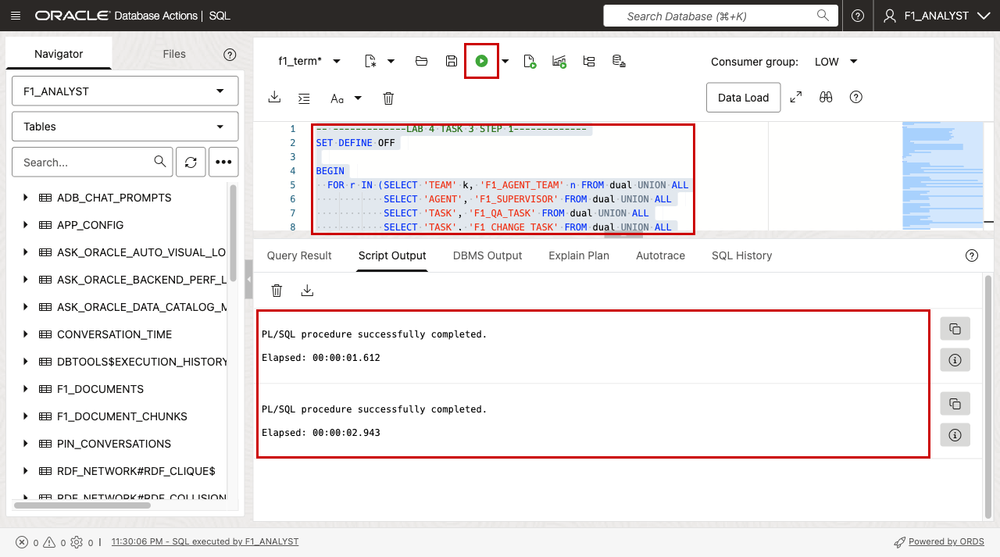
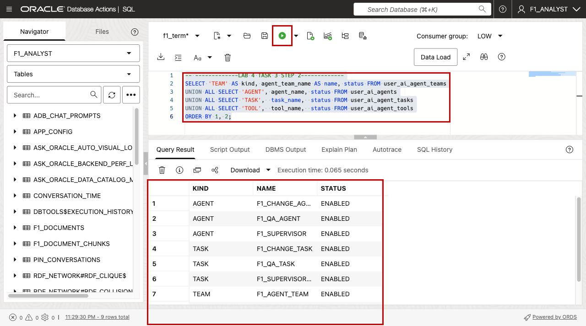
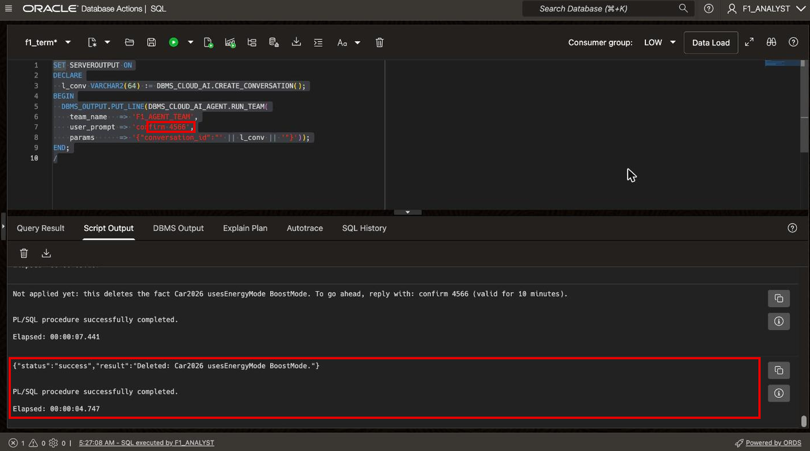
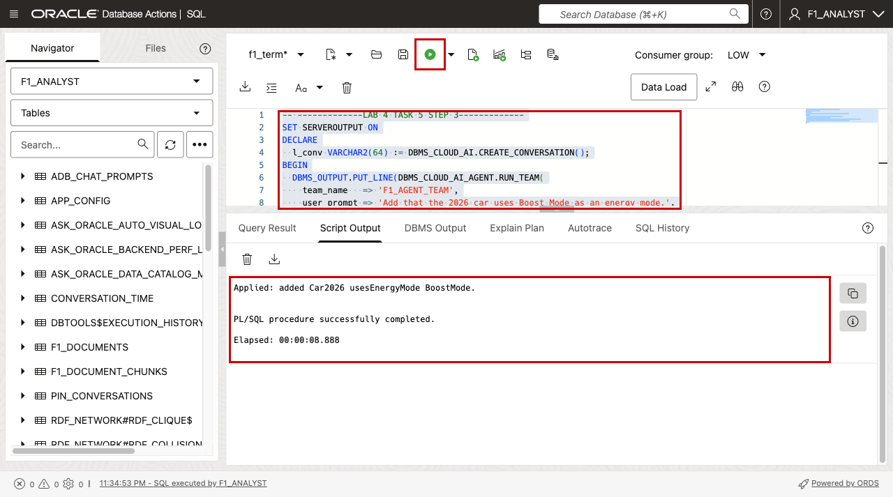
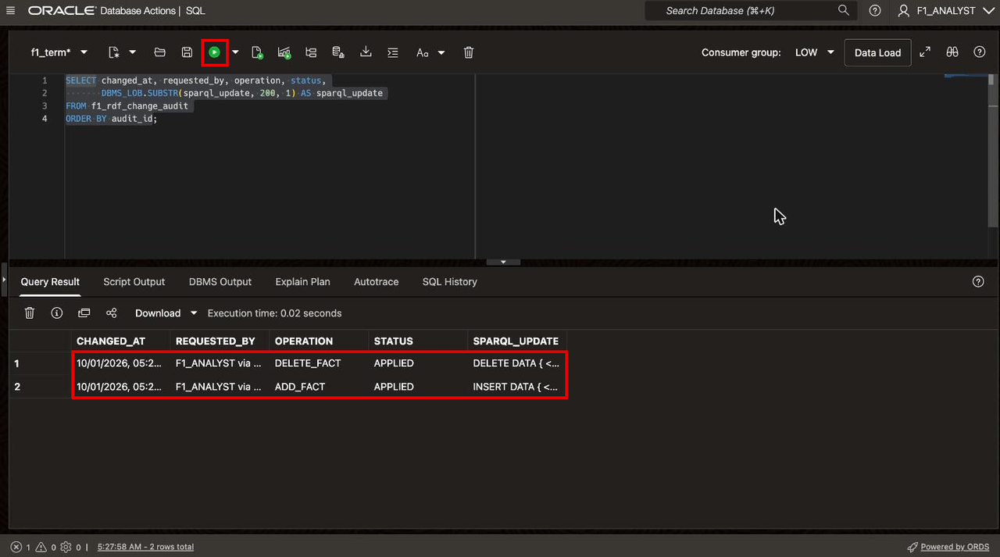

# Create the Question and Change Agents

## Introduction

In this lab, you put two AI agents on top of the graph and join them in one team, `F1_AGENT_TEAM`. A supervisor agent reads each request and hands it to exactly one of them:

| Agent | Tool | What it does |
| --- | --- | --- |
| `F1_QA_AGENT` | `F1_QUERY_TOOL` calls `F1_ASK` | Answers questions from the graph. Read-only. |
| `F1_CHANGE_AGENT` | `F1_CHANGE_TOOL` calls `F1_CHANGE` | Adds or deletes facts through a checked, audited API. |

One tool per agent keeps each agent fast and predictable. The change agent never writes SPARQL itself. It describes the change as JSON, and a PL/SQL package checks every name against an allow-list, builds the SPARQL update, and writes an audit row. A delete needs a one-time code that only the user can send back.

Estimated Time: 12 minutes

### Objectives

In this lab, you will:

- Create `F1_ASK`, the read-only question function.
- Create the change guardrails: allow-list, audit table, change API, and `F1_CHANGE`.
- Register the tools, tasks, agents, and the team with `DBMS_CLOUD_AI_AGENT`.
- Test a compliance question and a two-step delete.

## Task 1: Create the question function

1. Run this block with **Run**. It creates two small tables and the function `F1_ASK`.

    F1_ASK takes as input a question in natural language, and asks the LLM to answer using the facts in the RDF knowledge graph that represents the documents.

    ```sql
    <copy>
    -- -------------LAB 4 TASK 1 STEP 1-------------
    SET DEFINE OFF

    CREATE TABLE IF NOT EXISTS f1_rdf_change_audit (
      audit_id      NUMBER GENERATED ALWAYS AS IDENTITY PRIMARY KEY,
      changed_at    TIMESTAMP WITH TIME ZONE DEFAULT SYSTIMESTAMP NOT NULL,
      requested_by  VARCHAR2(255) NOT NULL,
      operation     VARCHAR2(40)  NOT NULL,
      request_text  CLOB,
      sparql_update CLOB          NOT NULL,
      status        VARCHAR2(16)  NOT NULL,
      error_message VARCHAR2(4000)
    );

    CREATE TABLE IF NOT EXISTS f1_ask_cache (
      question_key VARCHAR2(4000) NOT NULL,
      asked_at     TIMESTAMP WITH TIME ZONE DEFAULT SYSTIMESTAMP NOT NULL,
      answer       CLOB
    );

    CREATE OR REPLACE FUNCTION f1_ask(p_question IN VARCHAR2) RETURN CLOB
    AUTHID DEFINER AS
      l_facts  CLOB;
      l_line   VARCHAR2(32767);
      l_key    VARCHAR2(4000);
      l_answer CLOB;
      c        SYS_REFCURSOR;
      s VARCHAR2(4000); p VARCHAR2(4000); o VARCHAR2(4000);

      FUNCTION short(t VARCHAR2) RETURN VARCHAR2 IS
      BEGIN
        RETURN REPLACE(REPLACE(REPLACE(t,
          'https://oracle.com/ontology/f1/', ''),
          'http://www.w3.org/1999/02/22-rdf-syntax-ns#', ''),
          'http://www.w3.org/2001/XMLSchema#', '');
      END short;

      PROCEDURE save_answer(p_key VARCHAR2, p_answer CLOB) IS
        PRAGMA AUTONOMOUS_TRANSACTION;
      BEGIN
        DELETE FROM f1_ask_cache WHERE question_key = p_key OR asked_at < SYSTIMESTAMP - INTERVAL '1' DAY;
        INSERT INTO f1_ask_cache (question_key, answer) VALUES (p_key, p_answer);
        COMMIT;
      EXCEPTION WHEN OTHERS THEN ROLLBACK;
      END save_answer;
    BEGIN
      IF LENGTH(p_question) <= 4000 THEN
        l_key := LOWER(TRIM(REGEXP_REPLACE(p_question, '\s+', ' ')));
        BEGIN
          SELECT answer INTO l_answer FROM (
            SELECT c.answer FROM f1_ask_cache c
             WHERE c.question_key = l_key
               AND c.asked_at > SYSTIMESTAMP - INTERVAL '10' MINUTE
               AND NOT EXISTS (SELECT 1 FROM f1_rdf_change_audit a
                                WHERE a.status = 'APPLIED' AND a.changed_at > c.asked_at)
             ORDER BY c.asked_at DESC)
           WHERE ROWNUM = 1;
          RETURN l_answer;
        EXCEPTION WHEN NO_DATA_FOUND THEN NULL;
        END;
      END IF;

      DBMS_LOB.CREATETEMPORARY(l_facts, TRUE);
      OPEN c FOR
        'SELECT s, p, o FROM TABLE(SEM_MATCH(''SELECT DISTINCT ?s ?p ?o WHERE { ?s ?p ?o } ORDER BY ?s ?p'', ' ||
        'SEM_MODELS(' || DBMS_ASSERT.ENQUOTE_LITERAL('F1_2026_GRAPH') || '), NULL, NULL, NULL, NULL, NULL, NULL, NULL, ' ||
        DBMS_ASSERT.ENQUOTE_LITERAL($$PLSQL_UNIT_OWNER) || ', ' ||
        DBMS_ASSERT.ENQUOTE_LITERAL('RDF_NETWORK') || '))';
      LOOP
        FETCH c INTO s, p, o;
        EXIT WHEN c%NOTFOUND;
        l_line := short(s) || ' ' || short(p) || ' ' || short(o) || CHR(10);
        DBMS_LOB.WRITEAPPEND(l_facts, LENGTH(l_line), l_line);
      END LOOP;
      CLOSE c;

      l_answer := DBMS_CLOUD_AI.GENERATE(
        prompt =>
          TO_CLOB(
            'Answer the question about the 2026 Formula 1 rules using ONLY the facts below. Do not use outside knowledge.' || CHR(10) ||
            '- Measurements look like: X hasMeasurement M . M hasValue n ; hasUnit U ; measurementKind Maximum, Minimum or Reduction.' || CHR(10) ||
            '- Start with the answer in one or two sentences, in plain words (no identifiers).' || CHR(10) ||
            '- If a described car characteristic breaks a Maximum or Minimum, say NOT COMPLIANT and why.' || CHR(10) ||
            '- If the facts are not enough, say CANNOT DETERMINE and name the missing fact.' || CHR(10) || CHR(10) ||
            'FACTS:' || CHR(10))
          || l_facts ||
          TO_CLOB(CHR(10) || 'QUESTION: ' || p_question),
        profile_name => 'GENAI_PROFILE',
        action       => 'chat');

      IF l_key IS NOT NULL AND l_answer IS NOT NULL AND DBMS_LOB.GETLENGTH(l_answer) > 0 THEN
        save_answer(l_key, l_answer);
      END IF;
      RETURN l_answer;
    END f1_ask;
    /
    </copy>
    ```

    Stored code uses `$$PLSQL_UNIT_OWNER` as the network owner instead of `USER`. When the APEX chatbot calls this function, `USER` is the web gateway account, not `F1_ANALYST`.

    

2. Ask a question directly, without an agent.

    ```sql
    <copy>
    -- -------------LAB 4 TASK 1 STEP 2-------------
    SELECT F1_ASK('A 2026 car has a 3,500 mm wheelbase. Is it compliant?') AS answer
    FROM dual;
    </copy>
    ```

    The answer says the car is **not compliant**, because the graph holds a maximum wheelbase of 3,400 mm. The grid shows only the start of the answer. Click the cell, then click the eye icon to read all of it.

    

## Task 2: Create the change guardrails

1. Run this block with **Run**. It creates the following tables::

    - `f1_allowed_term`: the only relationships, units, and measurement kinds a change may use.
    - `f1_pending_delete`: deletes waiting for the user to confirm.
    - `f1_graph_change_api`: a package that validates every name, builds the SPARQL update itself, logs it in `f1_rdf_change_audit`, and applies it with `SEM_APIS.UPDATE_RDF_GRAPH`.
    - `F1_CHANGE`: turns a plain-English request into one operation (`ADD_FACT`, `ADD_MEASUREMENT`, `DELETE_FACT`, or `CLARIFY`) and calls the package.

    ```sql
    <copy>
    -- -------------LAB 4 TASK 2 STEP 1-------------
    SET DEFINE OFF

    CREATE TABLE IF NOT EXISTS f1_allowed_term (
      term      VARCHAR2(128) NOT NULL,
      term_kind VARCHAR2(20)  NOT NULL,   -- PREDICATE | UNIT | KIND
      CONSTRAINT f1_allowed_term_pk PRIMARY KEY (term, term_kind)
    );

    MERGE INTO f1_allowed_term t
    USING (
      SELECT 'usesFeature' AS term, 'PREDICATE' AS term_kind FROM dual UNION ALL
      SELECT 'usesEnergyMode', 'PREDICATE' FROM dual UNION ALL
      SELECT 'usesAeroMode',   'PREDICATE' FROM dual UNION ALL
      SELECT 'replacesSystem', 'PREDICATE' FROM dual UNION ALL
      SELECT 'disables',       'PREDICATE' FROM dual UNION ALL
      SELECT 'Millimeter',     'UNIT' FROM dual UNION ALL
      SELECT 'Meter',          'UNIT' FROM dual UNION ALL
      SELECT 'Kilogram',       'UNIT' FROM dual UNION ALL
      SELECT 'Megajoule',      'UNIT' FROM dual UNION ALL
      SELECT 'Kilowatt',       'UNIT' FROM dual UNION ALL
      SELECT 'Second',         'UNIT' FROM dual UNION ALL
      SELECT 'Maximum',        'KIND' FROM dual UNION ALL
      SELECT 'Minimum',        'KIND' FROM dual UNION ALL
      SELECT 'Reduction',      'KIND' FROM dual UNION ALL
      SELECT 'Exact',          'KIND' FROM dual
    ) s
    ON (t.term = s.term AND t.term_kind = s.term_kind)
    WHEN NOT MATCHED THEN INSERT (term, term_kind) VALUES (s.term, s.term_kind);
    COMMIT;

    CREATE TABLE IF NOT EXISTS f1_pending_delete (
      code        VARCHAR2(4)   NOT NULL,
      subject     VARCHAR2(200) NOT NULL,
      predicate   VARCHAR2(200) NOT NULL,
      object      VARCHAR2(200) NOT NULL,
      request     VARCHAR2(4000),
      created_at  TIMESTAMP WITH TIME ZONE DEFAULT SYSTIMESTAMP NOT NULL,
      used_at     TIMESTAMP WITH TIME ZONE
    );

    CREATE OR REPLACE PACKAGE f1_graph_change_api AUTHID DEFINER AS
      c_ns    CONSTANT VARCHAR2(100) := 'https://oracle.com/ontology/f1/';
      c_graph CONSTANT VARCHAR2(30)  := 'F1_2026_GRAPH';
      c_net   CONSTANT VARCHAR2(30)  := 'RDF_NETWORK';

      PROCEDURE add_fact(p_subject VARCHAR2, p_predicate VARCHAR2, p_object VARCHAR2, p_request CLOB);
      PROCEDURE add_measurement(p_subject VARCHAR2, p_name VARCHAR2, p_kind VARCHAR2,
                                p_value NUMBER, p_unit VARCHAR2, p_request CLOB);
      PROCEDURE delete_fact(p_subject VARCHAR2, p_predicate VARCHAR2, p_object VARCHAR2, p_request CLOB);
      FUNCTION  match_count(p_pattern VARCHAR2) RETURN NUMBER;
      FUNCTION  fact_exists(p_subject VARCHAR2, p_predicate VARCHAR2, p_object VARCHAR2) RETURN NUMBER;
      FUNCTION  iri(p_local VARCHAR2) RETURN VARCHAR2;
    END f1_graph_change_api;
    /

    CREATE OR REPLACE PACKAGE BODY f1_graph_change_api AS

      FUNCTION local_id(p_name VARCHAR2, p_what VARCHAR2) RETURN VARCHAR2 IS
        l VARCHAR2(4000) := REGEXP_REPLACE(TRIM(p_name), '^f1:', '');
      BEGIN
        IF l IS NULL OR NOT REGEXP_LIKE(l, '^[A-Za-z][A-Za-z0-9_]{0,127}$') THEN
          RAISE_APPLICATION_ERROR(-20001, 'Invalid ' || p_what || ': ' || NVL(p_name, '(missing)'));
        END IF;
        RETURN l;
      END local_id;

      FUNCTION allowed(p_name VARCHAR2, p_kind VARCHAR2) RETURN VARCHAR2 IS
        l VARCHAR2(128) := local_id(p_name, LOWER(p_kind));
        t f1_allowed_term.term%TYPE;
      BEGIN
        SELECT term INTO t FROM f1_allowed_term
         WHERE UPPER(term) = UPPER(l) AND term_kind = p_kind;
        RETURN t;
      EXCEPTION WHEN NO_DATA_FOUND THEN
        RAISE_APPLICATION_ERROR(-20002, l || ' is not an allowed ' || LOWER(p_kind) || '.');
      END allowed;

      FUNCTION iri(p_local VARCHAR2) RETURN VARCHAR2 IS
      BEGIN
        IF p_local = 'rdf:type' THEN RETURN '<http://www.w3.org/1999/02/22-rdf-syntax-ns#type>'; END IF;
        RETURN '<' || c_ns || local_id(p_local, 'identifier') || '>';
      END iri;

      FUNCTION match_count(p_pattern VARCHAR2) RETURN NUMBER IS
        n NUMBER;
      BEGIN
        IF INSTR(p_pattern, '''') > 0 THEN RAISE_APPLICATION_ERROR(-20003, 'Invalid pattern.'); END IF;
        EXECUTE IMMEDIATE
          'SELECT COUNT(*) FROM TABLE(SEM_MATCH(''SELECT * WHERE { ' || p_pattern || ' }'', ' ||
          'SEM_MODELS(' || DBMS_ASSERT.ENQUOTE_LITERAL(c_graph) || '), NULL, NULL, NULL, NULL, NULL, NULL, NULL, ' ||
          DBMS_ASSERT.ENQUOTE_LITERAL($$PLSQL_UNIT_OWNER) || ', ' || DBMS_ASSERT.ENQUOTE_LITERAL(c_net) || '))'
          INTO n;
        RETURN n;
      END match_count;

      PROCEDURE write_update(p_op VARCHAR2, p_request CLOB, p_sparql CLOB) IS
        l_id  NUMBER;
        l_err VARCHAR2(4000);
      BEGIN
        INSERT INTO f1_rdf_change_audit (requested_by, operation, request_text, sparql_update, status)
        VALUES (COALESCE(SYS_CONTEXT('APEX$SESSION', 'APP_USER'), SYS_CONTEXT('USERENV', 'SESSION_USER')) || ' via F1_CHANGE_AGENT',
                p_op, p_request, p_sparql, 'STARTED')
        RETURNING audit_id INTO l_id;
        SEM_APIS.UPDATE_RDF_GRAPH(
          apply_rdf_graph => c_graph, update_stmt => p_sparql, options => 'SERIALIZABLE=T',
          network_owner   => $$PLSQL_UNIT_OWNER, network_name => c_net);
        UPDATE f1_rdf_change_audit SET status = 'APPLIED' WHERE audit_id = l_id;
        COMMIT;
      EXCEPTION WHEN OTHERS THEN
        l_err := SUBSTR(SQLERRM, 1, 4000);
        UPDATE f1_rdf_change_audit SET status = 'FAILED', error_message = l_err WHERE audit_id = l_id;
        COMMIT;
        RAISE;
      END write_update;

      PROCEDURE add_fact(p_subject VARCHAR2, p_predicate VARCHAR2, p_object VARCHAR2, p_request CLOB) IS
        s VARCHAR2(300) := iri(local_id(p_subject, 'subject'));
        p VARCHAR2(300) := iri(allowed(p_predicate, 'PREDICATE'));
        o VARCHAR2(300) := iri(local_id(p_object, 'object'));
      BEGIN
        write_update('ADD_FACT', p_request, 'INSERT DATA { ' || s || ' ' || p || ' ' || o || ' . }');
      END add_fact;

      PROCEDURE add_measurement(p_subject VARCHAR2, p_name VARCHAR2, p_kind VARCHAR2,
                                p_value NUMBER, p_unit VARCHAR2, p_request CLOB) IS
        l_s   VARCHAR2(128) := local_id(p_subject, 'subject');
        l_n   VARCHAR2(128) := local_id(p_name, 'measurement name');
        l_k   VARCHAR2(128) := allowed(p_kind, 'KIND');
        l_u   VARCHAR2(128) := allowed(p_unit, 'UNIT');
        l_m   VARCHAR2(300);
        l_v   VARCHAR2(100);
      BEGIN
        IF p_value IS NULL THEN RAISE_APPLICATION_ERROR(-20004, 'A numeric value is required.'); END IF;
        l_m := iri(l_s || '_' || l_n);
        l_v := TO_CHAR(p_value, 'TM9', 'NLS_NUMERIC_CHARACTERS=''.,''');
        IF l_v LIKE '.%' THEN l_v := '0' || l_v; END IF;
        write_update('ADD_MEASUREMENT', p_request,
          'INSERT DATA { ' ||
          iri(l_s) || ' ' || iri('hasMeasurement') || ' ' || l_m || ' . ' ||
          l_m || ' ' || iri('rdf:type') || ' ' || iri('Measurement') || ' . ' ||
          l_m || ' ' || iri('hasValue') || ' "' || l_v || '"^^<http://www.w3.org/2001/XMLSchema#decimal> . ' ||
          l_m || ' ' || iri('hasUnit') || ' ' || iri(l_u) || ' . ' ||
          l_m || ' ' || iri('measurementKind') || ' ' || iri(l_k) || ' . }');
      END add_measurement;

      FUNCTION fact_exists(p_subject VARCHAR2, p_predicate VARCHAR2, p_object VARCHAR2) RETURN NUMBER IS
      BEGIN
        RETURN match_count(iri(local_id(p_subject, 'subject')) || ' ' ||
                           iri(allowed(p_predicate, 'PREDICATE')) || ' ' ||
                           iri(local_id(p_object, 'object')));
      END fact_exists;

      PROCEDURE delete_fact(p_subject VARCHAR2, p_predicate VARCHAR2, p_object VARCHAR2, p_request CLOB) IS
        s VARCHAR2(300) := iri(local_id(p_subject, 'subject'));
        p VARCHAR2(300) := iri(allowed(p_predicate, 'PREDICATE'));
        o VARCHAR2(300) := iri(local_id(p_object, 'object'));
      BEGIN
        IF match_count(s || ' ' || p || ' ' || o) = 0 THEN
          RAISE_APPLICATION_ERROR(-20005, 'No such fact in the graph; nothing was deleted.');
        END IF;
        write_update('DELETE_FACT', p_request, 'DELETE DATA { ' || s || ' ' || p || ' ' || o || ' . }');
      END delete_fact;

    END f1_graph_change_api;
    /

    CREATE OR REPLACE FUNCTION f1_change(p_request IN VARCHAR2) RETURN CLOB
    AUTHID DEFINER AS
      l_vocab CLOB;
      l_raw   CLOB;
      l_plan  CLOB;
      l_ok    NUMBER;
      l_obj   JSON_OBJECT_T;
      l_op    VARCHAR2(40);
      l_val   NUMBER;
      l_s     VARCHAR2(4000);
      l_a     INTEGER;
      l_b     INTEGER;
      c       SYS_REFCURSOR;
      l_code  VARCHAR2(4) := REGEXP_SUBSTR(p_request, 'confirm\s*#?\s*([0-9]{4})', 1, 1, 'i', 1);
      l_pend  f1_pending_delete%ROWTYPE;

      FUNCTION v(p_key VARCHAR2) RETURN VARCHAR2 IS
        l_el JSON_ELEMENT_T;
      BEGIN
        IF NOT l_obj.has(p_key) THEN RETURN NULL; END IF;
        l_el := l_obj.get(p_key);
        IF l_el.is_null THEN RETURN NULL; END IF;
        IF l_el.is_string THEN RETURN l_obj.get_string(p_key); END IF;
        RETURN l_el.to_string;
      END v;
    BEGIN
      -- Step 2 of a delete: "confirm 1234" runs the parked delete (no LLM call)
      IF l_code IS NOT NULL THEN
        BEGIN
          SELECT * INTO l_pend FROM f1_pending_delete
           WHERE code = l_code AND used_at IS NULL
             AND created_at > SYSTIMESTAMP - INTERVAL '10' MINUTE
           ORDER BY created_at DESC FETCH FIRST 1 ROW ONLY;
        EXCEPTION WHEN NO_DATA_FOUND THEN
          RETURN 'Not applied: code ' || l_code || ' is unknown, already used or expired. Ask for the delete again.';
        END;
        IF l_pend.created_at > SYSTIMESTAMP - INTERVAL '15' SECOND THEN
          RETURN 'Not applied: the confirmation must come from the user in a new message.';
        END IF;
        UPDATE f1_pending_delete SET used_at = SYSTIMESTAMP
         WHERE code = l_code AND used_at IS NULL;
        COMMIT;
        f1_graph_change_api.delete_fact(l_pend.subject, l_pend.predicate, l_pend.object,
                                        l_pend.request || ' [confirmed ' || l_code || ']');
        RETURN 'Deleted: ' || l_pend.subject || ' ' || l_pend.predicate || ' ' || l_pend.object || '.';
      END IF;

      -- Vocabulary for the planner: allowed terms plus every entity already in the graph
      DBMS_LOB.CREATETEMPORARY(l_vocab, TRUE);
      FOR r IN (SELECT term_kind, LISTAGG(term, ', ') WITHIN GROUP (ORDER BY term) terms
                  FROM f1_allowed_term GROUP BY term_kind ORDER BY term_kind) LOOP
        DBMS_LOB.APPEND(l_vocab, TO_CLOB(r.term_kind || ': ' || r.terms || CHR(10)));
      END LOOP;
      -- Existing entity-to-entity facts: the planner reuses their ids, and a delete
      -- must copy one of them exactly
      DBMS_LOB.APPEND(l_vocab, TO_CLOB('EXISTING FACTS (subject predicate object):' || CHR(10)));
      OPEN c FOR
        'SELECT s || '' '' || p || '' '' || o FROM TABLE(SEM_MATCH(''SELECT DISTINCT ?s ?p ?o WHERE { ?s ?p ?o FILTER(isIRI(?o)) } ORDER BY ?s ?p'', ' ||
        'SEM_MODELS(' || DBMS_ASSERT.ENQUOTE_LITERAL(f1_graph_change_api.c_graph) || '), NULL, NULL, NULL, NULL, NULL, NULL, NULL, ' ||
        DBMS_ASSERT.ENQUOTE_LITERAL($$PLSQL_UNIT_OWNER) || ', ' ||
        DBMS_ASSERT.ENQUOTE_LITERAL(f1_graph_change_api.c_net) || '))';
      LOOP
        FETCH c INTO l_s;
        EXIT WHEN c%NOTFOUND;
        l_s := REPLACE(REPLACE(l_s, f1_graph_change_api.c_ns, ''), 'http://www.w3.org/1999/02/22-rdf-syntax-ns#', 'rdf:');
        DBMS_LOB.APPEND(l_vocab, TO_CLOB(l_s || CHR(10)));
      END LOOP;
      CLOSE c;

      l_raw := DBMS_CLOUD_AI.GENERATE(
        prompt =>
          TO_CLOB(
            'Turn this change request for an F1 2026 knowledge graph into ONE JSON object and nothing else.' || CHR(10) ||
            'Operations:' || CHR(10) ||
            '- ADD_FACT: subject, predicate, object (a relationship between two entities)' || CHR(10) ||
            '- ADD_MEASUREMENT: subject, name (PascalCase, e.g. MaximumFuelMass), kind, value (a number), unit' || CHR(10) ||
            '- DELETE_FACT: subject, predicate, object copied exactly from one line of EXISTING FACTS' || CHR(10) ||
            '- CLARIFY: message (no existing fact or id plausibly matches, or it is not a change)' || CHR(10) ||
            'Match everyday wording to the closest existing id (for example a button, mode or system name). ' ||
            'Use predicates, units and kinds ONLY from these lists, and reuse existing entity ids:' || CHR(10))
          || l_vocab ||
          TO_CLOB(CHR(10) ||
            'Output: {"operation":"...","subject":null,"predicate":null,"object":null,"name":null,' ||
            '"kind":null,"value":null,"unit":null,"message":null}' || CHR(10) ||
            'REQUEST: ' || p_request),
        profile_name => 'GENAI_PROFILE',
        action       => 'chat');

      -- keep only the JSON object (models sometimes add fences or text)
      l_a := INSTR(l_raw, '{');
      l_b := REGEXP_INSTR(l_raw, '\}[^}]*$');
      IF l_a = 0 OR l_b < l_a THEN
        RETURN 'Not applied: the request could not be turned into a change. Please rephrase it.';
      END IF;
      l_plan := SUBSTR(l_raw, l_a, l_b - l_a + 1);
      SELECT COUNT(*) INTO l_ok FROM dual WHERE l_plan IS JSON;
      IF l_ok = 0 THEN
        RETURN 'Not applied: the request could not be turned into a change. Please rephrase it.';
      END IF;
      l_obj := JSON_OBJECT_T.parse(l_plan);
      l_op  := UPPER(v('operation'));

      CASE l_op
        WHEN 'CLARIFY' THEN
          RETURN 'Clarification needed: ' || NVL(v('message'), 'say exactly which fact to add or delete.');
        WHEN 'ADD_FACT' THEN
          f1_graph_change_api.add_fact(v('subject'), v('predicate'), v('object'), p_request);
          RETURN 'Applied: added ' || v('subject') || ' ' || v('predicate') || ' ' || v('object') || '.';
        WHEN 'ADD_MEASUREMENT' THEN
          l_s := REPLACE(TRIM(v('value')), ',', '');
          SELECT TO_NUMBER(l_s DEFAULT NULL ON CONVERSION ERROR) INTO l_val FROM dual;
          f1_graph_change_api.add_measurement(v('subject'), v('name'), v('kind'), l_val, v('unit'), p_request);
          RETURN 'Applied: ' || v('subject') || ' ' || v('name') || ' = ' || v('value') || ' ' || v('unit') ||
                 ' (' || v('kind') || ').';
        WHEN 'DELETE_FACT' THEN
          -- Step 1 of a delete: check the fact exists, park it, hand the user a code
          IF f1_graph_change_api.fact_exists(v('subject'), v('predicate'), v('object')) = 0 THEN
            RETURN 'Not applied: the graph has no fact ' || v('subject') || ' ' || v('predicate') || ' ' ||
                   v('object') || '.';
          END IF;
          l_s     := LPAD(TRUNC(DBMS_RANDOM.VALUE(1000, 10000)), 4, '0');
          l_pend.subject   := v('subject');
          l_pend.predicate := v('predicate');
          l_pend.object    := v('object');
          INSERT INTO f1_pending_delete (code, subject, predicate, object, request)
          VALUES (l_s, l_pend.subject, l_pend.predicate, l_pend.object, SUBSTR(p_request, 1, 4000));
          COMMIT;
          RETURN 'Not applied yet: this deletes the fact ' || v('subject') || ' ' || v('predicate') || ' ' ||
                 v('object') || '. To go ahead, reply with: confirm ' || l_s || ' (valid for 10 minutes).';
        ELSE
          RETURN 'Not applied: unsupported change (' || NVL(l_op, 'none') || ').';
      END CASE;
    EXCEPTION WHEN OTHERS THEN
      RETURN 'Not applied: ' || SQLERRM;
    END f1_change;
    /
    </copy>
    ```

    

2. Confirm that everything compiled.

    ```sql
    <copy>
    -- -------------LAB 4 TASK 2 STEP 2-------------
    SELECT object_name, object_type, status
    FROM user_objects
    WHERE object_name IN ('F1_ASK', 'F1_CHANGE', 'F1_GRAPH_CHANGE_API')
    ORDER BY 1, 2;
    </copy>
    ```

    All four rows show `VALID`.

    

## Task 3: Register the tools, agents, and team

1. Run this block with **Run**. It removes any earlier version, then creates two tools, two tasks, the two agents, the supervisor, and the team.

    ```sql
    <copy>
    -- -------------LAB 4 TASK 3 STEP 1-------------
    SET DEFINE OFF

    BEGIN
      FOR r IN (SELECT 'TEAM' k, 'F1_AGENT_TEAM' n FROM dual UNION ALL
                SELECT 'AGENT', 'F1_SUPERVISOR' FROM dual UNION ALL
                SELECT 'TASK', 'F1_QA_TASK' FROM dual UNION ALL
                SELECT 'TASK', 'F1_CHANGE_TASK' FROM dual UNION ALL
                SELECT 'AGENT', 'F1_QA_AGENT' FROM dual UNION ALL
                SELECT 'AGENT', 'F1_CHANGE_AGENT' FROM dual UNION ALL
                SELECT 'TOOL', 'F1_QUERY_TOOL' FROM dual UNION ALL
                SELECT 'TOOL', 'F1_CHANGE_TOOL' FROM dual) LOOP
        BEGIN
          CASE r.k
            WHEN 'TEAM'  THEN DBMS_CLOUD_AI_AGENT.DROP_TEAM (r.n, force => TRUE);
            WHEN 'TASK'  THEN DBMS_CLOUD_AI_AGENT.DROP_TASK (r.n, force => TRUE);
            WHEN 'AGENT' THEN DBMS_CLOUD_AI_AGENT.DROP_AGENT(r.n, force => TRUE);
            WHEN 'TOOL'  THEN DBMS_CLOUD_AI_AGENT.DROP_TOOL (r.n, force => TRUE);
          END CASE;
        EXCEPTION WHEN OTHERS THEN NULL;
        END;
      END LOOP;
    END;
    /

    BEGIN
      DBMS_CLOUD_AI_AGENT.CREATE_TOOL(
        tool_name   => 'F1_QUERY_TOOL',
        description => 'Read-only question answering over the F1 2026 RDF graph.',
        attributes  => q'~{
          "instruction": "Use for every question about the 2026 F1 rules. It is read-only. Pass the question unchanged, including every detail given. Return the tool result as the answer.",
          "function": "F1_ASK",
          "tool_inputs": [{"name":"p_question","mandatory":true,"description":"The full question, unchanged"}]
        }~');

      DBMS_CLOUD_AI_AGENT.CREATE_TOOL(
        tool_name   => 'F1_CHANGE_TOOL',
        description => 'Controlled, audited update of the F1 2026 RDF graph. Never accepts SPARQL.',
        attributes  => q'~{
          "instruction": "Use only for an explicit request to add or delete a fact in the graph, or when the user replies confirm followed by a code. Pass the user message exactly as written. Never add words, codes or the word confirm to it.",
          "function": "F1_CHANGE",
          "tool_inputs": [{"name":"p_request","mandatory":true,"description":"The full change request, unchanged"}]
        }~');

      DBMS_CLOUD_AI_AGENT.CREATE_TASK(
        task_name  => 'F1_QA_TASK',
        attributes => q'~{
          "instruction": "Answer this request: {query}. Always call F1_QUERY_TOOL exactly once with the full request, even if a similar question was answered earlier in this conversation. Return the answer of the tool verbatim. Never use outside knowledge and never modify the graph.",
          "tools": ["F1_QUERY_TOOL"],
          "enable_human_tool": "false"
        }~');

      DBMS_CLOUD_AI_AGENT.CREATE_TASK(
        task_name  => 'F1_CHANGE_TASK',
        attributes => q'~{
          "instruction": "Handle this graph change request: {query}. Call F1_CHANGE_TOOL exactly once with the request exactly as the user wrote it. Never add the word confirm or a code yourself; only the user can confirm, in a later message. Reply with only the text of the result of the tool, exactly as written. Never call the tool a second time and never invent facts, predicates or ids.",
          "tools": ["F1_CHANGE_TOOL"],
          "enable_human_tool": "false"
        }~');

      DBMS_CLOUD_AI_AGENT.CREATE_AGENT(
        agent_name => 'F1_QA_AGENT',
        attributes => q'~{
          "profile_name": "GENAI_PROFILE",
          "role": "You are the read-only F1 2026 regulations agent. You answer only from the RDF graph through your tool and never modify data.",
          "enable_human_tool": "false"
        }~');

      DBMS_CLOUD_AI_AGENT.CREATE_AGENT(
        agent_name => 'F1_CHANGE_AGENT',
        attributes => q'~{
          "profile_name": "GENAI_PROFILE",
          "role": "You are the F1 2026 graph maintenance agent. You change the graph only through your controlled change tool and report exactly what it returned.",
          "enable_human_tool": "false"
        }~');

      DBMS_CLOUD_AI_AGENT.CREATE_AGENT(
        agent_name => 'F1_SUPERVISOR',
        attributes => q'~{
          "profile_name": "GENAI_PROFILE",
          "supervisor": true,
          "role": "You route F1 2026 rules requests to exactly one worker. Questions about the rules (what, which, how many, is it compliant) go to F1_QA_AGENT. Requests to add or delete a fact in the graph, and messages that say confirm followed by a code, go to F1_CHANGE_AGENT. Delegate once, passing the user message word for word. Your final answer is the worker answer copied verbatim, with nothing added.",
          "enable_human_tool": "false"
        }~');

      DBMS_CLOUD_AI_AGENT.CREATE_TEAM(
        team_name   => 'F1_AGENT_TEAM',
        attributes  => q'~{
          "supervisor_agent": "F1_SUPERVISOR",
          "process": "sequential",
          "agents": [
            {"name": "F1_QA_AGENT",     "task": "F1_QA_TASK"},
            {"name": "F1_CHANGE_AGENT", "task": "F1_CHANGE_TASK"}
          ]
        }~',
        description => 'F1 2026 rules: ask questions or change the graph (one team, two agents).');
    END;
    /
    </copy>
    ```

    Keep `SET DEFINE OFF` at the top. SQL Worksheet treats an ampersand as a substitution variable and can silently skip a block that contains one.

    

2. Check that every object is `ENABLED`: one team, three agents, three tasks, and two tools. You created two of the tasks. The database creates the third one for the supervisor.

    ```sql
    <copy>
    -- -------------LAB 4 TASK 3 STEP 2-------------
    SELECT 'TEAM' AS kind, agent_team_name AS name, status FROM user_ai_agent_teams
    UNION ALL SELECT 'AGENT', agent_name, status FROM user_ai_agents
    UNION ALL SELECT 'TASK',  task_name,  status FROM user_ai_agent_tasks
    UNION ALL SELECT 'TOOL',  tool_name,  status FROM user_ai_agent_tools
    ORDER BY 1, 2;
    </copy>
    ```

    

## Task 4: Ask a question

1. Run the team with a question. The supervisor sends it to the question agent. `RUN_TEAM` needs a conversation ID, which `DBMS_CLOUD_AI.CREATE_CONVERSATION` creates.

    ```sql
    <copy>
    -- -------------LAB 4 TASK 4 STEP 1-------------
    SET SERVEROUTPUT ON
    DECLARE
      l_conv VARCHAR2(64) := DBMS_CLOUD_AI.CREATE_CONVERSATION();
    BEGIN
      DBMS_OUTPUT.PUT_LINE(DBMS_CLOUD_AI_AGENT.RUN_TEAM(
        team_name   => 'F1_AGENT_TEAM',
        user_prompt => 'What replaced DRS in 2026, and what is the minimum car weight?',
        params      => '{"conversation_id":"' || l_conv || '"}'));
    END;
    /
    </copy>
    ```

    The answer names Overtake Mode or active aerodynamics and a minimum weight of 768 kg. It takes a few seconds.

    

## Task 5: Change the graph with a confirmed delete

1. Ask the same team to delete a fact. This time the supervisor sends the request to the change agent.

    ```sql
    <copy>
    -- -------------LAB 4 TASK 5 STEP 1-------------
    SET SERVEROUTPUT ON
    DECLARE
      l_conv VARCHAR2(64) := DBMS_CLOUD_AI.CREATE_CONVERSATION();
    BEGIN
      DBMS_OUTPUT.PUT_LINE(DBMS_CLOUD_AI_AGENT.RUN_TEAM(
        team_name   => 'F1_AGENT_TEAM',
        user_prompt => 'Delete the fact that the 2026 car uses the Boost Button.',
        params      => '{"conversation_id":"' || l_conv || '"}'));
    END;
    /
    </copy>
    ```

    Nothing is deleted yet. The reply names the exact fact and ends with a code, for example `reply with: confirm 8258`.

    

2. Wait at least 15 seconds. Replace `0000` with your code and run the block. Only a later message can confirm a delete, so the agent cannot confirm its own request.

    ```sql
    <copy>
    -- -------------LAB 4 TASK 5 STEP 2-------------
    SET SERVEROUTPUT ON
    DECLARE
      l_conv VARCHAR2(64) := DBMS_CLOUD_AI.CREATE_CONVERSATION();
    BEGIN
      DBMS_OUTPUT.PUT_LINE(DBMS_CLOUD_AI_AGENT.RUN_TEAM(
        team_name   => 'F1_AGENT_TEAM',
        user_prompt => 'confirm <your-code>',
        params      => '{"conversation_id":"' || l_conv || '"}'));
    END;
    /
    </copy>
    ```

    The reply confirms the delete, for example `Deleted: Car2026 usesEnergyMode BoostMode.` The supervisor sometimes returns it wrapped in JSON, such as `{"status":"success","result":"Deleted: ..."}`.

    

3. Put the fact back, this time as an add, which needs no confirmation.

    ```sql
    <copy>
    -- -------------LAB 4 TASK 5 STEP 3-------------
    SET SERVEROUTPUT ON
    DECLARE
      l_conv VARCHAR2(64) := DBMS_CLOUD_AI.CREATE_CONVERSATION();
    BEGIN
      DBMS_OUTPUT.PUT_LINE(DBMS_CLOUD_AI_AGENT.RUN_TEAM(
        team_name   => 'F1_AGENT_TEAM',
        user_prompt => 'Add that the 2026 car uses Boost Mode as an energy mode.',
        params      => '{"conversation_id":"' || l_conv || '"}'));
    END;
    /
    </copy>
    ```

    

4. Review the audit trail. Every change records who asked, what they asked, and the exact SPARQL that ran.

    ```sql
    <copy>
    -- -------------LAB 4 TASK 5 STEP 4-------------
    SELECT changed_at, requested_by, operation, status,
           DBMS_LOB.SUBSTR(sparql_update, 200, 1) AS sparql_update
    FROM f1_rdf_change_audit
    ORDER BY audit_id;
    </copy>
    ```

    You see one `DELETE_FACT` row and one `ADD_FACT` row, both `APPLIED`.

    

You may now **proceed to the next lab**.

## Learn More

- [DBMS\_CLOUD\_AI\_AGENT package](https://docs.oracle.com/en/cloud/paas/autonomous-database/serverless/adbsb/dbms-cloud-ai-agent-package.html)
- [SEM\_APIS.UPDATE\_RDF\_GRAPH](https://docs.oracle.com/en/database/oracle/oracle-database/26/rdfrm/SEM_APIS-reference.html)

## Acknowledgements

* **Author** - Ramu Murakami Gutierrez, Denise Myrick, Shreya Pandey, Matthew Perry
* **Last Updated By/Date** - Ramu Murakami Gutierrez, September 2026
