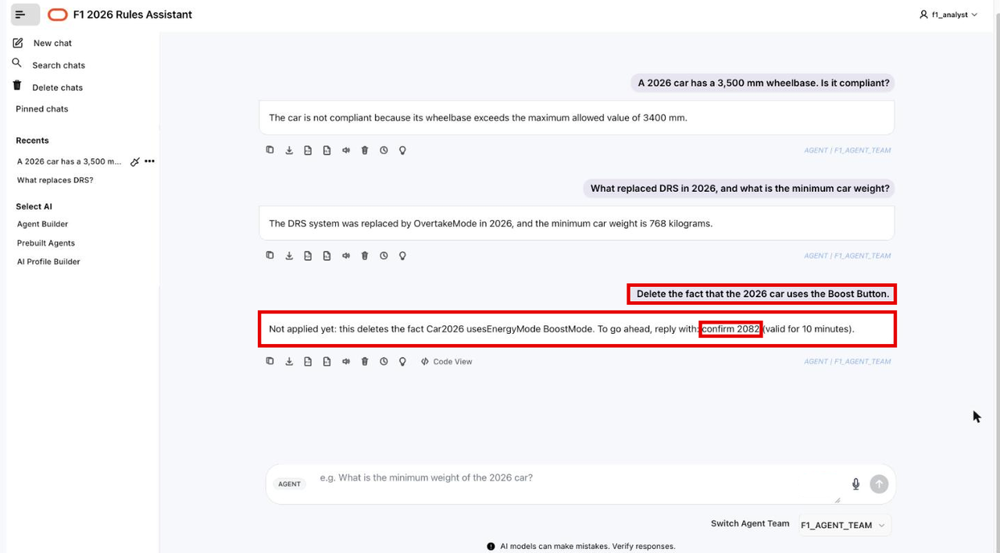
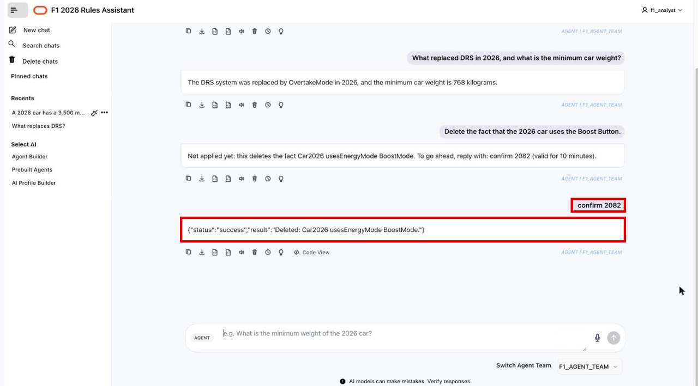
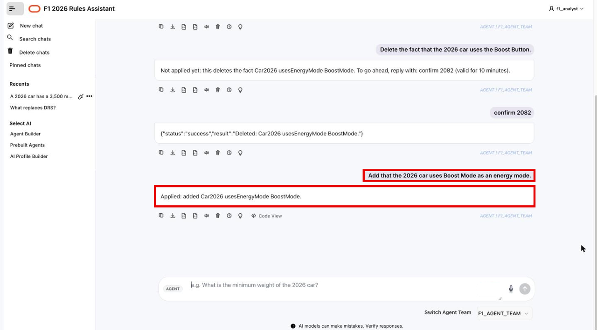

# Ask the Agents from the Chatbot

## Introduction

In this lab, you use the agent team from Lab 4 through a chat application built with Oracle APEX. The application sends every message to `F1_AGENT_TEAM`, so you get the same answers, the same delete confirmation, and the same audit trail as in SQL Worksheet. You do not write any code in this lab.

Estimated Time: 5 minutes

### Objectives

In this lab, you will:

- Sign in to the chatbot as `F1_ANALYST`.
- Ask questions about the 2026 rules.
- Delete a fact with a confirmation code, then add it back.

## Task 1: Open the chatbot

1. On your reservation page, click **View Login Info** and copy the **Chatbot app** URL.

2. Open a new browser tab, paste the URL, and press Enter.

3. Sign in with the same `F1_ANALYST` user and password that you used for SQL Worksheet.

    

    The chat opens with `F1_AGENT_TEAM` already selected under **Switch Agent Team**.

    

## Task 2: Ask questions

1. Type this question in the prompt bar and press Enter:

    ```text
    <copy>
    A 2026 car has a 3,500 mm wheelbase. Is it compliant?
    </copy>
    ```

    The supervisor sends the question to the question agent. The answer says the car is not compliant, because the graph holds a maximum wheelbase of 3,400 mm.

    

2. Ask a second question:

    ```text
    <copy>
    What replaced DRS in 2026, and what is the minimum car weight?
    </copy>
    ```

    The answer names Overtake Mode and a minimum weight of 768 kg. Each answer is labeled **AGENT | F1_AGENT_TEAM**.

    

## Task 3: Change the graph from the chat

1. Ask the team to delete a fact:

    ```text
    <copy>
    Delete the fact that the 2026 car uses the Boost Button.
    </copy>
    ```

    Nothing is deleted yet. The reply names the exact fact and gives you a code, for example `confirm 2082`.

    

2. Wait at least 15 seconds. Then send `confirm` followed by your code, for example:

    ```text
    confirm 2082
    ```

    The reply confirms the delete. It can come back wrapped in JSON, for example `{"status":"success","result":"Deleted: Car2026 usesEnergyMode BoostMode."}`.

    

3. Put the fact back:

    ```text
    <copy>
    Add that the 2026 car uses Boost Mode as an energy mode.
    </copy>
    ```

    The reply says `Applied: added Car2026 usesEnergyMode BoostMode.` Both changes are now in `f1_rdf_change_audit`, with `F1_ANALYST via F1_CHANGE_AGENT` as the requester. You can check them with the audit query from Lab 4.

    

Congratulations! You built an RDF knowledge graph from two documents and put question and change agents on top of it.

## Learn More

- [Oracle APEX](https://apex.oracle.com)

## Acknowledgements

* **Author** - Ramu Murakami Gutierrez, Denise Myrick, Shreya Pandey, Matthew Perry
* **Last Updated By/Date** - Ramu Murakami Gutierrez, October 2026
