# Ask the Agents from the Chatbot

## Introduction

In this lab, you use the agent team from Lab 4 through a chat application built with Oracle APEX. The application sends every message to `F1_AGENT_TEAM`, so you get the same answers, the same delete confirmation, and the same audit trail as in SQL Worksheet. You do not write any code in this lab.

Estimated Time: 9 minutes

### Objectives

In this lab, you will:

- Sign in to the chatbot as `F1_ANALYST`.
- View the agent team map: the team, its agents, tasks, and tools.
- Ask questions about the 2026 rules.
- Check a graph fact before and after deleting it, then add it back.

## Task 1: Open the chatbot

1. On your reservation page, click **View Login Info** and copy the **Chatbot app** URL.

2. Open a new browser tab, paste the URL, and press Enter.

3. Sign in with the same `F1_ANALYST` user and password that you used for SQL Worksheet.

    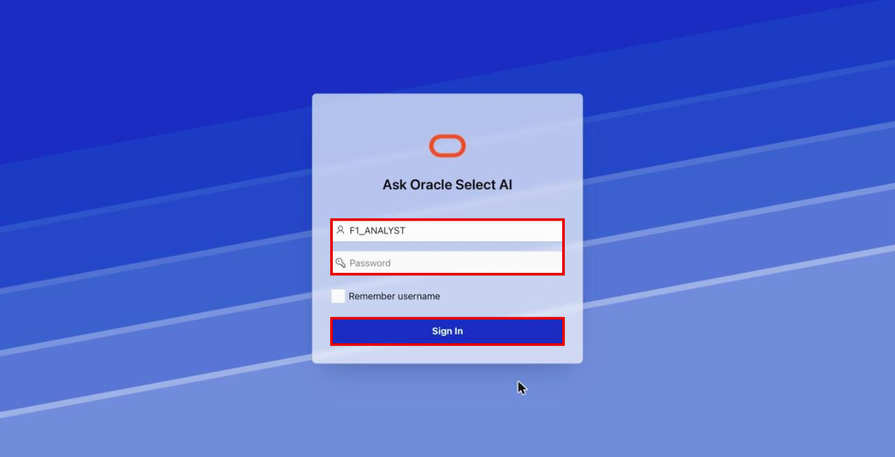

    The chat opens with `F1_AGENT_TEAM` already selected under **Switch Agent Team**.

    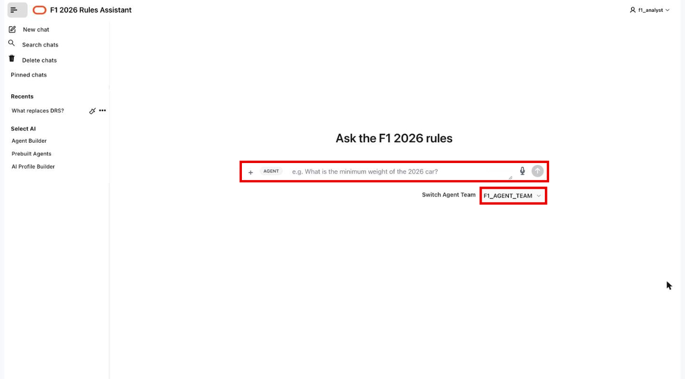

## Task 2: View the agent team

Before you chat with the team, look at how it is built. The **Agent Teams** page maps the objects you registered in Lab 4.

1. In the chat navigation menu, click **Agent Builder**.

    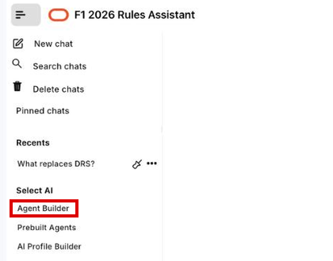

2. In the Settings navigation, under **AI Agents**, click **Agent Teams**.

    <!-- Screenshot placeholder: capture Agent Teams under AI Agents in the Settings navigation. -->
    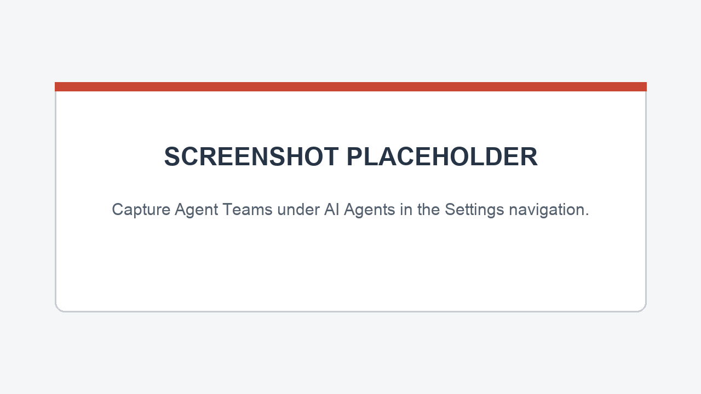

3. Under **Select Agent Team**, choose `F1_AGENT_TEAM` if it is not already selected.

    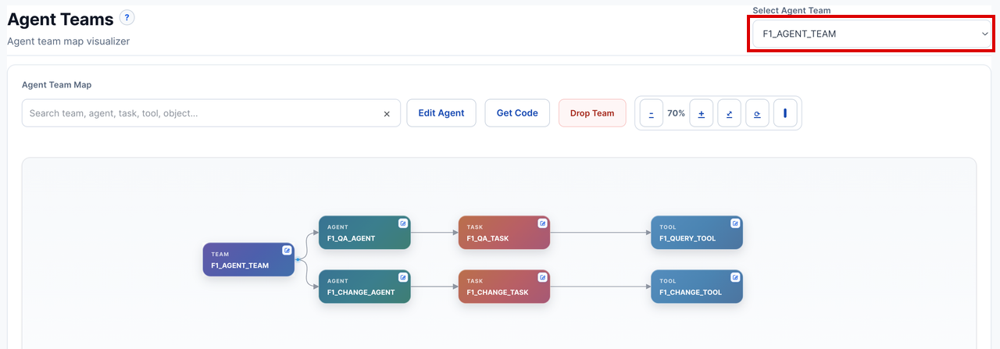

4. Review the **Agent Team Map**. Read it from left to right:

    | Column | Objects | What it shows |
    | --- | --- | --- |
    | **Team** | `F1_AGENT_TEAM` | The team that the chatbot sends every message to. |
    | **Agent** | `F1_QA_AGENT`, `F1_CHANGE_AGENT` | The two agents that the supervisor can choose between. |
    | **Task** | `F1_QA_TASK`, `F1_CHANGE_TASK` | The instructions each agent follows. |
    | **Tool** | `F1_QUERY_TOOL`, `F1_CHANGE_TOOL` | The one tool each agent can call. |

    Each agent has exactly one task and one tool. The question path can only read the graph. The change path is the only one that can write to it.

    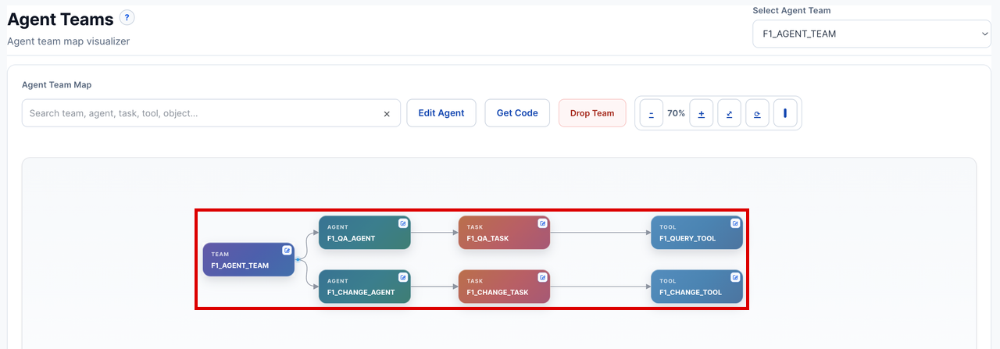

5. To go back to the chat, click the Oracle logo at the top of the page.

    

    The chat page opens, and you are ready to ask questions.

    

## Task 3: Ask questions

1. Type this question in the prompt bar and press Enter:

    ```text
    <copy>
    A 2026 car has a 3,500 mm wheelbase. Is it compliant?
    </copy>
    ```

    The supervisor sends the question to the question agent. The answer says the car is not compliant, because the graph holds a maximum wheelbase of 3,400 mm.

    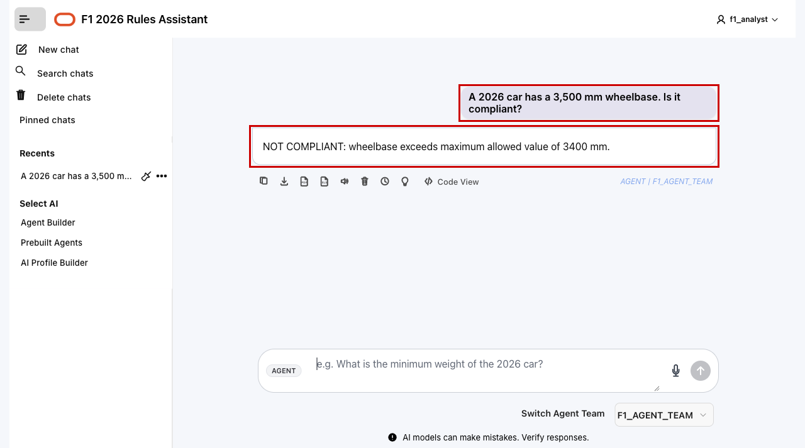

2. Ask a second question:

    ```text
    <copy>
    What replaced DRS in 2026, and what is the minimum car weight?
    </copy>
    ```

    The answer names Overtake Mode and a minimum weight of 768 kg. Each answer is labeled **AGENT | F1\_AGENT\_TEAM**.

    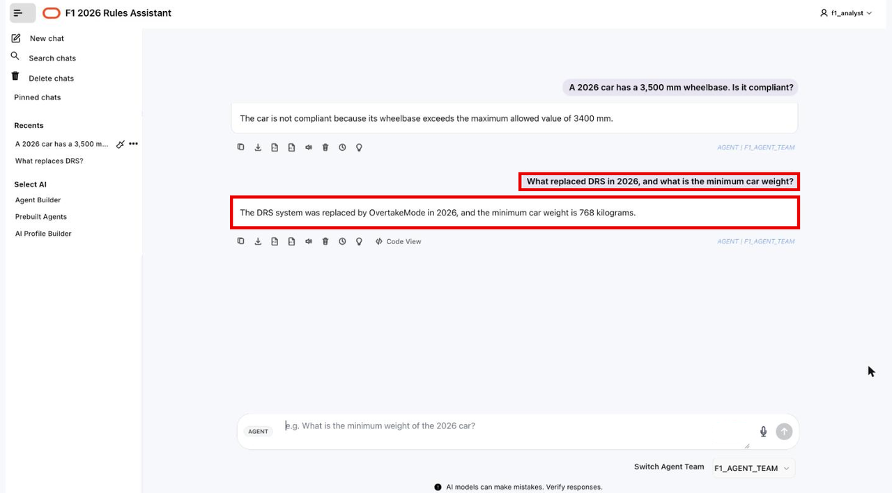

## Task 4: Change the graph from the chat

1. Check whether the graph says that the 2026 car uses Boost Mode as an energy mode:

    ```text
    <copy>
    Does the 2026 car use Boost Mode as an energy mode?
    </copy>
    ```

    The answer should be yes while the fact is in the graph. The supporting fact is `Car2026 usesEnergyMode BoostMode`.

    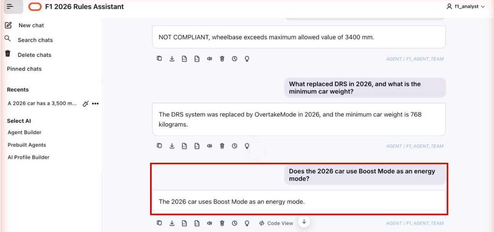

2. Ask the team to delete the fact:

    ```text
    <copy>
    Delete the fact that the 2026 car uses Boost Mode as an energy mode.
    </copy>
    ```

    Nothing is deleted yet. The reply names the exact fact and provides a confirmation code. In this screenshot, the code is `1655` and is valid for 10 minutes. Use the code from your own reply.

    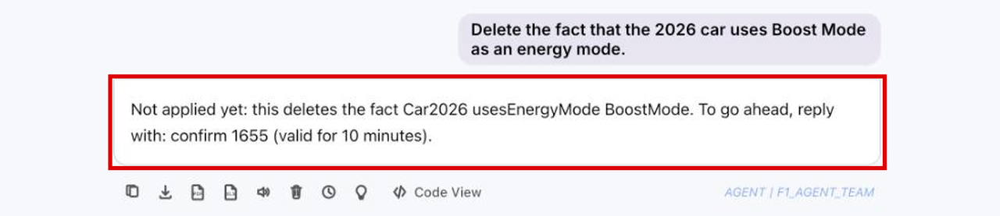

3. Wait at least 15 seconds. Then send `confirm` followed by your code:

    ```text
    confirm <your-code>
    ```

    The reply confirms the delete. It can come back wrapped in JSON, for example `{"status":"success","result":"Deleted: Car2026 usesEnergyMode BoostMode."}`.

    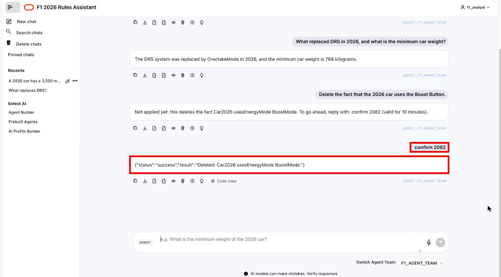

4. Ask the same question again:

    ```text
    <copy>
    Does the 2026 car use Boost Mode as an energy mode?
    </copy>
    ```

    The answer should now say no or report that the graph does not contain the fact.

    <!-- Screenshot placeholder: capture the answer after confirming the delete. -->
    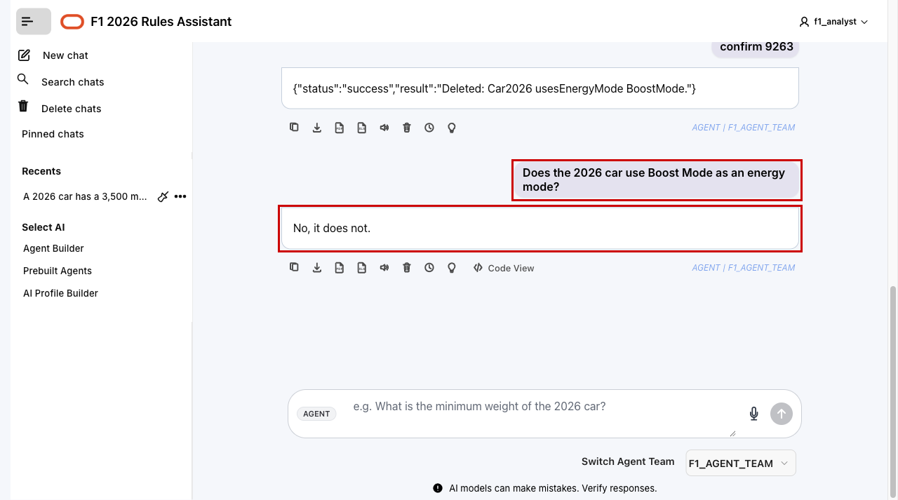

5. Put the fact back:

    ```text
    <copy>
    Add that the 2026 car uses Boost Mode as an energy mode.
    </copy>
    ```

    The reply says `Applied: added Car2026 usesEnergyMode BoostMode.` Both changes are now in `f1_rdf_change_audit`, with `F1_ANALYST via F1_CHANGE_AGENT` as the requester. You can check them with the audit query from Lab 4.

    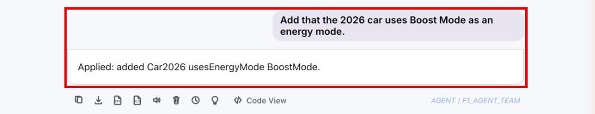

6. Ask the same question one last time:

    ```text
    <copy>
    Does the 2026 car use Boost Mode as an energy mode?
    </copy>
    ```

    The answer should say yes again, showing the fact was restored.

    <!-- Screenshot placeholder: capture the answer after adding the fact back. -->
    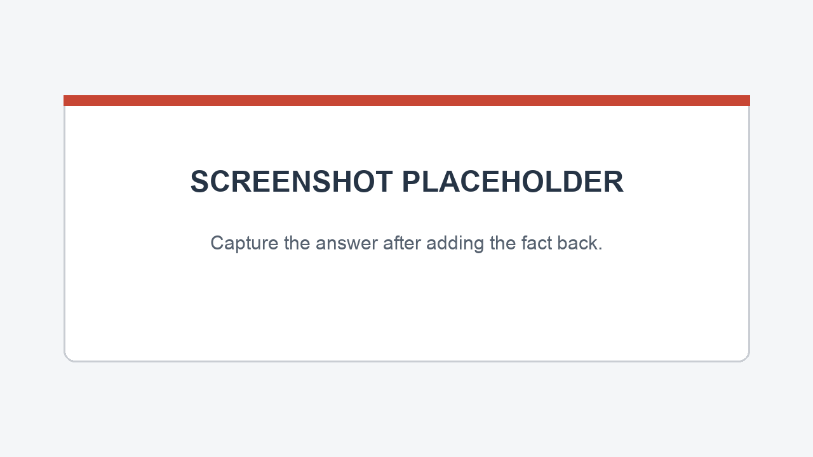

Congratulations! You built an RDF knowledge graph from two documents and put question and change agents on top of it.

## Learn More

- [Oracle APEX](https://apex.oracle.com)

## Acknowledgements

* **Author** - Ramu Murakami Gutierrez, Denise Myrick, Shreya Pandey, Matthew Perry
* **Last Updated By/Date** - Ramu Murakami Gutierrez, October 2026
