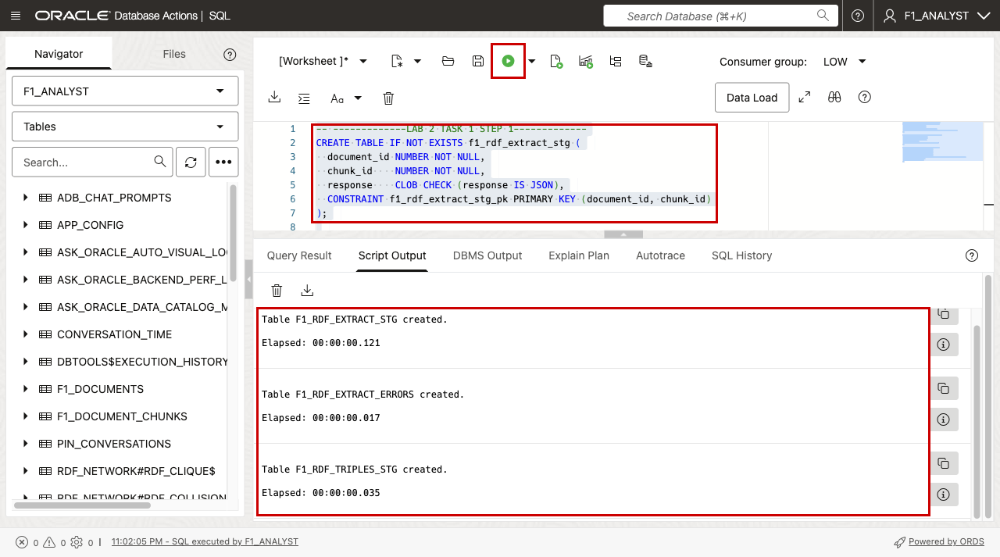
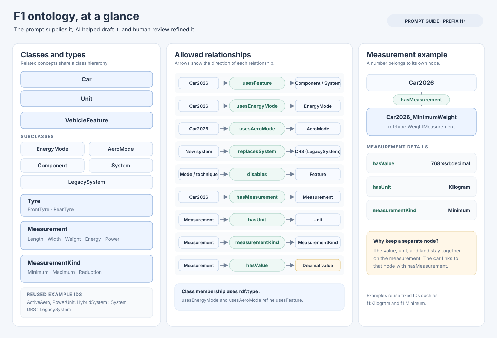
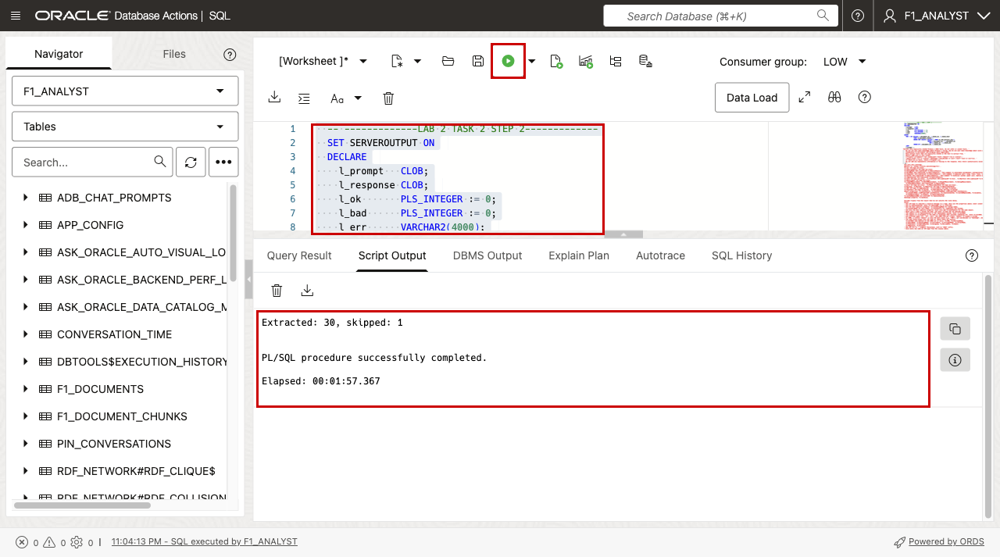
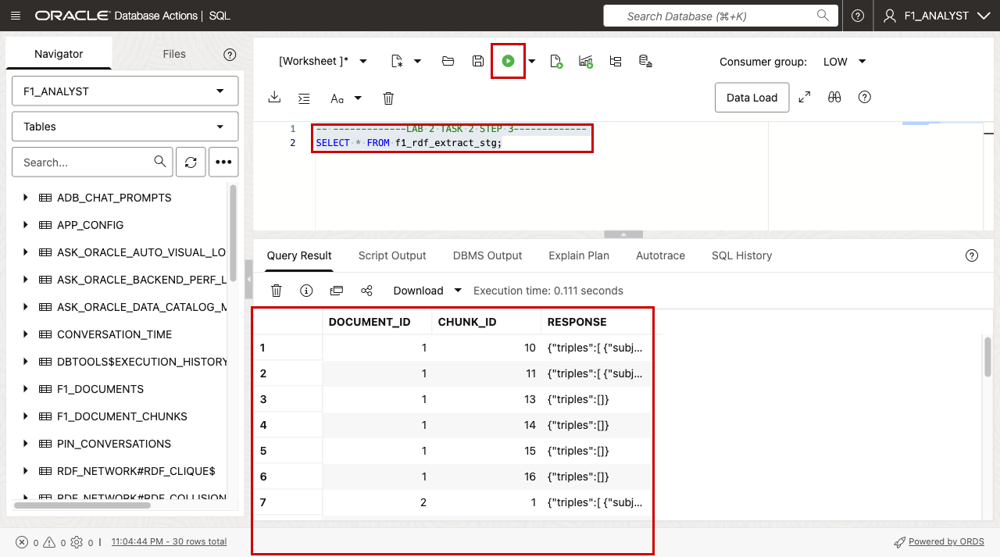
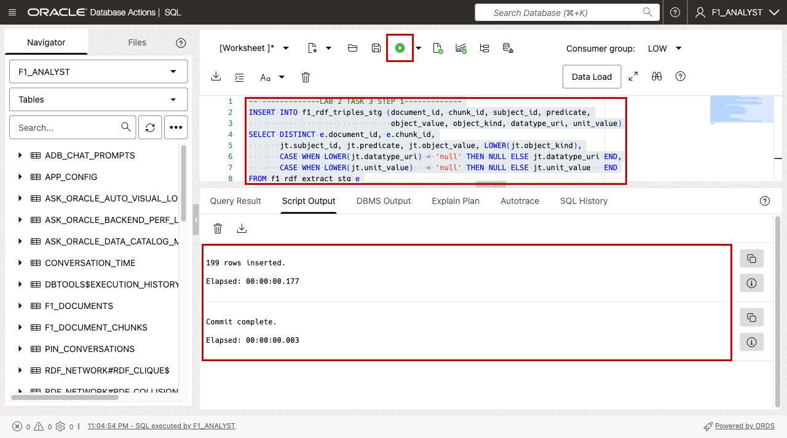
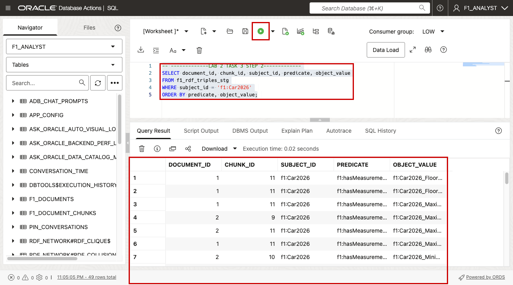
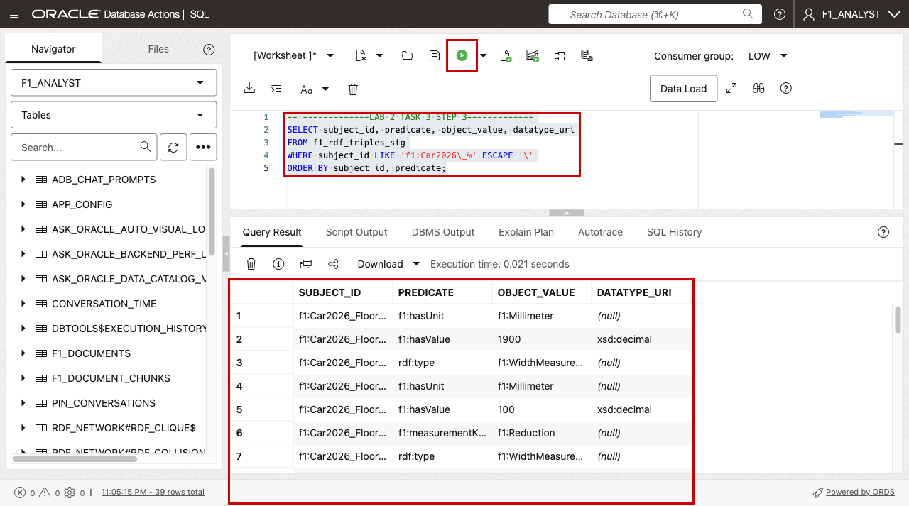

# Extract Ontology-Aligned Facts with an LLM

## Introduction

### Watch the video

[Extract Ontology-Aligned Facts with an LLM](videohub:1_2st3qk8k)

In this lab, you send each chunk to a chat LLM with `DBMS_CLOUD_AI.GENERATE`. The LLM returns facts as JSON triples: subject, predicate, and object. On its own, a LLM invents a new name for the same thing in every chunk. The ontology in the prompt prevents that. It lists the classes, the relationships, the IDs to reuse, and one pattern for measurements.

You keep the raw LLM responses in their own table. You can inspect or reparse them later without calling the LLM again.

Estimated Time: 15 minutes

### Objectives

In this lab, you will:

- Create staging tables for raw responses, failed chunks, and parsed triples.
- Extract facts from every chunk with an ontology-constrained prompt.
- Parse the JSON responses into one relational row per triple.

> **Note:** Run the blocks one at a time. Paste a block into an empty worksheet, select all of it (Ctrl+A or Cmd+A), click **Run**, and check the result before you move on to the next block.

## Task 1: Create the staging tables

1. Create the three staging tables with **Run**.

    ```sql
    <copy>
    -- -------------LAB 2 TASK 1 STEP 1-------------
    CREATE TABLE IF NOT EXISTS f1_rdf_extract_stg (
      document_id NUMBER NOT NULL,
      chunk_id    NUMBER NOT NULL,
      response    CLOB CHECK (response IS JSON),
      CONSTRAINT f1_rdf_extract_stg_pk PRIMARY KEY (document_id, chunk_id)
    );

    CREATE TABLE IF NOT EXISTS f1_rdf_extract_errors (
      document_id   NUMBER NOT NULL,
      chunk_id      NUMBER NOT NULL,
      error_message VARCHAR2(4000),
      response      CLOB,
      created_at    TIMESTAMP DEFAULT SYSTIMESTAMP
    );

    CREATE TABLE IF NOT EXISTS f1_rdf_triples_stg (
      document_id  NUMBER         NOT NULL,
      chunk_id     NUMBER         NOT NULL,
      subject_id   VARCHAR2(128)  NOT NULL,
      predicate    VARCHAR2(128)  NOT NULL,
      object_value VARCHAR2(4000) NOT NULL,
      object_kind  VARCHAR2(10)   NOT NULL CHECK (object_kind IN ('iri', 'literal')),
      datatype_uri VARCHAR2(500),
      unit_value   VARCHAR2(64)
    );
    </copy>
    ```

    The `IS JSON` check rejects a response that is not valid JSON. The block in the next task catches that case and writes the chunk to `f1_rdf_extract_errors` instead.

    

## Task 2: Extract facts with the ontology

Review the prompt before you run it. An ontology captures knowledge about a domain and can be created using a variety of tools. In this lab, the ontology is supplied as part of the prompt.

  The ontology was developed with AI assistance and human supervision. An LLM generated the initial ontology, and human review refined its terms, classes, and relationships for quality and consistency. The diagram summarizes the main classes and permitted relationships.

  

  The prompt has three parts:

  - **The ontology**: classes such as `f1:EnergyMode`, `f1:AeroMode`, and `f1:Measurement`, and the only relationships the LLM may use, such as `f1:usesEnergyMode` and `f1:replacesSystem`.
  - **Fixed IDs**: the same thing always gets the same ID. For example, any mention of the 2026 car becomes `f1:Car2026`.
  - **The measurement pattern**: a number is never attached directly to the car. It becomes its own node with a value, a unit, and a kind (`Minimum`, `Maximum`, or `Reduction`). A limit such as "minimum weight 768 kg" states one clear fact.

2. Run the block with **Run**. It calls the LLM once per chunk and takes about three to five minutes. Chunks that were already extracted are skipped, so if the session times out, run the block again.

    ```sql
    <copy>
    -- -------------LAB 2 TASK 2 STEP 2-------------
    SET SERVEROUTPUT ON
    DECLARE
      l_prompt   CLOB;
      l_response CLOB;
      l_ok       PLS_INTEGER := 0;
      l_bad      PLS_INTEGER := 0;
      l_err      VARCHAR2(4000);
    BEGIN
      FOR r IN (SELECT c.document_id, c.chunk_id, c.chunk_text
                FROM f1_document_chunks c
                WHERE NOT EXISTS (SELECT 1 FROM f1_rdf_extract_stg e
                                  WHERE e.document_id = c.document_id
                                    AND e.chunk_id = c.chunk_id)
                ORDER BY c.document_id, c.chunk_id)
      LOOP
      l_prompt :=
  'Extract only explicitly stated Formula 1 2026 facts. Do not infer or invent facts. '
  || 'Do not use your base knowledge about Formula 1 racing, but do use your base knowledge about units and measurements. '
  || 'Standardize to Millimeter and Kilogram where applicable. '
  || 'Only extract facts that are explicitly stated in the text to extract from. '
  || 'Return JSON only in this format: '
  || '{"triples":[{"subject":"id","predicate":"term","object":"id or literal",'
  || '"object_kind":"iri or literal","datatype":"xsd:decimal or null","unit":"unit or null"}]}. '
  || 'If there are no facts, return {"triples":[]}. '
  || 'Do not add any explanatory information or fencing to the response. Only return syntactically valid JSON. '
  || q'~
    Use only this ontology:
    @prefix f1: <https://oracle.com/ontology/f1/> .
    f1:Car rdf:type owl:Class .
    f1:VehicleFeature rdf:type owl:Class .
    f1:EnergyMode rdfs:subClassOf f1:VehicleFeature .
    f1:AeroMode rdfs:subClassOf f1:VehicleFeature ; rdfs:comment "A selectable aerodynamic configuration" .
    f1:Component rdfs:subClassOf f1:VehicleFeature ; rdfs:comment "A physical part: wing, floor, nose, roll structure" .
    f1:System rdfs:subClassOf f1:VehicleFeature ; rdfs:comment "A technical system: power unit, hybrid system, active aero" .
    f1:LegacySystem rdfs:subClassOf f1:VehicleFeature .
    f1:Tyre rdf:type owl:Class . f1:FrontTyre rdfs:subClassOf f1:Tyre . f1:RearTyre rdfs:subClassOf f1:Tyre .
    f1:Measurement rdf:type owl:Class .
    f1:LengthMeasurement, f1:WidthMeasurement, f1:WeightMeasurement, f1:EnergyMeasurement,
      f1:PowerMeasurement rdfs:subClassOf f1:Measurement .
    f1:Unit rdf:type owl:Class . f1:MeasurementKind rdf:type owl:Class .
    f1:Minimum, f1:Maximum, f1:Reduction rdf:type f1:MeasurementKind .
    f1:DRS rdf:type f1:LegacySystem . f1:ActiveAero rdf:type f1:System .
    f1:PowerUnit rdf:type f1:System . f1:HybridSystem rdf:type f1:System .
    Object properties: f1:usesFeature, f1:usesEnergyMode (subPropertyOf usesFeature),
      f1:usesAeroMode (subPropertyOf usesFeature), f1:replacesSystem, f1:systemReplacedBy, f1:disables,
      f1:hasMeasurement, f1:hasUnit, f1:measurementKind.
    f1:systemReplacedBy owl:inverseOf f1:replacesSystem .
    Datatype property: f1:hasValue.

    Exclude triples from the result that do not satisfy the rules below.
    Rules:
    - Use rdf:type to indicate a resource belongs to a type. Only use the properties above; never invent predicates.
    - Use f1:replacesSystem, never f1:replacedBy (it is inferred).
    - Use the most specific property: f1:usesEnergyMode for energy modes,
      f1:usesAeroMode for aero modes, f1:usesFeature for components and systems.
    - Use only the most specific property; never also add f1:usesFeature for the same object.
    - Never give a node a second rdf:type, and never re-type the ids defined above.
    - The subject of f1:replacesSystem is the replacement system, never f1:Car2026.
    - The subject of f1:disables is the mode or technique that switches something off, never f1:Car2026.
    - Use prefixed names (f1:, rdf:, xsd:). One JSON item per triple; "object" is always a string.
    - In JSON, a literal "object" is only the bare value (e.g. "768"); put xsd:decimal in "datatype", never ^^ inside "object".
    - The same thing always uses the same id. Reuse these ids exactly:
      f1:Car2026 (any mention of the 2026 car or cars), f1:DRS, f1:OvertakeMode,
      f1:BoostMode, f1:RechargeMode, f1:ActiveAero, f1:StraightMode, f1:CornerMode,
      f1:PowerUnit, f1:HybridSystem, f1:Kilogram, f1:Millimeter, f1:Meter,
      f1:Megajoule, f1:Kilowatt.
    - New ids are f1: + singular PascalCase, with no "2026" suffix.
    - Give every new node an rdf:type from the classes above.
    - A measurement is its own node: subject f1:hasMeasurement f1:<Subject>_<Kind><Quantity>,
      where Kind is Minimum, Maximum, Previous or empty (e.g. f1:Car2026_MinimumWeight,
      f1:OvertakeMode_EnergyRecovery), so the same value from different chunks gets the same id.
      That node gets rdf:type (a Measurement subclass), f1:measures "<number>"^^xsd:decimal
      (plain decimal, e.g. "0.5", no commas), f1:hasUnit only if the unit is stated,
      and f1:measurementKind if the text says minimum, maximum, or a pre-2026 value.
    - Attach a measurement to the thing it describes (e.g. f1:OvertakeMode f1:hasMeasurement
      f1:OvertakeMode_MaximumEnergyRecovery), not to f1:Car2026.
    - For changes ("narrower by 25 mm", "reduced by 30 kg"), use f1:measurementKind f1:Reduction.
    - Link every component, system and mode of the 2026 car to f1:Car2026
      (f1:usesFeature, f1:usesEnergyMode or f1:usesAeroMode).
    - Punning is not allowed. A class cannot become rdf:type of another class.

    Example (illustrative only; never output f1:ExampleCar):
    f1:ExampleCar f1:hasMeasurement f1:ExampleCar_MinimumWeight .
    f1:ExampleCar_MinimumWeight rdf:type f1:WeightMeasurement .
    f1:ExampleCar_MinimumWeight f1:hasValue "999"^^xsd:decimal .
    f1:ExampleCar_MinimumWeight f1:hasUnit f1:Kilogram .
    f1:ExampleCar_MinimumWeight f1:measurementKind f1:Minimum .

    Text to extract from:
    ~' || r.chunk_text;

        BEGIN
          l_response := DBMS_CLOUD_AI.GENERATE(prompt       => l_prompt,
                                               profile_name => 'GENAI_PROFILE',
                                               action       => 'chat');
          -- Keep only the outermost {...}: LLMs sometimes add code fences or a preamble
          l_response := NVL(REGEXP_SUBSTR(l_response, '\{.*\}', 1, 1, 'n'), l_response);

          IF JSON_EXISTS(l_response, '$.triples') THEN
            INSERT INTO f1_rdf_extract_stg (document_id, chunk_id, response)
            VALUES (r.document_id, r.chunk_id, l_response);
            l_ok := l_ok + 1;
          ELSE
            INSERT INTO f1_rdf_extract_errors (document_id, chunk_id, error_message, response)
            VALUES (r.document_id, r.chunk_id, 'No valid {"triples":[...]} JSON', l_response);
            l_bad := l_bad + 1;
          END IF;
        EXCEPTION
          WHEN OTHERS THEN
            l_err := SUBSTR(SQLERRM, 1, 4000);
            INSERT INTO f1_rdf_extract_errors (document_id, chunk_id, error_message, response)
            VALUES (r.document_id, r.chunk_id, l_err, l_response);
            l_bad := l_bad + 1;
        END;
        COMMIT;
      END LOOP;
      DBMS_OUTPUT.PUT_LINE('Extracted: ' || l_ok || ', skipped: ' || l_bad);
    END;
    /
    </copy>
    ```

    The block commits after each chunk, preserving progress even if a subsequent call fails.

    

3. Run a query with **Run** to examine a few rows from `f1_rdf_extract_stg`.

    ```sql
    <copy>
    -- -------------LAB 2 TASK 2 STEP 3-------------
    SELECT * FROM f1_rdf_extract_stg;
    </copy>
    ```

    

## Task 3: Parse the JSON into triple rows

1. Run this block with **Run** to parse the JSON into RDF triples and insert them into another table. The `JSON_TABLE` function reads the JSON arrays. LLMs sometimes write the word null as text, so the CASE expressions turn it into a real NULL.

    ```sql
    <copy>
    -- -------------LAB 2 TASK 3 STEP 1-------------
    INSERT INTO f1_rdf_triples_stg (document_id, chunk_id, subject_id, predicate,
                                    object_value, object_kind, datatype_uri, unit_value)
    SELECT DISTINCT e.document_id, e.chunk_id,
           jt.subject_id, jt.predicate, jt.object_value, LOWER(jt.object_kind),
           CASE WHEN LOWER(jt.datatype_uri) = 'null' THEN NULL ELSE jt.datatype_uri END,
           CASE WHEN LOWER(jt.unit_value)   = 'null' THEN NULL ELSE jt.unit_value   END
    FROM f1_rdf_extract_stg e
    CROSS JOIN JSON_TABLE(e.response, '$.triples[*]'
      COLUMNS (subject_id   VARCHAR2(128)  PATH '$.subject',
               predicate    VARCHAR2(128)  PATH '$.predicate',
               object_value VARCHAR2(4000) PATH '$.object',
               object_kind  VARCHAR2(10)   PATH '$.object_kind',
               datatype_uri VARCHAR2(500)  PATH '$.datatype',
               unit_value   VARCHAR2(64)   PATH '$.unit')) jt
    WHERE jt.subject_id IS NOT NULL
      AND jt.predicate IS NOT NULL
      AND jt.object_value IS NOT NULL
      AND LOWER(jt.object_kind) IN ('iri', 'literal')
      AND NOT EXISTS (SELECT 1 FROM f1_rdf_triples_stg t
                      WHERE t.document_id = e.document_id AND t.chunk_id = e.chunk_id);

    COMMIT;
    </copy>
    ```

    

2. Run the query with **Run** to look at the facts about the 2026 car. Each fact retains a reference to the document and chunk it came from. These facts form an RDF knowledge graph representation of the source documents.

    ```sql
    <copy>
    -- -------------LAB 2 TASK 3 STEP 2-------------
    SELECT document_id, chunk_id, subject_id, predicate, object_value
    FROM f1_rdf_triples_stg
    WHERE subject_id = 'f1:Car2026'
    ORDER BY predicate, object_value;
    </copy>
    ```

    Expect relationships such as `f1:usesEnergyMode f1:OvertakeMode` and `f1:usesAeroMode f1:StraightMode`, plus `f1:hasMeasurement` links. The LLM's output varies a little between runs, so your rows can differ.

    

3. Run the query with **Run** to look at one measurement and the facts that describe it.

    ```sql
    <copy>
    -- -------------LAB 2 TASK 3 STEP 3-------------
    SELECT subject_id, predicate, object_value, datatype_uri
    FROM f1_rdf_triples_stg
    WHERE subject_id LIKE 'f1:Car2026\_%' ESCAPE '\'
    ORDER BY subject_id, predicate;
    </copy>
    ```

    Each measurement node, such as `f1:Car2026_MinimumWeight`, has a type, a value, a unit, and a kind.

    

You may now **proceed to the next lab**.

## Learn More

- [DBMS\_CLOUD\_AI.GENERATE](https://docs.oracle.com/en/cloud/paas/autonomous-database/serverless/adbsb/dbms-cloud-ai-package.html)
- [JSON_TABLE](https://docs.oracle.com/en/database/oracle/oracle-database/26/sqlrf/JSON_TABLE.html)

## Acknowledgements

* **Author** - Ramu Murakami Gutierrez, Denise Myrick, Shreya Pandey, Matthew Perry
* **Last Updated By/Date** - Ramu Murakami Gutierrez, September 2026
