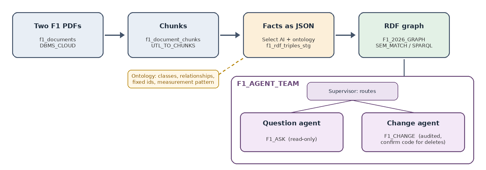

# Introduction

## About this Workshop

The 2026 Formula 1 rules change the car in connected ways. Active aerodynamics replaces DRS, a new energy mode helps drivers overtake, and the car gets lighter, shorter, and narrower. Rules like these are relationships and limits, and a knowledge graph represents them better than loose text chunks do.

In this workshop, you turn two F1 documents into an RDF knowledge graph inside Oracle Autonomous AI Database. A large language model reads the text, but an ontology decides which classes, relationships, and units the model may use. You then build two Select AI agents on the graph. One answers questions. The other changes the graph through a guarded, audited API.

Estimated Workshop Time: 45 minutes

### Objectives

In this workshop, you will:

- Load two PDF documents into the database and split them into chunks.
- Use Select AI with an ontology prompt to extract facts as JSON.
- Convert the facts to RDF terms and bulk load them into an RDF graph.
- Query the graph with SPARQL through `SEM_MATCH`.
- Create a read-only question agent and a change agent that needs a human to confirm deletes.
- Use the agents from an APEX chatbot.

### What Is Already Set Up for You

Your LiveLabs sandbox reservation prepares the environment before you start. You do not run any of these steps:

- An Oracle Autonomous AI Database 26ai with Oracle Java enabled. RDF graph queries and updates need it.
- The database user `F1_ANALYST`, with privileges on `DBMS_CLOUD`, `DBMS_CLOUD_AI`, `DBMS_CLOUD_AI_AGENT`, `DBMS_VECTOR_CHAIN`, and the RDF graph APIs.
- An OCI credential, so the database can call OCI Generative AI.
- The AI profile `GENAI_PROFILE`, which uses the `meta.llama-4-maverick-17b-128e-instruct-fp8` chat model on OCI Generative AI.
- The RDF network `RDF_NETWORK`, owned by `F1_ANALYST`.
- An APEX workspace with the chatbot application you use at the end of the workshop.

### Prerequisites

- A LiveLabs sandbox reservation for this workshop.
- Basic SQL skills. You do not need RDF or SPARQL experience.

## Learn More

- [Oracle RDF Graph Developer's Guide](https://docs.oracle.com/en/database/oracle/oracle-database/26/rdfrm/)
- [Select AI in Autonomous AI Database](https://docs.oracle.com/en/cloud/paas/autonomous-database/serverless/adbsb/sql-generation-ai-autonomous.html)
- [Select AI Agent](https://docs.oracle.com/en/cloud/paas/autonomous-database/serverless/adbsb/select-ai-agents.html)

## Acknowledgements

* **Author** - Ramu Murakami Gutierrez
* **Source** - [The beginner's guide to the 2026 Formula 1 regulations](https://www.formula1.com/en/latest/article/the-beginners-guide-to-the-2026-regulations.6j0tS0hrHG2T01tpmK6XYz). Built with permission from the author(s).
* **Last Updated By/Date** - Ramu Murakami Gutierrez, September 2026
