# Load and Query the RDF Graph

## Introduction

In this lab, you convert the triples to RDF terms, load them into the graph `F1_2026_GRAPH`, and query it with SPARQL. The model wrote short names such as `f1:Car2026`. RDF terms are represented as full IRIs such as `<https://oracle.com/ontology/f1/Car2026>`, and literals such as
Estimated Time: 10 minutes

### Objectives

In this lab, you will:

- Convert short names into full RDF terms.
- Stage the triples in the column layout that the RDF bulk loader expects.
- Create and bulk load the RDF graph.
- Query the graph with `SEM_MATCH` and SPARQL.
- Visualize the RDF graph in Graph Studio.

## Task 1: Convert the triples to RDF terms

1. Create `f1_term`. It expands a prefixed name to a full IRI in angle brackets, and replaces characters that an IRI cannot contain.

    ```sql
    <copy>
    -- -------------LAB 3 TASK 1 STEP 1-------------
    CREATE OR REPLACE FUNCTION f1_term(p IN VARCHAR2) RETURN VARCHAR2 IS
      l VARCHAR2(4000) := TRIM(p);
    BEGIN
      IF l = 'a' THEN RETURN '<http://www.w3.org/1999/02/22-rdf-syntax-ns#type>'; END IF;
      IF l LIKE '<%>' THEN RETURN l; END IF;
      IF l LIKE 'http://%' OR l LIKE 'https://%' THEN RETURN '<' || l || '>'; END IF;
      RETURN '<' ||
        CASE
          WHEN l LIKE 'rdf:%'  THEN 'http://www.w3.org/1999/02/22-rdf-syntax-ns#'
          WHEN l LIKE 'rdfs:%' THEN 'http://www.w3.org/2000/01/rdf-schema#'
          WHEN l LIKE 'owl:%'  THEN 'http://www.w3.org/2002/07/owl#'
          WHEN l LIKE 'xsd:%'  THEN 'http://www.w3.org/2001/XMLSchema#'
          ELSE 'https://oracle.com/ontology/f1/'
        END ||
        REGEXP_REPLACE(SUBSTR(l, INSTR(l, ':') + 1), '[^A-Za-z0-9_.-]', '_') || '>';
    END;
    /
    </copy>
    ```

    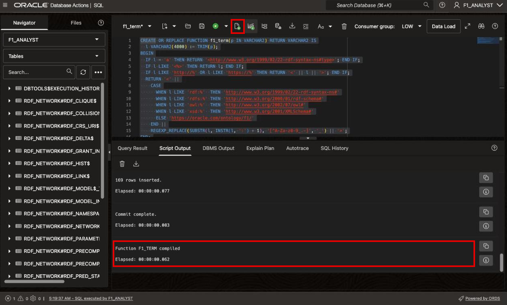

2. Create the staging table to load data into an RDF graph.  The bulk loader reads `RDF$STC_SUB`, `RDF$STC_PRED`, and `RDF$STC_OBJ` from this staging table. The `source_` columns keep the provenance.

    ```sql
    <copy>
    -- -------------LAB 3 TASK 1 STEP 2-------------
    CREATE TABLE IF NOT EXISTS f1_rdf_load_stg (
      source_document_id NUMBER,
      source_chunk_id    NUMBER,
      RDF$STC_SUB        VARCHAR2(4000) NOT NULL,
      RDF$STC_PRED       VARCHAR2(4000) NOT NULL,
      RDF$STC_OBJ        VARCHAR2(4000) NOT NULL,
      RDF$STC_GRAPH      VARCHAR2(4000)
    );
    </copy>
    ```

    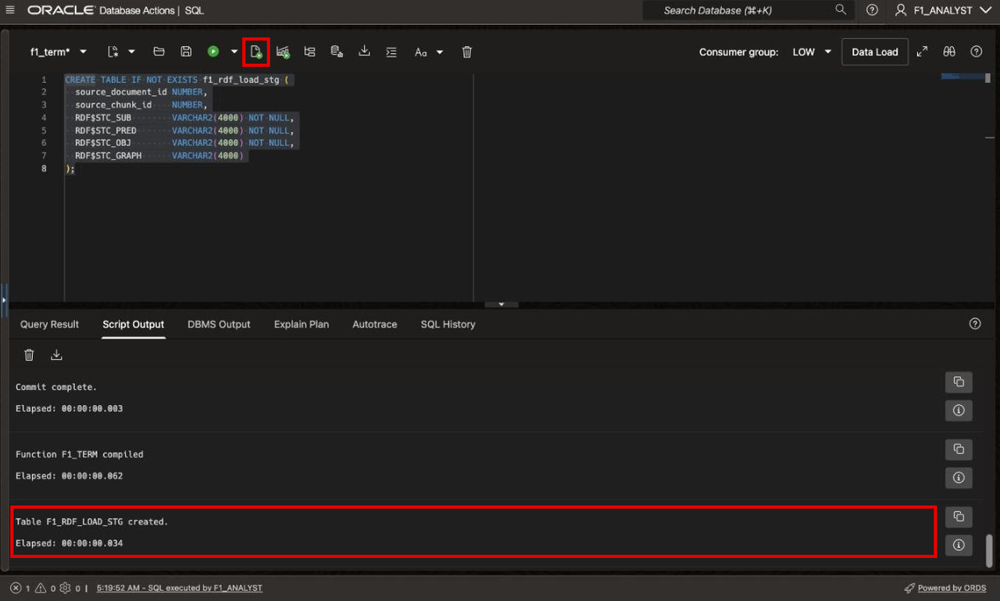

3. Load the RDF terms into the staging table.  IRIs are given the full IRI and angle brackets using the F1_TERM function.  Literals are wrapped in double quotes with their special characters escaped, and have a datatype if the model provided one.

    ```sql
    <copy>
    -- -------------LAB 3 TASK 1 STEP 3-------------
    INSERT INTO f1_rdf_load_stg (source_document_id, source_chunk_id,
                                 RDF$STC_SUB, RDF$STC_PRED, RDF$STC_OBJ, RDF$STC_GRAPH)
    SELECT t.document_id, t.chunk_id,
           f1_term(t.subject_id),
           f1_term(t.predicate),
           CASE
             WHEN t.object_kind = 'iri' THEN f1_term(t.object_value)
             ELSE '"' || REPLACE(REPLACE(REPLACE(REPLACE(t.object_value,
                          '\', '\\'), '"', '\"'), CHR(10), '\n'), CHR(13), '\r') || '"' ||
                  CASE WHEN t.datatype_uri IS NOT NULL
                       THEN '^^' || f1_term(t.datatype_uri) END
           END,
           NULL
    FROM f1_rdf_triples_stg t
    WHERE NOT EXISTS (SELECT 1 FROM f1_rdf_load_stg);

    COMMIT;
    </copy>
    ```

    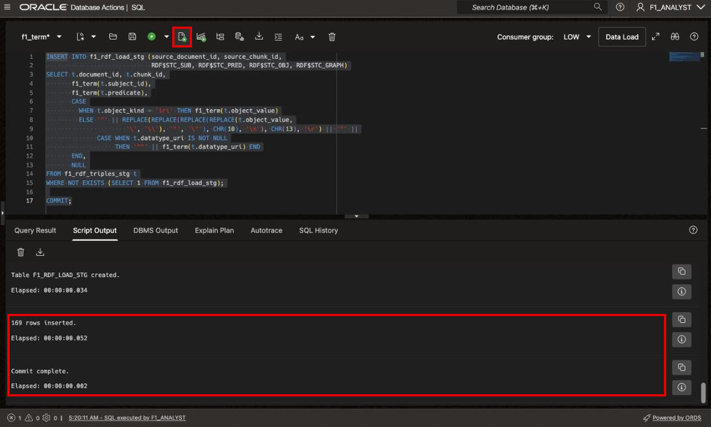

4. See how many staged rows are duplicates. The RDF graph stores each distinct fact only once.

    ```sql
    <copy>
    -- -------------LAB 3 TASK 1 STEP 4-------------
    SELECT COUNT(*) AS staged_rows,
           COUNT(DISTINCT RDF$STC_SUB || RDF$STC_PRED || RDF$STC_OBJ) AS distinct_facts
    FROM f1_rdf_load_stg;
    </copy>
    ```

    The graph stores each distinct fact once. The staging table keeps every copy, so you can still see which chunks stated a fact.

    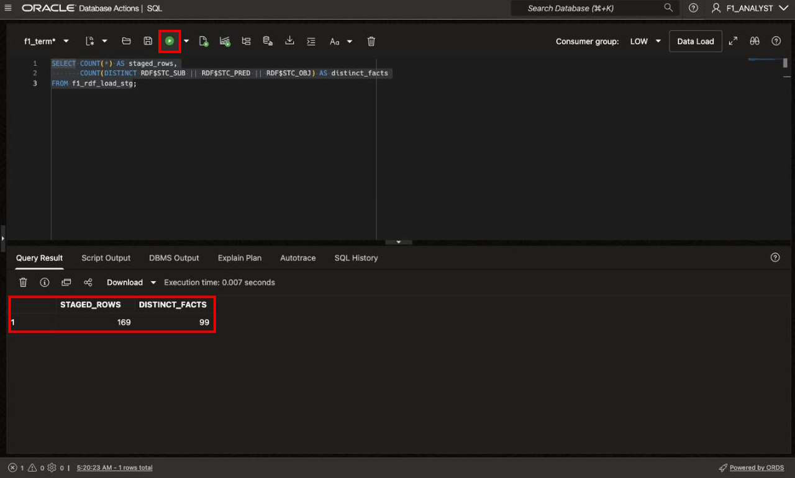

## Task 2: Create and load the graph

1. Create the RDF graph in the network `RDF_NETWORK` and bulk load the staging table.

    ```sql
    <copy>
    -- -------------LAB 3 TASK 2 STEP 1-------------
    BEGIN
      SEM_APIS.CREATE_RDF_GRAPH(
        rdf_graph_name => 'F1_2026_GRAPH',
        table_name     => NULL,
        column_name    => NULL,
        network_owner  => 'F1_ANALYST',
        network_name   => 'RDF_NETWORK');

      SEM_APIS.BULK_LOAD_RDF_GRAPH(
        rdf_graph_name => 'F1_2026_GRAPH',
        table_owner    => 'F1_ANALYST',
        table_name     => 'F1_RDF_LOAD_STG',
        network_owner  => 'F1_ANALYST',
        network_name   => 'RDF_NETWORK');
    END;
    /
    </copy>
    ```

    If you get an error that the RDF graph already exists, an earlier attempt created it. Remove the `CREATE_RDF_GRAPH` call and run the block again.

    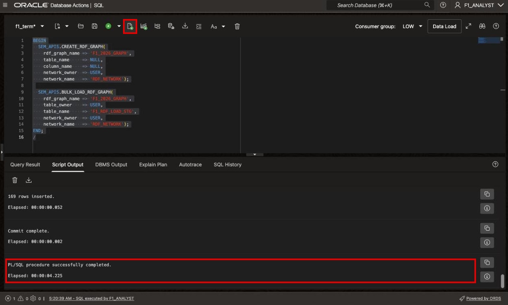

## Task 3: Visualize the RDF graph in Graph Studio

1. On the reservation page, open **View Login Info** and select **Open Link** next to **Graph Studio**. Sign in with the `F1_ANALYST` username and the password listed for your environment.

    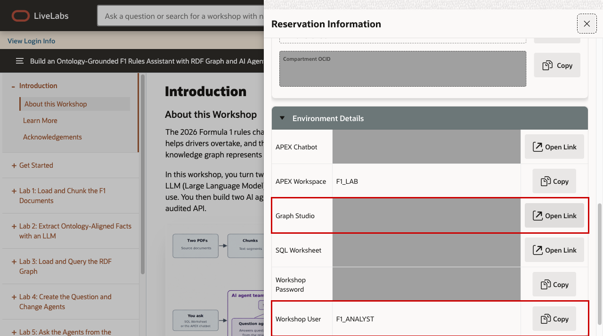

    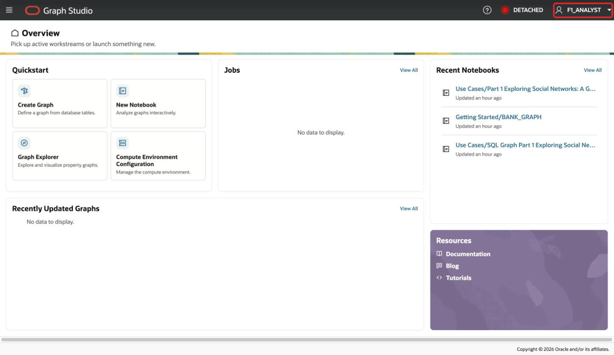

2. In the Graph Studio navigation panel, under **Graph Tools**, select **Graphs**. Open the **RDF Graph** tab, select `F1_2026_GRAPH`, and click **Query**.

    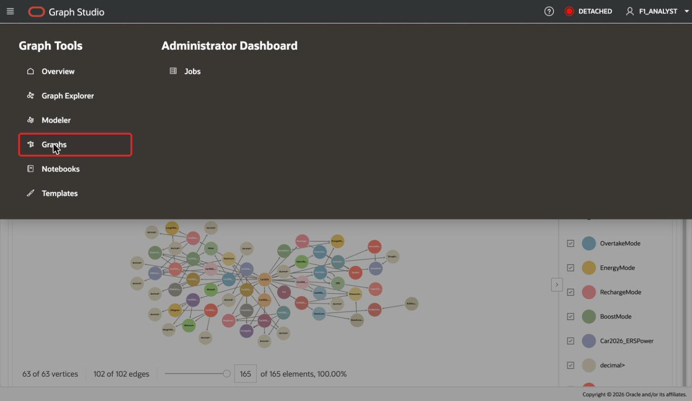

    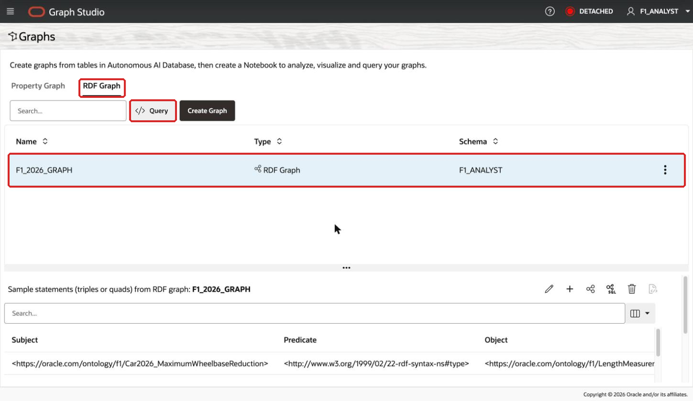

3. In Query Playground, confirm that **Graph Name** is `F1_2026_GRAPH`. Replace the query editor contents with this SPARQL query, then click **Execute**:

    ```sparql
    <copy>
    CONSTRUCT {?s ?p ?o}
    WHERE
      { ?s ?p ?o }
    </copy>
    ```

    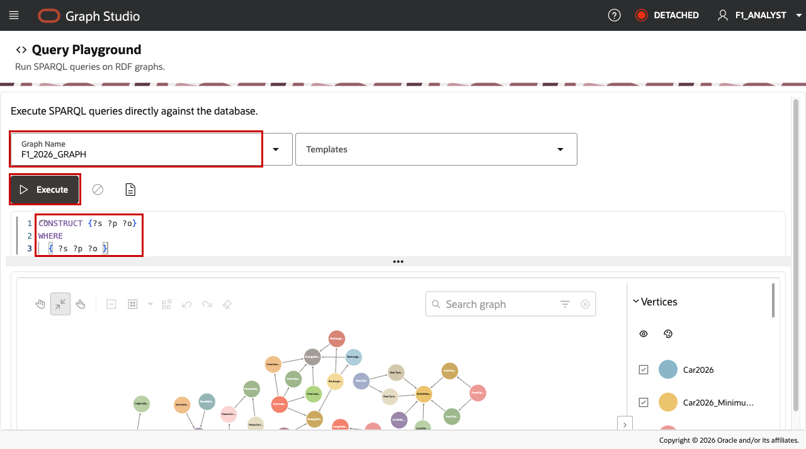

4. The graph appears in the visualization panel below the query editor. If it is only partially visible, move the element slider to its maximum to show all vertices and edges. In the captured run, the visualization showed 63 vertices and 102 edges (165 of 165 elements); your counts may vary with the triples loaded. Explore the graph by dragging vertices, searching for a node, and using the legend to show or hide vertex and edge types.

    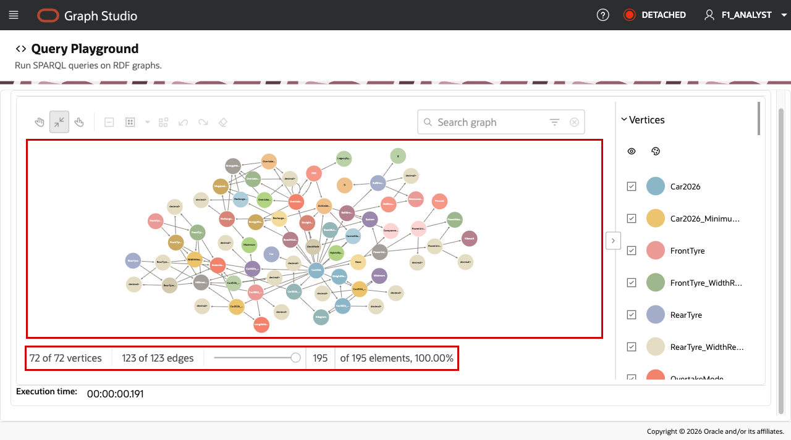

## Task 4: Query the graph with SEM_MATCH and SPARQL

Return to the SQL Worksheet tab you opened earlier and run the following queries. We will use the `SEM_MATCH` table function to run SPARQL against `F1_2026_GRAPH` from SQL.

1. Count the facts in the graph.

    ```sql
    <copy>
    -- -------------LAB 3 TASK 3 STEP 1-------------
    SELECT COUNT(*) AS facts
    FROM TABLE(SEM_MATCH(
      'SELECT ?s ?p ?o WHERE { ?s ?p ?o }',
      SEM_MODELS('F1_2026_GRAPH'), NULL, NULL, NULL, NULL, NULL, NULL, NULL,
      'F1_ANALYST', 'RDF_NETWORK'));
    </copy>
    ```

    Expect roughly 90 to 150 facts. The exact number depends on what the model extracted in Lab 2.

    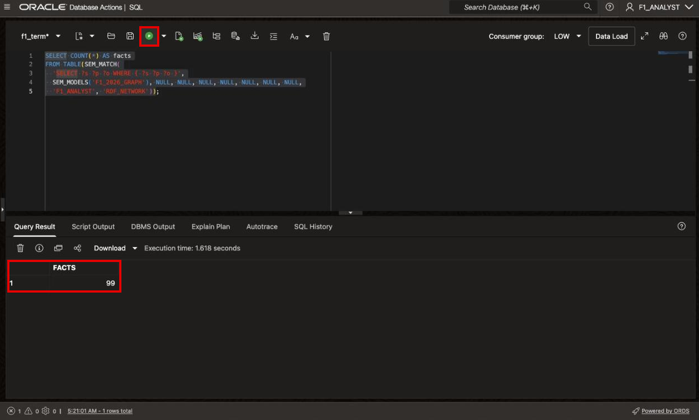

2. List what the 2026 car uses: its energy modes, aero modes, and other features.

    ```sql
    <copy>
    -- -------------LAB 3 TASK 3 STEP 2-------------
    SELECT REPLACE(relation, 'https://oracle.com/ontology/f1/') AS relation,
           REPLACE(feature,  'https://oracle.com/ontology/f1/') AS feature
    FROM TABLE(SEM_MATCH(
      'PREFIX f1: <https://oracle.com/ontology/f1/>
       SELECT ?relation ?feature
       WHERE { f1:Car2026 ?relation ?feature .
               FILTER (?relation IN (f1:usesFeature, f1:usesEnergyMode, f1:usesAeroMode)) }',
      SEM_MODELS('F1_2026_GRAPH'), NULL, NULL, NULL, NULL, NULL, NULL, NULL,
      'F1_ANALYST', 'RDF_NETWORK'))
    ORDER BY 1, 2;
    </copy>
    ```

    You see energy modes such as `BoostMode` and `RechargeMode`, and features such as `ActiveAero` and `PowerUnit`. The exact list depends on what the model extracted in Lab 2.

    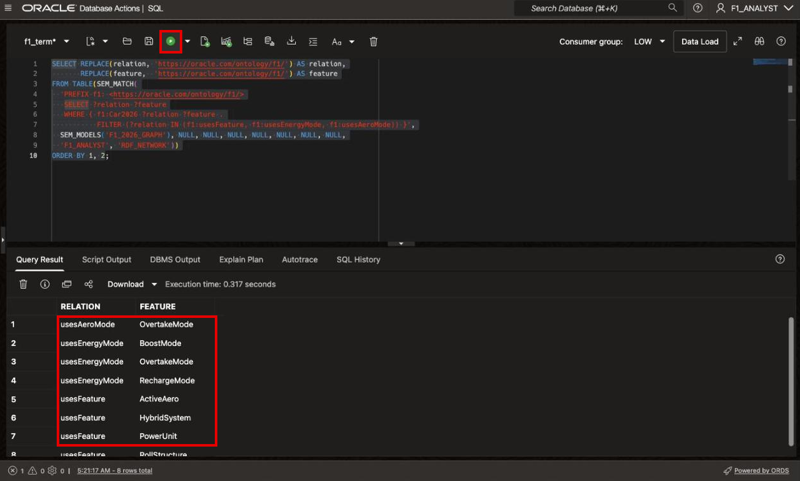

3. List every measurement with its value, unit, and kind. This query follows two hops: from a thing to its measurement node, then to the value, unit, and kind.

    ```sql
    <copy>
    -- -------------LAB 3 TASK 3 STEP 3-------------
    SELECT REPLACE(thing,      'https://oracle.com/ontology/f1/') AS thing,
           REPLACE(quantity,   'https://oracle.com/ontology/f1/') AS quantity,
           amount,
           REPLACE(unit_name,  'https://oracle.com/ontology/f1/') AS unit_name,
           REPLACE(limit_kind, 'https://oracle.com/ontology/f1/') AS limit_kind
    FROM TABLE(SEM_MATCH(
      'PREFIX f1: <https://oracle.com/ontology/f1/>
       SELECT ?thing ?quantity ?amount ?unit_name ?limit_kind
       WHERE { ?thing f1:hasMeasurement ?quantity .
               ?quantity f1:hasValue ?amount .
               OPTIONAL { ?quantity f1:hasUnit ?unit_name }
               OPTIONAL { ?quantity f1:measurementKind ?limit_kind } }',
      SEM_MODELS('F1_2026_GRAPH'), NULL, NULL, NULL, NULL, NULL, NULL, NULL,
      'F1_ANALYST', 'RDF_NETWORK'))
    ORDER BY 1, 2;
    </copy>
    ```

    Look for rows such as `Car2026_MaximumWheelbase | 3400 | Millimeter | Maximum` and `Car2026_MinimumWeight | 768 | Kilogram | Minimum`. The question agent in the next lab uses these limits to judge compliance.

    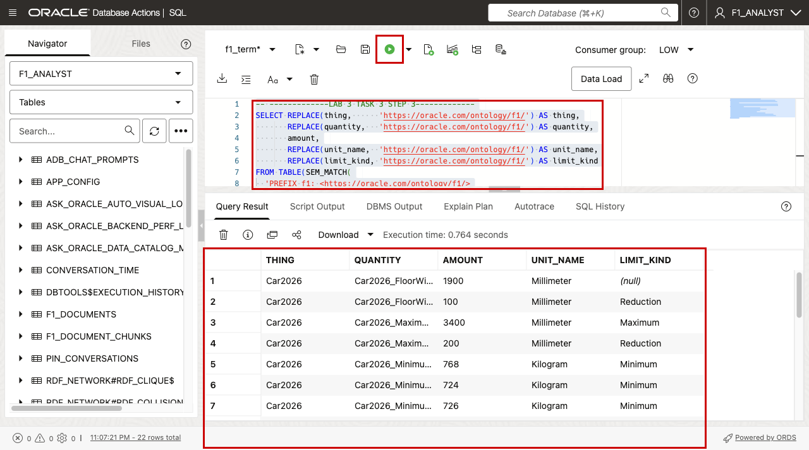

4. Find what replaced DRS, and what each mode switches off.

    ```sql
    <copy>
    -- -------------LAB 3 TASK 3 STEP 4-------------
    SELECT REPLACE(subj, 'https://oracle.com/ontology/f1/') AS subj,
           REPLACE(pred, 'https://oracle.com/ontology/f1/') AS pred,
           REPLACE(obj,  'https://oracle.com/ontology/f1/') AS obj
    FROM TABLE(SEM_MATCH(
      'PREFIX f1: <https://oracle.com/ontology/f1/>
       SELECT ?subj ?pred ?obj
       WHERE { ?subj ?pred ?obj . FILTER (?pred IN (f1:replacesSystem, f1:disables)) }',
      SEM_MODELS('F1_2026_GRAPH'), NULL, NULL, NULL, NULL, NULL, NULL, NULL,
      'F1_ANALYST', 'RDF_NETWORK'));
    </copy>
    ```

    SPARQL variables become SQL column names, so avoid SQL reserved words such as `?mode`, `?value`, `?session`, or `?limit`. That is why these queries use names such as `?amount` and `?limit_kind`.

    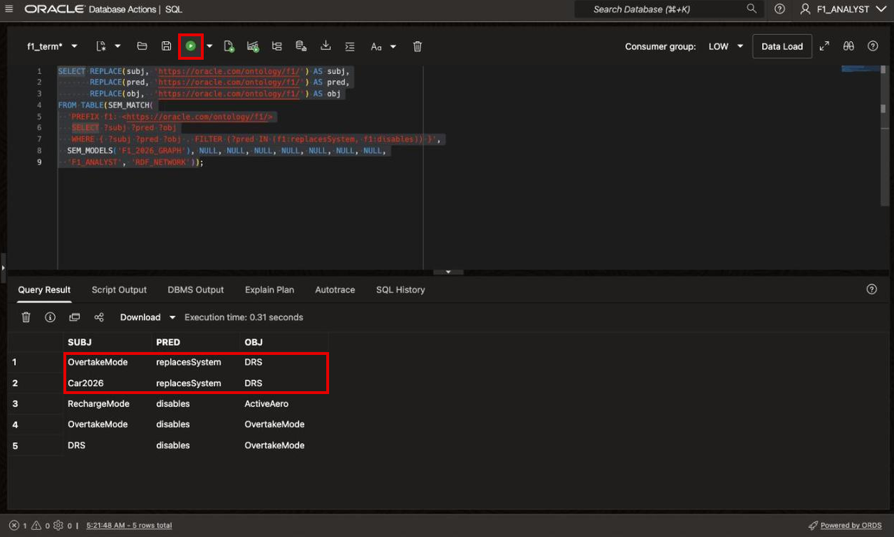

You may now **proceed to the next lab**.

## Learn More

- [Loading and Exporting RDF Data](https://docs.oracle.com/en/database/oracle/oracle-database/26/rdfrm/loading-and-exporting-rdf-data.html)
- [Using the SEM_MATCH Table Function](https://docs.oracle.com/en/database/oracle/oracle-database/26/rdfrm/sparql-query-rdf-graphs.html)

## Acknowledgements

* **Author** - Ramu Murakami Gutierrez, Denise Myrick, Shreya Pandey, Matthew Perry
* **Last Updated By/Date** - Ramu Murakami Gutierrez, September 2026
