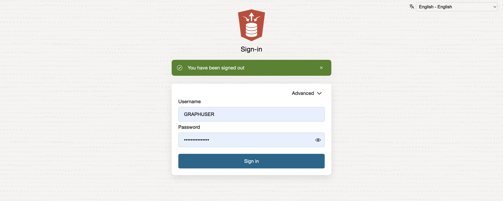
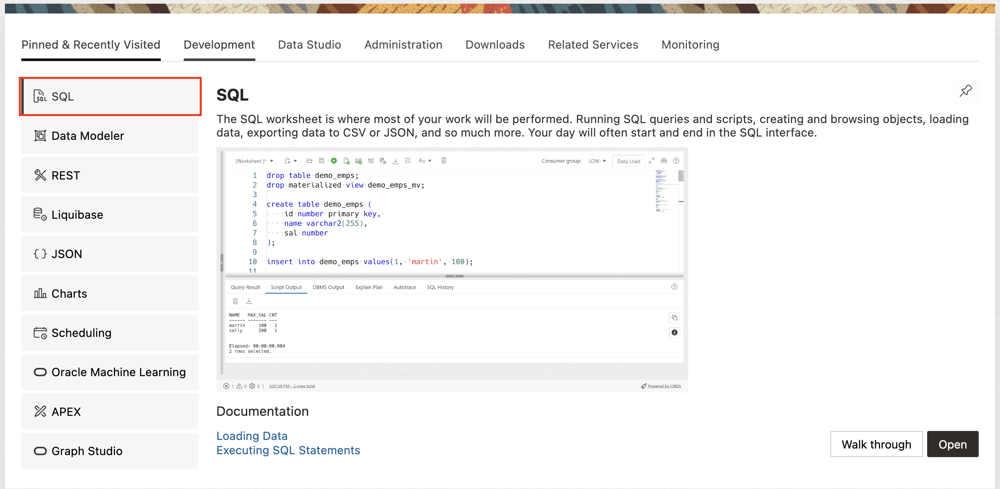
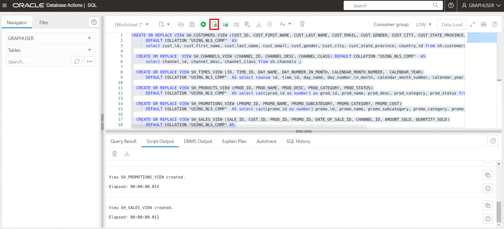
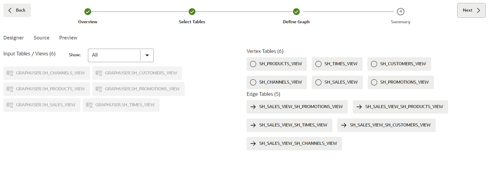
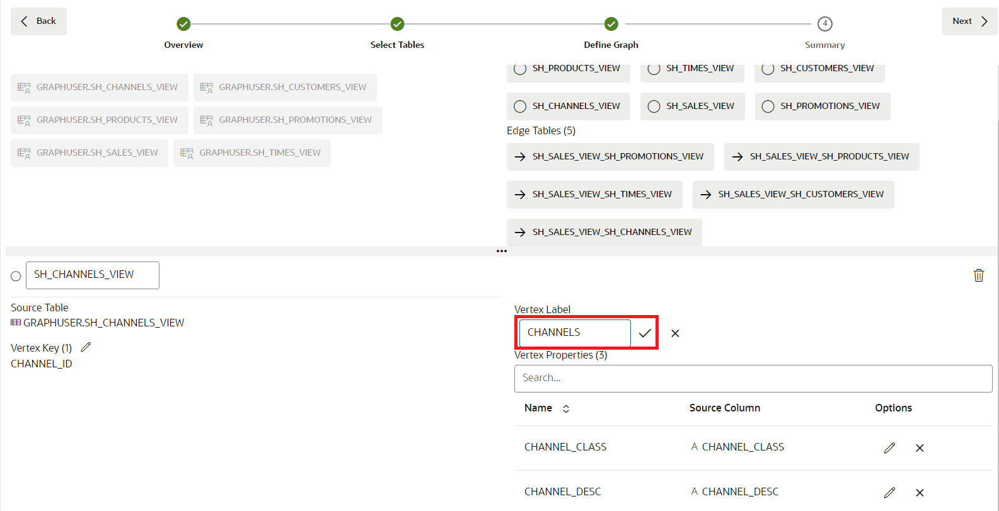
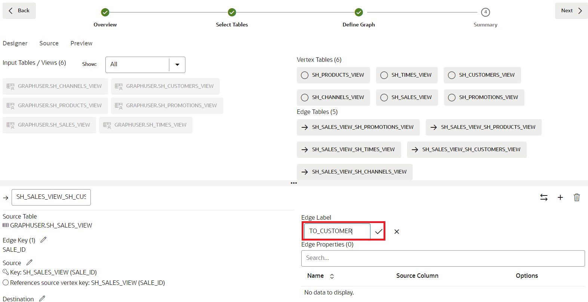
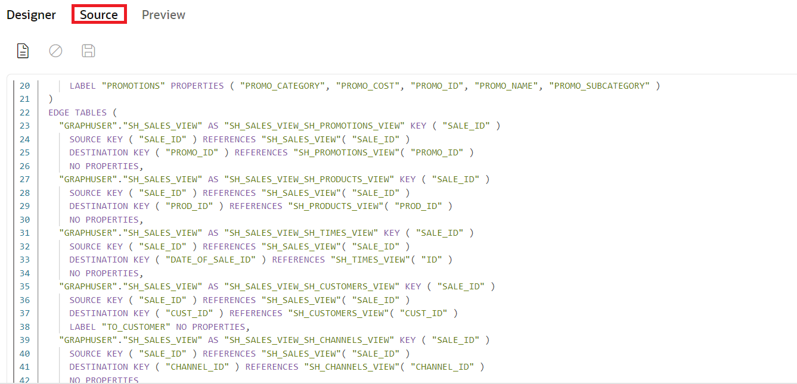
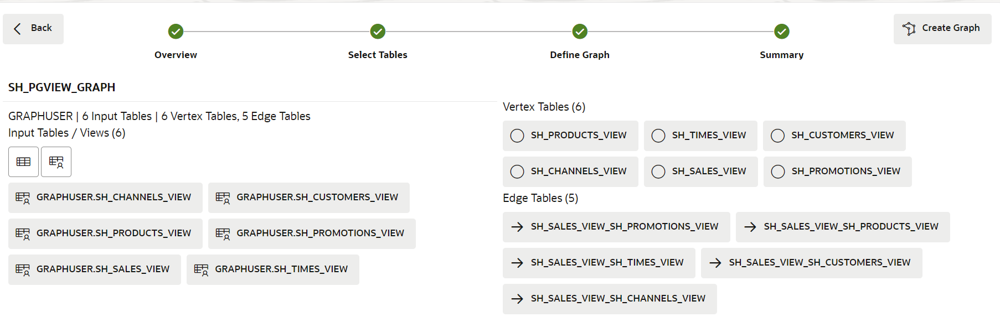
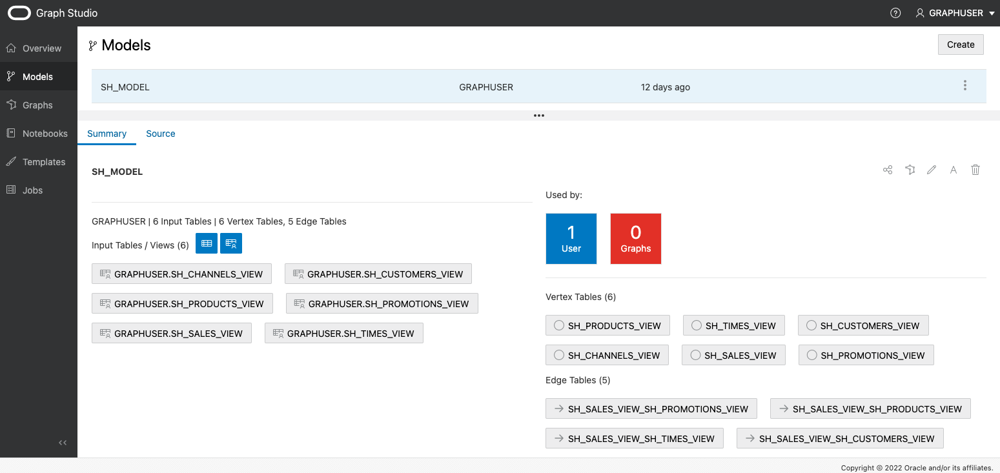

# Create a Graph from Existing Relational Data using Graph Studio

## Introduction

In this lab you will explore more of Graph Studio and learn about how you can create graphs from existing relational data stored in your
Autonomous Data Warehouse - Shared Infrastructure (ADW) or Autonomous Transaction Processing - Shared Infrastructure (ATP) instance.

Estimated Time: 30 minutes.

### Objectives

- Learn how to model a graph from the Sales History (SH) sample data set
- Learn how to monitor a graph creation job
- Learn how inspect created graphs and graph models

### Prerequisites

- The following lab requires an Autonomous Data Warehouse - Shared Infrastructure or Autonomous Transaction Processing - Shared Infrastructure account.
- It assumes you have completed the first lab which explains how you can access the Graph Studio interface of your database instance and illustrates some basic concepts.
## Task 1: Create the Required Views

1. From your Autonomous Database Details page in OCI, select Database Actions

    

2. By default you will be logged in as the Admin user. Sign out, and sign in again as the Graph User.

  
  

3. Select SQL

  

4. In this lab we use the Sales History (SH) sample schema to create our demo graph. The SH schema is available in all Autonomous Database instances. Create Views for CUSTOMERS, TIMES, CHANNELS, PRODUCTS, and PROMOTIONS from the SH tables, using only a subset of the columns from those tables.

  ```
  <copy>
  CREATE OR REPLACE VIEW SH_CUSTOMERS_VIEW (CUST_ID, CUST_FIRST_NAME, CUST_LAST_NAME, CUST_EMAIL, CUST_GENDER, CUST_CITY, CUST_STATE_PROVINCE, COUNTRY_ID)
  	DEFAULT COLLATION "USING_NLS_COMP"  AS
  	select cust_id, cust_first_name, cust_last_name, cust_email, cust_gender, cust_city, cust_state_province, country_id from sh.customers;

  CREATE OR REPLACE  VIEW SH_CHANNELS_VIEW (CHANNEL_ID, CHANNEL_DESC, CHANNEL_CLASS) DEFAULT COLLATION "USING_NLS_COMP"  AS
  	select channel_id, channel_desc, channel_class from sh.channels ;

  CREATE OR REPLACE VIEW SH_TIMES_VIEW (ID, TIME_ID, DAY_NAME, DAY_NUMBER_IN_MONTH, CALENDAR_MONTH_NUMBER,  CALENDAR_YEAR)
  	DEFAULT COLLATION "USING_NLS_COMP"  AS select rownum id, time_id, day_name, day_number_in_month, calendar_month_number, calendar_year from sh.times ;

  CREATE OR REPLACE VIEW SH_PRODUCTS_VIEW (PROD_ID, PROD_NAME, PROD_DESC, PROD_CATEGORY, PROD_STATUS)
  	DEFAULT COLLATION "USING_NLS_COMP"  AS select cast(prod_id as number) as prod_id, prod_name, prod_desc, prod_category, prod_status from sh.products;

  CREATE OR REPLACE VIEW SH_PROMOTIONS_VIEW (PROMO_ID, PROMO_NAME, PROMO_SUBCATEGORY, PROMO_CATEGORY, PROMO_COST)
  	DEFAULT COLLATION "USING_NLS_COMP"  AS select cast(promo_id as number) promo_id, promo_name, promo_subcategory, promo_category, promo_cost from sh.promotions;

  CREATE OR REPLACE VIEW SH_SALES_VIEW (SALE_ID, CUST_ID, PROD_ID, PROMO_ID, DATE_OF_SALE_ID, CHANNEL_ID, AMOUNT_SOLD, QUANTITY_SOLD)
  	DEFAULT COLLATION "USING_NLS_COMP" AS
  	select rownum sale_id, s.cust_id, s.prod_id, s.promo_id, tv.id as date_of_sale_id, s.channel_id, s.amount_sold, s.quantity_sold from sh.sales s, sh_times_view tv where s.time_id = tv.time_id
  </copy>
  ```

  

5. Add the relevant Primary Keys to the Views

  ```
  <copy>
  ALTER VIEW SH_CUSTOMERS_VIEW ADD CONSTRAINT SH_CUSTOMER_VIEW_PK PRIMARY KEY (CUST_ID) DISABLE ;

  ALTER VIEW SH_CHANNELS_VIEW ADD CONSTRAINT SH_CHANNEL_VIEW_PK PRIMARY KEY (CHANNEL_ID) DISABLE ;

  ALTER VIEW SH_TIMES_VIEW ADD CONSTRAINT SH_TIMES_VIEW_PK PRIMARY KEY (ID) DISABLE ;

  ALTER VIEW SH_PRODUCTS_VIEW ADD CONSTRAINT SH_PRODUCT_VIEW_PK PRIMARY KEY (PROD_ID) DISABLE;

  ALTER VIEW SH_PROMOTIONS_VIEW ADD CONSTRAINT SH_PROMO_VIEW_PK PRIMARY KEY (PROMO_ID) DISABLE;

  ALTER VIEW SH_SALES_VIEW ADD CONSTRAINT SH_SALES_VIEW_PK PRIMARY KEY (SALE_ID) DISABLE;
  </copy>
  ```

  

6. Add the relevant Foreign Keys for the Sales View

  ```
  <copy>
  ALTER VIEW SH_SALES_VIEW ADD CONSTRAINT SH_SALES_PROMO_VIEW_FK FOREIGN KEY (PROMO_ID) REFERENCES SH_PROMOTIONS_VIEW (PROMO_ID) DISABLE;

  ALTER VIEW SH_SALES_VIEW ADD CONSTRAINT SH_SALES_PRODUCT_VIEW_FK FOREIGN KEY (PROD_ID) REFERENCES SH_PRODUCTS_VIEW (PROD_ID) DISABLE;

  ALTER VIEW SH_SALES_VIEW ADD CONSTRAINT SH_SALES_CUST_VIEW_FK FOREIGN KEY (CUST_ID) REFERENCES SH_CUSTOMERS_VIEW (CUST_ID) DISABLE ;

  ALTER VIEW SH_SALES_VIEW ADD CONSTRAINT SH_SALES_CHANNEL_VIEW_FK FOREIGN KEY (CHANNEL_ID) REFERENCES SH_CHANNELS_VIEW (CHANNEL_ID) DISABLE ;

  ALTER VIEW SH_SALES_VIEW ADD CONSTRAINT SH_SALES_TIMES_VIEW_FK FOREIGN KEY (DATE_OF_SALE_ID) REFERENCES SH_TIMES_VIEW (ID) DISABLE ;
  </copy>
  ```

  

7. Now that you have created the necessary views, you can create a Graph in Graph Studio. So, navigate back to your Autonomous Database Details page in OCI, select tools, then "Open Graph Studio"

  

8. Log in to Graph Studio with your Graph user

  

## Task 2: Select the Tables to Create the Graph From

1. The following screenshot shows Graph Studio user interface with the menu, or navigation, icons on the left. They navigate to the Home, Models, Graphs, Notebooks, and Jobs pages respectively.

    

2. Click on the **Graphs** menu icon, and click create.

    

    In this lab we use the views created from the Sales History (SH) sample schema to create our demo graph. The SH schema is available in all Autonomous Database instances. You can, however, apply the steps of this lab to any relational data available in your database, regardless of where the data originated from. All the schemas and tables - including views - that you have access to will show up as possible input tables at the start of the modeling workflow.

3. Open up the **GRAPHUSER** schema and double click on the **SH\_PRODUCTS\_VIEW** table.

    You see some details about this table, like all the columns it has and their types, as well as which column is the primary key:

    

4. On the bottom left, click on the **GRAPHUSER.SH\_PRODUCTS\_VIEW - Data** tab.

    You see a preview of the values of that table. By default, it displays the first ten rows, but you can increase the sample size. You can also search for any value in that table and paginate through the preview.

5. For this lab, we choose all views we created earlier as input for our graph model. If your Graph user only contains those views, you can select *GRAPHUSER* and then click the button in the middle to move all views to the selected section on the right. Otherwise, select the relevant views, and then click the button in the middle to move all views to the selected section on the right.

    

6. Click on the **Next** button on the top right to move to the next step. Graph Studio analyzes the foreign key constraints and suggests a possible mapping from the selected views to a property graph structure. This may take a few seconds. Once done, you see all the input you selected on the left, and the mapping to vertex and edge tables on the right.  

    

    This model can be modified if necessary.

## Task 3: Edit your Graph Model

1. Click on the **SH\_CHANNELS\_VIEW** vertex table.

    The automatic graph modeler suggests to convert each row of the *SH\_CHANNELS\_VIEW* input into a vertex in target property graph. In the property graph model, vertex and edges can have a *label* to categorize them into different types of vertices and edges. Each label can have a different set of properties associated with it. The graph modeler automatically sets the label to the name of the input table. That way we can later easily identify of which type each vertex or edge in our generated graph is. In addition, we see that each *column* of the input table was converted into a *property* in our graph model. In the property graph model, properties are arbitrary key/value pairs associated with each vertex or edge in our graph. By mapping all column values into properties, we make sure that all input data is preserved in our graph.

    However, the graph modeler allows you to customize how data is mapped and remove unnecessary tables and or columns not relevant for your analysis. Reducing the amount of data to be processed will reduce the amount of processing resources and storage required for graph analysis. We removed unnecessary columns when creating the views for this graph, so there is nothing to remove in this instance.

2. Rename the vertex label to **CHANNELS**:

    

3. Repeat for all other vertex tables:

      | Current View Name | Renamed Vertex Label |
      | ----------------- | -------------------- |
      | SH\_SALES\_VIEW | SALES |
      | SH\_CUSTOMERS\_VIEW | CUSTOMERS |
      | SH\_TIMES\_VIEW | TIMES |
      | SH\_PROMOTIONS\_VIEW | PROMOTIONS |
      | SH\_PRODUCTS\_VIEW | PRODUCTS |

4. Click on the **SH\_SALES\_VIEW\_SH\_CUSTOMERS\_VIEW** edge table.

    As you can see from the **Source Vertex** and **Destination Vertex** information, this edge type maps all relations from **SH\_SALES\_VIEW** to **SH\_CUSTOMERS\_VIEW**. In other words, it models **bought by** relationships.
    By default, the modeler gave this edge type the label **SH\_SALES\_VIEW\_SH\_CUSTOMERS\_VIEW**.

    **Note**: If the edge table is not visible you can change the size of the upper pane. Use the splitter (the horizontal line with three dots `...` separating the two panes) to increase its size. Click on the splitter and drag it down or up.

5. Rename the edge label to **TO\_CUSTOMER**:

    

6. Repeat for the other all other edge tables:

| Current Edge Name | Renamed Edge Label |
| ----------------- | -------------------- |
| SH\_SALES\_VIEW\_SH\_TIMES\_VIEW | DATE\_OF\_SALE |
| SH\_SALES\_VIEW\_SH\_PROMOTIONS\_VIEW | USING\_PROMOTION |
| SH\_SALES\_VIEW\_SH\_PRODUCTS\_VIEW | PRODUCT\_SOLD |
| SH\_SALES\_VIEW\_SH\_CHANNELS\_VIEW | VIA\_CHANNEL |

7. Click on the **Source** tab on the upper left.

    

    You see the source code for this model. The source code is written in PGQL Data Definition Language (DDL) syntax. You can find more information about the language in the
    [latest PGQL specification](https://pgql-lang.org/spec/latest/#create-property-graph).

    Advanced users can edit the source code directly. Changes will be reflected immediately in the designer view and vice versa.

8. Click the **Preview** tab on the upper left.

    

    You see a visual representation of our graph model so far. Each circle in the graph represents a vertex type (label). And edge relationship in the graph represents an edge type (label)
    in between the circles. You can rearrange the graph by clicking and dragging elements around. You can also right click on each element to see the list of properties it will contain.

    

9. Click **Next** on the top right.

    

    You see a summary of the model we created. All the input tables and how we want to map those to a property graph.

## Task 4: Start the Graph Creation Job

1. Click **Create Graph** on the top right.

2. Enter **SH\_PGVIEW\_GRAPH** as graph name, **SH\_MODEL** as the model name,  and optionally give the graph a description and some tags to identify it easier later. Leave the **Load into memory** option checked. Then click **Create**.

    

    You get redirected to the jobs page where you see your graph creation job.

    

3. Click on the running job. In the details section, click on the **Logs** icon on the top right.

    

    That brings up a dialog with the log.  

    

    You can leave the resulting logs dialog open to monitor the progress of the graph creation. Graph Studio automatically refreshes the logs once every few seconds.
    The graph creation job should succeed after a few minutes. After completion, another **Load into memory** job is started automatically.

    

4. Wait for both jobs to complete successfully.


## Task 5: Inspect the Created Graph and Model

1. Click on the **Graphs** menu icon.

2. Click on the **SH\_PGVIEW\_GRAPH** graph that we just created.

    

    You can see a preview of the graph, edit its name or meta data, share it with others, load it into memory or delete it.

3. Click on the **Models** menu item

4. Click on the **SH Model** that we just created:

    

    Just like the graph, the model is stored as well. You can see the source code of this model, share it with others, edit its meta data or delete it.
    You can also kick off another graph creation job from the same model.

Congratulations! You successfully converted relational tables into a property graph. You can now go ahead and analyze the relationships in that data using powerful graph queries and algorithms.

You may now **proceed to the next lab**.

## Acknowledgements
* **Author** - Korbi Schmid, Product Development
* **Contributors** -  Jayant Sharma, Rahul Tasker, Product Management
* **Last Updated By/Date** - Jayant Sharma, June 2023
