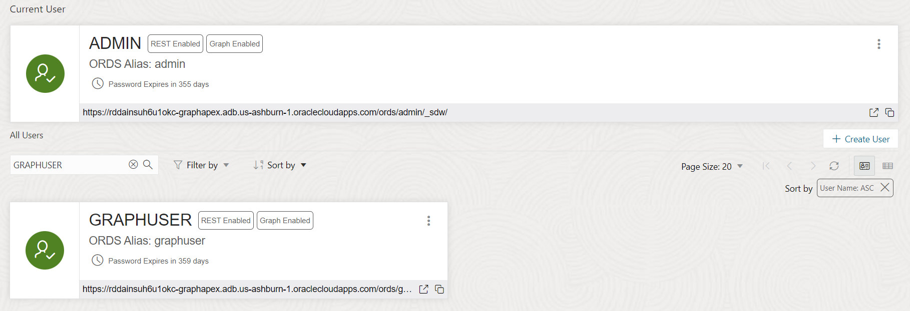
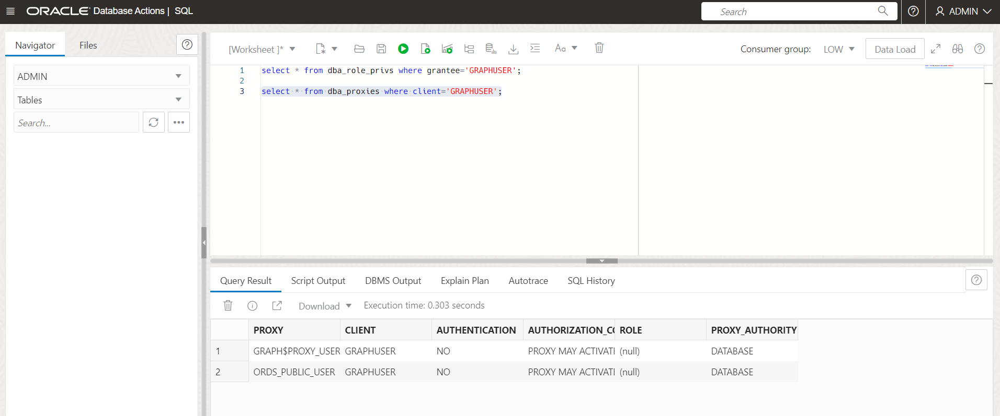

# Create the Graph User

## Introduction

In this lab you will create a database user with the appropriate roles and privileges required for using the graph capabilities of the Autonomous AI Database.

Estimated Time: 5 minutes.

Watch the video below for a quick walk through of the lab.

[Link to video of this workshop](youtube:CQh8Q24Rboc)

### Objectives

Learn how to

- create a database user with the appropriate roles and privileges required for accessing **Graph Studio**

### Prerequisites

- The following lab requires a Lakehouse or Transaction Processing database instance

## Task 1: Connect to the Database Actions for your Autonomous AI Database instance

1. Open the service detail page for your Autonomous AI Database instance in the OCI console.

   Then click on **Database actions** and select **View all database actions**.

   

## Task 2: Create the Web Access and Graph-enabled User

1. Login as the ADMIN user for your Autonomous Database instance.

    

2. Click  the **DATABASE USERS** tile under **Administration**.

   

3. Click the **+ Create User** icon.

    

4. Enter the required details, i.e. user name and password. Turn on the **Graph** and **REST, GraphQL, MongoDB API, and Web access** radio buttons. And select a quota, e.g. **UNLIMITED**,  to allocate on the `DATA` tablespace.

   >**Note:** The password should meet the following requirements:

- The password must be between 12 and 30 characters long and must include at least one uppercase letter, one lowercase letter, and one numeric character.
- The password cannot contain the username.
- The password cannot contain the double quote (“) character.
- The password must be different from the last 4 passwords used for this user.
- The password must not be the same password that is set less than 24 hours ago.

  

   >**Note:** Please do not Graph Enable the ADMIN user and do not login to Graph Studio as the ADMIN user. The ADMIN user has additional privileges by default.

Click the **Create User** button at the bottom of the panel to create the user with the specified credentials.

The newly created user will now be listed.

   

## Task 3: Create User using SQL Commands (OPTIONAL)

The UI steps in Task 2 can be alternatively done by executing the following SQL commands listed below when logged in as ADMIN. This task is optional. It shows an alternate way of creating and enabling GRAPHUSER.

1. Allocate a desired table space quota to the newly created user. Open the SQL page and issue the alter command.

   For example,
   `ALTER USER GRAPHUSER QUOTA UNLIMITED ON DATA;`
   will allocate a quota the user `GRAPHUSER` in the tablespace named `DATA`.  
   Copy and paste the following command into the SQL worksheet.  
   Substitute the correct values for  `<username>` and `<quota>` and then click on Run to execute it.

      ```
      <copy>
      -- Optional statement to use in place of the UI of the Administration page
      ALTER USER <username> QUOTA <quota> ON DATA;
      </copy>
      ```

      ```
      <copy>
      -- Optional statements to use in place of the UI of the Administration page
      GRANT GRAPH_DEVELOPER TO <username> ;
      ALTER USER <username> GRANT CONNECT THROUGH "GRAPH$PROXY_USER";
      </copy>
      ```

   The screenshot below show an example of executing the ALTER USER statement.

     

 2. You can similarly use SQL statements to verify that GRAPHUSER has been set up correctly.  

    You must be logged into Data Actions SQL as `ADMIN` then enter the following SQL statements and execute them.

    ```
    <copy>
    select * from dba_role_privs where grantee='GRAPHUSER';

    select * from dba_proxies where client='GRAPHUSER';
    </copy>
    ```
    The results should be the same as in the screenshots below.

    

    

Please **proceed to the next lab** to learn how to create and analyze graphs in ADB.

## Acknowledgements

- **Author** - Jayant Sharma, Product Management
- **Contributors** -  Korbi Schmid, Rahul Tasker, Ramu Murakami Gutierrez
- **Last Updated By/Date** - Denise Myrick, November 2025
