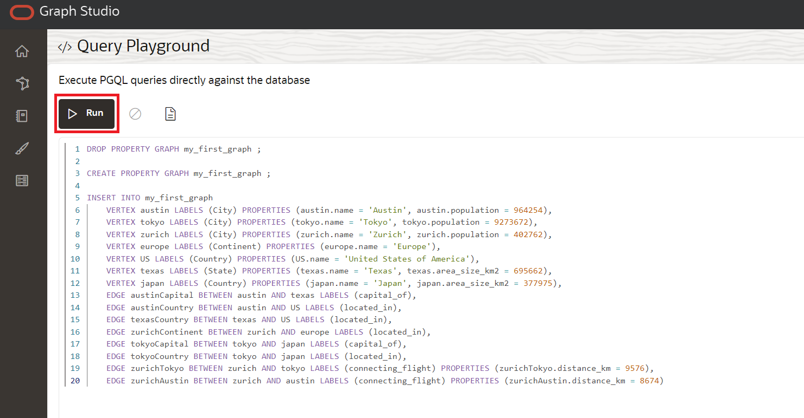

# Hello World: Create, Analyze and Visualize a Graph from Scratch

## Introduction

In this lab you will explore Graph Studio and learn how you can create and analyze a graph from scratch very quickly using
Autonomous Data Warehouse - Serverless (ADW) or Autonomous Transaction Processing - Serverless (ATP) instance.

**Note: While this lab uses Autonomous Data Warehouse, the steps are identical for creating and connecting to an Autonomous Transaction Processing database.**

Estimated Time: 10 minutes.

### Objectives

Learn how to
- connect to your Autonomous Database using **Graph Studio**
- quickly create a very simply graph from scratch using PGQL
- load graphs into memory for analysis
- create a simple notebook
- write and execute basic Markdown, PGX Java and PGQL notebook paragraphs
- visualize graph data

### Prerequisites

- The following lab requires an Autonomous Data Warehouse - Serverless or Autonomous Transaction Processing - Serverless account.

## Task 1: Connect to your Autonomous Database using Graph Studio

1. If you have the Graph Studio URL then proceed to step 3.

    Log in to the OCI Console, choose the Autonomous Database instance, then click on the Tools Configuration tab on the details page menu on the left.  
    Locate the Graph Studio link and copy and paste it into a new browser tab or window.

   


2. Alternatively, if you still have Database Actions open, click on the Graph Studio card to open in a new page or tab in your browser.  
   
     


3. Enter the Autonomous Database account credentials or the Graph-enabled user (e.g. `GRAPHUSER`) into the login screen.   
   Do **not** use `ADMIN`.

    

4. Then click the "Sign In" button.

## Task 2: Create a Simple Graph using PGQL

1. The following screenshot shows Graph Studio user interface with the menu, or navigation, icons on the left. They naviagte to the Home, Models, Graphs, Notebooks, and Jobs pages respectively.

    

2. Click on the `Graphs` menu icon:

    

3. Next click the `</> Query` button on the page. You should see a page titled  **</> Query Playground**

    
4. Copy and paste the following DDL code into the PGQL input text area:

    ```
    <copy>
    DROP PROPERTY GRAPH my_first_graph ;

    CREATE PROPERTY GRAPH my_first_graph ;

    INSERT INTO my_first_graph
        VERTEX austin LABELS (City) PROPERTIES (austin.name = 'Austin', austin.population = 964254),
        VERTEX tokyo LABELS (City) PROPERTIES (tokyo.name = 'Tokyo', tokyo.population = 9273672),
        VERTEX zurich LABELS (City) PROPERTIES (zurich.name = 'Zurich', zurich.population = 402762),
        VERTEX europe LABELS (Continent) PROPERTIES (europe.name = 'Europe'),
        VERTEX US LABELS (Country) PROPERTIES (US.name = 'United States of America'),
        VERTEX texas LABELS (State) PROPERTIES (texas.name = 'Texas', texas.area_size_km2 = 695662),
        VERTEX japan LABELS (Country) PROPERTIES (japan.name = 'Japan', japan.area_size_km2 = 377975),
        EDGE austinCapital BETWEEN austin AND texas LABELS (capital_of),
        EDGE austinCountry BETWEEN austin AND US LABELS (located_in),
        EDGE texasCountry BETWEEN texas AND US LABELS (located_in),
        EDGE zurichContinent BETWEEN zurich AND europe LABELS (located_in),
        EDGE tokyoCapital BETWEEN tokyo AND japan LABELS (capital_of),
        EDGE tokyoCountry BETWEEN tokyo AND japan LABELS (located_in),
        EDGE zurichTokyo BETWEEN zurich AND tokyo LABELS (connecting_flight) PROPERTIES (zurichTokyo.distance_km = 9576),
        EDGE zurichAustin BETWEEN zurich AND austin LABELS (connecting_flight) PROPERTIES (zurichAustin.distance_km = 8674)  

    </copy>
    ```


    This will create a very simple graph with 7 vertices and 8 edges. For more information about the syntax, please refer to the [PGQL specification](https://pgql-lang.org/spec/1.3/#inserting-vertices)

    5. Click the Execute button on the top left.

        

## Task 3: Load the Graph into Memory

1. Navigate to the Graphs page:

    

2. Click on `MY_FIRST_GRAPH`:

    

3. Click on the **Load into memory** icon on the right of the details section:

    

    In the resulting dialog, click **Yes**.

    

5. You get redirected to the Jobs page. Wait for the job to complete.

    


## Task 4: Create your First Notebook

1. Navigate to the Notebooks page:

    

2. Click the **Create** button on the right.  

3. Name the notebook **Learn/My First Notebook**, then click **Create**. That will create a folder named `Learn` and the note `My First Notebook` within it.

    

4. Each notebook is organized into a set of **paragraphs**. Each paragraph has an input (called *Code*) and an output (called **Result**). In Graph Studio, there are 7 types of paragraphs:

    

  Enter the following text into the first paragraph.

```
<copy>
%md
# My First Notebook

This is my first paragraph
</copy>
```  

  The `%md` indicates that the paragraph input is Markdown code.

1. Execute the paragraph:

    

    You will see the Markdown code rendered as HTML:

    

    Markdown paragraphs are useful to add explanations to your notebooks and order them into chapters. You can embed images and even videos using Markdown or HTML syntax, give it a try.

## Task 5: Analyze, Query and Visualize the Graph

1. Add another paragraph to the notebook by hovering at the middle of the bottom of the paragrah and clicking the **+** button which appears.

   

3. Then enter the following code in the new paragraph.

    ```
    <copy>
    %java-pgx
    var graph = session.getGraph("MY_FIRST_GRAPH", GraphSource.PG_VIEW)
    </copy>
    ```

4. Execute that paragraph, you will see we successfully referenced our graph that we just created from scratch via the PGX Java APIs.

    


**Note: Some users have encountered an issue when copying and pasting the `%md` and `%java-pgx` code above.** If you see an error message `"Invalid Parameter. No interpreter with the name 'java-pgx' is currently registered to the server."` then delete the text, or the paragraph, and manually enter the same text and re-execute the paragraph.   
The following screenshot shows the error message some, but not all, have encountered.  
    


4. Modify the paragraph to run a graph algorithm. For example:

    ```
    <copy>
    %java-pgx
    var graph = session.getGraph("MY_FIRST_GRAPH")
    analyst.countTriangles(graph, true)
    </copy>
    ```

5. Execute the updated paragraph again. Upon completion it displays the result, i.e. the graph contains exactly one triangle.

    

6. Add a paragraph and enter the following code. This will be a PGQL paragraph since it starts with the line `%pgql-pgx`.

    ```
    <copy>
    %pgql-pgx
    select v, e from match (v)-[e]->() on MY_FIRST_GRAPH
    </copy>
    ```
    

7. Execute that paragraph and the results are rendered as an interactive graph.

    

8. Right click on one of the vertices on the screen to see all the details of that vertex.

    

9. Click on the settings icon of the visualization.

    

10.  Navigate to the **Visualization** tab and select **NAME** as the label to render next to the vertices:

        

    You now see the name next to each vertex, which will help you better understand the visualization. There are lots of other options to help you make sense of the graph. Feel free to play around with the settings as you like.

11.  Add another paragraph with the following query and execute it.

    ```
    <copy>
    %pgql-pgx
    select c.NAME, c.POPULATION from match (c:City) on MY_FIRST_GRAPH order by c.POPULATION desc
    </copy>
    ```

    

12.  Change the output to be a pie chart.

       

Congratulations! You successfully created, analyzed and visualized a graph from scratch using Graph Studio. Hopefully this little example gave you a feeling of how can use your Autonomous Database as a graph database.

Please **proceed to the next lab** to see more complex examples of how to create and analyze graphs.

## Acknowledgements
* **Author** - Jayant Sharma , Product Development
* **Contributors** -  JKorbi Schmid, Rahul Tasker, Product Development
* **Last Updated By/Date** - Jayant Sharma, June 2023
