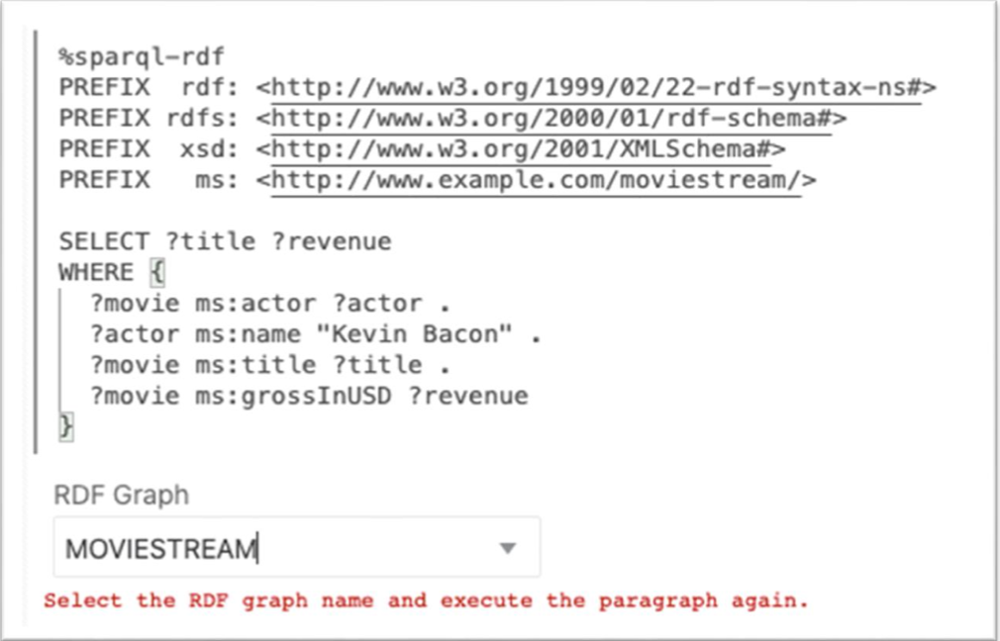
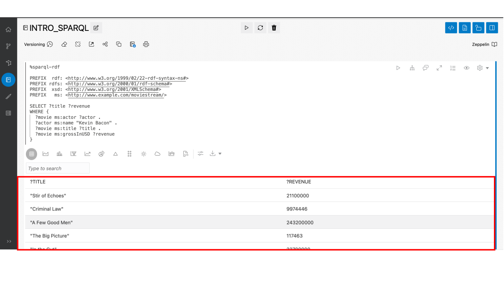
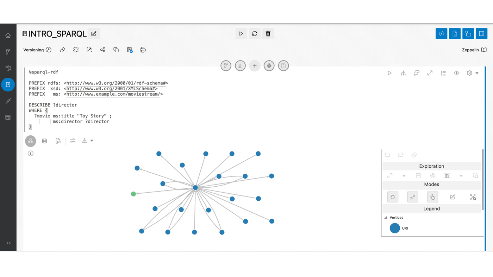
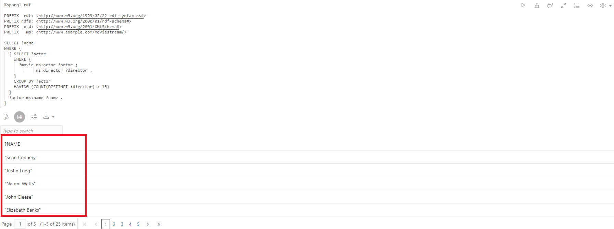
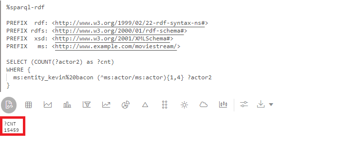
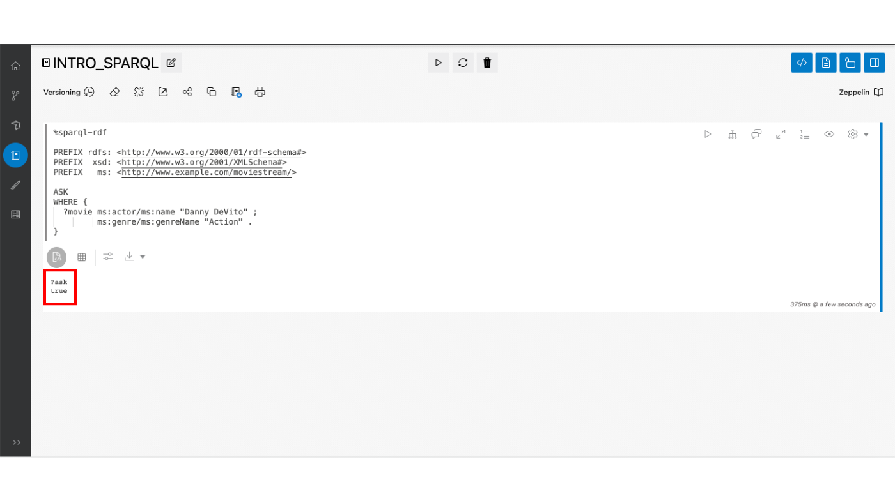
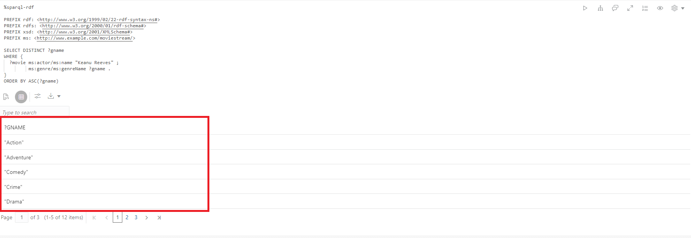
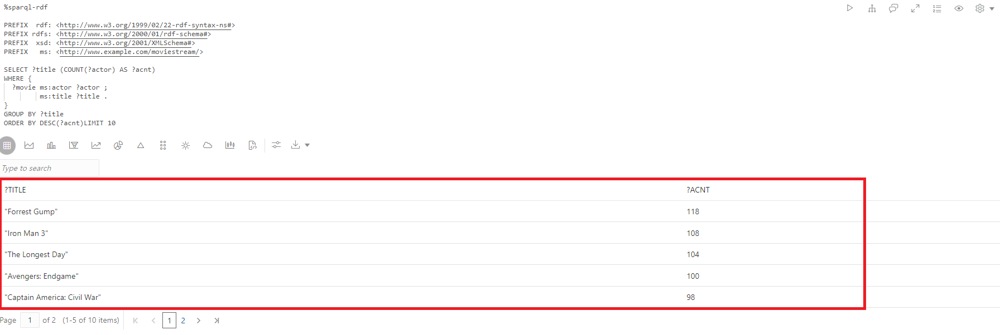
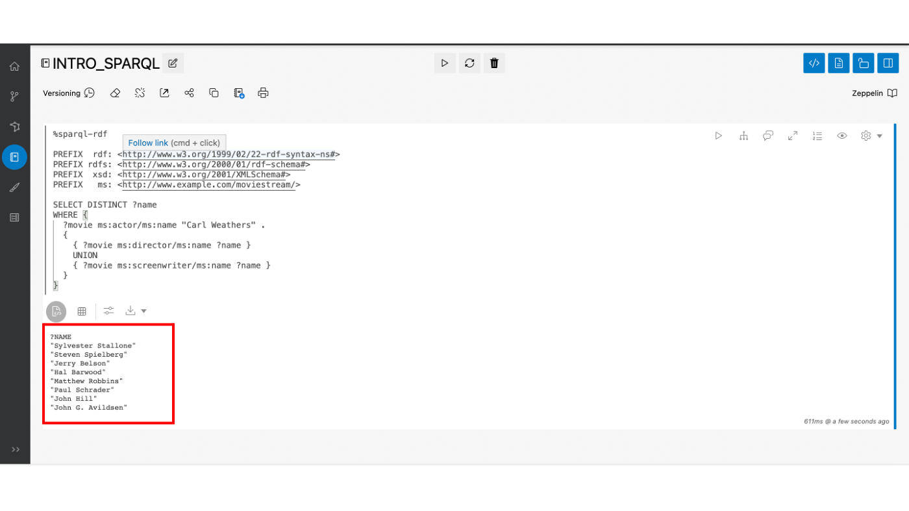
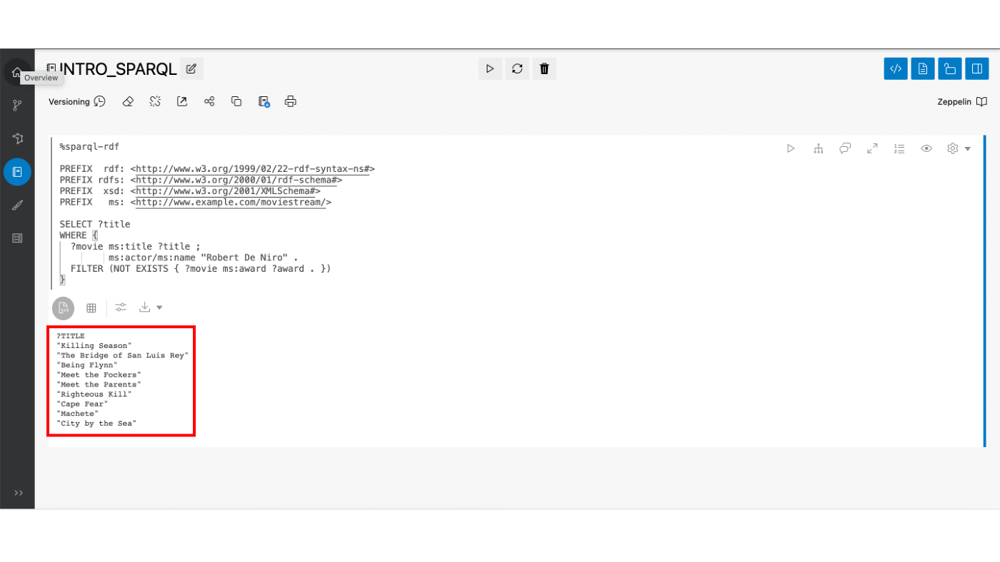

# Lab 4: Query and Visualize the RDF Graph

## Introduction

You can analyze, query, and visualize the RDF graph built from the Moviestream RDF file in a notebook paragraph. This section explains the steps to create a notebook in Graph Studio and how to get started executing SPARQL queries on the RDF graph.

Estimated Time: 10 minutes

Watch the video below for a quick walk-through of the lab.
[Query and Visualize the RDF Graph](videohub:1_g8kbgt4v)

### Objectives
- Create a Notebook in Graph Studio
- Use RDF Interpreter in Notebook paragraph
- Query and Analyze the RDF Graph

### Prerequisites
- Lab 3: Create an RDF Graph

## Task 1: Import the notebook

The instructions below show you how to create each notebook paragraph, execute it, and change default visualization settings as needed.  
First **import** the sample notebook and then execute the relevant paragraph for each step in task 2.   

1. Download the exported notebook using this [link](https://objectstorage.us-ashburn-1.oraclecloud.com/p/uaOb7jHZFcCWy4Y-OPjS3MYydBdIWL8OY2qAq5OUDmUUOZ8L-h8fggF_mjP4H0_e/n/c4u04/b/livelabsfiles/o/data-management-library-files/INTRO_SPARQL.dsnb).

2. Click the **Notebooks** menu icon and then on the **Import Notebook** icon on the top right.  

    

3. Drag the downloaded file or navigate to the correct folder and select it for upload.

    

4. Click **Import**.

    

5. Once imported it should open in Graph Studio.  

    

You can execute the paragraphs in sequence and experiment with visualizations settings as described in **Task 2** below.  

## Task 2: Create a Notebook in Graph Studio

You can perform the following steps to create a notebook in Graph Studio.

1. Go to the Notebooks page and click the Create button.

  

2. Enter the notebook Name. Optionally, you can enter Description and Tags. Click Create.

  

## Task 3: Use RDF Interpreter in Notebook Paragraph

For a newly created notebook, the notebook page is displayed with an empty paragraph. You can run a notebook paragraph using one of the following supported interpreters:

- Markdown
- Java
- Python
- PGQL
- SPARQL

A Markdown paragraph begins with %md and an RDF paragraph begins with %sparql-rdf. See [Available Notebook Interpreters](https://docs.oracle.com/en/cloud/paas/autonomous-database/csgru/inspect-environment.html) for more information on the other Graph Studio Interpreters.
You can execute a paragraph by clicking the Run Paragraph icon, which is shown highlighted in the preceding figure. Graph Studio will start to build the interpreter environment in the background if there is not one created. Paragraphs will run after the environment creation. See Inspect the Environment for more information to view the interpreter memory configuration.

You can execute a paragraph by clicking the Run Paragraph icon.

To create an RDF paragraph, mouse over the bottom of an existing paragraph and click the Add RDF Paragraph symbol.

**Let's start querying and analyzing the RDF graph**

This section gives an introduction to the SPARQL 1.1 query language through a series of example queries using the MOVIESTREAM RDF graph.

If you just have one RDF graph (MOVIESTREAM) in your account, then you can directly execute the queries shown in the examples in the following sections. The graph is automatically selected.

But, if your account has more than one RDF graph, a selection box is displayed when you execute the first SPARQL query in the notebook as shown:

  


**1. Using Graph Patterns in a SPARQL Query**

Query 1 shows a simple SPARQL query to find the title and revenue in USD of all movies starring Kevin Bacon.

The namespace prefix definition allows you to write URIs in a short form in other parts of the query. For example, `ms:actor` is short for `<http://www.example.com/moviestream/actor>`.  

The `SELECT` clause specifies the variables to project from the query, and the `WHERE` clause specifies three triple patterns enclosed within curly braces. A '.' is used as a separator between triple patterns. A shared variable between triple patterns serves as an implicit join condition.  

In this query, `?actor` appears in the first and second triple patterns and `?movie` appears in the first, third, and fourth triple patterns, which means that for three triples to match this pattern, the object of the first triple must be equal to the subject of the second triple, and the subject of the first triple must be equal to the subject of the third and fourth triples. A set of triple patterns within curly braces is called a graph pattern. A single SPARQL query may contain several graph patterns and graph patterns can be nested inside other graph patterns.

1. Execute the following in a SPARQL paragraph.

    ```
    <copy>%sparql-rdf

    PREFIX  rdf: <http://www.w3.org/1999/02/22-rdf-syntax-ns#>
    PREFIX rdfs: <http://www.w3.org/2000/01/rdf-schema#>
    PREFIX  xsd: <http://www.w3.org/2001/XMLSchema#>
    PREFIX   ms: <http://www.example.com/moviestream/>

    SELECT ?title ?revenue
    WHERE {
      ?movie ms:actor ?actor .
      ?actor ms:name "Kevin Bacon" .
      ?movie ms:title ?title .
      ?movie ms:grossInUSD ?revenue
    }</copy>
    ```

    The query output is as shown:

  

**2. Using a SPARQL DESCRIBE WHERE Query**

Query 2 uses the `DESCRIBE WHERE` form to describe the director of Toy Story.

1. Execute the following in a SPARQL paragraph.

    ```
    <copy>%sparql-rdf

    PREFIX rdfs: <http://www.w3.org/2000/01/rdf-schema#>
    PREFIX xsd: <http://www.w3.org/2001/XMLSchema#>
    PREFIX ms: <http://www.example.com/moviestream/>

    DESCRIBE ?director
    WHERE {
      ?movie ms:title "Toy Story" ;
        ms:director ?director
    }</copy>
    ```

    The query output is as shown:

  

**3. Using Dataset Descriptions in a SPARQL Query**

Query 3 shows the RDF properties defined in this dataset and their counts.

Aggregate queries can be very useful when characterizing an RDF dataset. They can show the available edge types (RDF properties) and vertex types (Classes) and their distribution

1. Execute the following in a SPARQL paragraph.

    ```
    <copy>%sparql-rdf

    PREFIX  rdf: <http://www.w3.org/1999/02/22-rdf-syntax-ns#>
    PREFIX rdfs: <http://www.w3.org/2000/01/rdf-schema#>
    PREFIX  xsd: <http://www.w3.org/2001/XMLSchema#>
    PREFIX   ms: <http://www.example.com/moviestream/>

    SELECT ?p (COUNT(*) AS ?cnt)
    WHERE { ?s ?p ?o }
    GROUP BY ?p</copy>
    ```

    The query output is as shown:

  

**4. Using OPTIONAL Clause in a SPARQL Query**

Query 4 finds movies with Jack Nicholson and optionally their awards.

SPARQL uses the `OPTIONAL` keyword to denote that a graph pattern should be matched in a best-effort fashion. That is, if there is a result for the optional pattern, then return it, otherwise, return NULL or no value. This feature is particularly useful for RDF data due to its schemaless nature and tolerance for irregular data. Resources of the same type in RDF graphs will often have different properties, and `OPTIONAL` allows us to match patterns when they exist but not exclude results when those patterns are not matched. If there are multiple triple patterns inside an `OPTIONAL` clause, then all of those triple patterns must match for the `OPTIONAL` pattern to return a result. Also, a single query may have several `OPTIONAL` clauses, which can be nested.

1. Execute the following in a SPARQL paragraph.

    ```
    <copy>%sparql-rdf

    PREFIX  rdf: <http://www.w3.org/1999/02/22-rdf-syntax-ns#>
    PREFIX rdfs: <http://www.w3.org/2000/01/rdf-schema#>
    PREFIX  xsd: <http://www.w3.org/2001/XMLSchema#>
    PREFIX   ms: <http://www.example.com/moviestream/>

    SELECT ?title ?awardName
    WHERE {
      ?movie ms:title ?title ;
             ms:actor/ms:name "Jack Nicholson" .
      OPTIONAL {  
        ?movie ms:award/ms:awardName ?awardName .  
      }
    }
    ORDER BY DESC(?awardName) ?title</copy>
    ```

    The query output is as shown:

  

**5. Using Subqueries in a SPARQL Query**

Query 5 finds information about actors who have worked with more than 15 different directors. This query uses a subquery to find a small set of actors and then finds ms:name triples for only those actors.

SPARQL supports subqueries. A SPARQL `SELECT` query can be nested inside a graph pattern. Subqueries enable useful capabilities such as limiting the number of results returned from a part of the overall query.

1. Execute the following in an RDF paragraph.

    ```
    <copy>%sparql-rdf

    PREFIX  rdf: <http://www.w3.org/1999/02/22-rdf-syntax-ns#>
    PREFIX rdfs: <http://www.w3.org/2000/01/rdf-schema#>
    PREFIX  xsd: <http://www.w3.org/2001/XMLSchema#>
    PREFIX   ms: <http://www.example.com/moviestream/>

    SELECT ?name
    WHERE {
      { SELECT ?actor
        WHERE {
          ?movie ms:actor ?actor ;
                 ms:director ?director .
        }
        GROUP BY ?actor
        HAVING (COUNT(DISTINCT ?director) > 15)
      }
      ?actor ms:name ?name .
    }</copy>
    ```

    The query output is as shown:

  

**6. Using a SPARQL CONSTRUCT Query**

Query 6 builds a co-star graph using an ms:coStar relationship. In this case, each solution returned from the `WHERE` clause generates three triples using bindings for `?actor1`, `?actor2`, `?name1`, and `?name2`.

SPARQL `CONSTRUCT` queries return an RDF graph built by inserting variable bindings into a construct template.

  1. Execute the following in a SPARQL paragraph.

    ```
    <copy>%sparql-rdf

    PREFIX rdfs: <http://www.w3.org/2000/01/rdf-schema#>
    PREFIX  xsd: <http://www.w3.org/2001/XMLSchema#>
    PREFIX   ms: <http://www.example.com/moviestream/>

    CONSTRUCT { ?actor1 ms:coStar ?actor2 .
                    ?actor1 ms:name ?name1 .
                    ?actor2 ms:name ?name2 }
    WHERE { ?movie ms:actor ?actor1 .
            ?actor1 ms:name ?name1 .
            ?movie ms:actor ?actor2 .
            ?actor2 ms:name ?name2 .
            FILTER (!sameTerm(?actor1, ?actor2))
    }
    LIMIT 50 </copy>
    ```

    The query output is as shown:

    

**7. Using Property Paths in a SPARQL Query**

Query 7 finds the number of actors connected to Kevin Bacon within 4 co-star relations.

SPARQL property paths allow you to match aribtrary length paths when searching for connected resources in an RDF graph. The start and destination positions in a property path may be query variables or constant RDF terms, but only constant URIs are allowed in the path expression iself. Property paths use a regular expression style syntax to express path patterns. Some highlights of the syntax are shown below (see Section 9.1 of the SPARQL 1.1 specification for details of the syntax):
- `elt*` - zero or more repetitions of `elt`
- `elt+` - one or more repetitions of `elt`
- `elt1/elt2` - elt1 followed by `elt2`
- `elt1|elt2` - an alternate path of `elt1` or `elt2`
- `^elt` - inverse path (object to subject)
- `elt{m,n}` - between `m` and `n` repetitions of `elt`

1. Execute the following in a SPARQL paragraph.

    ```
    <copy>%sparql-rdf

    PREFIX  rdf: <http://www.w3.org/1999/02/22-rdf-syntax-ns#>
    PREFIX rdfs: <http://www.w3.org/2000/01/rdf-schema#>
    PREFIX  xsd: <http://www.w3.org/2001/XMLSchema#>
    PREFIX   ms: <http://www.example.com/moviestream/>

    SELECT (COUNT(?actor2) as ?cnt)
    WHERE {
      ms:entity_kevin%20bacon (^ms:actor/ms:actor){1,4} ?actor2
    }</copy>
    ```

    The query output is as shown:

  

**8. Using a Property Path Syntax in a SPARQL Query**

Query 8 uses `|` property path syntax to express the query more concisely.

1. Execute the following in a SPARQL paragraph.

    ```
    <copy>%sparql-rdf

    PREFIX  rdf: <http://www.w3.org/1999/02/22-rdf-syntax-ns#>
    PREFIX rdfs: <http://www.w3.org/2000/01/rdf-schema#>
    PREFIX  xsd: <http://www.w3.org/2001/XMLSchema#>
    PREFIX   ms: <http://www.example.com/moviestream/>

    SELECT DISTINCT ?name
    WHERE {
      ?movie ms:actor/ms:name "Carl Weathers" .
      ?movie (ms:director|ms:screenwriter)/ms:name ?name.
    }</copy>
    ```

    The query output is as shown:

  

**9. Using a SPARQL ASK Query**

Query 9 asks whether Danny DeVito has acted in an Action movie.

SPARQL `ASK` queries return a boolean indicating whether or not a query has a non-empty result. The query form is the same as it is for SPARQL `SELECT` queries except that the `SELECT` clause is replaced by the keyword `ASK`.

1. Execute the following in a SPARQL paragraph.

    ```
    <copy>%sparql-rdf

    PREFIX rdfs: <http://www.w3.org/2000/01/rdf-schema#>
    PREFIX  xsd: <http://www.w3.org/2001/XMLSchema#>
    PREFIX   ms: <http://www.example.com/moviestream/>

    ASK
    WHERE {  
      ?movie ms:actor/ms:name "Danny DeVito" ;
             ms:genre/ms:genreName "Action" .
    } </copy>
    ```

    The query output is as shown:

  

**10. Using a SPARQL DESCRIBE Query**

Query 10 uses the simple form to describe the resource ms:movie_1216.

SPARQL `DESCRIBE` queries also return an RDF graph instead of a set of variable bindings. `DESCRIBE` queries return an RDF graph that describes the resources in a query result. The description of the resource includes any triples in which the resource appears in the subject or object position.

1. Execute the following in a SPARQL paragraph.

    ```
    <copy>%sparql-rdf

    PREFIX rdfs: <http://www.w3.org/2000/01/rdf-schema#>
    PREFIX  xsd: <http://www.w3.org/2001/XMLSchema#>
    PREFIX   ms: <http://www.example.com/moviestream/>

    DESCRIBE ms:movie_1216</copy>
    ```

    The query output is as shown:

  

## Task 4: Continue to Query and analyze the RDF graph (Optional)

**1. Executing a Concise SPARQL Query Using Shortcuts**

Query 1 finds distinct genres of movies starring Keanu Reeves in ascending order.

SPARQL syntax allows several shortcuts for writing common query patterns more concisely.

A sequence of triple patterns that repeat the same subject can be written by specifying the first triple in the normal way followed by a semicolon rather than a period, and subsequent triples can be written as predicate object pairs separated by semicolons, with a period following the last triple in the sequence.

1. Execute the following in a SPARQL paragraph.

    ```
    <copy>%sparql-rdf

    PREFIX rdf: <http://www.w3.org/1999/02/22-rdf-syntax-ns#>
    PREFIX rdfs: <http://www.w3.org/2000/01/rdf-schema#>
    PREFIX xsd: <http://www.w3.org/2001/XMLSchema#>
    PREFIX ms: <http://www.example.com/moviestream/>

    SELECT DISTINCT ?gname
    WHERE {
      ?movie ms:actor/ms:name "Keanu Reeves" ;
             ms:genre/ms:genreName ?gname .
    }
    ORDER BY ASC(?gname)</copy>
    ```

  The query output is as shown:

  

**2. Using Grouping and Aggregation in a SPARQL Query**

Query 2 finds genres of movies starring Tom Hanks, the number of movies of each genre, and the average gross revenue of movies in each genre.

Grouping and aggregation in SPARQL is very similar to grouping and aggregation in SQL. SPARQL provides the following built-in aggregates: `COUNT`, `SUM`, `MIN`, `MAX`, `AVG`, `GROUP_CONCAT`, and `SAMPLE`. Grouping is specified with `GROUP BY` and conditions on groups are specified with a `HAVING` clause. In SPARQL, expressions in the `SELECT` clause must be surrounded by parenthesis and given a variable name as an alias, for example `(COUNT(*) AS ?cnt)`, and elements in the `SELECT` clause are separated by blank space instead of with a comma. Expressions are also allowed in `GROUP BY` and `ORDER BY` and must be surrounded by parenthesis, with blank space used as a separator

1. Execute the following in a SPARQL paragraph.

    ```
    <copy>%sparql-rdf

    PREFIX  rdf: <http://www.w3.org/1999/02/22-rdf-syntax-ns#>
    PREFIX rdfs: <http://www.w3.org/2000/01/rdf-schema#>
    PREFIX  xsd: <http://www.w3.org/2001/XMLSchema#>
    PREFIX   ms: <http://www.example.com/moviestream/>

    SELECT ?gname (COUNT(*) AS ?cnt) (ROUND(AVG(?revenue)) AS?avg_revenue)
    WHERE {  
      ?movie ms:actor/ms:name "Tom Hanks" ;
             ms:genre/ms:genreName ?gname ;
             ms:grossInUSD ?revenue .
    }
    GROUP BY ?gname
    ORDER BY DESC(?avg_revenue)</copy>
    ```

    The query output is as shown:

  

**3. Using LIMIT Clause in a SPARQL Query**

Query 3 finds the 10  movies with the most actors.

The use of a `LIMIT` clause to restrict the total number of results to 10. SPARQL also supports an `OFFSET` clause to skip several solutions before returning query results.

1. Execute the following in a SPARQL paragraph.

    ```
    <copy>%sparql-rdf

    PREFIX  rdf: <http://www.w3.org/1999/02/22-rdf-syntax-ns#>
    PREFIX rdfs: <http://www.w3.org/2000/01/rdf-schema#>
    PREFIX  xsd: <http://www.w3.org/2001/XMLSchema#>
    PREFIX   ms: <http://www.example.com/moviestream/>

    SELECT ?title (COUNT(?actor) AS ?acnt)
    WHERE {
      ?movie ms:actor ?actor ;
             ms:title ?title .
    }
    GROUP BY ?title
    ORDER BY DESC(?acnt)LIMIT 10</copy>
    ```

    The query output is as shown:

  

**4. Using Class Membership in a SPARQL Query**

Query 4 shows the Classes defined in this dataset and the number of instances of each one. Note that rdf: type is a special RDF property defined by the W3C to denote Class membership

1. Execute the following in a SPARQL paragraph.

    ```
    <copy>%sparql-rdf

    PREFIX  rdf: <http://www.w3.org/1999/02/22-rdf-syntax-ns#>
    PREFIX rdfs: <http://www.w3.org/2000/01/rdf-schema#>
    PREFIX  xsd: <http://www.w3.org/2001/XMLSchema#>
    PREFIX   ms: <http://www.example.com/moviestream/>

    SELECT ?c (COUNT(*) AS ?cnt)
    WHERE { ?s rdf:type ?c }
    GROUP BY ?c</copy>
    ```

    The query output is as shown:

  

**5. Using FILTER Clause in a SPARQL Query**

Query 5 finds movies with Matt Damon that are more than 150 minutes long.

SPARQL uses the `FILTER` keyword to specify filter conditions on query elements. SPARQL `FILTER` clauses are analogous to SQL `WHERE` clauses. The usual logical comparison operators, boolean connectors, and numeric operators can be used. Note that SPARQL uses `&&` instead of the keyword `AND` and `||` instead of the keyword `OR`. SPARQL also provides several built-in strings, numeric, date, time, and hash functions in addition to RDF-specific functions. See the SPARQL 1.1 specification for a complete list.

1. Execute the following in a SPARQL paragraph.

    ```
    <copy>%sparql-rdf

    PREFIX  rdf: <http://www.w3.org/1999/02/22-rdf-syntax-ns#>
    PREFIX rdfs: <http://www.w3.org/2000/01/rdf-schema#>
    PREFIX  xsd: <http://www.w3.org/2001/XMLSchema#>
    PREFIX   ms: <http://www.example.com/moviestream/>

    SELECT ?title ?rt
    WHERE {  
      ?movie ms:actor/ms:name ?aname ;
             ms:runtimeInMin ?rt ;
             ms:title ?title .
    FILTER (?aname = "Matt Damon" && ?rt > 150)
    }</copy>
    ```

    The query output is as shown:

  

**6. Using UNION Clause in a SPARQL Query**

Query 6 finds names of writers and directors of movies with Carl Weathers.
Note the use of nested graph patterns to identify the patterns that are part of the `UNION`.

SPARQL provides a `UNION` clause to match one or more of several alternative patterns

1. Execute the following in a SPARQL paragraph.

    ```
    <copy>%sparql-rdf

    PREFIX  rdf: <http://www.w3.org/1999/02/22-rdf-syntax-ns#>
    PREFIX rdfs: <http://www.w3.org/2000/01/rdf-schema#>
    PREFIX  xsd: <http://www.w3.org/2001/XMLSchema#>
    PREFIX   ms: <http://www.example.com/moviestream/>

    SELECT DISTINCT ?name
    WHERE {
      ?movie ms:actor/ms:name "Carl Weathers" .
      {  
        { ?movie ms:director/ms:name ?name }
        UNION
        { ?movie ms:screenwriter/ms:name ?name }
      }
    }</copy>
    ```

    The query output is as shown:

  

**7. Using Negation in a SPARQL Query**

Query 7 finds movies with Robert De Niro that did not win an award.
Note the use of ‘NOT EXISTS’ keyword in the FILTER query.

SPARQL `FILTER` supports `EXISTS` and `NOT EXISTS` keywords to allow you to filter query results based on whether or not a graph pattern matches.

1. Execute the following in a SPARQL paragraph.

    ```
    <copy>%sparql-rdf

    PREFIX  rdf: <http://www.w3.org/1999/02/22-rdf-syntax-ns#>
    PREFIX rdfs: <http://www.w3.org/2000/01/rdf-schema#>
    PREFIX  xsd: <http://www.w3.org/2001/XMLSchema#>
    PREFIX   ms: <http://www.example.com/moviestream/>

    SELECT ?title
    WHERE {
      ?movie ms:title ?title ;
             ms:actor/ms:name "Robert De Niro" .
      FILTER (NOT EXISTS { ?movie ms:award ?award . })
    }</copy>
    ```

    The query output is as shown:

  

This concludes this lab. **You may now proceed to the next lab.**

## Acknowledgements

- **Author**- Bronze Martin Solution Engineer, Ethan Shmargad, Matthew McDaniel Solution Engineers, Ramu Murakami Gutierrez Product Manager
- **Technical Contributor** -  Melliyal Annamalai Distinguished Product Manager, Joao Paiva Consulting Member of Technical Staff, Lavanya Jayapalan Principal User Assistance Developer
- **Last Updated By/Date** - Ramu Murakami Gutierrez Product Manager, April 14th 2022
