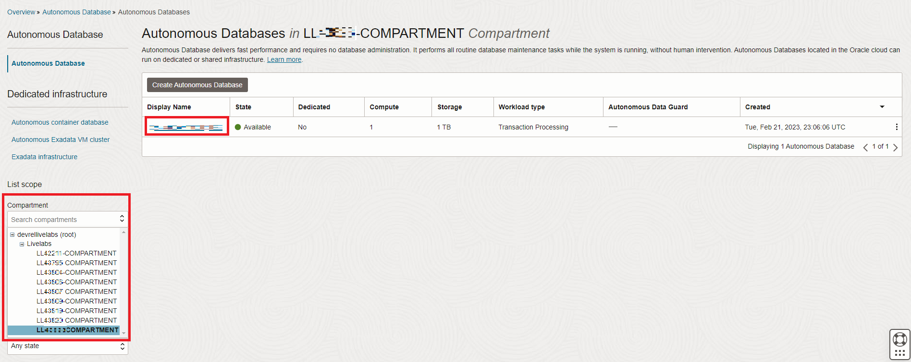
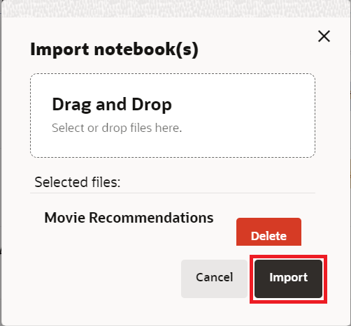

<!--
    {
        "name":"Create Graph",
        "description":"Login to Graph Studio and create a moviestream graph for when running the tenancy the lab."
    }
-->

# Import Notebook

## Introduction

Notebooks enable you to execute code and to work interactively with long workflows. You can analyze and visualize graph results using a notebook. In this lab we will be exporting the movie_recommentations notebook.

Estimated Time: 15 minutes.

### Objectives

Learn how to

- use Graph Studio to create a graph from existing tables or views.

### Prerequisites

- The following lab requires an Autonomous Database Serverless instance.
- And that the Graph-enabled user exists. That is, a database user with the correct roles and privileges exists.

## Task 1: Access the Autonomous Database

1. Click the **Navigation Menu** in the upper left, navigate to **Oracle Database**, and select **Autonomous Database**.

     

2. Select the compartment provided on **View Login Info**, and click on the **Display Name** for the **Autonomous Database**. 

     

## Task 2: Log into Graph Studio

<!---
    The Home icon  takes you to the Home page.  
    The Graph page  lists existing graphs for use in notebooks.  
    The Notebook page  lists existing notebooks and lets you create a new one. 
    The Templates page   let's you create templates for the graph visualizations.
    The Jobs page  lists the status of background jobs and lets you view the associated log if any.
--->

## Task 3: Import the notebook

 You can import a notebook that has the graph queries and analytics. Each paragraph in the notebook has an explanation.  You can review the explanation, and then run the query or analytics algorithm.   

  [Click here to download the notebook](https://c4u04.objectstorage.us-ashburn-1.oci.customer-oci.com/p/EcTjWk2IuZPZeNnD_fYMcgUhdNDIDA6rt9gaFj_WZMiL7VvxPBNMY60837hu5hga/n/c4u04/b/livelabsfiles/o/labfiles/Movie%20Recommendations%20-%20Personalized%20SALSA.dsnb) and save it to a folder on your local computer.  This notebook includes graph queries and analytics for the MOVIE_RECOMMENDATIONS graph.

 1. Click the **Notebook** icon. Import a notebook by clicking on the notebook icon on the left, and then clicking on the **Import** icon on the far right.

    
    
     Select or drag and drop the noteboook and click **Import**.

    

    A dialog pops up named **Environment Attaching**. It will disappear when the compute environment finishes attaching, usuallly in less than one minute. Or you can click **Dismiss** to close the dialog and start working on your environment. Note that you will not be able to run any paragraph until the environment finishes attaching.

## Acknowledgements
* **Author** - Ramu Murakami Gutierrez, Product Management
* **Contributors** -  Melliyal Annamalai, Rahul Tasker, Denise Myrick, Ramu Murkami Gutierrez Product Management
* **Last Updated By/Date** - Denise Myrick, Product Manager, July 2024