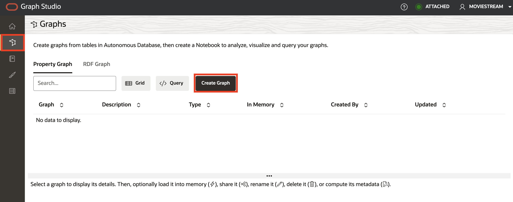
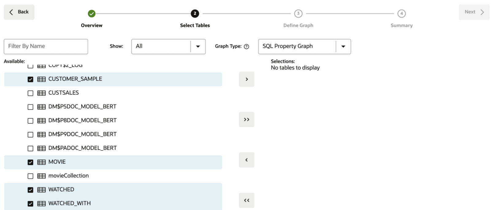

<!--
    {
        "name":"Create Graph",
        "description":"Login to Graph Studio and create a moviestream graph for when running the tenancy the lab."
    }
-->

# Create a Graph

## Introduction

In this lab you will create a graph from the `MOVIE, CUSTOMER_SAMPLE, WATCHED`, and `WATCHED_WITH` tables using the Graph Studio guided user experience.

Estimated Time: 15 minutes.

### Objectives

Learn how to

- use Graph Studio to create a graph from existing tables or views.

### Prerequisites

- The following lab requires an Autonomous Database Serverless instance.
- And that the Graph-enabled user exists. That is, a database user with the correct roles and privileges exists.

## Task 1: Access the Autonomous Database

1. Click the **Navigation Menu** in the upper left, navigate to **Oracle Database**, and select **Autonomous Database**.

     

2. Select the compartment provided on **View Login Info**, and click on the **Display Name** for the **Autonomous Database**. 

     

## Task 2: Log into Graph Studio
[](include:adb-goto-graph-studio.md)
<!---
    The Home icon  takes you to the Home page.  
    The Graph page  lists existing graphs for use in notebooks.  
    The Notebook page  lists existing notebooks and lets you create a new one. 
    The Templates page   let's you create templates for the graph visualizations.
    The Jobs page  lists the status of background jobs and lets you view the associated log if any.
--->

## Task 3: Create a graph of movies and watch data

The **Home** icon takes you to the Home page.</br>
The **Graph** page lists existing graphs for use in notebooks and lets you create a new one.</br>
The **Notebook** page lists existing notebooks and lets you create a new one.</br>
The **Templates** page lets you create templates for the graph visualizations.</br>
The **Jobs** page lists the status of background jobs and lets you view the associated log if any.</br>

1. Click the **Graph** icon. Then click **Create Graph**.  
   
      

2. Enter `MOVIESTREAM` as the graph name, then click **Next**. The description field is optional. That graph name is used throughout the next lab, so do not enter a different name because the queries and code snippets in the next lab will fail.  
    
    

3. Expand **MOVIESTREAM** and select the `CUSTOMER_SAMPLE`, `MOVIE`, `WATCHED` and `WATCHED_WITH` tables. Click **Next**. 

    

4. Move them to the right, that is, click the first icon on the shuttle control.   

    

5. The suggested graph has the `CUSTOMER_SAMPLE` and `MOVIE` as vertex tables since there are foreign key constraints specified on `WATCHED` and `WATCHED_WITH` that reference it. And `WATCHED` and `WATCHED_WITH` are suggested edge tables. Click **Next**. 

        

<!---
6.  Since these are directed edges, a best practice is verifying that the direction is correct.  
    In this instance we want to **confirm** that the direction is from `from_acct_id` to `to_acct_id`.  

    >**Note:** The `Source Vertex` and `Destination Vertex` information on the left.  

      

    **Notice** that the direction is wrong. The Source Key is `to_acct_id` instead of what we want, which is `from_acct_id`.  

    Click the swap edge icon on the right to swap the source and destination vertices and hence reverse the edge direction.  

    >**Note:** The `Source Vertex` is now the correct one, i.e. the `FROM_ACCT_ID`.

    

7. Click the **Source** tab to verify that the edge direction, and hence the generated CREATE PROPERTY GRAPH statement, is correct.

      


  **An alternate approach:** In the earlier Step 5 you could have just updated the CREATE PROPERTY GRAPH statement and saved the updates. That is, you could have just replaced the existing statement with the following one which specifies that the SOURCE KEY is  `from_acct_id`  and the DESTINATION KEY is `to_acct_id`.  

    ```
    -- This is not required if you used swap edge in UI to fix the edge direction.
    -- This is only to illustrate an alternate approach.
    <copy>
    CREATE PROPERTY GRAPH bank_graph
        VERTEX TABLES (
            BANK_ACCOUNTS as ACCOUNTS
            KEY (ACCT_ID)
            LABEL ACCOUNTS
            PROPERTIES (ACCT_ID, NAME)
        )
        EDGE TABLES (
            BANK_TXNS
            KEY (FROM_ACCT_ID, TO_ACCT_ID, AMOUNT)
            SOURCE KEY (FROM_ACCT_ID) REFERENCES ACCOUNTS
            DESTINATION KEY (TO_ACCT_ID) REFERENCES ACCOUNTS
            LABEL TRANSFERS
            PROPERTIES (AMOUNT, DESCRIPTION)
        )
    </copy>
    ```

     

   **Important:** Click the **Save** (floppy disk icon) to commit the changes.
--->

6. In the Summary step, click on **Create Graph**.

      

    This will open a Create Graph tab, click on **Create Graph**. 

    

    After this, you will be taken to the Jobs page where the graph will be created.

    This concludes this lab. **You may now proceed to the next lab.**

## Acknowledgements
* **Author** - Ramu Murakami Gutierrez, Product Management
* **Contributors** -  Melliyal Annamalai, Rahul Tasker, Denise Myrick, Ramu Murkami Gutierrez Product Management
* **Last Updated By/Date** - Denise Myrick, Product Manager, July 2024

