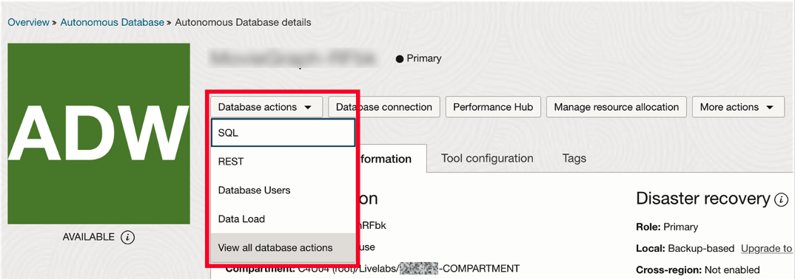
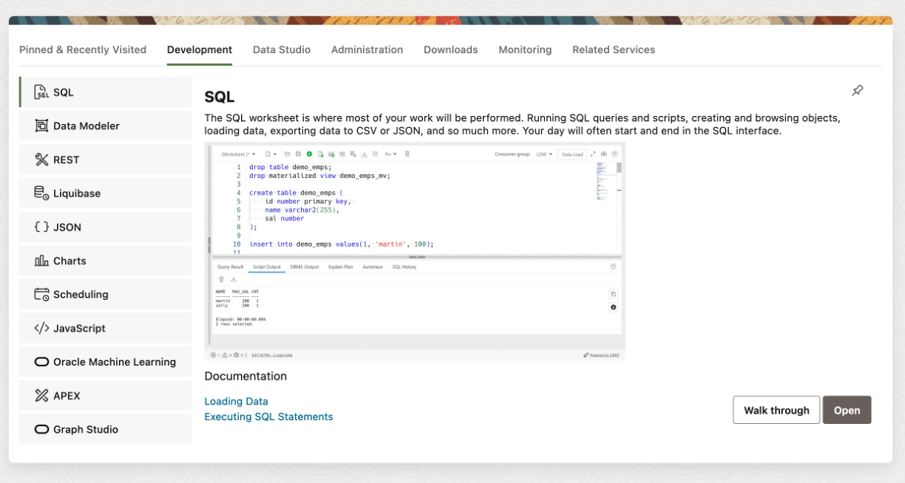
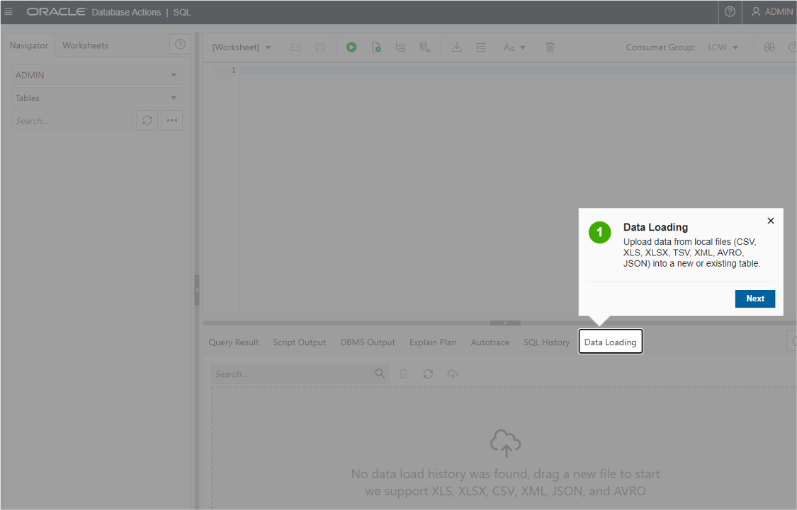
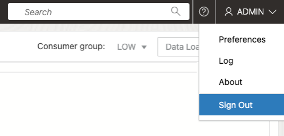
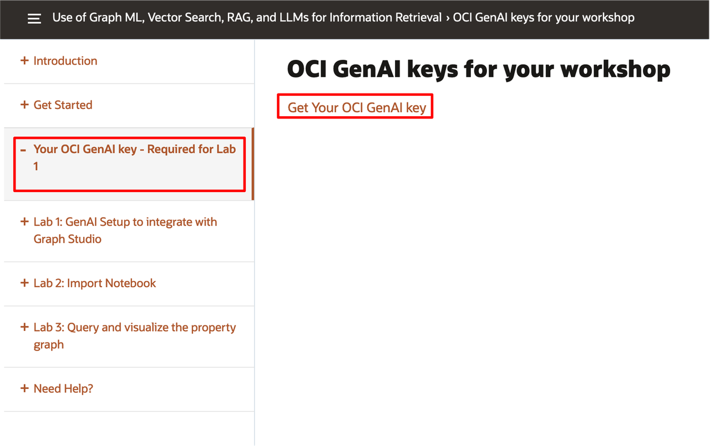
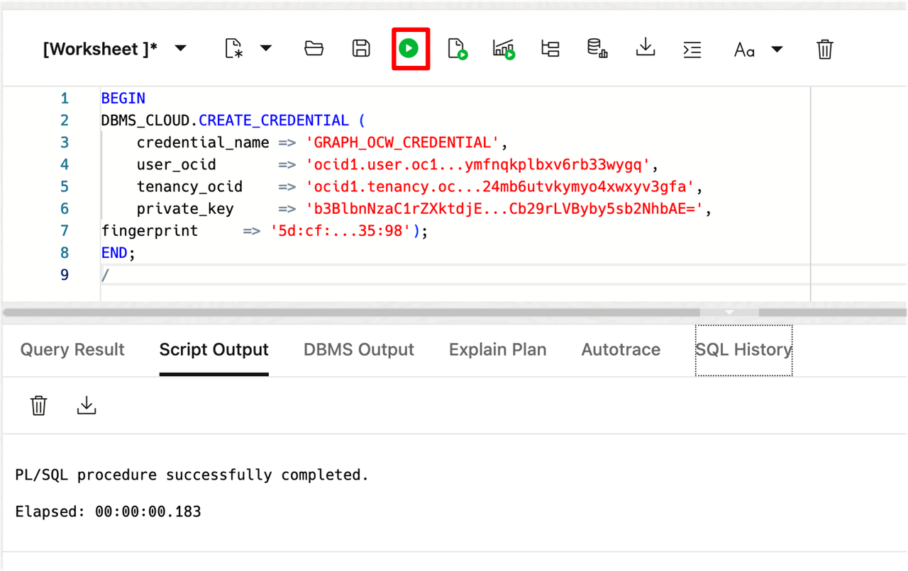
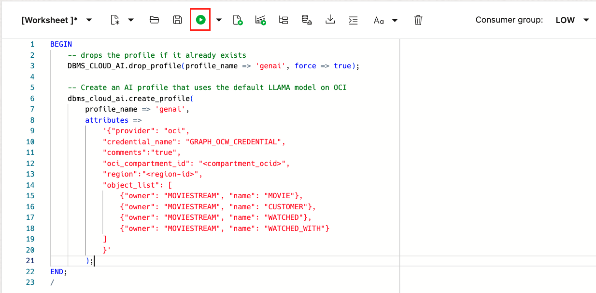
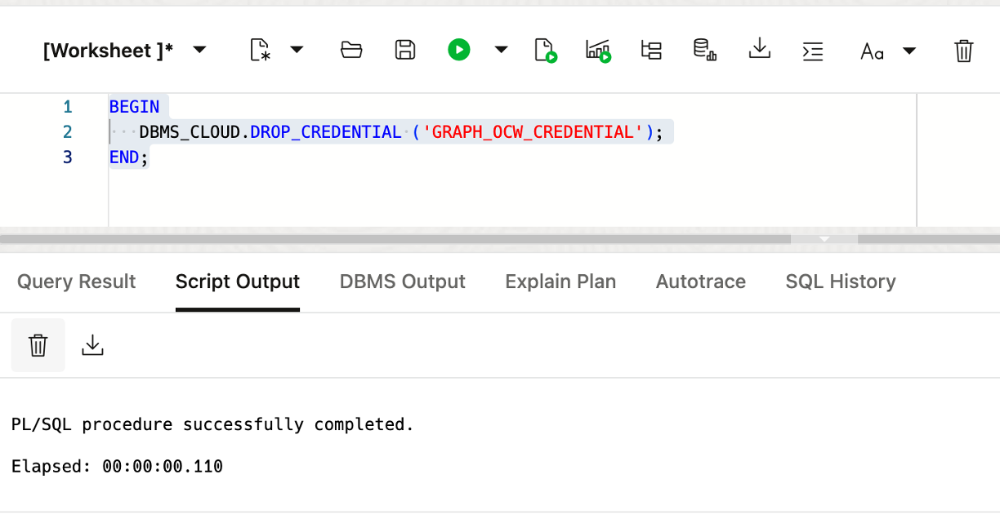

<!--
    {
        "name":"GenAI Setup to integrate with Graph Studio",
        "description":"Prerequisites for this workshop."
    }
-->

# GenAI Setup to integrate with Graph Studio

## Introduction

In this lab, you will set up the GenerativeAI service in OCI to work with Graph Studio.

Estimated Time: 10 minutes.

### Objectives

Learn how to

- Access SQL Worksheet
- Create a DBMS Cloud Credential
- Create a Gen AI profile

### Prerequisites

- The following lab requires access to an OCI account.

## Task 1: Access the Autonomous Database and open a SQL worksheet

1. Click the **Navigation Menu** in the upper left, navigate to **Oracle Database**, and select **Autonomous Database**.

    

2. Select the compartment provided on **View Login Info**, and click on the **Display Name** for the **Autonomous Database**.

    

3. In your Autonomous Database details page, click the **Database Actions** dropdown and then choose View all database actions.

    

    Logging in from the OCI service console expects you are the ADMIN user. Log in as ADMIN if you are not automatically logged in.

4. The Database Actions page opens. In the **Development** box, click **SQL**.

    

5. The first time you open SQL Worksheet, a series of pop-up informational boxes may appear, providing you a tour that introduces the main features. If not, you may click the Tour button (labeled with binoculars symbol) in the upper right corner. Click **Next** to take a tour through the informational boxes.

    

6. Sign out of the worksheet and log back in. Then, open SQL again and run the analytics as **MOVIESTREAM**.
    
    

    login using the following credentials:
    
    **Username:** MOVIESTREAM
    **Password:** watchS0meMovies#

## Task 2: Setup GenAI Connection

1. Download and unzip the zip file under the GenAI Key lab. This contains the connection information needed for GenAI to be used in the Graph Studio notebook.

     

2. Create a DBMS Cloud Credential to call the Gen AI service from SQL in Graph Studio. You will need this information: 

    ```
    <user> can be found in the text file as 'user'
    <tenancy> can be found in the text file as 'tenancy'
    <private_key> can be found as the contents .pem file that does not have the '_public' extension.
    <fingerprint> can be found in the text file as 'fingerprint' 
    ```

    Copy and paste the following code, and make the necessary changes.

    ```
    <copy>
    BEGIN
        DBMS_CLOUD.CREATE_CREDENTIAL (
        credential_name => 'GRAPH_OCW_CREDENTIAL',
        user_ocid       => '<user>',
        tenancy_ocid    => '<tenancy>',
        private_key     => '<private_key>',
        fingerprint     => '<fingerprint>'
        );
    END;
    /</copy>
    ```

    Here is **an example** of how it should look. Then run the the script using the **Run Statement** button to create the DBMS Cloud Credential. 

    ```
    BEGIN
    DBMS_CLOUD.CREATE_CREDENTIAL (
        credential_name => 'GRAPH_OCW_CREDENTIAL',
        user_ocid       => 'ocid1.user.oc1..aaaaaaaa3k363plccg...ymfnqkplbxv6rb33wygq',
        tenancy_ocid    => 'ocid1.tenancy.oc1..aaaaaaaaj4c...24mb6utvkymyo4xwxyv3gfa',
        private_key     => 'b3BlbnNzaC1rZXktdjEAAAAABG5v...Cb29rLVByby5sb2NhbAE=',
    fingerprint     => '5d:cf:...35:98');
    END;
    /
    ```

     

3. Then, create a Gen AI profile using the default llama model. You will need this information:  

    ```
    <oci_compartment_id> can be found in the text file as 'Compartment_ocid' 
    <region-id> can be found in the text file as 'region'
    ```

    Copy and paste the following code, and make the necessary changes. Then run this script using the **Run Statement** button. 

    ```
     <copy>BEGIN   
         -- drops the profile if it already exists
         DBMS_CLOUD_AI.drop_profile(profile_name => 'genai', force => true);

         -- Create an AI profile that uses the default LLAMA model on OCI
         dbms_cloud_ai.create_profile(
             profile_name => 'genai',
             attributes =>       
                 '{"provider": "oci",
                 "credential_name": "GRAPH_OCW_CREDENTIAL",
                 "comments":"true",            
                 "oci_compartment_id": "<compartment_ocid>",
                 "region":"<region-id>",
                 "object_list": [
                     {"owner": "MOVIESTREAM", "name": "MOVIE"},
                     {"owner": "MOVIESTREAM", "name": "CUSTOMER"},
                     {"owner": "MOVIESTREAM", "name": "WATCHED"},
                     {"owner": "MOVIESTREAM", "name": "WATCHED_WITH"}
                 ]
                 }'
             );

     END;
     /</copy>
    ```

     

    This concludes this lab. **You may now proceed to the next lab.**

>**Note:** If you encounter issues in lab 3, task 1, it may be due to the DBMS Cloud Credential not being created properly. You can remove the credential by running the following statement.
    ```
     <copy>BEGIN
     DBMS_CLOUD.DROP_CREDENTIAL ('GRAPH_OCW_CREDENTIAL');
     END;</copy>
    ```

Then, re-run task 2 in tab 1. After re-creating the DBMS Cloud Credential, you can return to lab 3, task 1.

## Acknowledgements

- **Author** - Ramu Murakami Gutierrez, Product Manager
- **Contributors** -  Melliyal Annamalai, Denise Myrick, Rahul Tasker, and Ramu Murakami Gutierrez Product Management
- **Last Updated By/Date** - Denise Myrick, Product Manager, June 2025
