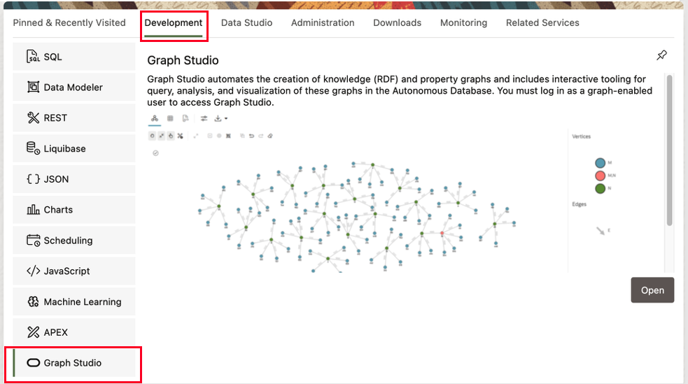

<!--
    {
        "name":"Create Graph",
        "description":"Login to Graph Studio and create a moviestream graph for when running the tenancy the lab."
    }
-->

# Import Notebook

## Introduction

Notebooks enable you to execute code and to work interactively with long workflows. You can analyze and visualize graph results using a notebook. In this lab we will be importing the movie_recommendations notebook.

Estimated Time: 15 minutes.

### Objectives

Learn how to

- Log into Graph Studio
- Import a notebook

### Prerequisites

- The following lab requires an Autonomous Database Serverless instance.
- And that the Graph-enabled user exists. That is, a database user with the correct roles and privileges exists.

## Task 1: Log into Graph Studio

1. Click the **Navigation Menu** in the upper left, navigate to **Oracle Database**, and select **Autonomous Database**.

    

2. Select the compartment provided on **View Login Info**, and click on the **Display Name** for the **Autonomous Database**.

    

3. In your Autonomous Database details page, click the **Database Actions** dropdown and then choose View all database actions.

    

4. The Database Actions page opens. In the **Development** box, click **Graph Studio**.

    

    Login using the following credentials:

    **Username:**

    ```
     <copy>MOVIESTREAM</copy>
    ```

    **Password:**

    ```
     <copy>watchS0meMovies#</copy>
    ```

    

## Task 2: Import the notebook

 You can import a notebook that has the graph queries and analytics. Each paragraph in the notebook has an explanation.  You can review the explanation, and then run the query or analytics algorithm.

  [Click here to download the notebook](https://c4u04.objectstorage.us-ashburn-1.oci.customer-oci.com/p/EcTjWk2IuZPZeNnD_fYMcgUhdNDIDA6rt9gaFj_WZMiL7VvxPBNMY60837hu5hga/n/c4u04/b/livelabsfiles/o/MOVIE_RECOMMENDATIONS.dsnb) and save it to a folder on your local computer.  This notebook includes graph queries and analytics for the MOVIE_RECOMMENDATIONS graph.

 1. Click the **Notebook** icon. Import a notebook by clicking on the notebook icon on the left, and then clicking on the **Import** icon on the far right.

    

    

    A dialog pops up named **Compute Environment**. It will disappear when the compute environment finishes attaching, usually in less than one minute. Or you can click **Close** to close the dialog and start working on your environment. Note that you will not be able to run any paragraph until the environment finishes attaching.

## Acknowledgements

- **Author** - Ramu Murakami Gutierrez, Product Management
- **Contributors** -  Melliyal Annamalai, Rahul Tasker, Denise Myrick, Ramu Murkami Gutierrez Product Management
- **Last Updated By/Date** - Denise Myrick, Product Management, June 2025
