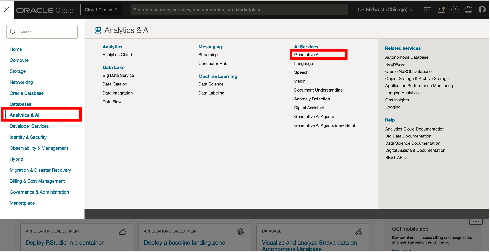
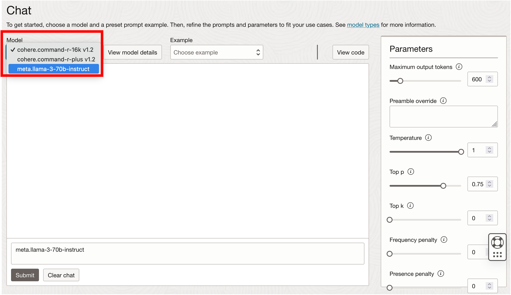
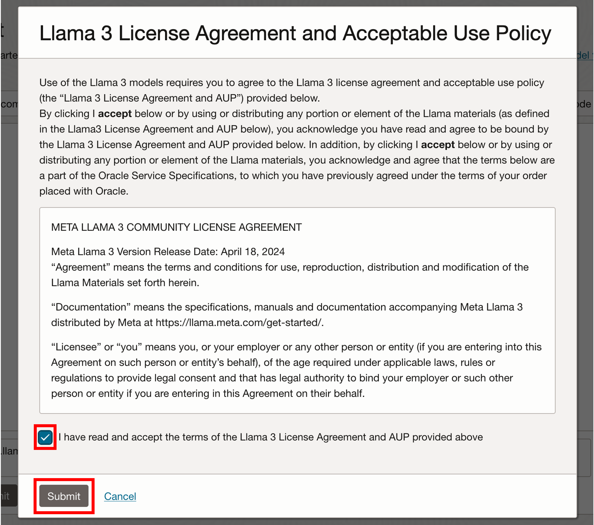
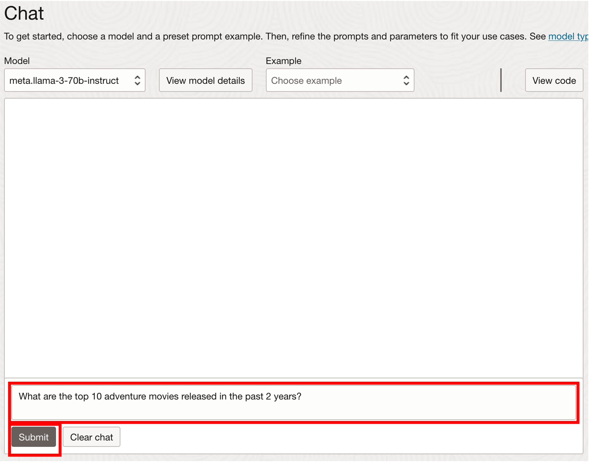

# Ask GenerativeAI for a movie recommendation

## Introduction

In this lab you will use the GenerativeAI service in OCI to ask for a list of adventure movie recommendation released in 2024. 

Estimated Time: 15 minutes.

### Objectives

Learn how to
- Use OCI GenerativeAI.

### Prerequisites

- The following lab requires access to an OCI account. 

## Task 1: Access the OCI Generative AI service 

1. Click the **Navigation Menu** in the upper left, navigate to **Analytics and AI**, and select **Generative AI**.

     

2. A welcome message with pop up in the screen.  You can start introduction or exit. Click on **Go to playground**. ›

     

## Task 2: Ask GenAI for a movie recommendation 

1. There's 3 models to choose from. Select **meta.llama-3-70b-instruct**. 

    

    Accept the terms in the Lama 3 License Agreement and Acceptable Use Policy and click submit.

    

2. Ask GenerativeAI to recommend you an adventure movie released in 2024. Copy the following question and **Submit** it. 

     ```
     <copy>What are the top 10 adventure movies released in the past 2 years?</copy>
     ```

      

    The GenerativeAI model returns a list of adventure movies released between 2020-2022. 
    
      

    As we can see in here, the LLM is not trained for movies released this year. Since we are looking to recommend an adventure movie released this year, we will rely on our database to identify the right movie to watch in our watch party. 

    This concludes this lab. **You may now proceed to the next lab.**

## Acknowledgements
* **Author** - Ramu Murakami Gutierrez, Product Management
* **Contributors** -  Melliyal Annamalai, Denise Myrick, Rahul Tasker, and Ramu Murakami Gutierrez Product Management
* **Last Updated By/Date** - Ramu Murakami Gutierrez, Product Manager, July 2024

