# Query and visualize the graph

## Introduction

In this lab, you will query the newly created graph (that is, `MOVIESTREAM`) in SQL and PGQL paragraphs of a notebook.

Estimated Time: 30 minutes.

Watch the video below for a quick walk-through of the lab.
[Query and visualize the property graph](videohub:1_42g4tneh)

### Objectives

Learn how to:

- Import a notebook
- Create a notebook and add paragraphs
- Use Graph Studio notebooks with SQL and PGQL paragraphs to query, analyze, and visualize a graph

### Prerequisites

- Earlier labs of this workshop. That is, the graph user exists, you have logged into Graph Studio, and created a graph

## Task 1: Explore the data available in the database

In this workshop, we on the development team at Oracle MovieStream, a fictitious on-line movie streaming company, which has a new feature helping users coordinate watch parties for their friends, who are also MovieStream users. The service uses each party goers' watch history to help inform suggestions. Users can use the LLM to ask general questions about movies, but as we saw, has limitations. One of our customers, Adriana, is exploring the watch party feature. She wants to see what 2024 adventure movie she might be interested in watching and which of her friends she could invite to a party. MovieStream includes an option to personalize an email to Adriana's invitees to her watch party.

In this task, we will explore the data that is available in the MovieStream database, and search for movies that were recently released.

>**Note:** *Execute the relevant paragraph after reading the description in each of the steps below*.
If the compute environment is not ready just yet and the code cannot be executed then you will see a blue line moving across the bottom of the paragraph to indicate that a background task is in progress.

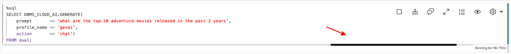

1. We will first start by identifying movies that were released in 2024. We are using vectors to find movies with genre type Adventure for our watch party.

     ```
     <copy>%sql
     SELECT m.TITLE, m.MOVIE_ID, m.YEAR
     FROM MOVIE m
     WHERE m.YEAR = 2024
     ORDER BY vector_distance(m.summary_vec, 
     vector_embedding(doc_model_bert using 'ADVENTURE' as data), COSINE)</copy>
     ```

    Looks like the 'The Fall Guy' has the highest score for ADVENTURE movies in 2024 that we have available for our customers to watch. 

    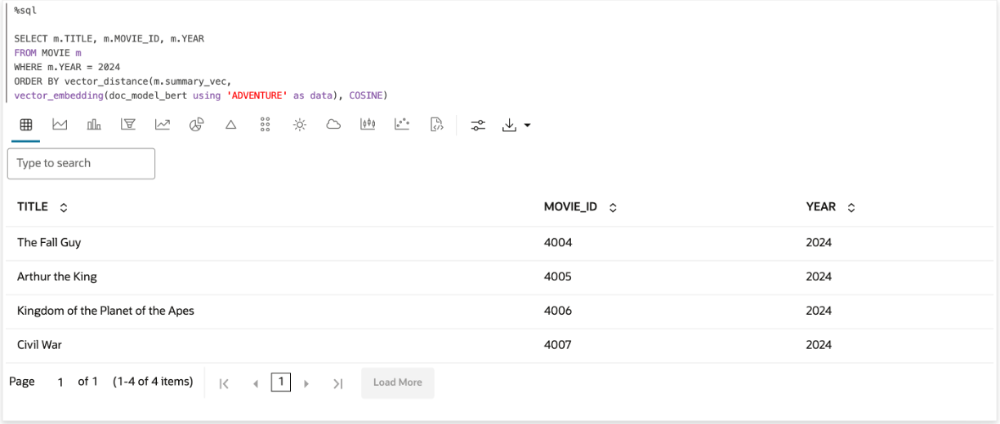 

2. Our search result gives 'The Fall Guy' the highest score for ADVENTURE movies in 2024 that we have available for our customers to watch.

Adriana wants to know which movies it's similar to to help her decide if she'd like to watch it. Let's run a vector search to find out.

     ```
     <copy>%sql
     SELECT mo.TITLE, mo.YEAR, vector_distance(m.summary_vec, mo.summary_vec, COSINE) as vec_dist
     FROM MOVIE m, MOVIE mo
     WHERE m.TITLE = 'The Fall Guy'
     ORDER BY vec_dist;
     </copy>
     ``` 

    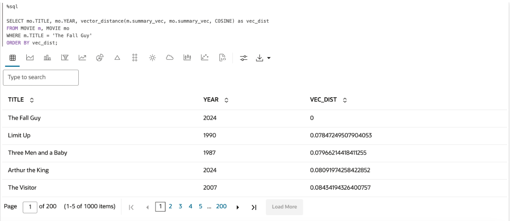 

## Task 2: Create and query a Property Graph using SQL

Knowing what movies are similar to 'The Fall Guy' is a good start, but it doesn't fully achieve Adriana's goal. We need more information about the relationships between customers and movies they watch. We will first create a graph of customers, movies they have watched, and movies they have watched at watch parties. Then, we will query the graph using SQL and PGQL.

1. The following query creates a graph of customers, movies they have watched, and movies they have watched at watch parties.

     ```
     <copy>%sql
     CREATE PROPERTY GRAPH movie_recommendations
     VERTEX TABLES (
         CUSTOMER
             KEY ( CUST_ID ),
         MOVIE
             KEY ( MOVIE_ID )
     )
     EDGE TABLES (
         WATCHED
             KEY ( ID )
             SOURCE KEY ( PROMO_CUST_ID ) REFERENCES CUSTOMER ( CUST_ID )
             DESTINATION KEY ( MOVIE_ID ) REFERENCES MOVIE ( MOVIE_ID ),
         WATCHED_WITH
             KEY(ID)
             SOURCE KEY ( WATCHER ) REFERENCES CUSTOMER( CUST_ID )
             DESTINATION KEY ( WATCHED_WITH ) REFERENCES CUSTOMER ( CUST_ID )
     );</copy>
     ```

    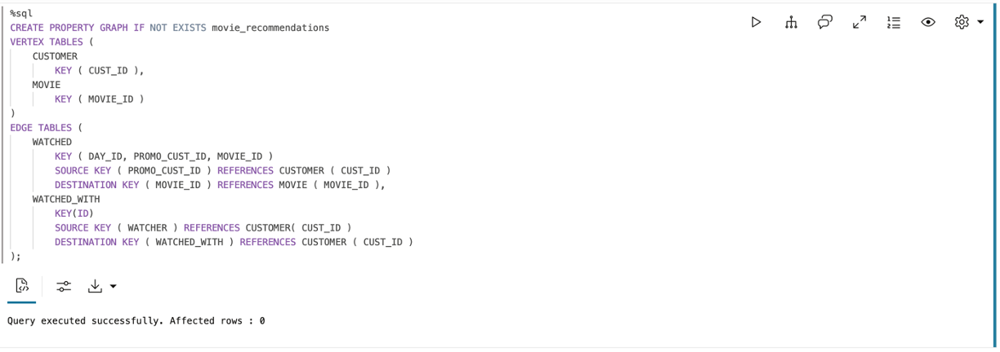

2. Let's take a close look at our customer, Adriana Osborne. We want to know the movies she has watched, and the watch parties she has been to. The next query helps us find her CUST_ID to make writing the queries a bit easier.

     ```
     <copy>%sql
     SELECT CUST_ID FROM CUSTOMER WHERE FIRST_NAME ='Adriana'AND LAST_NAME = 'Osborne';</copy>
     ```

    

    Now that we know Adriana's CUST_ID, let's look at some sample queries. 

3. This query returns all the movies Adriana has watched.

     ```
     <copy>%sql
     SELECT C1NAME, MOVIE_TITLE
     FROM GRAPH_TABLE( MOVIE_RECOMMENDATIONS
     MATCH (c1 IS CUSTOMER)-[e1 IS WATCHED]->(m IS MOVIE)
     WHERE c1.CUST_ID = 1005510
     COLUMNS (c1.FIRST_NAME as C1NAME, m.title as MOVIE_TITLE) );</copy>
     ```

    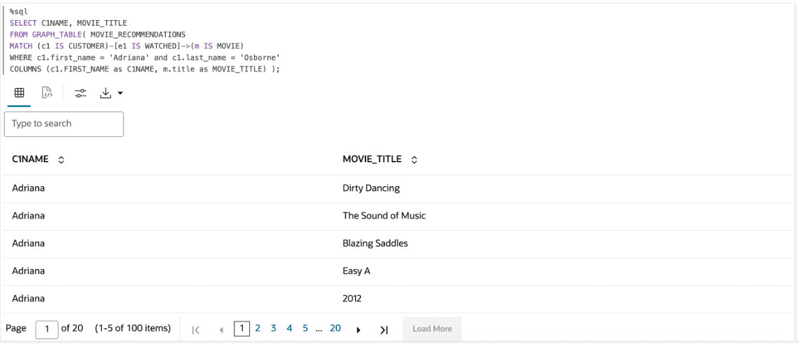

4. Next, let's take a look at the watch parties Adriana has been part of, and some other movies other watch party attendees have watched.

     ```
     <copy>%sql
     SELECT C1NAME, C2NAME, MOVIE_TITLE
	     FROM GRAPH_TABLE(MOVIE_RECOMMENDATIONS 
         MATCH (c1 is CUSTOMER) -[e is WATCHED_WITH]-> (c2 is CUSTOMER)-[w is WATCHED]-> (m is MOVIE)
         WHERE c1.CUST_ID = 1005510
         COLUMNS (c1.FIRST_NAME as C1NAME, C2.FIRST_NAME as C2NAME, m.TITLE as MOVIE_TITLE)
         )</copy>
     ```

    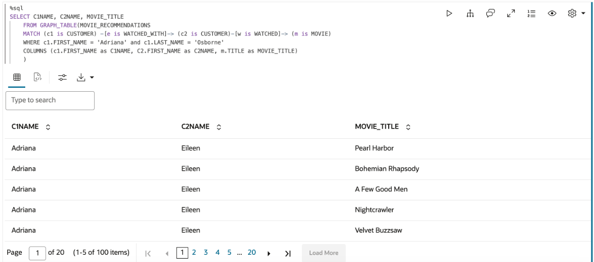  

## Task 3: Create and query a Property Graph using PGQL

This is great, but sometimes a visualization helps us identify relationships more quickly. We will visualize the results of this graph query by creating a PGQL Property Graph. (SQL Property Graph visualization coming soon!)

1. Run the following query to create the same property graph query using PGQL.

     ```
     <copy>%pgql-rdbms
     CREATE PROPERTY GRAPH movie_recommendations_pgql
     VERTEX TABLES (
         CUSTOMER
             KEY ( CUST_ID ),
         MOVIE
             KEY ( MOVIE_ID )
             PROPERTIES ARE ALL COLUMNS EXCEPT(summary_vec)
     )
     EDGE TABLES (
         WATCHED
             KEY ( ID )
             SOURCE KEY ( PROMO_CUST_ID ) REFERENCES CUSTOMER ( CUST_ID )
             DESTINATION KEY ( MOVIE_ID ) REFERENCES MOVIE ( MOVIE_ID ),
         WATCHED_WITH
             KEY(ID)
             SOURCE KEY ( WATCHER ) REFERENCES CUSTOMER( CUST_ID )
             DESTINATION KEY ( WATCHED_WITH ) REFERENCES CUSTOMER ( CUST_ID )
         ) OPTIONS(PG_VIEW)</copy>
     ```

    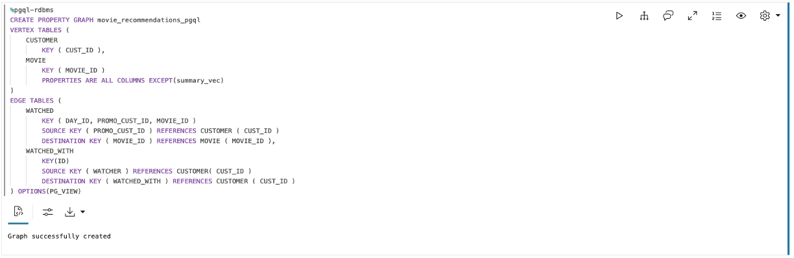

    Let's run the previous queries in PGQL.

2. This query helps us visualize the movies Adriana watched at a watch party and who else attended these events.

     ```
     <copy>%pgql-rdbms
     SELECT c1, e, c2, w, m
         FROM MATCH (c1 is CUSTOMER) -[e is WATCHED_WITH]-> (c2 is CUSTOMER)-[w is WATCHED]-> (m is MOVIE)
         ON MOVIE_RECOMMENDATIONS_PGQL 
         WHERE c1.CUST_ID = 1005510</copy>
     ```

    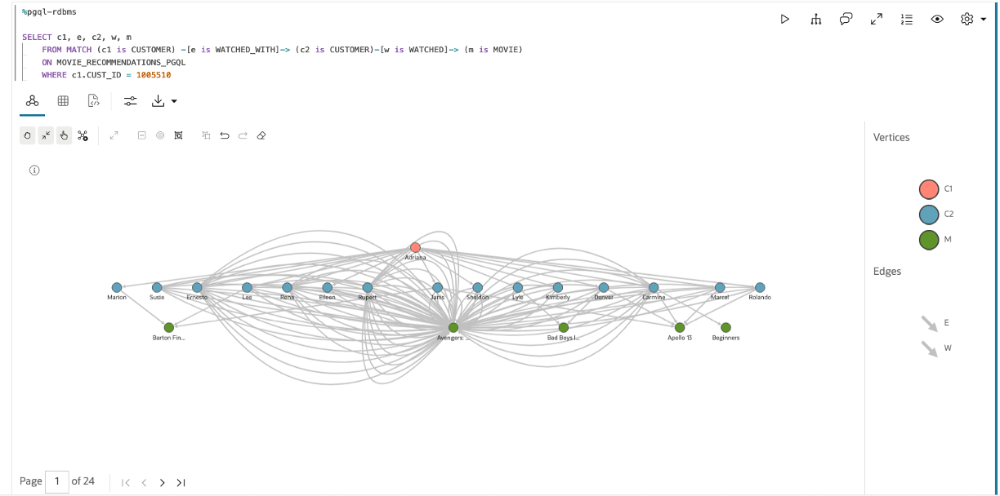

3. This query visualizes the movies Adriana has watched previously.

     ```
     <copy>%pgql-rdbms
     SELECT c1, w, m
	     FROM MATCH (c1 is CUSTOMER) -[w is WATCHED]-> (m is MOVIE)
         ON MOVIE_RECOMMENDATIONS_PGQL 
         WHERE c1.CUST_ID = 1005510</copy>
      ```

    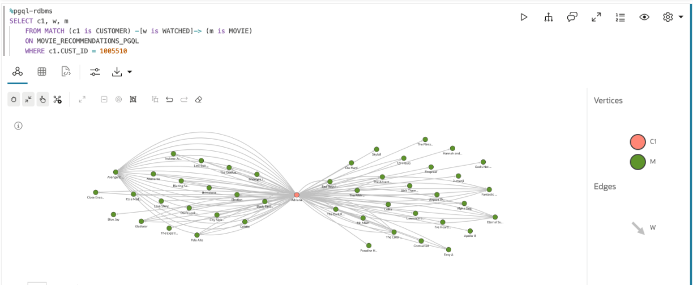

## Task 4: Continue querying the MOVIE_RECOMMENDATIONS graph using SQL and PGQL

We want to know whether Adriana has gone to watch parties for movies similar to 'The Fall Guy.'
Maybe she will be interested in getting together with the same group of people to watch 'The Fall Guy.'

1. Let us first find out the MOVIE_ID for the 'The Fall Guy' so that writing the query will be a little easier.

     ```
     <copy>%sql
     select MOVIE_ID from MOVIE where TITLE ='The Fall Guy';</copy>
      ```

    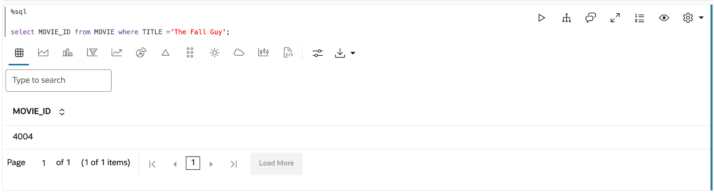

2. The following query helps us find watch parties that Adriana has been to where the movie they watched was similar to 'The Fall Guy.'

     ```
     <copy>%sql
     SELECT C1NAME, C2NAME, MOVIE_TITLE, vector_distance(svec, (SELECT summary_vec from MOVIE WHERE movie_id = 4004), COSINE) as vec_dist 
     FROM (
         SELECT C1NAME, C2NAME, MOVIE_TITLE, svec
         FROM GRAPH_TABLE(MOVIE_RECOMMENDATIONS 
             MATCH (c1 is CUSTOMER) -[e is WATCHED_WITH]-> (c2 is CUSTOMER)-[w is WATCHED]-> (m is MOVIE)
             WHERE c1.CUST_ID = 1005510
             COLUMNS (c1.FIRST_NAME as C1NAME, C2.FIRST_NAME as C2NAME, m.MOVIE_ID as m_id, m.TITLE as MOVIE_TITLE, m.YEAR as MOVIE_YEAR, m.SUMMARY_VEC as svec, vertex_id(c1) as c1id, edge_id(e) as eid, vertex_id(c2) as c2id, edge_id(w) as wid, vertex_id(m) as mid)
         )
     )
     ORDER BY vec_dist  desc;</copy>
     ```

    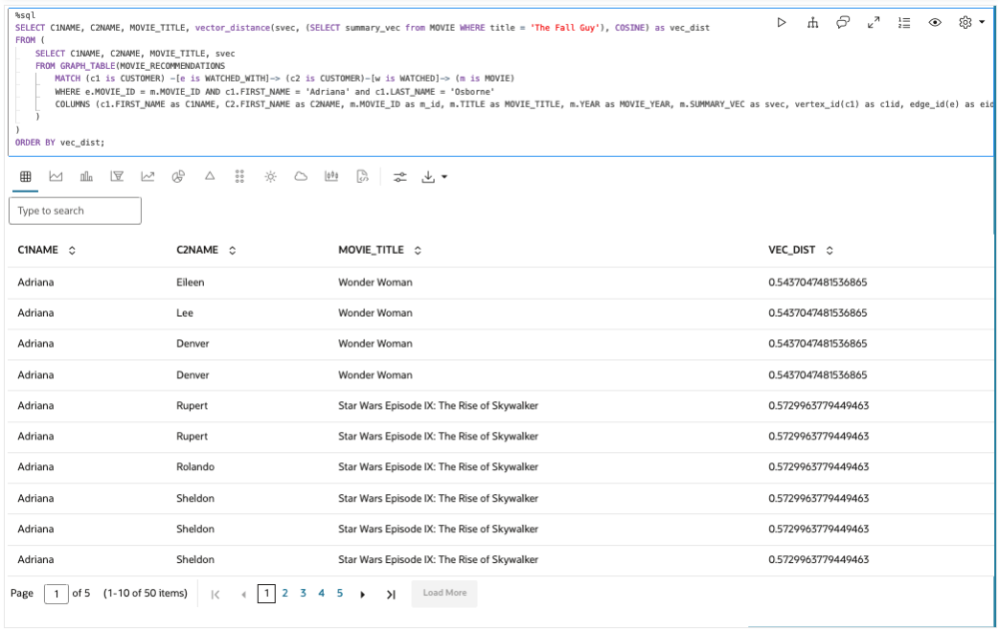

    Let us visualize the graph in this query, again using a PGQL graph.

     ```
     <copy>%pgql-rdbms
     SELECT c1, e, c2, w, m
         FROM MATCH (c1 is CUSTOMER) -[e is WATCHED_WITH]-> (c2 is CUSTOMER)-[w is WATCHED]-> (m is MOVIE)
         ON MOVIE_RECOMMENDATIONS_PGQL 
         WHERE e.MOVIE_ID = m.MOVIE_ID and c1.CUST_ID = 1005510</copy>
     ```
     
    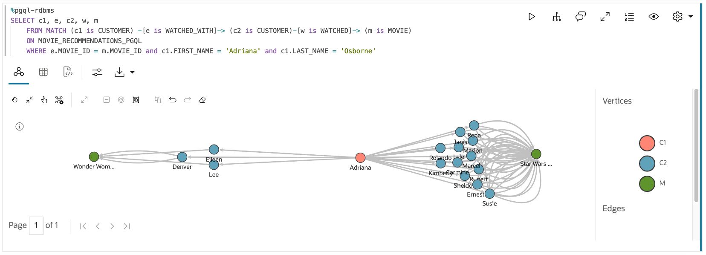

    Given the strong turnout for the 'Star Wars Episode IX: The Rise of Skywalker' watch party, this group seems perfect for organizing a watch party to watch 'The Fall Guy' so we will use the help of the OCI Generative AI service to set up this watch party.

This concludes this lab.

## Acknowledgements
* **Author** - Ramu Murakami Gutierrez, Product Management
* **Contributors** -  Melliyal Annamalai, Rahul Tasker, Denise Myrick, Ramu Murkami Gutierrez Product Management
* **Last Updated By/Date** - Denise Myrick, Product Manager, July 2024
