# Query and visualize the graph

## Introduction

In this lab, you will query the newly created graph (that is, `MOVIESTREAM`) in PGQL paragraphs of a notebook.

Estimated Time: 30 minutes.

Watch the video below for a quick walk-through of the lab.
[Query and visualize the property graph](videohub:1_42g4tneh)

### Objectives

Learn how to:

- Import a notebook
- Create a notebook and add paragraphs
- Use Graph Studio notebooks with SQL and Python paragraphs to query, analyze, and visualize a graph

### Prerequisites

- Earlier labs of this workshop. That is, the graph user exists, you have logged into Graph Studio, and created a graph

## Task 1: Import the notebook (OPTION A)

The instructions below show you how to create each notebook paragraph, execute it, and change default visualization settings as needed.
First **import** the sample notebook and then execute the relevant paragraph for each step in task 2.

1. Download the exported notebook using this [link](https://c4u04.objectstorage.us-ashburn-1.oci.customer-oci.com/p/EcTjWk2IuZPZeNnD_fYMcgUhdNDIDA6rt9gaFj_WZMiL7VvxPBNMY60837hu5hga/n/c4u04/b/livelabsfiles/o/labfiles/BANK_GRAPH.dsnb).

2. Click the **Notebooks** menu icon and then on the **Import** notebook icon on the top right.  

    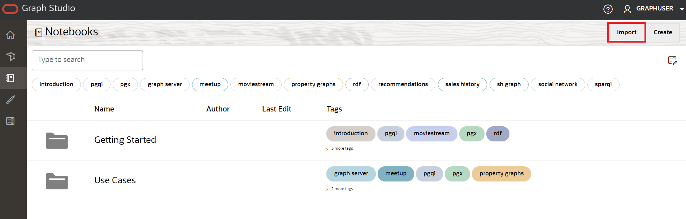  

3. Drag the downloaded file or navigate to the correct folder and select it for upload.  

    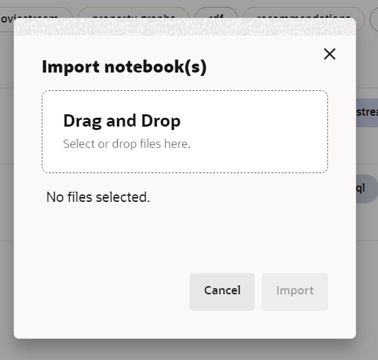  

4. Click **Import**.

    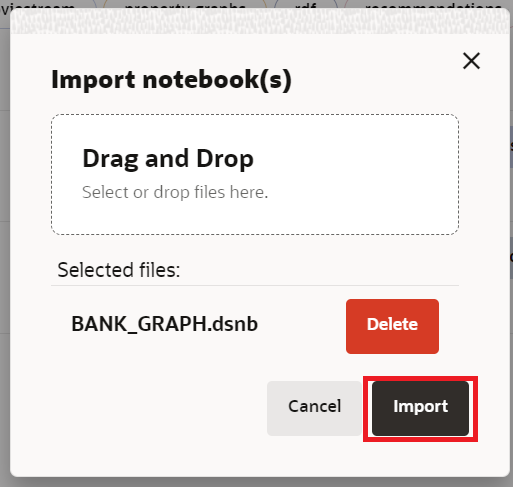

5. Once imported, it should open in Graph Studio.

    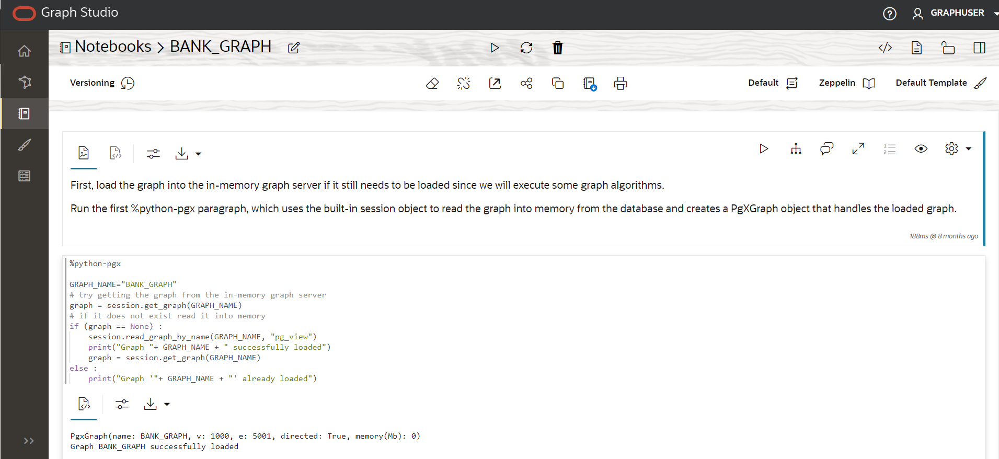

    You can execute the paragraphs in sequence and experiment with visualizations settings as described in **Task 2** below.

## Task 2: Create a notebook in Graph Studio and add a paragraph (OPTION B)

1. Go to the **Notebooks** page and click the **Create** button.

    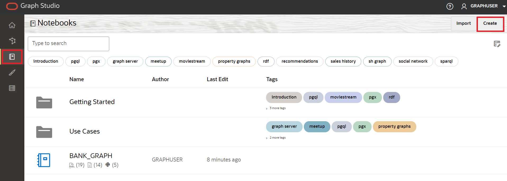

2. Enter the notebook Name. Optionally, you can enter Description and Tags. Click **Create**.

    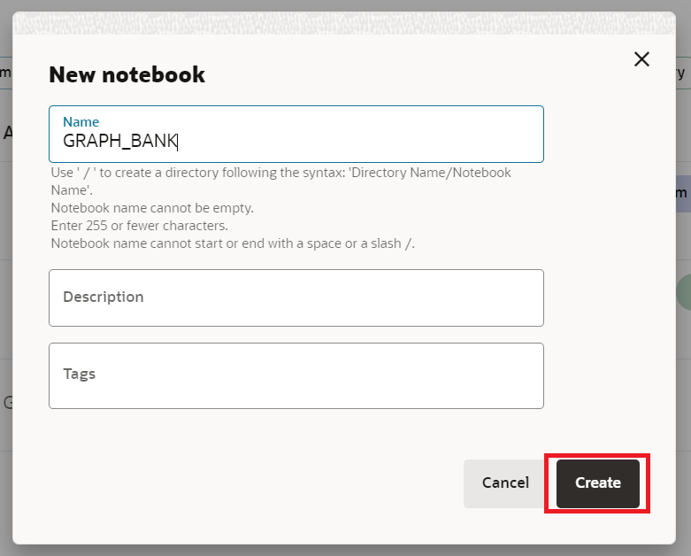

3. To add a paragraph, hover over the top or the bottom of an existing paragraph.

    

    There are 9 different interpreters. Each option creates a paragraph with a sample syntax that can be customized.

    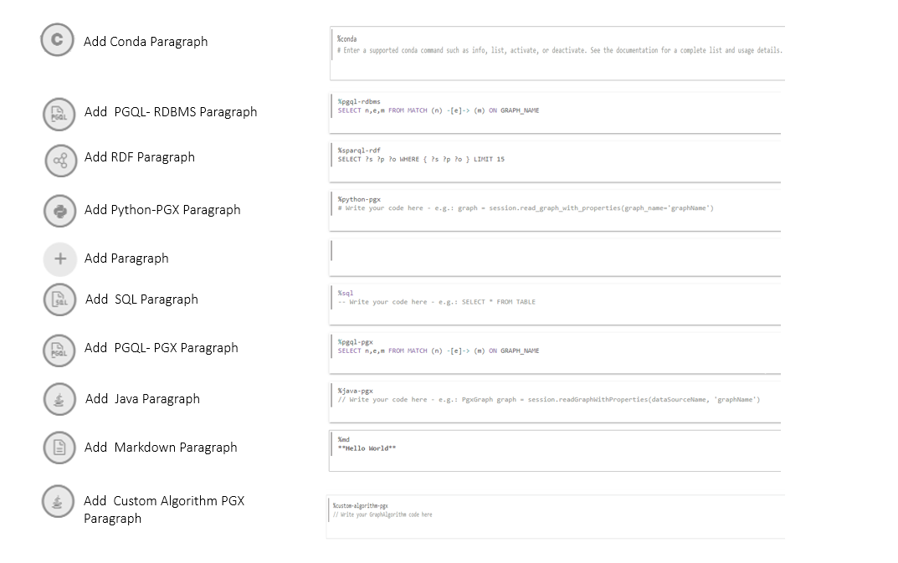

    In this lab, we will select the  **Add Paragraph** interpreter.

## Task 3: Load and query the `MOVIESTREAM` graph and visualize the results

In this task, we will run the graph queries and use the settings tool to customize the graphs. If you have imported the notebook in task 1, you do not need to customize the visualizations to achieve the end result. However, you can manipulate the settings to explore different available options.

>**Note:** *Execute the relevant paragraph after reading the description in each of the steps below*.
If the compute environment is not ready as yet and the code cannot be executed then you will see a blue line moving across the bottom of the paragraph to indicate that a background task is in progress.


1. Let's see what movies we have in our database.   

     ```
     <copy>%sql
     SELECT m.TITLE, m.YEAR
     FROM MOVIES m
     WHERE m.YEAR > 2021
     ORDER BY vector_distance(m.summary_vec, 
     vector_embedding(doc_model_bert using 'ADVENTURE' as data), COSINE)</copy>
     ``` 

    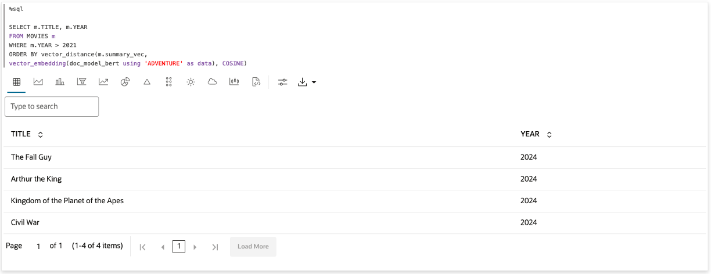 " "

2. Looks like the 'The Fall Guy' has the highest score for ADVENTURE movies in 2024 that we have available for our customers to watch.
What movies have my customers watched that are similar to 'The Fall Guy?' Let me run a vector search to find out.

     ```
     <copy>%sql
     SELECT mo.TITLE, mo.YEAR, vector_distance(m.summary_vec, mo.summary_vec, COSINE) as vec_dist
     FROM MOVIES m, MOVIES mo
     WHERE m.TITLE = 'The Fall Guy'
     ORDER BY vec_dist;
     </copy>
     ``` 

    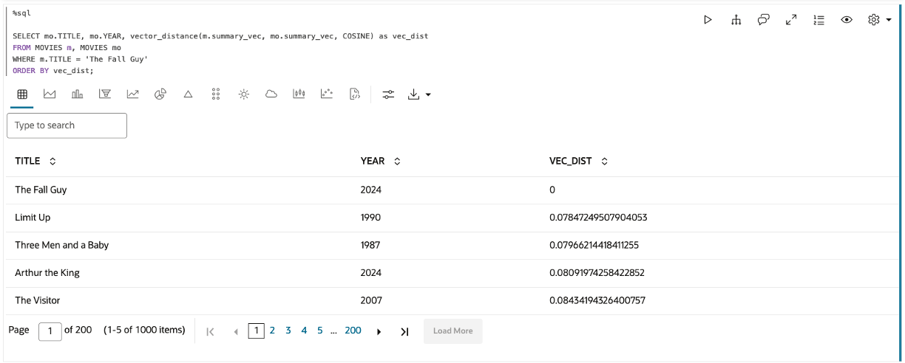 

3. What I want to know is whether my customers have had watch parties with movies similar to 'The Fall Guy.'
This is a query to identify customers who have been together in a watch party, and one of them has watched a movie similar to 'The Fall Guy.'

     ```
     <copy>%sql
     SELECT C1NAME, C2NAME, MOVIE_TITLE, vector_distance(svec, (SELECT summary_vec from MOVIES WHERE title = 'The Fall Guy'), COSINE) as vec_dist 
     FROM (
	 SELECT C1NAME, C2NAME, MOVIE_TITLE, svec
	 FROM GRAPH_TABLE(MOVIE_RECOMMENDATIONS 
	     MATCH (c1 is CUSTOMER) -[e is WATCHED_WITH]-> (c2 is CUSTOMER)-[w is WATCHED]-> (m is MOVIES)
	     COLUMNS (c1.FIRST_NAME as C1NAME, C2.FIRST_NAME as C2NAME, m.MOVIE_ID as m_id, m.TITLE as MOVIE_TITLE, m.YEAR as MOVIE_YEAR, m.SUMMARY_VEC as svec)
	    )  
     )
     ORDER BY vec_dist  desc;</copy>
    ```

    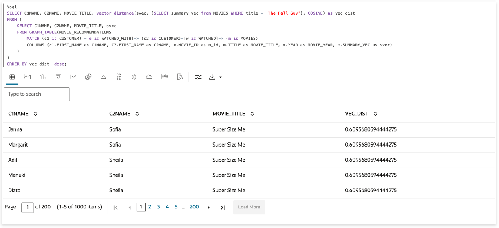

4. Now let us find customers who have been in a watch party together, and the watch party movie is similar to 'The Fall Guy.'

     ```
     <copy>%sql
     SELECT C1NAME, C2NAME, MOVIE_TITLE, vector_distance(svec, (SELECT summary_vec from MOVIES WHERE title = 'The Fall Guy'), COSINE) as vec_dist 
     FROM (
	 SELECT C1NAME, C2NAME, MOVIE_TITLE, svec
	 FROM GRAPH_TABLE(MOVIE_RECOMMENDATIONS 
	     MATCH (c1 is CUSTOMER) -[e is WATCHED_WITH]-> (c2 is CUSTOMER)-[w is WATCHED]-> (m is MOVIES)
         WHERE e.MOVIE_ID = m.MOVIE_ID
	     COLUMNS (c1.FIRST_NAME as C1NAME, C2.FIRST_NAME as C2NAME, m.MOVIE_ID as m_id, m.TITLE as MOVIE_TITLE, m.YEAR as MOVIE_YEAR, m.SUMMARY_VEC as svec)
	    )
     )
     ORDER BY vec_dist desc;</copy>
     ```

    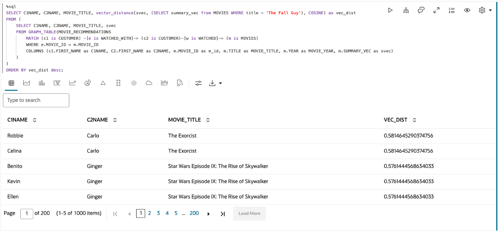

This looks like a good set of folks to create a watch party for, to see the 'Fall Guy.' The watch part of 'Star Wars Episode IX: The Rise of Skywalker' has a good number of folks, so I will use the help of the OCI Generative AI service to set up this watch party.

5. Let's load the graph into the in-memory graph server if it still needs to be loaded since we will execute some graph algorithms.

    Run the **%python-pgx** paragraph, which uses the built-in session object to read the graph into memory from the database and creates a PgXGraph object that handles the loaded graph.  

     ```
     <copy>%python-pgx
     GRAPH_NAME="MOVIESTREAM"
     # try getting the graph from the in-memory graph server
     graph = session.get_graph(GRAPH_NAME)
     # if it does not exist read it into memory
     if (graph == None) :
         session.read_graph_by_name(GRAPH_NAME, "pg_view")
         print("Graph "+ GRAPH_NAME + " successfully loaded")
         graph = session.get_graph(GRAPH_NAME)
     else :
         print("Graph '"+ GRAPH_NAME + "' already loaded")</copy>
     ```

      

6. Place holder for instructions

     Execute the following query.

     ```
     <copy>%sql
     SELECT C1NAME, MOVIE_TITLE, C2NAME
     FROM GRAPH_TABLE( MOVIE_RECOMMENDATIONS
     MATCH (c1)-[e1]->(m)<-[e2]-(c2)
     WHERE c1.CUST_ID = 1005510 AND c2.CUST_ID = 1062082
     COLUMNS (c1.FIRST_NAME as C1NAME, edge_id(e1) as e1, m.title as MOVIE_TITLE, 
     edge_id(e2) as e2, c2.FIRST_NAME as C2NAME) );</copy>
     ```

    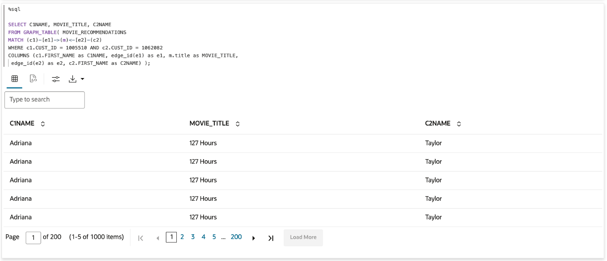

This concludes this lab.

## Acknowledgements
* **Author** - Ramu Murakami Gutierrez, Product Management
* **Contributors** -  Melliyal Annamalai, Rahul Tasker, Denise Myrick, Ramu Murkami Gutierrez Product Management
* **Last Updated By/Date** - Denise Myrick, Product Manager, July 2024
