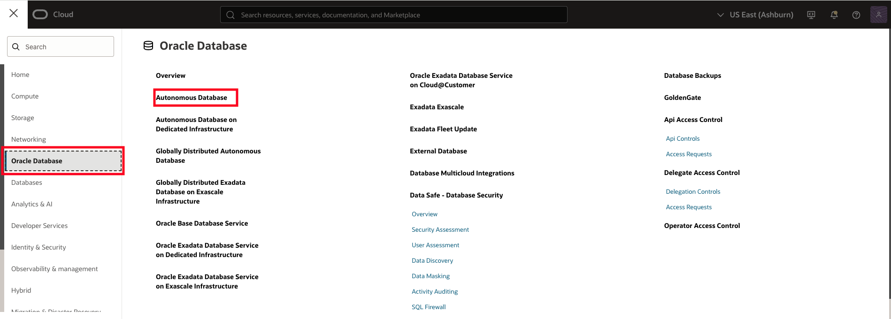
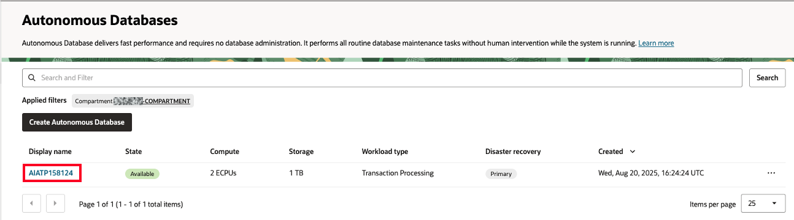
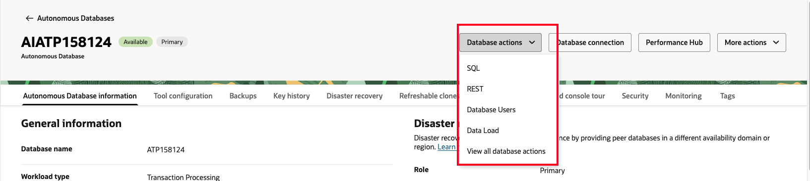
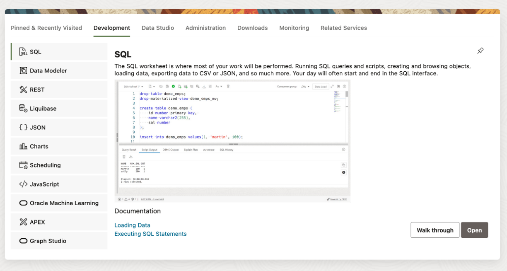
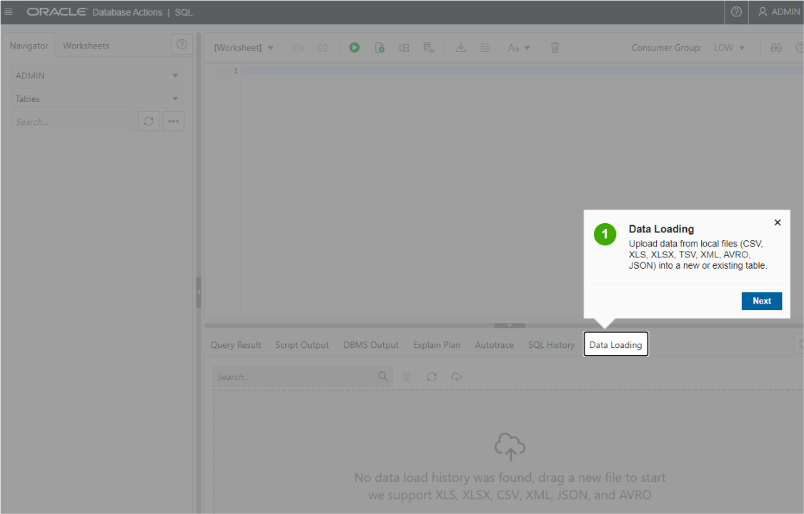
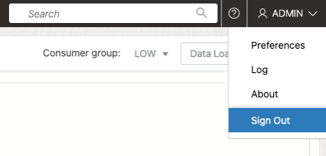
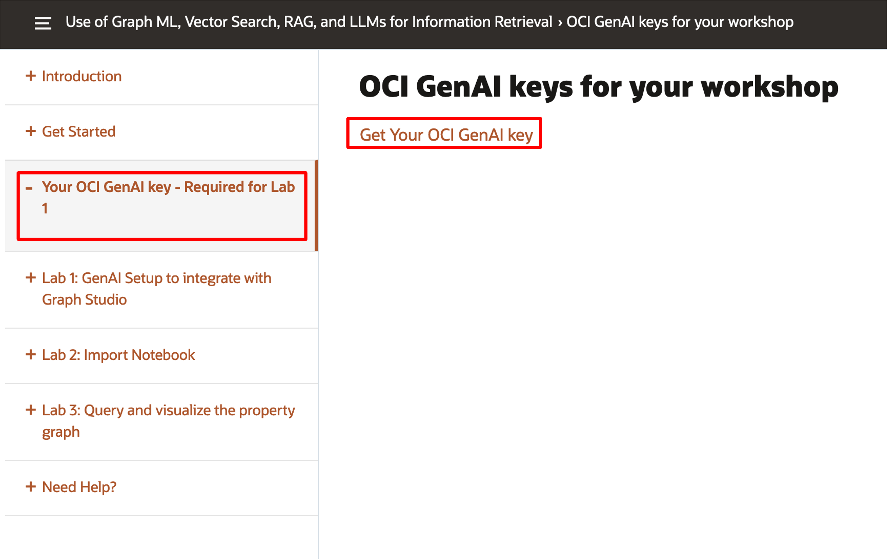
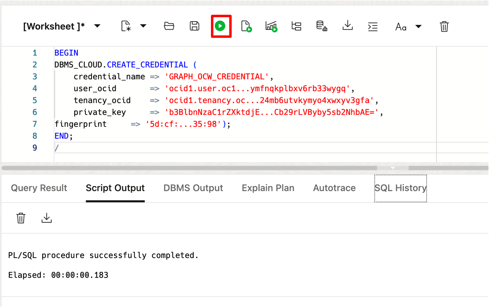
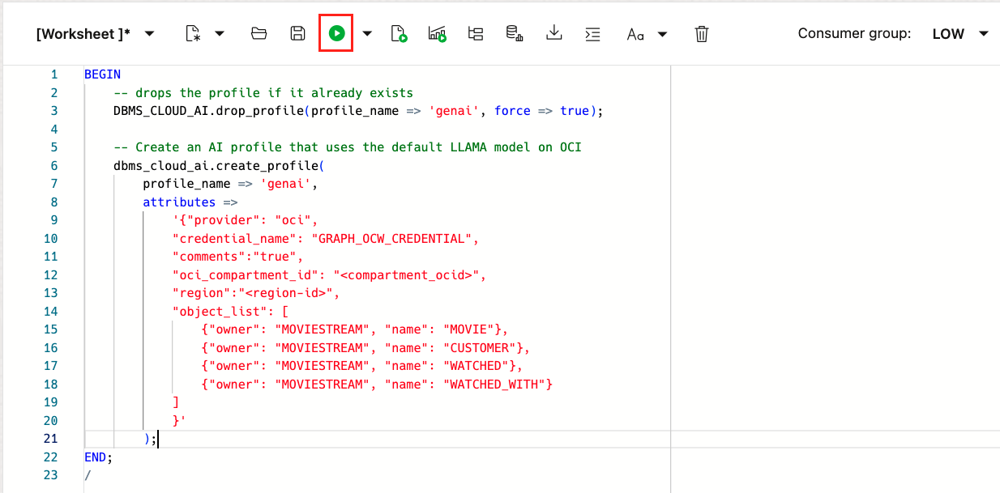
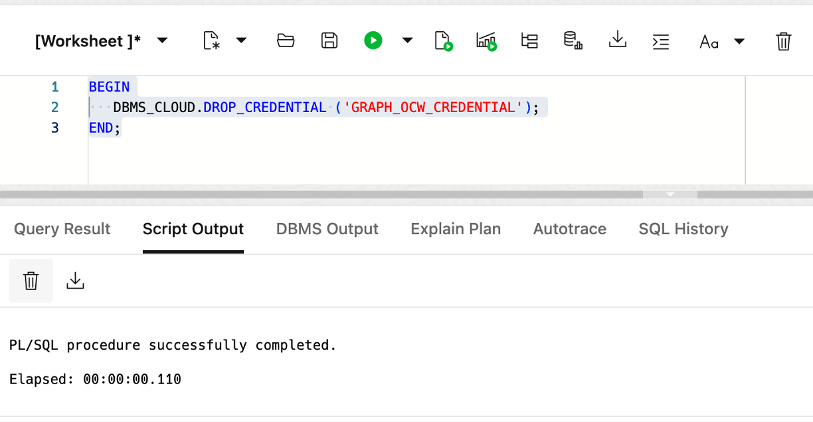

<!--
    {
        "name":"GenAI Setup to integrate with Graph Studio",
        "description":"Prerequisites for this workshop."
    }
-->

# GenAI Setup to integrate with Graph Studio

## Introduction

In this lab, you will set up the GenerativeAI service in OCI to work with Graph Studio.

Estimated Time: 10 minutes.

### Objectives

Learn how to

- Access SQL Worksheet
- Create a DBMS Cloud Credential
- Create a Gen AI profile

### Prerequisites

- The following lab requires access to an OCI account.

## Task 1: Access the Autonomous Database and open a SQL worksheet

1. Click the **Navigation Menu** in the upper left, navigate to **Oracle Database**, and select **Autonomous Database**.

    

2. Select the compartment provided on **View Login Info**, and click on the **Display Name** for the **Autonomous Database**.

    

3. In your Autonomous Database details page, click the **Database Actions** dropdown and then choose View all database actions.

    

    Logging in from the OCI service console expects you are the ADMIN user. Log in as ADMIN if you are not automatically logged in.

4. The Database Actions page opens. In the **Development** box, click **SQL**.

    

5. The first time you open SQL Worksheet, a series of pop-up informational boxes may appear, providing you a tour that introduces the main features. If not, you may click the Tour button (labeled with binoculars symbol) in the upper right corner. Click **Next** to take a tour through the informational boxes.

    

6. Sign out of the worksheet and log back in. Then, open SQL again and run the analytics as **GRAPHUSER**.
    
    

    Login using the graph user and password that appears under **View Login Info**.

## Task 2: Setup GenAI Connection

Next we're going to generate an oci configuration file that will contain user credentials and other settings needed for interacting with Oracle Cloud. In order to prepare for this step you'll need to gather the user OCID, the tenancy OCID, the tenancy region, the fingerprint of your key, and the path to your key file, and store these in a text file.

1. Click View Login Info at the upper left corner of this page. The Reservation Information slide out will appear.

    

2. In the Reservation Information slide out,copy your **Tenancy Name: *your tenancy name***. Store this information in a text file.

    

3. Identify the home region of your tenancy located near the top of the slide out. Note that information in your text file.

   

4. Locate the tenancy OCID and click the **Copy value** button to copy the OCID. Paste it into your text file.

   

5. In the same slide out, locate the **User OCID** field and click **Copy value** to the right of the User OCID field.  Paste it into your text file.

   

6. With the above information handy, run the following command in the terminal.

    ```
      <copy>
     oci setup config
      </copy>
    ```

7. Hit return to accept the default config file location of /home/opc/.oci/config

8. Enter your user OCID, tenancy OCID, and select your region from the list by using the corresponding number.

9. When asked if you want to generate a new API key, answer 'Y' for yes.

10. Press **Enter** to accept the default creation directory of /home/opc/.oci

11. Press **Enter** to accept the default name of *oci_api_key*.

12. Enter *N/A* twice to eliminate the need for a passphrase. (Your output won't show up in the terminal screen.)

    Next you'll create an environment file for the application.

13. Create the .env file that will hold connection information for your application.

    ````
        <copy>
        touch .env
        </copy>
    ````

14. Use your favorite editor to open and edit the file.

    ````
        <copy>
        nano .env
        </copy>
    ````

15. The following information needs to be collected and inserted into the .env file. Copy the 9 lines below and paste them in the .env file. Follow the steps below to gather the required information and place it in the file.

    ```
    <copy>
    USERNAME=""
    DBPASSWORD=""
    DBCONNECTION=""
    ADB_NAME=""
    ADB_OCID=""
    GRAPH_ENDPOINT=""
    COMPARTMENT_OCID=""
    TENANCY_OCID=""
    ENDPOINT=https://inference.generativeai.us-chicago-1.oci.oraclecloud.com
    </copy>
    ```

16. The database username should be 'admin'. Use the password that you assigned to the admin user. Make sure all the information you enter into the file stays between the quotes.

17. Find your database connection string by selecting navigating to **Oracle Database**, choose **Autonomous Database**, then choose the ATP you created earlier in the lab, **SeerATP**. At the top of the screen, click the button labeled **Database Connection**.

    

18. Locate the connection labeled *seeratp_low*. Click the ellipsis at the far right and choose *Copy*. Paste the result into your configuration file. **Note:** Make sure to enclose the connection string in single quotes.  Click **Cancel** to close the screen when you're done.

    

19. Copy your Autonomous Database Name and OCID and paste them into your .env file.

    

20. While still in the ATP details screen, click the **Tool Configuration** tab. Copy the Graph Studio Public access URL and paste it into the .env file.

    

21. To find the compartment OCID, navigate to **Identity & Security**, select **Compartments**, then click on the link of the compartment you're using for this lab.

22. Locate the compartment OCID and click the *Copy* link. Paste the compartment OCID into your .env file.

    

23. Locate the tenancy OCID. From the OCI Console home screen, click the tenancy name link under the **Home** title.

    

24. Copy the tenancy OCID and paste it into the .env file.

    

25. Copy the below url and paste it into your file as the endpoint.

    ````
        <copy>
        https://inference.generativeai.us-chicago-1.oci.oraclecloud.com
        </copy>
    ````

26. Your .env file should look similar to the screenshot below. (*Don't forget the sinqle quotes around the connection string!*)

    

27. Save and close the .env file.

<!-->
## Task 2: Setup GenAI Connection

1. Download and unzip the zip file under the GenAI Key lab. This contains the connection information needed for GenAI to be used in the Graph Studio notebook.

     

2. Create a DBMS Cloud Credential to call the Gen AI service from SQL in Graph Studio. You will need this information:

    ```
    <user> can be found in the text file as 'user'
    <tenancy> can be found in the text file as 'tenancy'
    <private_key> can be found as the contents .pem file that does not have the '_public' extension.
    <fingerprint> can be found in the text file as 'fingerprint' 
    ```

    Copy and paste the following code, and make the necessary changes.

    ```
    <copy>
    BEGIN
        DBMS_CLOUD.CREATE_CREDENTIAL (
        credential_name => 'GRAPH_OCW_CREDENTIAL',
        user_ocid       => '<user>',
        tenancy_ocid    => '<tenancy>',
        private_key     => '<private_key>',
        fingerprint     => '<fingerprint>'
        );
    END;
    /</copy>
    ```

    Here is **an example** of how it should look. Then run the the script using the **Run Statement** button to create the DBMS Cloud Credential. 

    ```
    BEGIN
    DBMS_CLOUD.CREATE_CREDENTIAL (
        credential_name => 'GRAPH_OCW_CREDENTIAL',
        user_ocid       => 'ocid1.user.oc1..aaaaaaaa3k363plccg...ymfnqkplbxv6rb33wygq',
        tenancy_ocid    => 'ocid1.tenancy.oc1..aaaaaaaaj4c...24mb6utvkymyo4xwxyv3gfa',
        private_key     => 'b3BlbnNzaC1rZXktdjEAAAAABG5v...Cb29rLVByby5sb2NhbAE=',
    fingerprint     => '5d:cf:...35:98');
    END;
    /
    ```

     

3. Then, create a Gen AI profile using the default llama model. You will need this information:  

    ```
    <oci_compartment_id> can be found in the text file as 'Compartment_ocid' 
    <region-id> can be found in the text file as 'region'
    ```

    Copy and paste the following code, and make the necessary changes. Then run this script using the **Run Statement** button. 

    ```
     <copy>BEGIN   
         -- drops the profile if it already exists
         DBMS_CLOUD_AI.drop_profile(profile_name => 'genai', force => true);

         -- Create an AI profile that uses the default LLAMA model on OCI
         dbms_cloud_ai.create_profile(
             profile_name => 'genai',
             attributes =>       
                 '{"provider": "oci",
                 "credential_name": "GRAPH_OCW_CREDENTIAL",
                 "comments":"true",            
                 "oci_compartment_id": "<compartment_ocid>",
                 "region":"<region-id>",
                 "object_list": [
                     {"owner": "GRAPHUSER", "name": "MOVIE"},
                     {"owner": "GRAPHUSER", "name": "CUSTOMER"},
                     {"owner": "GRAPHUSER", "name": "WATCHED"},
                     {"owner": "GRAPHUSER", "name": "WATCHED_WITH"}
                 ]
                 }'
             );

     END;
     /</copy>
    ```

    

    This concludes this lab. **You may now proceed to the next lab.**

>**Note:** If you encounter issues in lab 3, task 1, it may be due to the DBMS Cloud Credential not being created properly. You can remove the credential by running the following statement.
    ```
     <copy>BEGIN
     DBMS_CLOUD.DROP_CREDENTIAL ('GRAPH_OCW_CREDENTIAL');
     END;</copy>
    ```

Then, re-run task 2 in tab 1. After re-creating the DBMS Cloud Credential, you can return to lab 3, task 1.
-->

## Acknowledgements

- **Author** - Ramu Murakami Gutierrez, Product Manager
- **Contributors** -  Melliyal Annamalai, Denise Myrick, Rahul Tasker, and Ramu Murakami Gutierrez Product Management
- **Last Updated By/Date** - Denise Myrick, Product Manager, August 2025
