# Query and visualize the graph

## Introduction

In this lab, you will create and query a graph (`AUTO_GRAPH`) in SQL paragraphs of a notebook, and use that with vector search.

Estimated Time: 30 minutes.

### Objectives

Learn how to:

- Use Graph Studio notebooks to run vector search
- Use Graph Studio notebooks with SQL paragraphs to create, query, analyze, and visualize a graph, and integrate with vector search

### Prerequisites

- You have logged into Graph Studio, and imported the notebook

## Task 1: Explore the data available in the database

In this workshop, we will query our graph to learn more about our data to discover what products have the highest number of customer support tickets, what components make up those products and who supplies those components. We will start by connecting to Oracle Cloud Infrastructure AI Language sentiment analysis tool and analyzing our tickets to determine the emotional tone or attitude of our tickets, classifying them as positive, negative, or neutral.

>**Note:** Click the **Run Paragraph** button to run the query.
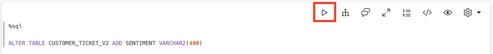
*Execute the relevant paragraph after reading the description in each of the steps below*.
If the compute environment is not ready just yet and the code cannot be executed then you will see a line moving across the bottom of the paragraph to indicate that a background task is in progress.
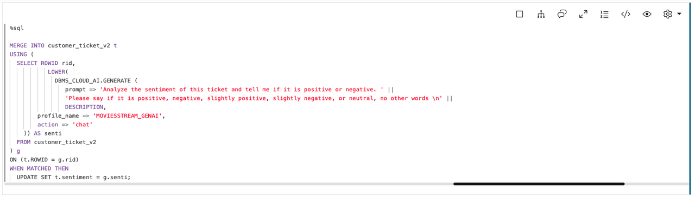

1. The following command adds a new column called SENTIMENT we will use to store our sentiment analysis.

     ```
     <copy>%sql
     ALTER TABLE CUSTOMER_TICKET ADD SENTIMENT VARCHAR2(400)
     </copy>
     ```

    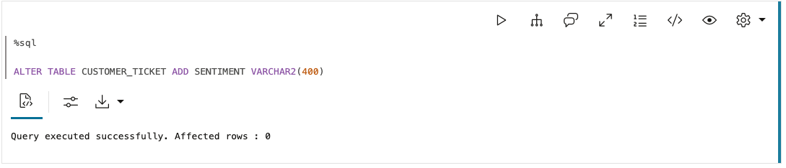

2. Run sentiment analysis on customer_ticket table

     ```
     <copy>%sql

MERGE INTO customer_ticket t
USING (
  SELECT ROWID rid,
           LOWER(
             DBMS_CLOUD_AI.GENERATE (
                prompt => 'Analyze the sentiment of this ticket and tell me if it is positive or negative. ' ||
                'Please say if it is positive, negative, slightly positive, slightly negative, or neutral, no other words \n' || 
                DESCRIPTION,
        profile_name => 'GENAI',
        action => 'chat'
    )) AS senti
  FROM customer_ticket
) g
ON (t.ROWID = g.rid)
WHEN MATCHED THEN
  UPDATE SET t.sentiment = g.senti;
     </copy>
     ```
         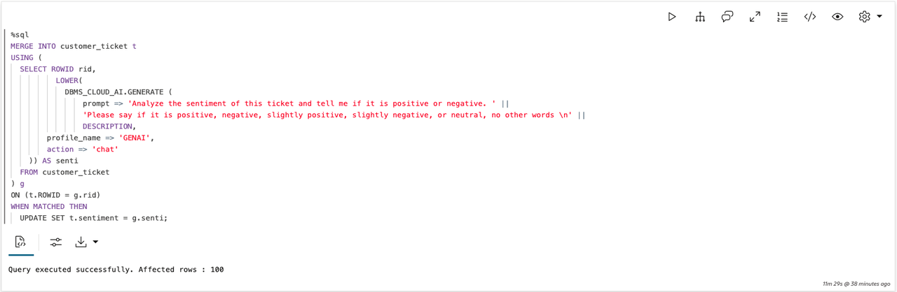

3. Now we have the sentiments in the SENTIMENT column for the comments in the DESCRIPTION column. We can query this table to find complaints that have negative sentiments and the associated product ids.

     ```
     <copy>%sql
     SELECT TICKET_ID, PRODUCT_ID, DESCRIPTION, SENTIMENT FROM CUSTOMER_TICKET
     </copy>
     ```

    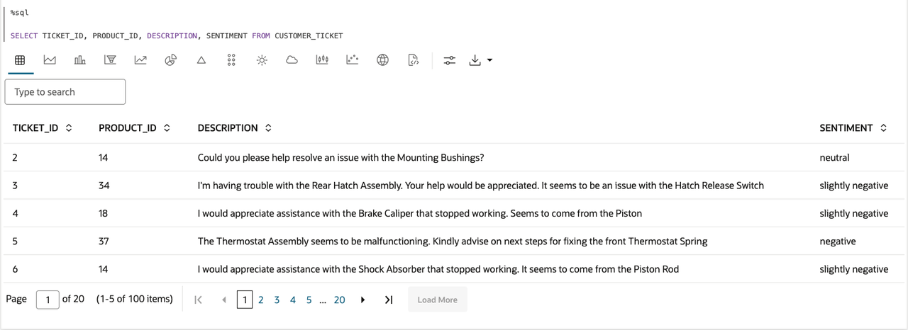

    ```
     <copy>%sql
     SELECT product_id, sentiment
    FROM CUSTOMER_TICKET t
    WHERE t.sentiment = 'slightly negative' OR t.sentiment = 'negative';
     </copy>
     ```

    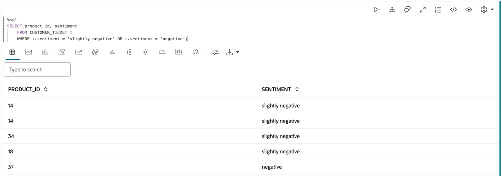

4. We want to identify which components and which suppliers of those components could be causing a problem. So let's create a graph on the CATEGORY, PRODUCT, COMPONENT, SUPPLIER, and CUSTOMER_TICKET tables to connect the negative sentiments to the components that could be causing the problem.
  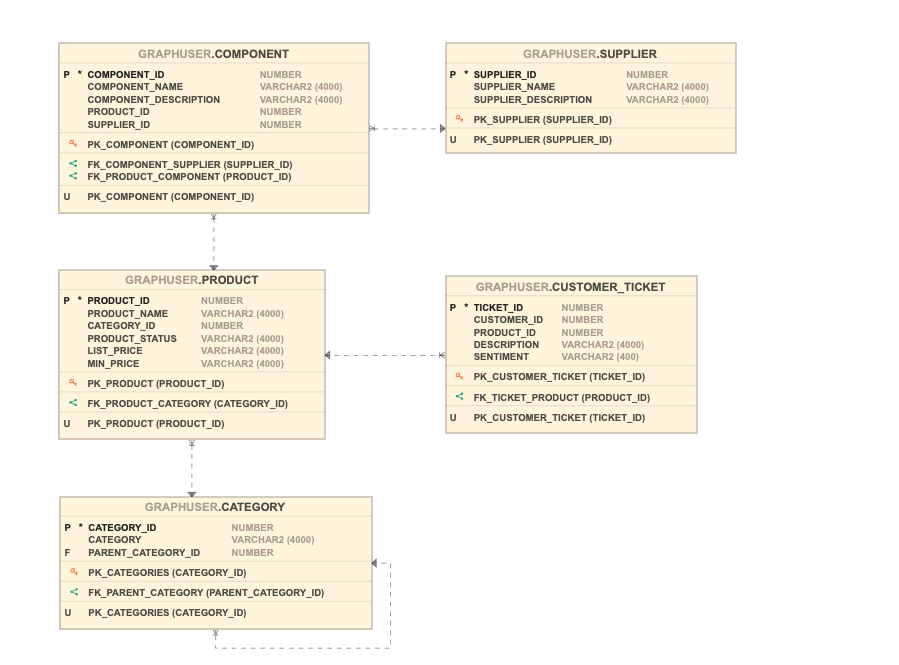

     ```
     <copy>%sql
     CREATE OR REPLACE PROPERTY GRAPH auto_graph
     VERTEX TABLES (
    CUSTOMER_TICKET
      KEY ( TICKET_ID ),
    SUPPLIER
      KEY ( SUPPLIER_ID ),
    CATEGORY
      KEY ( CATEGORY_ID ),
    PRODUCT
      KEY ( PRODUCT_ID ),
    COMPONENT
      KEY ( COMPONENT_ID )
   )
   EDGE TABLES (
    CUSTOMER_TICKET AS TICKET_FOR_PRODUCT KEY ( TICKET_ID )
      SOURCE KEY ( TICKET_ID ) REFERENCES CUSTOMER_TICKET( TICKET_ID )
      DESTINATION KEY ( PRODUCT_ID ) REFERENCES PRODUCT( PRODUCT_ID )
      NO PROPERTIES,
    CATEGORY AS PARENT_CATEGORY_OF KEY ( CATEGORY_ID )
      SOURCE KEY ( PARENT_CATEGORY_ID ) REFERENCES CATEGORY( CATEGORY_ID )
      DESTINATION KEY ( CATEGORY_ID ) REFERENCES CATEGORY( CATEGORY_ID )
      NO PROPERTIES,
    PRODUCT AS CATEGORY_OF_PRODUCT KEY ( PRODUCT_ID )
      SOURCE KEY ( CATEGORY_ID ) REFERENCES CATEGORY( CATEGORY_ID )
      DESTINATION KEY ( PRODUCT_ID ) REFERENCES PRODUCT( PRODUCT_ID )
      NO PROPERTIES,
    COMPONENT AS COMPONENT_OF_PRODUCT KEY (COMPONENT_ID, PRODUCT_ID)
      SOURCE KEY ( PRODUCT_ID ) REFERENCES PRODUCT( PRODUCT_ID )
      DESTINATION KEY ( COMPONENT_ID ) REFERENCES COMPONENT( COMPONENT_ID )
      NO PROPERTIES,
    COMPONENT AS SUPPLIED_BY KEY (COMPONENT_ID)
      SOURCE KEY ( COMPONENT_ID ) REFERENCES COMPONENT( COMPONENT_ID )
      DESTINATION KEY ( SUPPLIER_ID ) REFERENCES SUPPLIER( SUPPLIER_ID )
      NO PROPERTIES
  )
     </copy>
     ```
    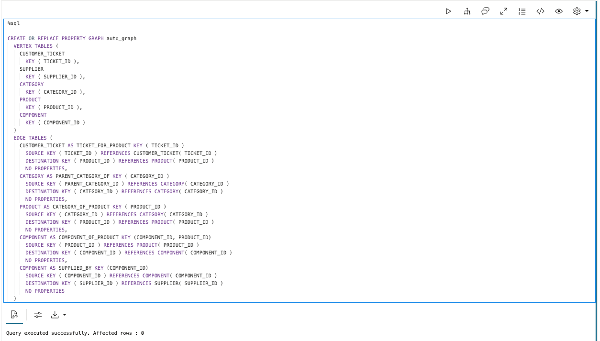

5. Let's take a look at what the graph looks like visually. The query we will run to do that is like running 'select * from tablename' on a table.

     ```
     <copy>%sql
    SELECT * FROM GRAPH_TABLE(auto_graph
       MATCH (n) -[e]-> (m)
        COLUMNS(vertex_id(n) as nid, edge_id(e) as eid, vertex_id(m) as mid)
    )
     </copy>
     ```

    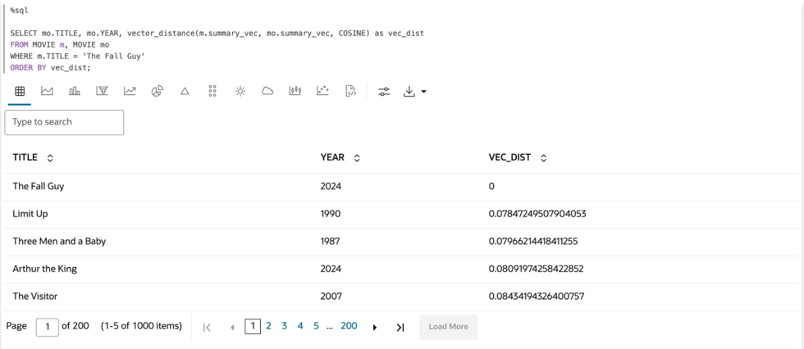

6. **Modeling your data as a graph makes it easy to navigate connections in your data.** For example, here is a 'multiple hop' query to visualize the Electrical System hierarchy - that is, find all data entities you can reach from this category in one to four hops. Our graph is made up of multiple categories, subcategories, products, components and suppliers, and this query easily finds the subcategories and associated products of the 'Electrical Systems' category.

     ```
     <copy>%sql
    SELECT *
      FROM GRAPH_TABLE( auto_graph
      MATCH (a IS CATEGORY) -[]->{1,4}(c)
      WHERE a.category = 'Electrical System'
      ONE ROW PER STEP (src, e, dst)
      COLUMNS(vertex_id(src) as src, edge_id(e) as e, vertex_id(dst) as dst)
    ) 
     </copy>
     ```

    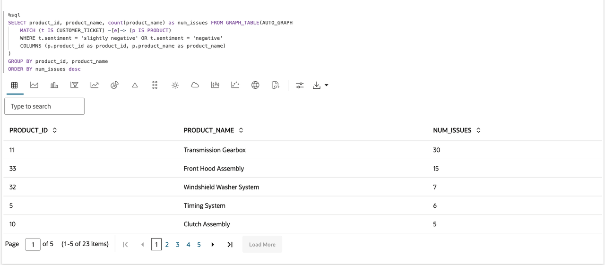

    **Exploring further** - In the next few paragraphs, we will query our graph, combined with vector search, to discover which products have the highest number of negative customer support tickets, which components make up those products, and who supplies those components.

    **First, let's find the products with the largest number of negative sentiment customer tickets**  - We can find this through a simple pattern matching query on our graph.

     ```
     <copy>%sql
     SELECT product_id, product_name, count(product_name) as num_issues FROM GRAPH_TABLE(AUTO_GRAPH
        MATCH (t IS CUSTOMER_TICKET) -[e]-> (p IS PRODUCT)
        WHERE t.sentiment = 'slightly negative' OR t.sentiment = 'negative'
        COLUMNS (p.product_id as product_id, p.product_name as product_name)
      )
      GROUP BY product_id, product_name
      ORDER BY num_issues desc
     </copy>
     ```

    

7. To find the supplier of each component in the product, let's extend the previous query through another edge and node. This visualization shows the supplier for each component in the High Performance Gasket. 

     ```
     <copy>%sql
     SELECT *
     FROM GRAPH_TABLE( auto_graph
         MATCH (p is PRODUCT) -[e1]-> (m) -[e2]-> (l)
         WHERE p.product_id=59
         COLUMNS(vertex_id(p) as p, edge_id(e1) as e1, vertex_id(m) as m, edge_id(e2) as e2, vertex_id(l) as l)
     )
     </copy>
     ``` 

    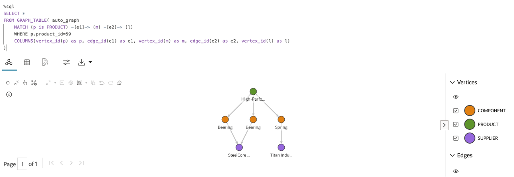

8. **Next, find the components used in the product that have the highest number of customer tickets with negative sentiments** - From our previous query, we know Transmission Gearbox, with ID 11, has the highest number of reported issues. Let's query our graph with a WHERE clause to find what components make up this product.

     ```
     <copy>%sql
     SELECT * FROM GRAPH_TABLE(AUTO_GRAPH
      MATCH (p is PRODUCT) -[e]-> (m)
      WHERE p.product_id=11
      COLUMNS(vertex_id(p) as pid, edge_id(e) as eid, vertex_id(m) as mid)
    )
     </copy>
     ```

    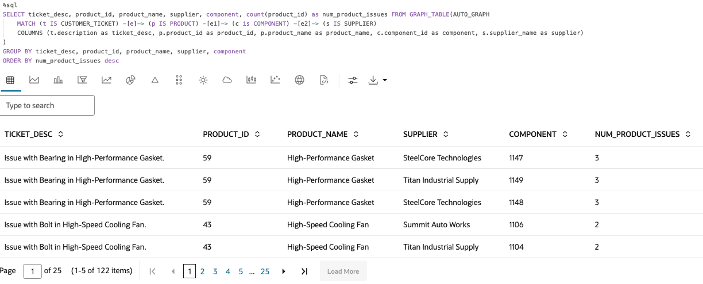

9. Now let's run a vector search with our graph query to uncover which component of the Transmission Gearbox is causing so many issues. We use vector search to match the component names identified by the graph with the terms used in the customer tickets.

     ```
     <copy>%sql
     SELECT DISTINCT ticket_id, component_id, component_name, ticket_description, vector_distance(ticket_vector, component_vector, COSINE) as vec_dist
    FROM GRAPH_TABLE(AUTO_GRAPH
        MATCH (t is CUSTOMER_TICKET) -[e]-> (p is PRODUCT) -[f]-> (c is COMPONENT)
        WHERE p.product_id=11
        AND t.product_id=11
        COLUMNS (
            t.TICKET_ID as ticket_id,
            t.TICKET_VEC as ticket_vector,
            t.DESCRIPTION as ticket_description,
            c.COMPONENT_NAME_VEC as component_vector, 
            c.COMPONENT_ID as component_id, 
            c.COMPONENT_NAME as component_name
        )
    )
WHERE vector_distance(ticket_vector, component_vector, COSINE) < .45
ORDER BY vec_dist;
     </copy>
     ```

    

10. The Oil Pump component seems to be the culprit! Let's confirm that no other products are affected by the Oil Pump through another graph query.

     ```
     <copy>%sql
     SELECT * FROM GRAPH_TABLE(auto_graph
    MATCH (p) -[e]-> (m IS COMPONENT)
    WHERE m.component_id=1220
    COLUMNS(p.product_id as product_id, p.product_name as product_name, m.component_id as component_id, m.component_name as component_name)
)
     </copy>
     ```

    

11. Now, let's find the suppliers for the components in the product we are investigating (product_id 11) - We can extend the previous query through another edge and node in our query to find the suppliers for each component in the Transmission Gearbox (product id 11).

     ```
     <copy>%sql
     SELECT *
    FROM GRAPH_TABLE( auto_graph
      MATCH (p is PRODUCT) -[e1]-> (m) -[e2]-> (s)
      WHERE p.product_id=11
      COLUMNS(vertex_id(p) as p, edge_id(e1) as e1, vertex_id(m) as m, edge_id(e2) as e2, vertex_id(s) as s)
    )
     </copy>
     ```

    

12. Now, who is the supplier for the Oil Pump component, that vector search helped us identify? We show the results both visually and as a table of results.

     ```
     <copy>%sql
     SELECT *
      FROM GRAPH_TABLE( auto_graph
      MATCH (m IS COMPONENT) -[e]-> (l IS SUPPLIER)
     WHERE m.component_id=1220
     COLUMNS(vertex_id(m) as m, edge_id(e) as e, vertex_id(l) as l)
    )
     </copy>
     ```

    ```
     <copy>%sql
     SELECT *
      FROM GRAPH_TABLE( auto_graph
     MATCH (m IS COMPONENT) -[e]-> (l IS SUPPLIER)
     WHERE m.component_id=1220
    COLUMNS(m.component_id as component_id, l.supplier_id as supplier_id, l.supplier_name as supplier_name)
    )
     </copy>
     ```

    

13. Let's see if there are any other suppliers for this component in our supplier network that we can switch over to. This may help us reduce the number of negative issues for this product.

     ```
     <copy>%sql
     SELECT * FROM GRAPH_TABLE(AUTO_GRAPH
      MATCH (c IS COMPONENT) -[e]-> (s IS SUPPLIER)
      WHERE s.supplier_id <> 4918 
      AND c.component_name = 'Oil Pump'
      COLUMNS(c.component_id as component_id, c.component_name as component_name, s.supplier_id as supplier_id, s.supplier_name as supplier_name)
)
     </copy>
     ```

14. We will reach out to Peak Performance Manufacturing to order a few oil pumps to test them out. Hopefully, sourcing oil pumps from a different supplier resolves our issues! Let's see which other components are supplied by Velocity Parts Co. who had supplied the defective 'Oil Pump.' Maybe we need to find new suppliers for those components too!

     ```
     <copy>%sql
     SELECT * FROM GRAPH_TABLE(AUTO_GRAPH
      MATCH (c IS COMPONENT) -[e]-> (s IS SUPPLIER)
      WHERE s.supplier_id = 4918
      COLUMNS(c.component_id as component_id, c.component_name as component_name, s.supplier_id as supplier_id, s.supplier_name as supplier_name, vertex_id(c) as c_id, edge_id(e) as e_id, vertex_id(s) as s_id )
    )
     </copy>
     ```

    

15. Let's find all products that contain components supplied by Velocity Parts Co.

     ```
     <copy>%sql
     SELECT * FROM GRAPH_TABLE(AUTO_GRAPH
      MATCH (p IS PRODUCT) -[e1]->(c IS COMPONENT) -[e2]-> (s IS SUPPLIER)
     WHERE s.supplier_id = 4918
     COLUMNS(vertex_id(p) as p_id, edge_id(e1) as e1_id, vertex_id(c) as c_id, edge_id(e2) as e2_id, vertex_id(s) as s_id )
    )
     </copy>
     ```

    

This concludes this lab.

## Acknowledgements

- **Author** - Ramu Murakami Gutierrez, Product Management, July 2025
- **Contributors** -  Melliyal Annamalai, Denise Myrick, Rahul Tasker, and Ramu Murakami Gutierrez Product Management
- **Last Updated By/Date** - Denise Myrick, Product Management, September 2025
