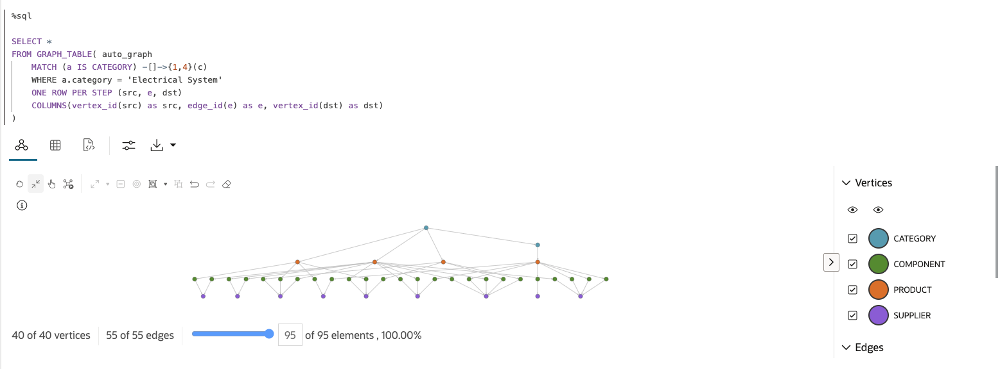

# Query and visualize the graph

## Introduction

In this lab, you will create and query a graph (that is, `MOVIE_RECOMMENDATIONS`) in SQL and PGQL paragraphs of a notebook, and use that with vector search and send the results to an LLM.

Estimated Time: 30 minutes.

### Objectives

Learn how to:

- Use Graph Studio notebooks to query a LLM and run vector search
- Use Graph Studio notebooks with SQL and PGQL paragraphs to create, query, analyze, and visualize a graph, and integrate with vector search

### Prerequisites

- You have logged into Graph Studio, and imported the notebook

## Task 1: Explore the data available in the database

In this workshop, we will query our graph to learn more about our data to discover what products have the highest number of customer support tickets, what components make up those products and who supplies those components. We will start by finding what products have the highest number of customer support tickets.  

>**Note:** Click the **Run Paragraph** button to run the query.

*Execute the relevant paragraph after reading the description in each of the steps below*.
If the compute environment is not ready just yet and the code cannot be executed then you will see a line moving across the bottom of the paragraph to indicate that a background task is in progress.


-----------------------------------------NEEDS TO BE REPLACED-----------------------------------------------------------------------

1. Users can use the LLM to ask general questions about movies. Let's ask the LLM to give us the top 10 adventure movies released in the past 2 years.

    <span style="display: inline-block; border-radius: 50%; background-color: #2B6689; color: white; width: 20px; height: 20px; text-align: center; font-weight: bold;">i</span> This paragraph has the run button disabled and serves as an example of how to combine Graph Studio with OCI generative AI.

     ```
     <copy>%sql
     SELECT DBMS_CLOUD_AI.GENERATE(
         prompt       => 'what are the top 10 adventure movies released in the past 2 years',
         profile_name => 'genai',
         action       => 'chat')
     FROM dual;</copy>
     ```

     

    GenAI Answer: 

    

    Your LLM answer might vary because each time you submit a prompt, it can produce a different response.

    As we see, we could not find the answers we wanted (movies released in 2024), because this generative AI service does not have the latest data.

    So in the next task we will explore data in the database which has up-to-date data. This is known as "RAG" or "Vector RAG," the technique of using data in the database to enhance the prompt sent to the generative AI service. Text search or vector search (similarity search) can be used to find relevant data in the database, and that data is used to enhance the prompt.   

    We will search for movies that were released in 2024. We will use vector search to find movies with genre type 'Adventure' for the watch party, as these are the movies of interest for Adriana. 

-----------------------------------------NEEDS TO BE REPLACED-----------------------------------------------------------------------

2. The following query finds all nodes connected to another node through an edge. This is usually the first step in any exploratory analysis to ensure the graph is modeled as expected. 

     ```
     <copy>%sql
     SELECT * FROM GRAPH_TABLE(auto_graph
     MATCH (n) -[e]-> (m)
     COLUMNS(vertex_id(n) as nid, edge_id(e) as eid, vertex_id(m) as mid)
     )</copy>
     ```

     

3. Run a two hop query to visualize the Electrical System hierarchy - Our graph is made up of multiple categories, subcategories, products, components and suppliers. This query will find all products under the 'Electrical Systems' category.

     ```
     <copy>%sql
     SELECT *
     FROM GRAPH_TABLE( auto_graph
         MATCH (a IS CATEGORY) -[e1]->(b) -[e2]-> (c)
         WHERE a.category_name = 'Electrical Systems'
         COLUMNS(vertex_id(a) as a, edge_id(e1) as e1, vertex_id(b) as b, edge_id(e2) as e2, vertex_id(c) as c)
     )
     </copy>
     ``` 

     

4. Lets find what products have the highest number of customer support tickets. We can find this through a simple pattern matching query using SQL Property Graphs.

     ```
     <copy>%sql
     SELECT ticket_desc, product_id, product_name, count(product_name) as num_issues FROM GRAPH_TABLE(AUTO_GRAPH
         MATCH (t IS CUSTOMER_TICKET) -[e]-> (p IS PRODUCT)
         COLUMNS (t.description as ticket_desc, p.product_id as product_id, p.product_name as product_name)
     )
     GROUP BY ticket_desc, product_id, product_name
     ORDER BY num_issues desc
     </copy>
     ``` 

     

5. Lets find what products have the highest number of customer support tickets. We can find this through a simple pattern matching query using SQL Property Graphs.

     ```
     <copy>%sql
     SELECT ticket_desc, product_id, product_name, count(product_name) as num_issues FROM GRAPH_TABLE(AUTO_GRAPH
         MATCH (t IS CUSTOMER_TICKET) -[e]-> (p IS PRODUCT)
         COLUMNS (t.description as ticket_desc, p.product_id as product_id, p.product_name as product_name)
     )
     GROUP BY ticket_desc, product_id, product_name
     ORDER BY num_issues desc
     </copy>
     ``` 

     

6. From our previous query, we know High-Performance Gaskets, with ID 59, has the highest number of reported issues. Let's query our graph with a WHERE clause to find what components make up this product.

     ```
     <copy>%sql
     SELECT * FROM GRAPH_TABLE(auto_graph
         MATCH (p is PRODUCT) -[e]-> (m)
         WHERE p.product_id=59
         COLUMNS(vertex_id(p) as pid, edge_id(e) as eid, vertex_id(m) as mid)
     )
     </copy>
     ``` 

    

    You can also view the results as a table running the following query:

     ```
     <copy>%sql
     SELECT * FROM GRAPH_TABLE(auto_graph
         MATCH (p is PRODUCT) -[e]-> (m)
         WHERE p.product_id=59
         COLUMNS(vertex_id(p) as pid, edge_id(e) as eid, vertex_id(m) as mid)
     )
     </copy>
     ``` 

    

7. To find the supplier of each component in the product, let's extend the previous query through another edge and node. This visualization shows the supplier for each component in the High Performance Gasket. 

     ```
     <copy>%sql
     SELECT *
     FROM GRAPH_TABLE( auto_graph
         MATCH (p is PRODUCT) -[e1]-> (m) -[e2]-> (l)
         WHERE p.product_id=59
         COLUMNS(vertex_id(p) as p, edge_id(e1) as e1, vertex_id(m) as m, edge_id(e2) as e2, vertex_id(l) as l)
     )
     </copy>
     ``` 

    

8. Now that we understand our data, we can run a graph query to pull a report based on our exploratory analysis. Using the SQL Property Graph syntax we can eliminate the need for complex joins and unions to return the ticket description, product information, component ID, supplier name and number of issues associated with the product.

     ```
     <copy>%sql
     SELECT ticket_desc, product_id, product_name, supplier, component, count(product_id) as num_product_issues FROM GRAPH_TABLE(AUTO_GRAPH
         MATCH (t IS CUSTOMER_TICKET) -[e]-> (p IS PRODUCT) -[e1]-> (c is COMPONENT) -[e2]-> (s IS SUPPLIER)
         COLUMNS (t.description as ticket_desc, p.product_id as product_id, p.product_name as product_name, c.component_id as component, s.supplier_name as supplier)
    )
    GROUP BY ticket_desc, product_id, product_name, supplier, component
    ORDER BY num_product_issues desc
     </copy>
     ``` 

    

This concludes this lab.

## Acknowledgements
* **Author** - Ramu Murakami Gutierrez, Product Management, July 2025
* **Contributors** -  Melliyal Annamalai, Denise Myrick, Rahul Tasker, and Ramu Murakami Gutierrez Product Management
* **Last Updated By/Date** - Ramu Murakami Gutierrez, Product Management, July 2025
