# Query and visualize the graph

## Introduction

In this lab, you will create and query a graph (`AUTO_GRAPH`) using graph syntax in SQL, and use that graph with vector search.

Estimated Time: 30 minutes.

### Objectives

Learn how to:

- Use Graph Studio notebooks to run vector search
- Use Graph Studio notebooks with SQL paragraphs to create, query, analyze, and visualize a graph, and integrate with vector search

### Prerequisites

- You have logged into Graph Studio, and imported the notebook

## Task 1:  Sentiment Analysis

Early on a Monday morning, our manager messages us. There is an urgent problem she needs our help with. She tells us that she noticed some negative customer sentiments that popped up on her dashboard. She asks us to look into them and see what might be going on.

In the next few paragraphs, we will first run sentiment analysis and add the results as a column to the ticket table. We'll use sentiment analysis to determine the emotional tone or attitude of our tickets, classifying them as positive, negative, or neutral.

Once we determine the comments with a negative sentiment, we will identify the product they are associated with. From that product we will a trace the path through the components that make up the product, and then to the supplier who supplies them, using graph queries.

>**Note:** Click the **Run Paragraph** button to run the query.

*Execute the relevant paragraph after reading the description in each of the steps below*.
If the compute environment is not ready just yet and the code cannot be executed then you will see a line moving across the bottom of the paragraph to indicate that a background task is in progress.


1. The following command adds a new column named **SENTIMENT** to your table. We'll use this column to store the results of our sentiment analysis.

     ```
     <copy>%sql
     ALTER TABLE CUSTOMER_TICKET ADD SENTIMENT VARCHAR2(400)
     </copy>
     ```

    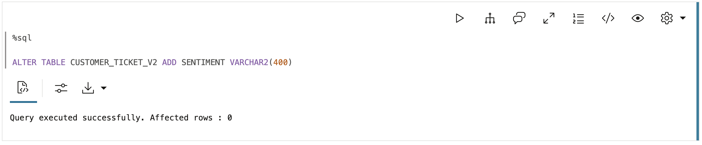

2. Now, let’s run sentiment analysis on the **customer_ticket** table. This process will evaluate the sentiment of each ticket.

     ```
    <copy>%sql
    MERGE INTO customer_ticket t
    USING (
      SELECT ROWID rid,
              LOWER(
                DBMS_CLOUD_AI.GENERATE (
                    prompt => 'Analyze the sentiment of this ticket and tell me if it is positive or negative. ' ||
                    'Please say if it is positive, negative, slightly positive, slightly negative, or neutral, no other words \n' || 
                    DESCRIPTION,
            profile_name => 'GENAI',
            action => 'chat'
        )) AS senti
      FROM customer_ticket
    ) g
    ON (t.ROWID = g.rid)
    WHEN MATCHED THEN
    UPDATE SET t.sentiment = g.senti;
    </copy>
     ```
    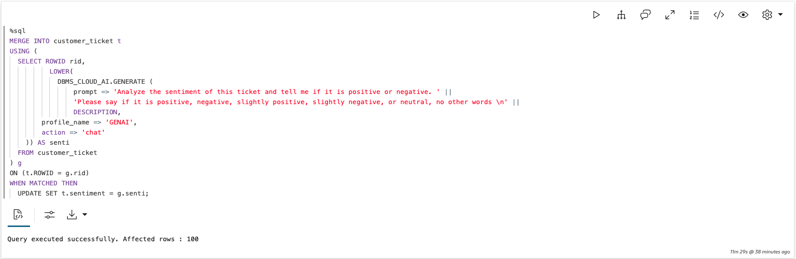

3. Let's start by querying **CUSTOMER_TICKET** table, to display the sentiment analysis results we've added to the **SENTIMENT** column.

     ```
     <copy>%sql
     SELECT ticket_id, product_id, description, sentiment
     FROM customer_ticket;
     </copy>
     ```

    

4. Next, we'll filter our results by tickets with 'slightly negative' or 'negative' sentiments. This will help us focus on the customer comments that may need further attention.

    ```
     <copy>%sql
     SELECT product_id, sentiment
    FROM CUSTOMER_TICKET t
    WHERE t.sentiment = 'slightly negative' OR t.sentiment = 'negative';
     </copy>
     ```

    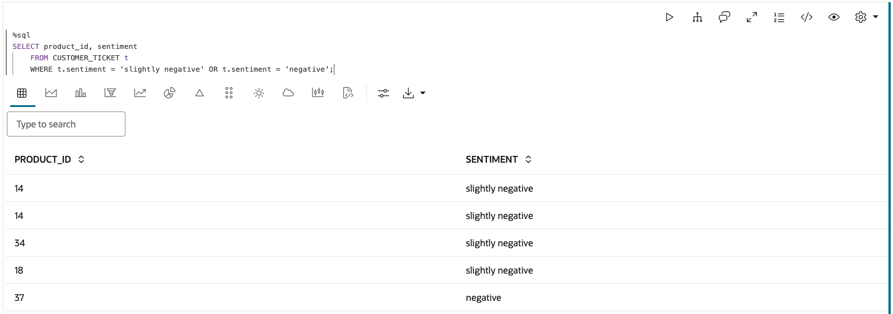

## Task 2: Graph Creation and Relationship Exploration

To pinpoint potential issues, we want to identify which components, and their associated suppliers, might be causing problems.

It's important to note that customer tickets are linked directly to products, not to specific components.

By creating a graph that connects the CATEGORY, PRODUCT, COMPONENT, SUPPLIER, and CUSTOMER_TICKET tables, we can bridge this gap and trace negative sentiments from customer tickets back to the components and suppliers that may be responsible.

  

1. Let's create a graph on the CATEGORY, PRODUCT, COMPONENT, SUPPLIER, and CUSTOMER_TICKET tables to connect the negative sentiments to the components that could be causing the problem.

     ```
     <copy>%sql
    CREATE OR REPLACE PROPERTY GRAPH auto_graph
      VERTEX TABLES (
        CUSTOMER_TICKET
          KEY ( TICKET_ID ),
        SUPPLIER
          KEY ( SUPPLIER_ID ),
        CATEGORY
          KEY ( CATEGORY_ID ),
        PRODUCT
          KEY ( PRODUCT_ID ),
        COMPONENT
          KEY ( COMPONENT_ID )
      )
      EDGE TABLES (
        CUSTOMER_TICKET AS TICKET_FOR_PRODUCT KEY ( TICKET_ID )
          SOURCE KEY ( TICKET_ID ) REFERENCES CUSTOMER_TICKET( TICKET_ID )
          DESTINATION KEY ( PRODUCT_ID ) REFERENCES PRODUCT( PRODUCT_ID )
          NO PROPERTIES,
        CATEGORY AS PARENT_CATEGORY_OF KEY ( CATEGORY_ID )
          SOURCE KEY ( PARENT_CATEGORY_ID ) REFERENCES CATEGORY( CATEGORY_ID )
          DESTINATION KEY ( CATEGORY_ID ) REFERENCES CATEGORY( CATEGORY_ID )
          NO PROPERTIES,
        PRODUCT AS CATEGORY_OF_PRODUCT KEY ( PRODUCT_ID )
          SOURCE KEY ( CATEGORY_ID ) REFERENCES CATEGORY( CATEGORY_ID )
          DESTINATION KEY ( PRODUCT_ID ) REFERENCES PRODUCT( PRODUCT_ID )
          NO PROPERTIES,
        COMPONENT AS COMPONENT_OF_PRODUCT KEY (COMPONENT_ID, PRODUCT_ID)
          SOURCE KEY ( PRODUCT_ID ) REFERENCES PRODUCT( PRODUCT_ID )
          DESTINATION KEY ( COMPONENT_ID ) REFERENCES COMPONENT( COMPONENT_ID )
          NO PROPERTIES,
        COMPONENT AS SUPPLIED_BY KEY (COMPONENT_ID)
          SOURCE KEY ( COMPONENT_ID ) REFERENCES COMPONENT( COMPONENT_ID )
          DESTINATION KEY ( SUPPLIER_ID ) REFERENCES SUPPLIER( SUPPLIER_ID )
          NO PROPERTIES
      )
     </copy>
     ```
    

2. Let’s visualize the graph.

    Running the following query is similar to executing SELECT * FROM <tablename\> on a traditional table.

    It’s a straightforward way to view all the relationships and data points in our graph.

     ```
     <copy>%sql
     SELECT * 
     FROM GRAPH_TABLE(auto_graph
       MATCH (n) -[e]-> (m)
        COLUMNS(vertex_id(n) as nid, edge_id(e) as eid, vertex_id(m) as mid)
    )
     </copy>
     ```

    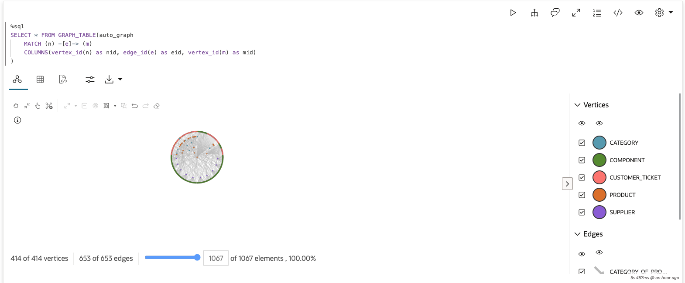

3. Let’s make sense of this data.

    **Modeling your data as a graph makes it easy to explore the relationships between different entities.**

     Our graph consists of categories, subcategories, products, components, and suppliers. You can run a ‘multiple hop’ query to visualize the hierarchy within the Electrical System category - this means finding all data entities connected to this category by one to four hops. With this query, you can easily identify all subcategories and associated products related to the ‘Electrical Systems’ category.

     ```
     <copy>%sql
    SELECT *
      FROM GRAPH_TABLE( auto_graph
      MATCH (a IS CATEGORY) -[]->{1,4}(c)
      WHERE a.category = 'Electrical System'
      ONE ROW PER STEP (src, e, dst)
      COLUMNS(vertex_id(src) as src, edge_id(e) as e, vertex_id(dst) as dst)
    ) 
     </copy>
     ```

    

## Task 3: Cause Analysis and Supplier Investigation

In the next few paragraphs, we will query our graph, combined with vector search, to discover which products have the highest number of negative customer support tickets, which components make up those products, and who supplies those components.

1. **First, let's find the products with the largest number of negative sentiment customer tickets**  - We can find this through a simple pattern matching query on our graph.

     ```
     <copy>%sql
     SELECT product_id, product_name, count(product_name) as num_issues
     FROM GRAPH_TABLE(AUTO_GRAPH
        MATCH (t IS CUSTOMER_TICKET) -[e]-> (p IS PRODUCT)
        WHERE t.sentiment = 'slightly negative' OR t.sentiment = 'negative'
        COLUMNS (p.product_id as product_id, p.product_name as product_name)
      )
      GROUP BY product_id, product_name
      ORDER BY num_issues desc
     </copy>
     ```

     

2. **Next, let's find the components used in the product that have the highest number of customer tickets with negative sentiments** - From our previous query, we know Transmission Gearbox, with ID 11, has the highest number of reported issues. Let's query our graph with a WHERE clause to find what components make up this product.

     ```
     <copy>%sql
     SELECT * FROM GRAPH_TABLE(AUTO_GRAPH
      MATCH (p is PRODUCT) -[e]-> (m)
      WHERE p.product_id=11
      COLUMNS(vertex_id(p) as pid, edge_id(e) as eid, vertex_id(m) as mid)
    )
     </copy>
     ```

    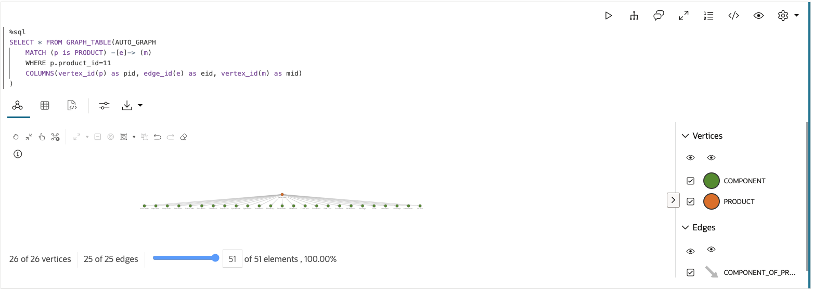

3. Now let's run a vector search with our graph query to uncover which component of the Transmission Gearbox is causing so many issues.

  By using vector search, we can match the component names identified in the graph with the language customers have used in their support tickets, helping us connect specific problems to the corresponding components more accurately.

     ```
     <copy>%sql
     SELECT DISTINCT ticket_id, component_id, component_name, ticket_description, vector_distance(ticket_vector, component_vector, COSINE) as vec_dist
       FROM GRAPH_TABLE(AUTO_GRAPH
          MATCH (t is CUSTOMER_TICKET) -[e]-> (p is PRODUCT) -[f]-> (c is COMPONENT)
          WHERE p.product_id=11
          AND t.product_id=11
          COLUMNS (
            t.TICKET_ID as ticket_id,
            t.TICKET_VEC as ticket_vector,
            t.DESCRIPTION as ticket_description,
            c.COMPONENT_NAME_VEC as component_vector, 
            c.COMPONENT_ID as component_id, 
            c.COMPONENT_NAME as component_name
        )
    )
      WHERE vector_distance(ticket_vector, component_vector, COSINE) < .45
      ORDER BY vec_dist;
     </copy>
     ```

    

4. The Oil Pump component seems to be the culprit! Let's confirm that no other products are affected by the Oil Pump through another graph query.

     ```
     <copy>%sql
     SELECT * FROM GRAPH_TABLE(auto_graph
      MATCH (p) -[e]-> (m IS COMPONENT)
      WHERE m.component_id=1220
      COLUMNS(p.product_id as product_id, p.product_name as product_name, m.component_id as component_id, m.component_name as component_name)
      )
     </copy>
     ```

   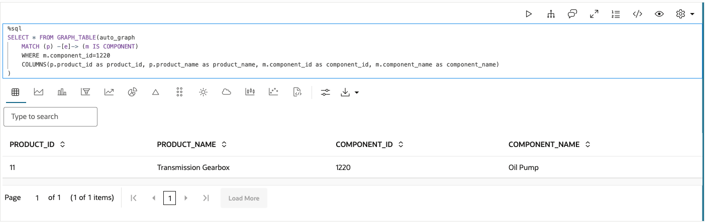

5. Now, let’s identify the suppliers for the components in the product we’re investigating (product_id 11).

    By extending our previous graph query to include an additional edge and node, we can trace each component in the Transmission Gearbox (product ID 11) directly to its supplier. This gives us a complete view of the supply chain for this product.

    ```
    <copy>%sql
    SELECT *
    FROM GRAPH_TABLE( auto_graph
      MATCH (p is PRODUCT) -[e1]-> (m) -[e2]-> (s)
      WHERE p.product_id=11
      COLUMNS(vertex_id(p) as p, edge_id(e1) as e1, vertex_id(m) as m, edge_id(e2) as e2, vertex_id(s) as s)
    )
     </copy>
     ```

    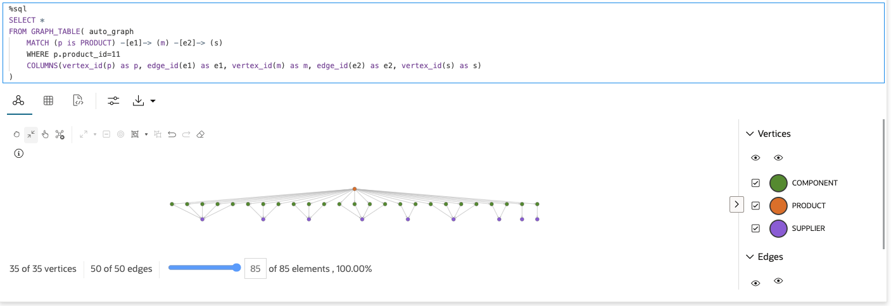

6. Now, who is the supplier for the Oil Pump component, that vector search helped us identify? We show the results both visually and as a table.

     ```
     <copy>%sql
     SELECT *
      FROM GRAPH_TABLE( auto_graph
      MATCH (m IS COMPONENT) -[e]-> (l IS SUPPLIER)
     WHERE m.component_id=1220
     COLUMNS(vertex_id(m) as m, edge_id(e) as e, vertex_id(l) as l)
    )
     </copy>
     ```

    ```
     <copy>%sql
     SELECT *
      FROM GRAPH_TABLE( auto_graph
     MATCH (m IS COMPONENT) -[e]-> (l IS SUPPLIER)
     WHERE m.component_id=1220
    COLUMNS(m.component_id as component_id, l.supplier_id as supplier_id, l.supplier_name as supplier_name)
    )
     </copy>
     ```

    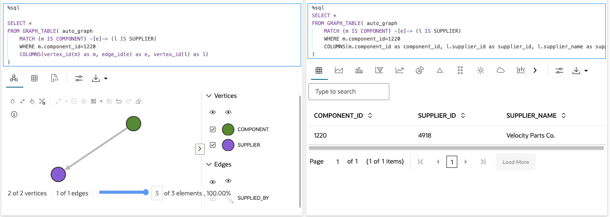

7. Let's see if there are any other suppliers for this component in our supplier network that we can switch over to. This may help us reduce the number of negative issues for this product.

     ```
     <copy>%sql
     SELECT * FROM GRAPH_TABLE(AUTO_GRAPH
      MATCH (c IS COMPONENT) -[e]-> (s IS SUPPLIER)
      WHERE s.supplier_id <> 4918 
      AND c.component_name = 'Oil Pump'
      COLUMNS(c.component_id as component_id, c.component_name as component_name, s.supplier_id as supplier_id, s.supplier_name as supplier_name)
    )
     </copy>
     ```
    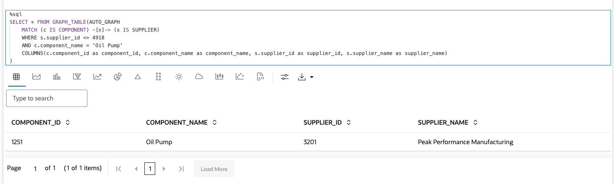

8. We will reach out to **Peak Performance Manufacturing** to order a few oil pumps to test them out. Hopefully, sourcing oil pumps from a different supplier resolves our issues!
Let's see which other components are supplied by the supplier who had supplied the defective 'Oil Pump.' Maybe we need to find new suppliers for those components too!

     ```
     <copy>%sql
     SELECT * FROM GRAPH_TABLE(AUTO_GRAPH
      MATCH (c IS COMPONENT) -[e]-> (s IS SUPPLIER)
      WHERE s.supplier_id = 4918
      COLUMNS(c.component_id as component_id, c.component_name as component_name, s.supplier_id as supplier_id, s.supplier_name as supplier_name, vertex_id(c) as c_id, edge_id(e) as e_id, vertex_id(s) as s_id )
    )
     </copy>
     ```

    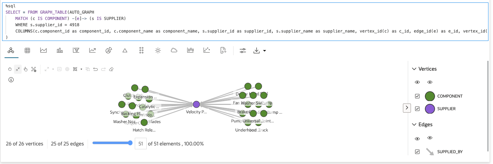

9. Finally, let’s identify all products that contain components supplied by Velocity Parts Co. This will give us a comprehensive view of this supplier’s involvement in our products and help us decide if further action is needed to ensure quality across our offerings.

     ```
     <copy>%sql
     SELECT * FROM GRAPH_TABLE(AUTO_GRAPH
      MATCH (p IS PRODUCT) -[e1]->(c IS COMPONENT) -[e2]-> (s IS SUPPLIER)
     WHERE s.supplier_id = 4918
     COLUMNS(vertex_id(p) as p_id, edge_id(e1) as e1_id, vertex_id(c) as c_id, edge_id(e2) as e2_id, vertex_id(s) as s_id )
    )
     </copy>
     ```

    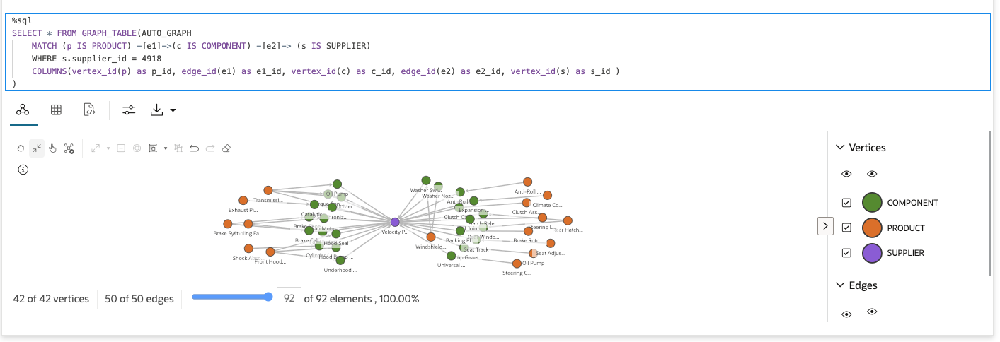

This concludes this lab.

## Acknowledgements

- **Author** - Melliyal Annamalai, Denise Myrick, Rahul Tasker, and Ramu Murakami Gutierrez Product Management, July 2025
- **Contributors** -  Melliyal Annamalai, Denise Myrick, Rahul Tasker, and Ramu Murakami Gutierrez Product Management
- **Last Updated By/Date** - Denise Myrick, Product Management, September 2025
