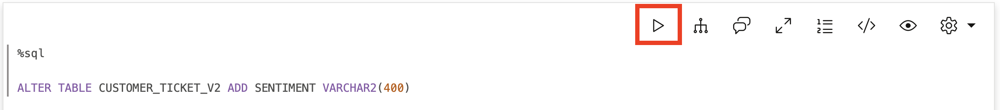
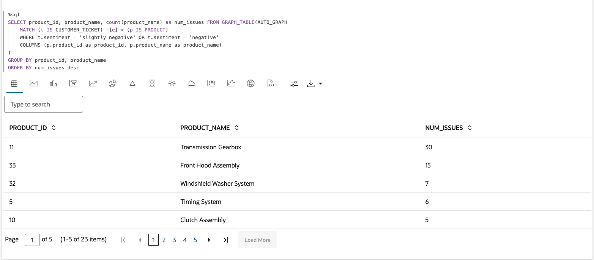
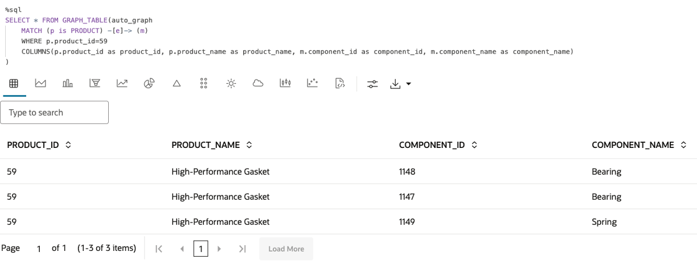

# Query and visualize the graph

## Introduction

In this lab, you will create and query a graph (`AUTOMOTIVE_ORDERS`) in SQL and PGQL paragraphs of a notebook, and use that with vector search.

Estimated Time: 30 minutes.

### Objectives

Learn how to:

- Use Graph Studio notebooks to run vector search
- Use Graph Studio notebooks with SQL and PGQL paragraphs to create, query, analyze, and visualize a graph, and integrate with vector search

### Prerequisites

- You have logged into Graph Studio, and imported the notebook

## Task 1: Explore the data available in the database

In this workshop, we will query our graph to learn more about our data to discover what products have the highest number of customer support tickets, what components make up those products and who supplies those components. We will start by connecting to Oracle Cloud Infrastructure AI Language sentiment analysis tool and analyzing our tickets to determine the emotional tone or attitude of our tickets, classifying them as positive, negative, or neutral.

>**Note:** Click the **Run Paragraph** button to run the query.

*Execute the relevant paragraph after reading the description in each of the steps below*.
If the compute environment is not ready just yet and the code cannot be executed then you will see a line moving across the bottom of the paragraph to indicate that a background task is in progress.


-----------------------------------------NEEDS TO BE REPLACED-----------------------------------------------------------------------

1. The following command adds a new column called sentiment we will use to store our sentiment analysis.

     ```
     <copy>%sql
     ALTER TABLE CUSTOMER_TICKET ADD SENTIMENT VARCHAR2(400)
     </copy>
     ```

    

-----------------------------------------NEEDS TO BE REPLACED-----------------------------------------------------------------------

2. Run sentiment analysis on customer_ticket table

     ```
     <copy>%sql

MERGE INTO customer_ticket t
USING (
  SELECT ROWID rid,
           LOWER(
             DBMS_CLOUD_AI.GENERATE (
                prompt => 'Analyze the sentiment of this ticket and tell me if it is positive or negative. ' ||
                'Please say if it is positive, negative, slightly positive, slightly negative, or neutral, no other words \n' || 
                DESCRIPTION,
        profile_name => 'MOVIESSTREAM_GENAI',
        action => 'chat'
    )) AS senti
  FROM customer_ticket
) g
ON (t.ROWID = g.rid)
WHEN MATCHED THEN
  UPDATE SET t.sentiment = g.senti;
     </copy>
     ```
         

3. Show the results of the sentiment analysis in a table

     ```
     <copy>%sql
     SELECT TICKET_ID, PRODUCT_ID, DESCRIPTION, SENTIMENT FROM CUSTOMER_TICKET
     </copy>
     ``` 

    

4. Now, let's create a graph

     ```
     <copy>%sql
     CREATE OR REPLACE PROPERTY GRAPH auto_graph
     VERTEX TABLES (
    CUSTOMER_TICKET
      KEY ( TICKET_ID ),
    SUPPLIER
      KEY ( SUPPLIER_ID ),
    CATEGORY
      KEY ( CATEGORY_ID ),
    PRODUCT
      KEY ( PRODUCT_ID ),
    COMPONENT
      KEY ( COMPONENT_ID )
  )
  EDGE TABLES (
    CUSTOMER_TICKET AS TICKET_FOR_PRODUCT KEY ( TICKET_ID )
      SOURCE KEY ( TICKET_ID ) REFERENCES CUSTOMER_TICKET( TICKET_ID )
      DESTINATION KEY ( PRODUCT_ID ) REFERENCES PRODUCT( PRODUCT_ID )
      NO PROPERTIES,
    CATEGORY AS PARENT_CATEGORY_OF KEY ( CATEGORY_ID )
      SOURCE KEY ( PARENT_CATEGORY_ID ) REFERENCES CATEGORY( CATEGORY_ID )
      DESTINATION KEY ( CATEGORY_ID ) REFERENCES CATEGORY( CATEGORY_ID )
      NO PROPERTIES,
    PRODUCT AS CATEGORY_OF_PRODUCT KEY ( PRODUCT_ID )
      SOURCE KEY ( CATEGORY_ID ) REFERENCES CATEGORY( CATEGORY_ID )
      DESTINATION KEY ( PRODUCT_ID ) REFERENCES PRODUCT( PRODUCT_ID )
      NO PROPERTIES,
    COMPONENT AS COMPONENT_OF_PRODUCT KEY (COMPONENT_ID, PRODUCT_ID)
      SOURCE KEY ( PRODUCT_ID ) REFERENCES PRODUCT( PRODUCT_ID )
      DESTINATION KEY ( COMPONENT_ID ) REFERENCES COMPONENT( COMPONENT_ID )
      NO PROPERTIES,
    COMPONENT AS SUPPLIED_BY KEY (COMPONENT_ID)
      SOURCE KEY ( COMPONENT_ID ) REFERENCES COMPONENT( COMPONENT_ID )
      DESTINATION KEY ( SUPPLIER_ID ) REFERENCES SUPPLIER( SUPPLIER_ID )
      NO PROPERTIES
  )
     </copy>
     ```

    

5. Let's find what products have the highest number of customer support tickets. We can find this through a simple pattern matching query using SQL Property Graphs.

     ```
     <copy>%sql
    SELECT * FROM GRAPH_TABLE(auto_graph
       MATCH (n) -[e]-> (m)
        COLUMNS(vertex_id(n) as nid, edge_id(e) as eid, vertex_id(m) as mid)
    )
     </copy>
     ```

    

**Exploratory Analysis** - In the next few paragraphs, we will query our graph to learn more about our data to discover which products have the highest number of negative customer support tickets, which components make up those products and who supplies those components.

6. **Find the products with the largest number of negative customer tickets** - First, let's find which products have the highest number of customer support tickets with a negative sentiment. We can find this through a simple pattern matching query using SQL Property Graphs.

     ```
     <copy>%sql
    SELECT product_id, product_name, count(product_name) as num_issues FROM GRAPH_TABLE(AUTO_GRAPH
        MATCH (t IS CUSTOMER_TICKET) -[e]-> (p IS PRODUCT)
        WHERE t.sentiment = 'slightly negative' OR t.sentiment = 'negative'
        COLUMNS (p.product_id as product_id, p.product_name as product_name)
    )
    GROUP BY product_id, product_name
    ORDER BY num_issues desc
     </copy>
     ```

    

    You can also view the results as a table running the following query:

     ```
     <copy>%sql
     SELECT * FROM GRAPH_TABLE(auto_graph
         MATCH (p is PRODUCT) -[e]-> (m)
         WHERE p.product_id=59
         COLUMNS(vertex_id(p) as pid, edge_id(e) as eid, vertex_id(m) as mid)
     )
     </copy>
     ``` 

    

7. To find the supplier of each component in the product, let's extend the previous query through another edge and node. This visualization shows the supplier for each component in the High Performance Gasket. 

     ```
     <copy>%sql
     SELECT *
     FROM GRAPH_TABLE( auto_graph
         MATCH (p is PRODUCT) -[e1]-> (m) -[e2]-> (l)
         WHERE p.product_id=59
         COLUMNS(vertex_id(p) as p, edge_id(e1) as e1, vertex_id(m) as m, edge_id(e2) as e2, vertex_id(l) as l)
     )
     </copy>
     ``` 

    

8. Now that we understand our data, we can run a graph query to pull a report based on our exploratory analysis. Using the SQL Property Graph syntax we can eliminate the need for complex joins and unions to return the ticket description, product information, component ID, supplier name and number of issues associated with the product.

     ```
     <copy>%sql
     SELECT ticket_desc, product_id, product_name, supplier, component, count(product_id) as num_product_issues FROM GRAPH_TABLE(AUTO_GRAPH
         MATCH (t IS CUSTOMER_TICKET) -[e]-> (p IS PRODUCT) -[e1]-> (c is COMPONENT) -[e2]-> (s IS SUPPLIER)
         COLUMNS (t.description as ticket_desc, p.product_id as product_id, p.product_name as product_name, c.component_id as component, s.supplier_name as supplier)
    )
    GROUP BY ticket_desc, product_id, product_name, supplier, component
    ORDER BY num_product_issues desc
     </copy>
     ``` 

    

This concludes this lab.

## Acknowledgements
* **Author** - Ramu Murakami Gutierrez, Product Management, July 2025
* **Contributors** -  Melliyal Annamalai, Denise Myrick, Rahul Tasker, and Ramu Murakami Gutierrez Product Management
* **Last Updated By/Date** - Ramu Murakami Gutierrez, Product Management, July 2025
