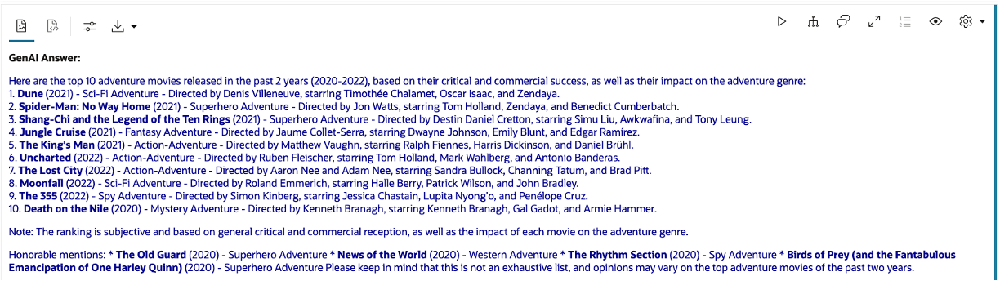
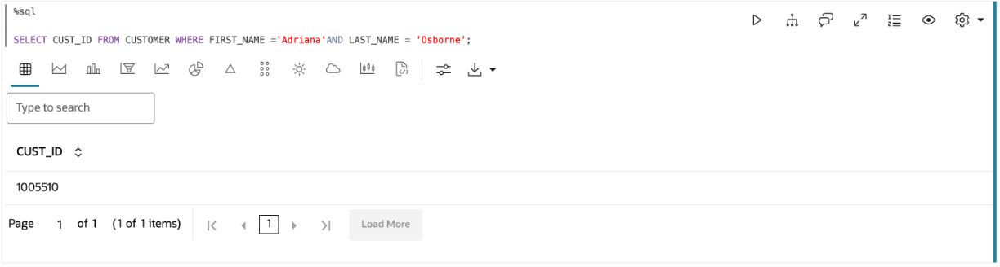
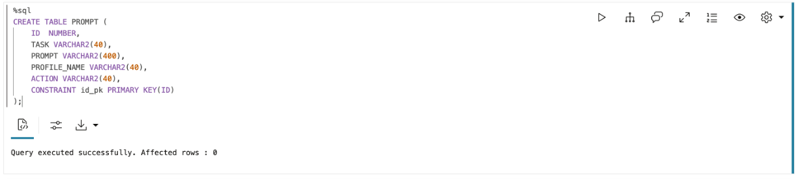
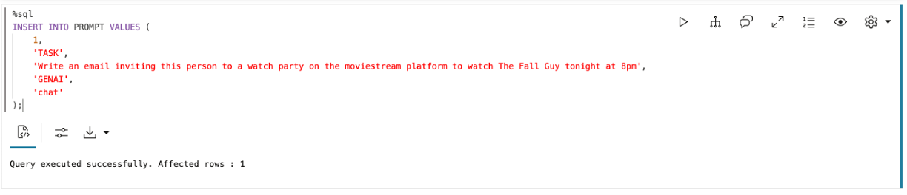
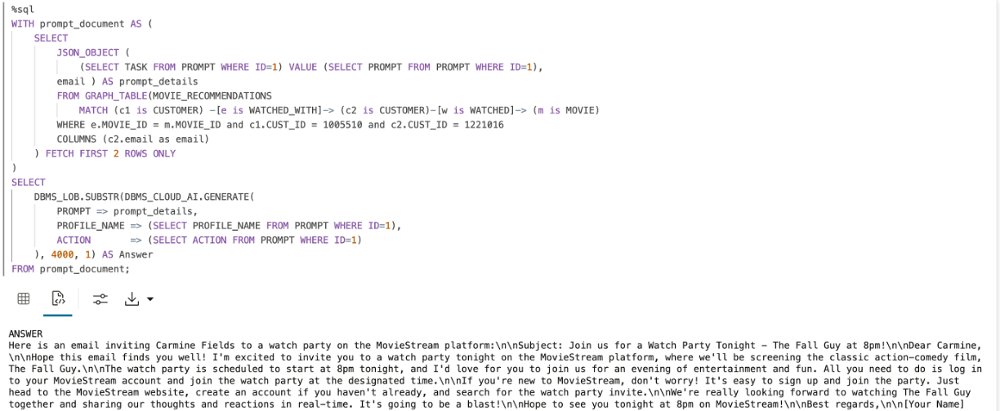

# Query and visualize the graph

## Introduction

In this lab, you will create and query a graph (that is, `MOVIE_RECOMMENDATIONS`) in SQL and PGQL paragraphs of a notebook, and use that with vector search and send the results to an LLM.

Estimated Time: 30 minutes.

### Objectives

Learn how to:

- Use Graph Studio notebooks to query a LLM and run vector search
- Use Graph Studio notebooks with SQL and PGQL paragraphs to create, query, analyze, and visualize a graph, and integrate with vector search

### Prerequisites

- You have logged into Graph Studio, and imported the notebook

## Task 1: Explore the data available in the database

In this workshop, we on the development team at Oracle MovieStream, a fictitious on-line movie streaming company, will demonstrate a new feature to help users coordinate watch parties for their friends, who are also MovieStream users. The service uses each party goers' watch history to help inform suggestions.

One of our customers, Adriana Osborne, is exploring the watch party feature. She wants to see what 2024 adventure movie she might be interested in watching and which of her friends she could invite to a party. MovieStream includes an option to personalize an email to Adriana's invitees to her watch party.

>**Note:** Click the **Run Paragraph** button to run the query.

*Execute the relevant paragraph after reading the description in each of the steps below*.
If the compute environment is not ready just yet and the code cannot be executed then you will see a line moving across the bottom of the paragraph to indicate that a background task is in progress.


1. Users can use the LLM to ask general questions about movies. Let's ask the LLM to give us the top 10 adventure movies released in the past 2 years.

    <span style="display: inline-block; border-radius: 50%; background-color: #2B6689; color: white; width: 20px; height: 20px; text-align: center; font-weight: bold;">i</span> This paragraph has the run button disabled and serves as an example of how to combine Graph Studio with OCI generative AI.

     ```
     <copy>%sql
     SELECT DBMS_CLOUD_AI.GENERATE(
         prompt       => 'what are the top 10 adventure movies released in the past 2 years',
         profile_name => 'genai',
         action       => 'chat')
     FROM dual;</copy>
     ```

     

    GenAI Answer: 

    

    Your LLM answer might vary because each time you submit a prompt, it can produce a different response.

    As we see, we could not find the answers we wanted (movies released in 2024), because this generative AI service does not have the latest data.

    So in the next task we will explore data in the database which has up-to-date data. This is known as "RAG" or "Vector RAG," the technique of using data in the database to enhance the prompt sent to the generative AI service. Text search or vector search (similarity search) can be used to find relevant data in the database, and that data is used to enhance the prompt.   

    We will search for movies that were released in 2024. We will use vector search to find movies with genre type 'Adventure' for the watch party, as these are the movies of interest for Adriana. 

2. We will search for movies that were released in 2024. We will use vector search to find movies with genre type 'Adventure' for the watch party, as these are the movies of interest for Adriana. 

     ```
     <copy>%sql
     SELECT m.TITLE, m.MOVIE_ID, m.YEAR
     FROM MOVIE m
     WHERE m.YEAR = 2024
     ORDER BY vector_distance(m.summary_vec, 
     vector_embedding(doc_model_bert using 'ADVENTURE' as data), COSINE)</copy>
     ```

    Our search result gives 'The Fall Guy' the highest score for 'Adventure' movies in 2024 that we (Oracle MovieStream company) have available for our customers to watch. 

     

3. Adriana wants to know which movies are similar to 'The Fall Guy' to help her decide if she'd like to watch 'The Fall Guy.' Let's run another vector search to find out.

     ```
     <copy>%sql
     SELECT mo.TITLE, mo.YEAR, vector_distance(m.summary_vec, mo.summary_vec, COSINE) as vec_dist
     FROM MOVIE m, MOVIE mo
     WHERE m.TITLE = 'The Fall Guy'
     ORDER BY vec_dist;
     </copy>
     ``` 

     

## Task 2: Create and query a Property Graph using SQL

Knowing what movies are similar to 'The Fall Guy' is a good start, but it doesn't fully achieve Adriana's goal. She needs more information about the relationships between customers and movies they watch, to decide who to invite to the watch party.

We will first create a graph of customers, movies they have watched, and movies they have watched at watch parties. Then, we will query the graph using SQL and PGQL. The results of the graph query, where the graph represents the network of watch parties, is used to enhance the prompt sent to a generative AI service.

1. The following SQL statement creates a graph of customers, movies they have watched, and movies they have watched at watch parties.

     ```
     <copy>%sql
     CREATE PROPERTY GRAPH IF NOT EXISTS movie_recommendations
     VERTEX TABLES (
         CUSTOMER
             KEY ( CUST_ID ),
         MOVIE
             KEY ( MOVIE_ID )
     )
     EDGE TABLES (
         WATCHED
             KEY ( DAY_ID, PROMO_CUST_ID, MOVIE_ID )
             SOURCE KEY ( PROMO_CUST_ID ) REFERENCES CUSTOMER ( CUST_ID )
             DESTINATION KEY ( MOVIE_ID ) REFERENCES MOVIE ( MOVIE_ID ),
         WATCHED_WITH
             KEY(ID)
             SOURCE KEY ( WATCHER ) REFERENCES CUSTOMER( CUST_ID )
             DESTINATION KEY ( WATCHED_WITH ) REFERENCES CUSTOMER ( CUST_ID )
     );</copy>
     ```

    
<!---
2. Let's take a close look at our customer, Adriana Osborne. We want to know the movies she has watched, and the watch parties she has been to. The next query helps us find her CUST_ID to make writing the queries a bit easier.

     ```
     <copy>%sql
     SELECT CUST_ID FROM CUSTOMER WHERE FIRST_NAME ='Adriana'AND LAST_NAME = 'Osborne';</copy>
     ```

    Now that we know Adriana's CUST_ID, let's look at some sample queries. 

    
-->

2. This query returns all the movies Adriana has watched.

     ```
     <copy>%sql
     SELECT C1NAME, MOVIE_TITLE
     FROM GRAPH_TABLE( MOVIE_RECOMMENDATIONS
     MATCH (c1 IS CUSTOMER)-[e1 IS WATCHED]->(m IS MOVIE)
     WHERE c1.FIRST_NAME ='Adriana' AND c1.LAST_NAME = 'Osborne'
     COLUMNS (c1.FIRST_NAME as C1NAME, m.title as MOVIE_TITLE) );</copy>
     ```

    

3. Next, let's take a look at the watch parties Adriana has been part of, and some other movies other watch party attendees have watched.

     ```
     <copy>%sql
     SELECT C1NAME, C2NAME, MOVIE_TITLE
	     FROM GRAPH_TABLE(MOVIE_RECOMMENDATIONS 
         MATCH (c1 is CUSTOMER) -[e is WATCHED_WITH]-> (c2 is CUSTOMER)-[w is WATCHED]-> (m is MOVIE)
         WHERE c1.FIRST_NAME ='Adriana' AND c1.LAST_NAME = 'Osborne'
         COLUMNS (c1.FIRST_NAME as C1NAME, C2.FIRST_NAME as C2NAME, m.TITLE as MOVIE_TITLE)
         )</copy>
     ```

      

## Task 3: Create and query a Property Graph using PGQL

This is great, but sometimes a visualization helps us identify relationships more quickly. We will visualize the results of this graph query by creating a PGQL Property Graph. (SQL Property Graph visualization coming soon!)

1. Run the following PGQL statement to create the same property graph query using PGQL.

     ```
     <copy>%pgql-rdbms
     CREATE PROPERTY GRAPH movie_recommendations_pgql
     VERTEX TABLES (
         CUSTOMER
             KEY ( CUST_ID ),
         MOVIE
             KEY ( MOVIE_ID )
             PROPERTIES ARE ALL COLUMNS EXCEPT(summary_vec)
     )
     EDGE TABLES (
         WATCHED
             KEY ( DAY_ID, PROMO_CUST_ID, MOVIE_ID )
             SOURCE KEY ( PROMO_CUST_ID ) REFERENCES CUSTOMER ( CUST_ID )
             DESTINATION KEY ( MOVIE_ID ) REFERENCES MOVIE ( MOVIE_ID ),
         WATCHED_WITH
             KEY(ID)
             SOURCE KEY ( WATCHER ) REFERENCES CUSTOMER( CUST_ID )
             DESTINATION KEY ( WATCHED_WITH ) REFERENCES CUSTOMER ( CUST_ID )
     ) OPTIONS(PG_VIEW)</copy>
     ```

    

    Let's run the previous queries in PGQL.

2. This query visualizes the movies Adriana has watched previously.

     ```
     <copy>%pgql-rdbms
     SELECT c1, w, m
	     FROM MATCH (c1 is CUSTOMER) -[w is WATCHED]-> (m is MOVIE)
         ON MOVIE_RECOMMENDATIONS_PGQL 
         WHERE c1.FIRST_NAME ='Adriana' AND c1.LAST_NAME = 'Osborne'</copy>
      ```

    

3. This query helps us visualize the movies Adriana watched at a watch party and others who attended these events, and the movies they have watched. In this example, we are using Adriana Osborne's CUST_ID.

     ```
     <copy>%pgql-rdbms
     SELECT c1, e, c2, w, m
         FROM MATCH (c1 is CUSTOMER) -[e is WATCHED_WITH]-> (c2 is CUSTOMER)-[w is WATCHED]-> (m is MOVIE)
         ON MOVIE_RECOMMENDATIONS_PGQL 
         WHERE c1.CUST_ID = 1005510</copy>
     ```

    

## Task 4: Continue querying the MOVIE_RECOMMENDATIONS graph using SQL and PGQL

We next find out whether Adriana has gone to watch parties for movies similar to 'The Fall Guy.' Maybe the same group of people will be interested in watching 'The Fall Guy.'

1. The following query helps us find watch parties that Adriana has been to where the movie they watched was similar to 'The Fall Guy.' Graph pattern search and vector search are combined together.

     ```
     <copy>%sql
     SELECT C1NAME, C2NAME, MOVIE_TITLE, vector_distance(svec, (SELECT summary_vec from MOVIE WHERE title = 'The Fall Guy'), COSINE) as vec_dist 
     FROM (
         SELECT C1NAME, C2NAME, MOVIE_TITLE, svec
         FROM GRAPH_TABLE(MOVIE_RECOMMENDATIONS 
             MATCH (c1 is CUSTOMER) -[e is WATCHED_WITH]-> (c2 is CUSTOMER)-[w is WATCHED]-> (m is MOVIE)
             WHERE e.MOVIE_ID = m.MOVIE_ID AND c1.FIRST_NAME ='Adriana' AND c1.LAST_NAME = 'Osborne'
             COLUMNS (c1.FIRST_NAME as C1NAME, C2.FIRST_NAME as C2NAME, m.MOVIE_ID as m_id, m.TITLE as MOVIE_TITLE, m.YEAR as MOVIE_YEAR, m.SUMMARY_VEC as svec, vertex_id(c1) as c1id, edge_id(e) as eid, vertex_id(c2) as c2id, edge_id(w) as wid, vertex_id(m) as mid)
         )
     )
     ORDER BY vec_dist;</copy>
     ```

    

2. Let us visualize the graph in this query, again using a PGQL graph.

     ```
     <copy>%pgql-rdbms
     SELECT c1, e, c2, w, m
         FROM MATCH (c1 is CUSTOMER) -[e is WATCHED_WITH]-> (c2 is CUSTOMER)-[w is WATCHED]-> (m is MOVIE)
         ON MOVIE_RECOMMENDATIONS_PGQL 
         WHERE e.MOVIE_ID = m.MOVIE_ID and c1.FIRST_NAME ='Adriana' AND c1.LAST_NAME = 'Osborne'</copy>
     ```
     
    

    Given the strong turnout for the 'Star Wars Episode IX: The Rise of Skywalker' watch party, this group seems perfect for organizing a watch party to watch 'The Fall Guy' so we will use the help of a generative AI service to set up this watch party.

## Task 5: Use SQL and GenAI to write an invitation email

 1. Let's start by creating a table so we can easily create, save and call various prompts.
 
 <span style="display: inline-block; border-radius: 50%; background-color: #2B6689; color: white; width: 20px; height: 20px; text-align: center; font-weight: bold;">i</span> This paragraph has the run button disabled and is included as an example of how to combine Graph Studio with a generative AI service, using SQL.

     ```
     <copy>%sql
     CREATE TABLE PROMPT (
         ID  NUMBER,
         TASK VARCHAR2(40),
         PROMPT VARCHAR2(400),
         PROFILE_NAME VARCHAR2(40),
         ACTION VARCHAR2(40),
         CONSTRAINT id_pk PRIMARY KEY(ID)
     );</copy>
     ```

    
 
 2. Then we can call the Gen AI service directly through SQL, using a SQL query similar to the previous query. In this case we are inserting prompt values for our email and asking GenAI to generate an email for the watch party. 
 
 <span style="display: inline-block; border-radius: 50%; background-color: #2B6689; color: white; width: 20px; height: 20px; text-align: center; font-weight: bold;">i</span> This paragraph has the run button disabled and is included as an example of how to combine Graph Studio with a generative AI service, using SQL.

     ```
     <copy>%sql
     INSERT INTO PROMPT VALUES (
         1, 
         'TASK', 
         'Write an email inviting this person to a watch party on the moviestream platform to watch The Fall Guy tonight at 8pm',
         'GENAI',
         'chat'
     );</copy>
     ```
    
    

 3. Now we can generate an email for Carmine using SQL and GenAI.
 
 <span style="display: inline-block; border-radius: 50%; background-color: #2B6689; color: white; width: 20px; height: 20px; text-align: center; font-weight: bold;">i</span> This paragraph has the run button disabled and is included as an example of how to combine Graph Studio with a generative AI service, using SQL.

     ```
     <copy>%sql
     WITH prompt_document AS (
         SELECT
             JSON_OBJECT (
                 (SELECT TASK FROM PROMPT WHERE ID=1) VALUE (SELECT PROMPT FROM PROMPT WHERE ID=1),
             email ) AS prompt_details
             FROM GRAPH_TABLE(MOVIE_RECOMMENDATIONS
                 MATCH (c1 is CUSTOMER) -[e is WATCHED_WITH]-> (c2 is CUSTOMER)-[w is WATCHED]-> (m is MOVIE) 
             WHERE e.MOVIE_ID = m.MOVIE_ID and c1.CUST_ID = 1005510 and c2.CUST_ID = 1221016
             COLUMNS (c2.email as email) 
         ) FETCH FIRST 2 ROWS ONLY
     )
     SELECT 
         DBMS_LOB.SUBSTR(DBMS_CLOUD_AI.GENERATE(
             PROMPT => prompt_details,
             PROFILE_NAME => (SELECT PROFILE_NAME FROM PROMPT WHERE ID=1),
             ACTION       => (SELECT ACTION FROM PROMPT WHERE ID=1)       
         ), 4000, 1) AS Answer
     FROM prompt_document;</copy>
     ```
    
     

    GenAI Answer: 

          
    
    Your LLM answer might vary because each time you submit a prompt, it can produce a different response.

This concludes this lab.

## Acknowledgements
* **Author** - Ramu Murakami Gutierrez, Product Manager
* **Contributors** -  Melliyal Annamalai, Denise Myrick, Rahul Tasker, and Ramu Murakami Gutierrez Product Management
* **Last Updated By/Date** - Ramu Murakami Gutierrez, Product Management, October 2024
