# Get started - LiveLabs login and Accessing your Compartment

## Introduction

To get started, you need to have an active Oracle Cloud account and a LiveLabs reservation. An Oracle Cloud account is free and needed to gain access to your LiveLabs reservation, Oracle Support, and other Oracle publicly-accessible content.

If you already have an Oracle Cloud account, you can skip to Task 2.

If you already have a reservation, skip to the next lab to start your workshop!

Estimated Time: 5 minutes

### Objectives

- Create an Oracle cloud account
- Request workshop reservation on LiveLabs
- Launch workshop

### Prerequisites

- A valid email address
- Valid phone number

## Task 1: Create an Oracle Account

Creating an Oracle account can be summarized in the following two simple steps.

1. Navigate to [oracle.com](http://www.oracle.com), Click on *View Account*, and Select *Create an Account*

  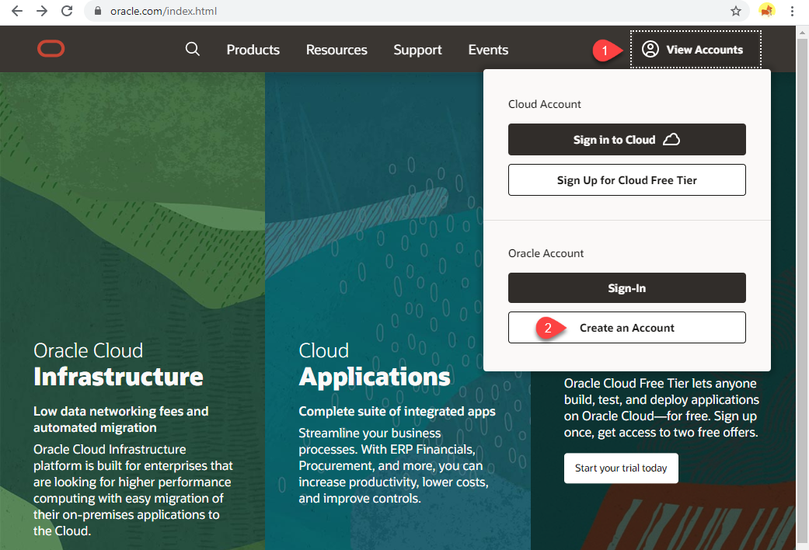

2. Fill out the form and click **Create Account**.

  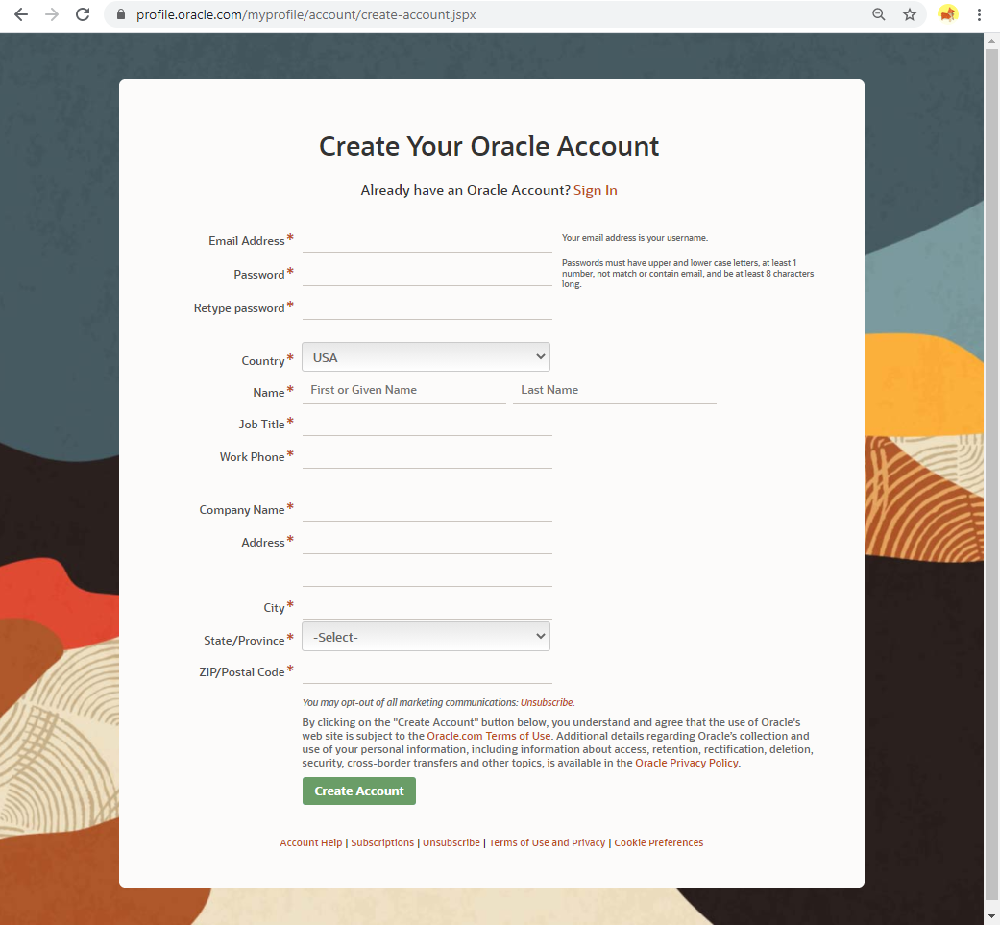

## Task 2: Request Workshop Reservation

1. Using your *Oracle Account Login* go to [link for the cloud event](http://bit.ly/golivelabs) and click  to request a reservation for this workshop.

2. After creating a reservation for a LiveLab Workshop, you will receive an e-mail indicating that your reservation is being processed, followed by an e-mail indicating that your environment has been created.

  

  >**Note:** You will receive the second created e-mail just before your selected reservation time.

3. Log into LiveLabs and click **My Reservations**, then click the **Launch Workshop** link for the Workshop environment you'd like to use. Note that you may have several Workshops listed.

  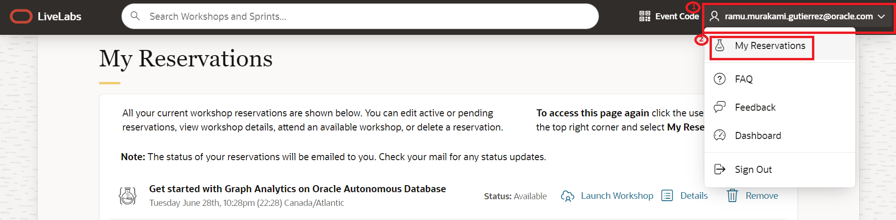

  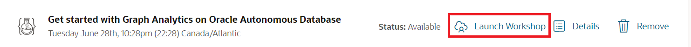

4. View Login Info to access your reservation Info.
  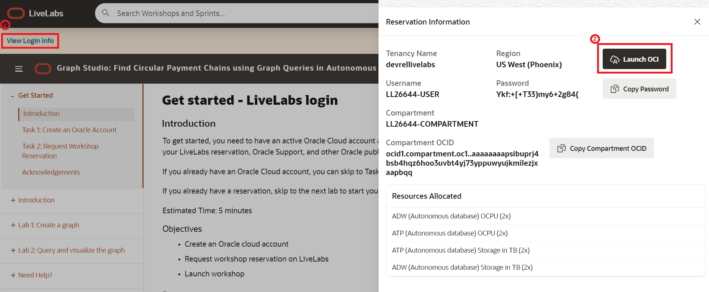
  After that click on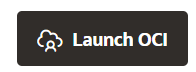

5. Follow the instructions provided to log in to your Oracle Cloud account, change your password, and complete your login to Oracle Cloud.

  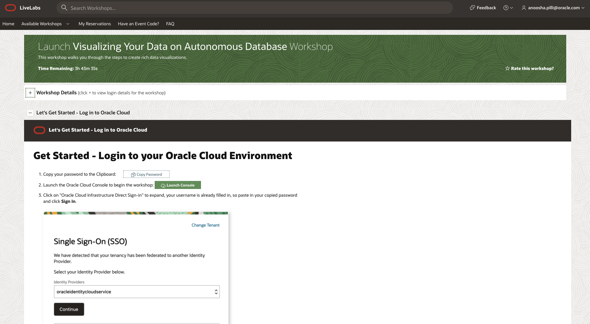

6. Finally, open the lab instructions by choosing one of the two options.

  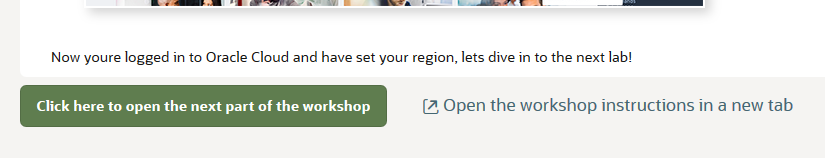

## Task 1: Accessing compartment

1. Login to the Oracle Cloud.

2. Once you are logged in, you are taken to the cloud services dashboard where you can see all the services available to you. Click the navigation menu in the upper left to show top level navigation choices.

    > **Note:** You can also directly access your Autonomous Data Warehouse or Autonomous Transaction Processing service in the __Quick Actions__ section of the dashboard.

    

3. The following steps apply similarly to either Autonomous Data Warehouse or Autonomous Transaction Processing. This lab shows provisioning of an Autonomous Data Transaction Processing database, so click **Autonomous Transaction Processing**.

    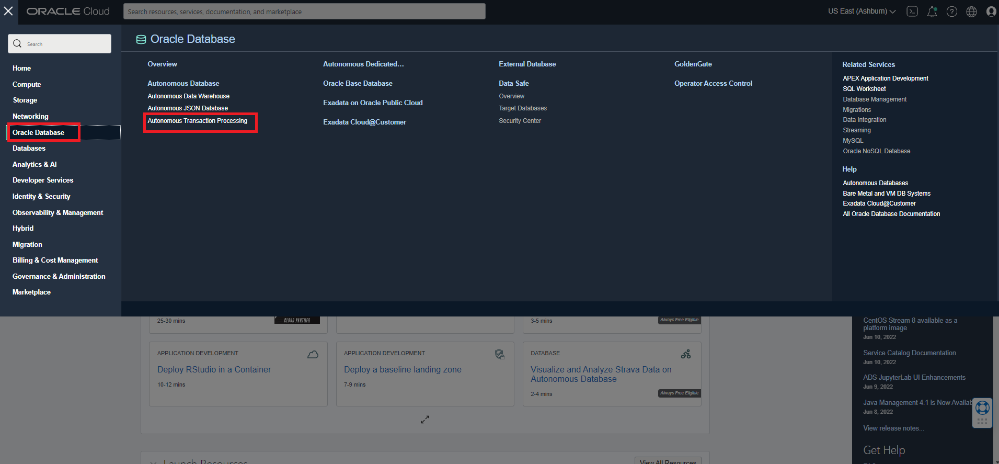

4. Make sure your workload type is __Autonomous Transaction Processing__ or __All__ to see your Autonomous Transaction Processing instances. Use the __List Scope__ drop-down menu to select a compartment. Enter the first part of your user name located under **Workshop Details**, for example `LL26422` in the Search Compartments field to quickly locate your compartment.

    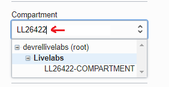

5. This console shows that no databases yet exist. If there were a long list of databases, you could filter the list by the **State** of the databases (Available, Stopped, Terminated, and so on). You can also sort by __Workload Type__. Here, the __Transaction Processing__ workload type is selected.

    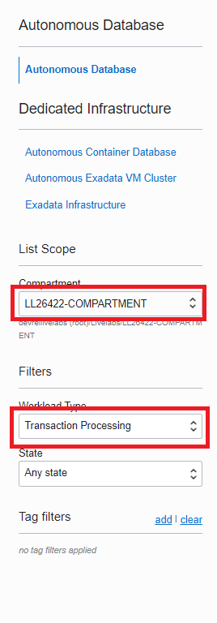

You may now **proceed to the next lab**.

## Acknowledgements

- **Created By/Date** - Kay Malcolm, Database Product Management, March 2020
- **Contributors** - Rene Fontcha, Kamryn Vinson, Anoosha Pilli, Arabella Yao
- **Last Updated By/Date** - Ramu Murakami Gutierrez, Product Management, June 2022
