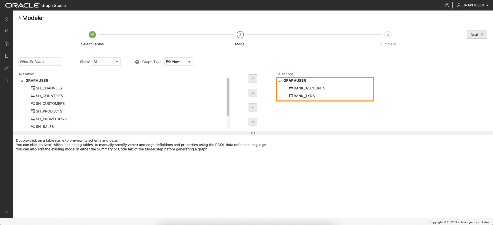
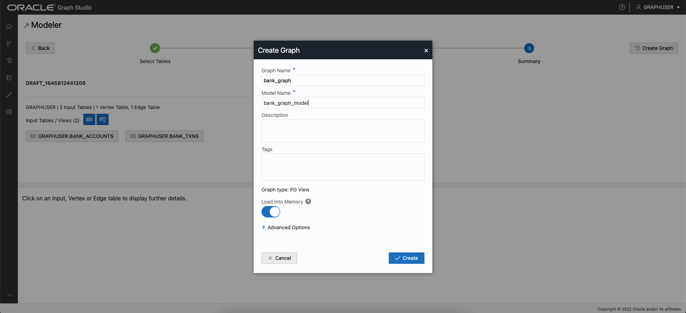

# Graph Studio: Create a graph using PGQL CREATE PROPERTY GRAPH statement

## Introduction

In this lab you will create a graph from the `bank_accounts` and `bank_txns` tables using Graph Studio and the CREATE PROPERTY GRAPH statement.

<!-- COMMENTED THE FOLLOWING OUT FOR DATABSE WORLD:
The following video shows the steps you will execute in this lab.

[](youtube:5g9i9HA_cn0) Graph Studio: Create a graph. -->

Estimated Time: 15 minutes.

Watch the video below for a quick walk through of the lab.

[Video on how to create a graph](youtube:tNPY4xmVFMk)

### Objectives

Learn how to
- use Graph Studio and PGQL DDL (that is, CREATE PROPERTY GRAPH statement) to model and create a graph from existing tables or views.

### Prerequisites

- The following lab requires an Autonomous Database - Shared Infrastructure account.
- And that the Graph-enabled user (`GRAPHUSER`) exists. That is, a database user with the correct roles and privileges exists.

## **Task 1:** Create a graph of accounts and transactions from the corresponding tables

1. Click the **Models** icon to navigate to the start of the modeling workflow.  
   Then click **Create**.  
     

   >**Note**: If you clicked on `Start Modeling` button instead then you'll see the screen shown in the next step.

2. Then select the `BANK_ACCOUNTS` and `BANK_TXNS` tables.   
  

3. Move them to the right, that is, click the first icon on the shuttle control.   

  

4.  Click **Next** to get a suggested model. We will edit and update this model to add an edge and a vertex label.  

    The suggested model has the `BANK_ACCOUNTS` as a vertex table since there are foreign key constraints specified on `BANK_TXNS` that reference it.   

    And `BANK_TXNS` is a suggested edge table.

      


5.  Now let's change the default Vertex and Edge labels.  

    Click the `BANK_ACCOUNTS` vertex table. Change the Vertex Label to **ACCOUNTS**. Then click outside the input box on confirm label and save the update.  

      

    Click the `BANK_TXNS` edge table and rename the Edge Label from `BANK_TXNS` to **TRANSFERS**.  
    Then click outside the input box on confirm label and save the update.  

      

    This is **important** because we will use these edge labels in the next lab of this workshop when querying the graph.  

6.  Since these are directed edges, a best practice is verifying that the direction is correct.  
    In this instance we want to **confirm** that the direction is from `from_acct_id` to `to_acct_id`.  

    >**Note:** the `Source Vertex` and `Destination Vertex` information on the left.  

      

    **Notice** that the direction is wrong. The Source Key is `to_acct_id` instead of what we want, which is `from_acct_id`.  

    Click the swap edge icon on the right to swap the source and destination vertices and hence reverse the edge direction.  

   >**Note:** that the `Source Vertex` is now the correct one, i.e. the `FROM_ACCT_ID`.

   


7. Click the **Source** tab to verify that the edge direction, and hence the generated CREATE PROPERTY GRAPH statement, is correct.


     

<!---
  **An alternate approach:** In the earlier Step 5 you could have just updated the CREATE PROPERTY GRAPH statement and saved the updates. That is, you could have just replaced the existing statement with the following one which specifies that the SOURCE KEY is  `from_acct_id`  and the DESTINATION KEY is `to_acct_id`.  

    ```
    -- This is not required if you used swap edge in UI to fix the edge direction.
    -- This is only to illustrate an alternate approach.
    <copy>
    CREATE PROPERTY GRAPH bank_graph
        VERTEX TABLES (
            BANK_ACCOUNTS as ACCOUNTS
            KEY (ACCT_ID)
            LABEL ACCOUNTS
            PROPERTIES (ACCT_ID, NAME)
        )
        EDGE TABLES (
            BANK_TXNS
            KEY (FROM_ACCT_ID, TO_ACCT_ID, AMOUNT)
            SOURCE KEY (FROM_ACCT_ID) REFERENCES ACCOUNTS
            DESTINATION KEY (TO_ACCT_ID) REFERENCES ACCOUNTS
            LABEL TRANSFERS
            PROPERTIES (AMOUNT, DESCRIPTION)
        )
    </copy>
    ```

     

   **Important:** Click the **Save** (floppy disk icon) to commit the changes.
--->

8. Click **Next** and then click **Create Graph** to move on to the next step in the flow.   

   Enter `bank_graph` as the graph name.  
   That graph name is used throughout the next lab.  
   Do not enter a different name because then the queries and code snippets in the next lab will fail.  

   Enter a model name (for example, `bank_graph_model`), and other optional information and then click Create.
   

9. Graph Studio modeler will now save the metadata and start a job to create the graph.  
   The Jobs page shows the status of this job.

     

   You can then interactively query and visualize the graph in a notebook after it's loaded into memory.


This concludes this lab. **You may now proceed to the next lab.**

## Acknowledgements
* **Author** - Jayant Sharma, Product Management
* **Contributors** -  Jayant Sharma, Product Management
* **Last Updated By/Date** - Ramu Murakami Gutierrez, Product Management, June 2022  
