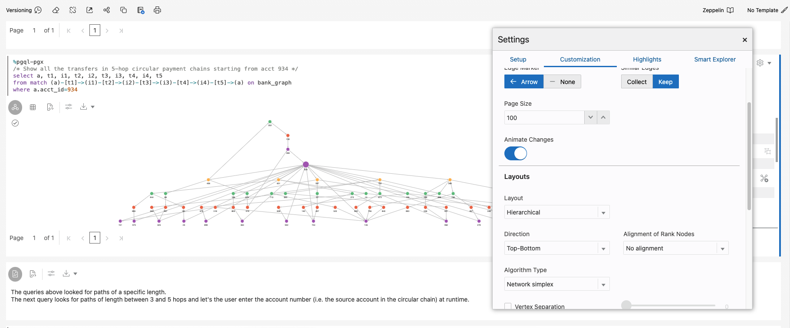

# Graph Studio: Query, visualize, and analyze a graph using PGQL and Python

## Introduction

In this lab you will query the newly create graph (that is, `bank_graph`) in PGQL paragraphs of a notebook.

Estimated Time: 30 minutes.

Watch the video below for a quick walk through of the lab.

[](youtube:XnE1yw2k5IU)

### Objectives

Learn how to
- use Graph Studio notebooks and PGQL and Python paragraphs to query, analyze, and visualize a graph.

### Prerequisites

- Earlier labs of this workshop. That is, the graph user exists and you have logged into Graph Studio.

## Task 1: Load and Query the `BANK_GRAPH` and visualize the results

>**Note:** *Execute the relevant paragraph after reading the description in each of the steps below*.
          If the compute environment is not ready as yet and the code cannot be executed then you will see a blue line moving across the bootom of the paragraph to indicate that a background task is in progress.  
  

  **Note:** *Execute the relevant paragraph after reading the description in each of the steps below*.

1. First load the graph into the in-memory graph server since we will be executing some graph algorithms.  

  	Run the first `%python-pgx` paragraph which uses the built-in `session` object to read the graph into memory from the database and creates a `PgXGraph` object which is a handle to the loaded graph.  

  	The code snippet in that paragraph is:  

  	```
    <copy>%python-pgx
    graph = session.read_graph_by_name('BANK_GRAPH', "pg_view");</copy>
  	```

        

2. Next, execute the paragraph which queries and displays 100 elements of the graph.    

    ```
    <copy>%pgql-pgx
    /* Query and visualize 100 elements (nodes and edges) of BANK_GRAPH */
    select *
    from match (s)-[t]->(d) on bank_graph
    limit 100</copy>
    ```

  	The above PGQL query fetches the first 100 elements of the graph and displays them.  
  	The MATCH clause specifies a graph pattern.  
  	- `(s)` is the source node
  	- `[t]` is an edge
  	- `->` indicates the edge direction, that is, from the source `s` to a destination `d`
  	- `(d)` is the destination node

  The LIMIT clause specifies the maximum of elements that the query should return.

  See the [PGQL site](https://pgql-lang.org) and specification for more details on the syntax and features of the language.  
  The Getting Started notebook folder also has a tutorial on PGQL.  

3. The result utilizes some features of the visualization component. The `acct_id` property is used for the node (or vertex) labels and the graph is rendered using a selected graph layout algorithm.  

  >**Note:** *You do not need to execute the following steps. They just outline the steps used. Feel free to experiment and modify the visualizations.*

  Steps required for customizing the visualization:  

  Click the visualization `settings` icon
   (the fourth icon from the left at the top of the visualization panel).  

     

  In this `Settings` dialog, click the **Customization** tab. Then scroll down and pick `ACCT_ID` from the `Labeling`, `Vertex Label` drop-down list.  

    

  Click the **X** on the top-right to exit the Settings dialog. The resulting visualization should be similar to the screenshot below.   

  **Note:** The colors and layout shown in the screenshots may differ from those in your results.

     

  Now open the visualization settings again, click the **Customization** tab, and choose a different layout (**Concentric**) from the Layout drop-down    list. Exit the Settings dialog.
  

4. Next let's use PGQL to find the top 10 accounts in terms of number of transfers.  
	PGQL has built-in functions `IN_DEGREE` and `OUT_DEGREE` which return the number of incoming and outgoing edges of a node. So we can use them in this query.   
	Run the paragraph with the following query.

    ```
    <copy>%pgql-pgx
    /* List 10 accounts with the most number of transactions (that is, incoming + outgoing edges) */
    select a.acct_id, (in_degree(a) + out_degree(a)) as num_transactions
    from match (a) on bank_graph
    order by num_transactions desc
    limit 10</copy>
    ```

    

  We see that accounts 934 and 387 are high on the list.  

5.  Now check if there are any circular transfers originating and terminating at account 934.   
	Execute the following query.

    ```
    <copy>%pgql-pgx
    /* Check if there are any circular payment chains of length 5 from acct 934 */
    select *
    from match (a)-/:TRANSFERS{5}/->(a) on bank_graph
    where a.acct_id=934</copy>
    ```

	

  Here `/:TRANSFERS{5}/` is a [reachability path expression](https://pgql-lang.org/spec/1.3/#reachability). It only tests for the existence of the path.  
  `:TRANSFERS` specifies that all edges in the path must have the label `TRANSFERS`.  
  While `{5}` specifies a path length of exactly 5 hops.  

  The result shows a dotted line which indicates a path, of length one or more, from the node for account 934 to itself.  

  

  It does not display all the paths or any intermediate nodes.

6. We can change the above query to include the node which made the deposit into account 934. This will display all the paths.   
	Execute the following query.

    ```
    <copy>%pgql-pgx
    /* Show the account that deposited into acct 934 in the 5-hop circular payment chain */
    select *
    from match (a)-/:TRANSFERS{4}/->(d)-[t]->(a) on bank_graph
    where a.acct_id=934</copy>
    ```

    

  The reachability test has paths of length four because we explicity specify the last hop (`(d)-[t]->(a)`).  
    

  Click the **Customization** settings and then select the **Concentric** layout and `ACCT_ID` for the vertex label.  
  

7. The next query finds and displays the 6-hop circular payment chains originating at account 934.  

    ```
    <copy>%pgql-pgx
    /* Show the account that deposited into acct 934 in the 5-hop circular payment chain */
    select *
    from match (a)-/:TRANSFERS{5}/->(d)-[t]->(a) on bank_graph
    where a.acct_id=934</copy>
    ```

	  

  The resulting visualizing will be similar to the following screenshot.  
    

8. We may want also to display all the intermediate nodes, that is, accounts through which the money was transferred.
  Let's do that for the 5-hop case.  

    ```
    <copy>%pgql-pgx
    /* Show all the transfers in 5-hop circular payment chains starting from acct 934 */
    select a, t1, i1, t2, i2, t3, i3, t4, i4, t5
    from match (a)-[t1]->(i1)-[t2]->(i2)-[t3]->(i3)-[t4]->(i4)-[t5]->(a) on bank_graph
    where a.acct_id=934</copy>
    ```

    

  >**Note:** *You do not need to execute the following steps. They just outline the steps used. Feel free to experiment and modify the visualizations.*

  Steps required for customizing the visualization:  

  This result is better viewed as a hierarchical layout.  
  Open the **Visualization** settings dialog and select **Hierarchical** from the **Layouts** drop-down list.  
  Leave the Direction as `Top-Down` and Algorithm Type as `Network Simplex`.
    

  Use the **Settings** icon and **Customization** tab to label the vertices with the `ACCT_ID` for the resulting graph.     
  Lastly, let's change the source node's size to highlight it.   
  Open the **Visualization** settings dialog and select the **Highlights** tab.   
  Click **New Highlight**.   
  Then
  - Click the **Size** checkbox and move the slider to `3X` so that the select vertex will be 3 times as larger as others.
  - Click the **+** icon next to `Condition` to add a selection criterion for the vertex.
  - Select `ACCT_ID` from the first drop-down list, `=` from the second, and `934.0` from the third to specify the criterion `ACCT_ID=934`.
    

  The result will be similar to the following screenshot.  
  

## Task 2: More query features and the use of the Python API to execute graph algorithms   

1. This shows the use of bind parameters in a query. The account id value is entered at runtime.  
   **Enter 534 as the account id**, and then execute the paragraph.  

    ```
    <copy>%pgql-pgx
    /* Check if there are any circular payment chains of between 3 and 5 hops starting from the user-supplied account # */
    select *
    from match (a)-/:TRANSFERS{2,4}/->(d)-[t]->(a) on bank_graph
    where a.acct_id=${account_id}</copy>
    ```
    

2. Now let's run the PageRank graph algorithm.  

  A %Python-pgx paragraph lets you execute python code snippets.  

  The code snippet below creates a PgxGraph object which contains a handle to the `BANK_GRAPH` which is loaded into the in-memory graph server.  
  Then it executes the `pagerank` algorithm using the built-in `analyst` python object.  
  The `session` and `analyst` objects are created when the in-memory graph server is instantiated and when a notebook is opened.    

  Execute the paragrah containing the following code snippet.

    ```
    <copy>%python-pgx
    graph.get_or_create_vertex_property("pagerank", data_type='double', dim=0)
    analyst = session.create_analyst()
    analyst.pagerank(graph, tol=0.001, damping=0.85, max_iter=100, norm=False, rank='pagerank');</copy>
    ```

  

3. Now let's use the computed PageRank value in visualizing a PGQL query result.  

  Execute the paragraph with the following query which finds the 6-hop transfers starting at account #934.  

    ```
    <copy>%pgql-pgx
    /* Add highlights to symbolize account nodes by pagerank values. This shows that 934 is connected to other accounts with higher PageRank values. */
    SELECT *
    FROM MATCH(n)-/:Transfers{1,6}/->(m) on bank_graph
    WHERE n.acct_id = 934 limit 100</copy>
    ```

  **Note:** *You do not need to execute the following steps. They just outline the steps used. Feel free to experiment and modify the visualizations.*   

  Steps required for customizing the visualization:  

  Click **Visualization** settings once the query has executed. Then click the **Highlights** tab.  
    

  Then click **New Highlight** and enter the following details to create it.  
  Specify pagerank >= 0.0035 as the condition, size = 3X as the visual effect.  

    

  The result should be similar to the screenshot shown below.  

  


4. Now let's compare the top ten accounts by PageRank and number of transactions.  

  Execute the paragraph with the following query to show the top ten accounts by PageRank.  

    ```
    <copy>%pgql-pgx
    /* List top ten accounts by pagerank */
    select a.acct_id, a.pagerank
    from match (a) on bank_graph
    order by a.pagerank desc limit 10</copy>
    ```

  Click the **Table** icon to visualize the results as a table, if necessary.  
      

5. And the one which shows top ten accounts by number of transfers.  

    ```
    <copy>%pgql-pgx
    /* List 10 accounts with the most number of edges (that is, transfers) */
    select a.acct_id, in_degree(a) + out_degree(a) as num_transfers
    from match (a) on bank_graph
    order by num_transfers desc limit 10</copy>
    ```

	    

6. Account #222 is in the top ten by PageRank but not by # of transfers. So let us look at that account and its immediate neighbors in the graph.  

  Execute the paragraph which queries and displays account 222 and its neighbors.

    ```
    <copy>%pgql-pgx
    /* show the transactions for acct id 222 */
    select *
    from match (v1)-[e1]->(a)-[e2]->(v2) on bank_graph where a.acct_id=222</copy>
    ```


  **Note:** *You do not need to execute the following steps. They just outline the steps used. Feel free to experiment and modify the visualizations.*   

  Steps required for customizing the visualization:  

  Choose a **Grid** layout for the visualization.  
  Add a new highlight with pagerank >= 0.0035 as the condition, size = 3X as the visual effect.  
      

7. Similarly account #4 has a higher PageRank but is not in the top 10 by #transfers while account #380 is in the top 10 by #transfers but not by PageRank.   
  So let us look at those two and their neighbors.  

  Execute the paragraph which queries the neighbors of accounts #4 and #380.  

    ```
    <copy>%pgql-pgx
    /* Query and visualize elements (nodes and edges) of BANK_GRAPH for accts 4 and 380 */
    select *
    from match (s)-[t]->(d) on bank_graph where s.acct_id = 4 or s.acct_id = 380 or d.acct_id = 4 or d.acct_id = 380</copy>
    ```

  **Note:** *You do not need to execute the following steps. They just outline the steps used. Feel free to experiment and modify the visualizations.*   

  Steps required for customizing the visualization:  

  Change the graph visualization layout to **Hierarchical**.
    	  


**Congratulations** on successfully completing this workshop.

## Acknowledgements
* **Author** - Jayant Sharma, Product Management
* **Contributors** -  Jayant Sharma, Product Management
March* **Last Updated By/Date** - Jayant Sharma, Product Management, March 2022  
