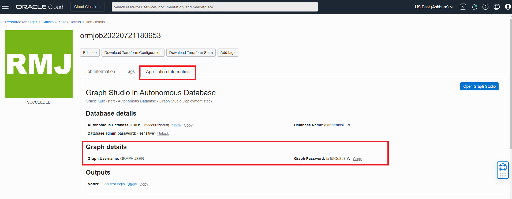

# Setup: Run Stack

## Introduction

In this lab you will run a slack that will generate an Autonomous Database, create a Graph User, and upload the dataset that will be used.

Estimated Time: 5 minutes.

### Objectives

Learn how to
- Run the stack to create an Autonomous Database, Graph user, and upload dataset
- Login to Graph Studio

## Task 1: Run Stack

The instructions below will show you how to run a stack that will automatically create an Autonomous Database containing a graph user and the dataset needed for the property graph queries.

1. Login to the Oracle Cloud.
2.  Once logged in, use this [link](https://cloud.oracle.com/resourcemanager/stacks/create?zipUrl=https://github.com/orac[…]/oci-arch-graph/releases/latest/download/orm-graph-stack.zip) to create run the Stack.
3. You will be directed to this page:

  

  - Check the "I have reviewed and accept the Oracle Terms of Use" box. Leave the rest as default. Click **Next**.

  

4. Leave the Configure Variables settings as default. Click **Next**. After that you will be taken to the Review page, click **Create**.
5. When the job has succeeded, You will see the status turn from orange to green.

    

    To see information about your application click on **Application Information**. Save the Graph Username and Password since you will be using it to login to Graph Studio.

    

## Task 2: Login to Graph studio

1. Click the **Open Graph Studio** under the Application Information. This will open a new page. Enter your graph username and password provided under Application Information, into the login screen.

  

2. Then click the **Sign In** button. You should see the studio home page.   

  

  Graph Studio consists of a set of pages accessed from the menu on the left.

  The Home icon  takes you to the Home page.  
  The Models icon  takes you to the Models page where you start modeling your existing tables and views as a graph and then create, or instantiate, a graph.  
  The Graph page  lists existing graphs for use in notebooks.  
  The Notebook page  lists existing notebooks and lets you create a new one.  
  The Jobs page  lists the status of background jobs and lets you view the associated log if any.

  This concludes this lab. *You may now proceed to the next lab.*  

  ## Acknowledgements
  * **Author** - Jayant Sharma, Ramu Murakami Gutierrez, Product Management
  * **Contributors** -  Jayant Sharma, Ramu Murakami Gutierrez, Product Management
  * **Last Updated By/Date** - Ramu Murakami Gutierrez, Product Management, June 2022  
