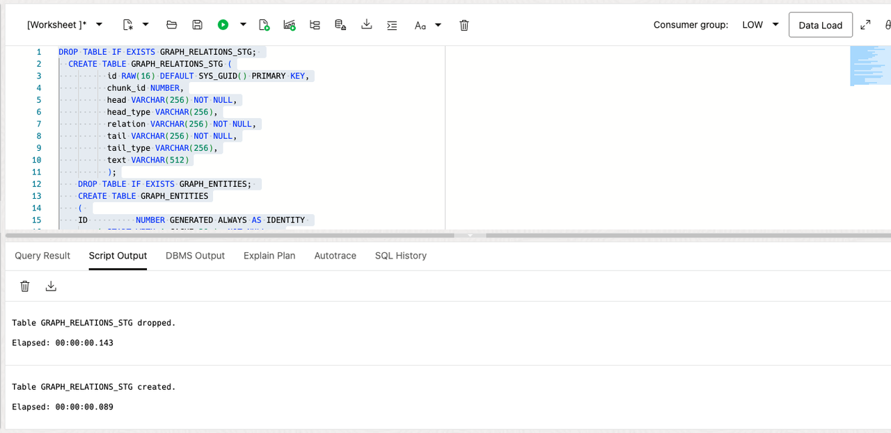
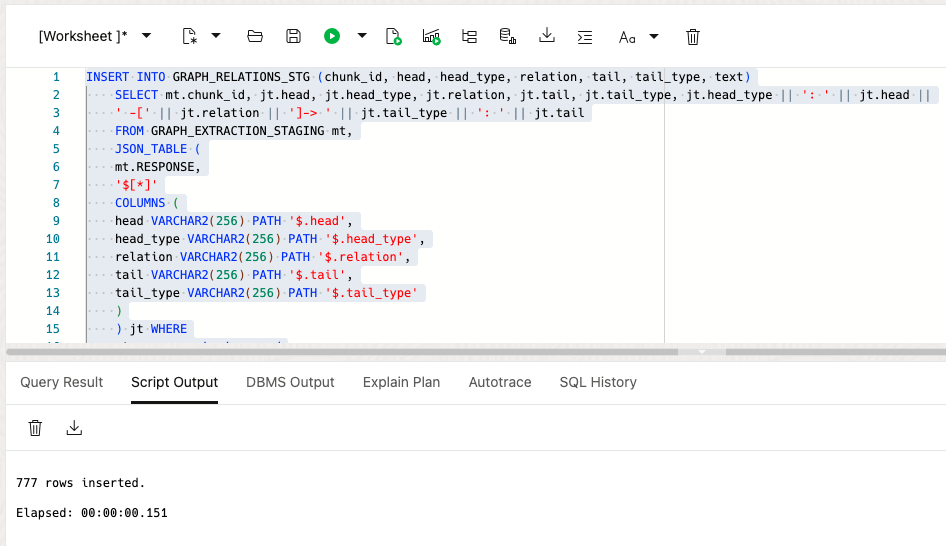
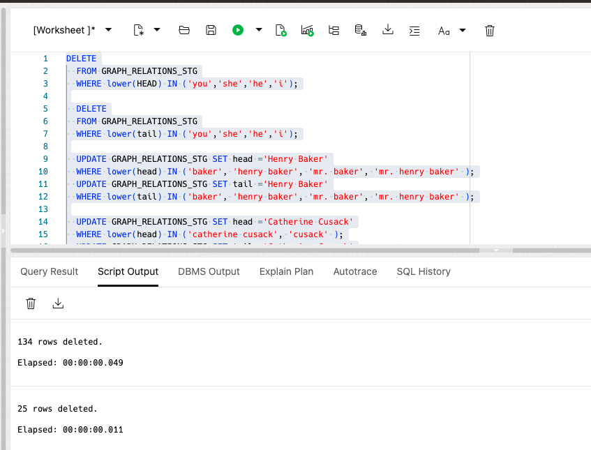
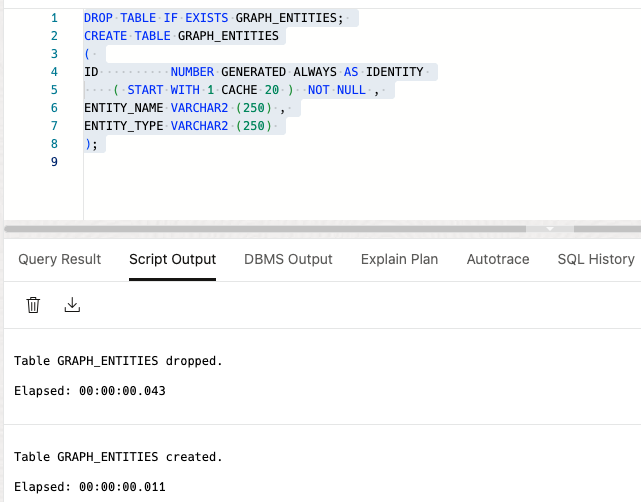
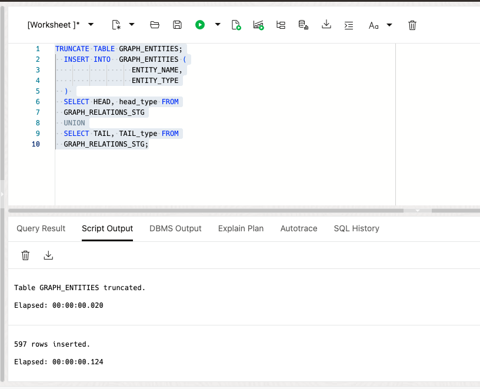
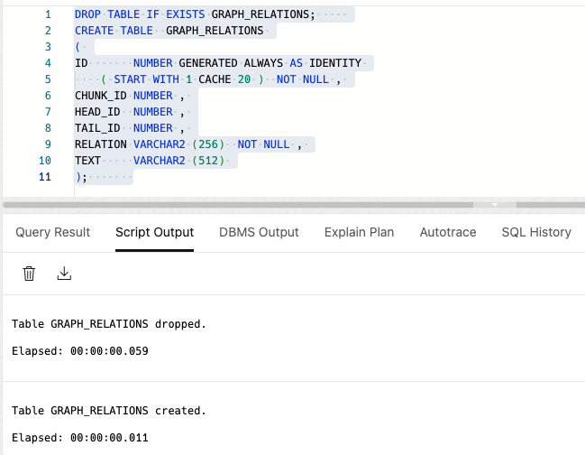
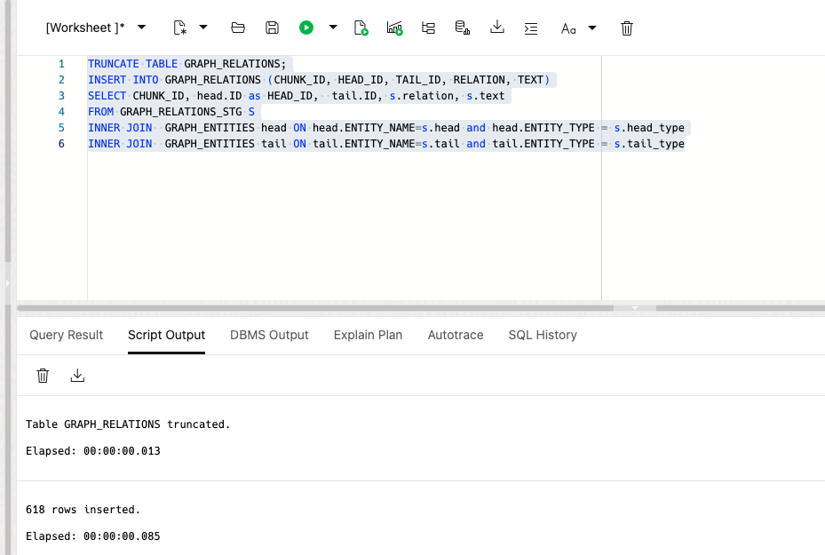

# Process Data for Graph

## Introduction

This labs goes thru the processing required to create a property graph for use in graph studio. First you will stage and clean the data for unnecessary and ambiguous information. Then you will load the staged data into tables that will be used as edge and vertices of a property graph.

Estimated Time: -- minutes


### Objectives


In this lab, you will:
* Stage generated SQL
* Clean bad data
* Load edge/vertice tables

### Prerequisites  

This lab assumes you have:
* An Oracle Cloud account
* All previous labs successfully completed

 
## Task 1: Load Gen AI Prompt Responses into table

1. Create staging, edge and vertice tables

      Paste the PL/SQL:

      ```text
          <copy>
            DROP TABLE IF EXISTS GRAPH_RELATIONS_STG; 
            CREATE TABLE GRAPH_RELATIONS_STG (
                    id RAW(16) DEFAULT SYS_GUID() PRIMARY KEY,
                    chunk_id NUMBER,
                    head VARCHAR(256) NOT NULL,
                    head_type VARCHAR(256),
                    relation VARCHAR(256) NOT NULL,
                    tail VARCHAR(256) NOT NULL,
                    tail_type VARCHAR(256),
                    text VARCHAR(512)
                    );
            
          </copy>
      ```

  

2. Load Staging table

      Paste the PL/SQL:

      ```text
          <copy>
              INSERT INTO GRAPH_RELATIONS_STG (chunk_id, head, head_type, relation, tail, tail_type, text)
              SELECT mt.chunk_id, jt.head, jt.head_type, jt.relation, jt.tail, jt.tail_type, jt.head_type || ': ' || jt.head ||
              ' -[' || jt.relation || ']-> ' || jt.tail_type || ': ' || jt.tail
              FROM GRAPH_EXTRACTION_STAGING mt,
              JSON_TABLE (
              mt.RESPONSE,
              '$[*]'
              COLUMNS (
              head VARCHAR2(256) PATH '$.head',
              head_type VARCHAR2(256) PATH '$.head_type',
              relation VARCHAR2(256) PATH '$.relation',
              tail VARCHAR2(256) PATH '$.tail',
              tail_type VARCHAR2(256) PATH '$.tail_type'
              )
              ) jt WHERE
              mt.response is json and
              jt.head IS NOT NULL and
              jt.relation IS NOT NULL and
              jt.tail IS NOT NULL;
          </copy>
      ```

  

## Task 2: Process data

1. Clean data with DELETE and UPDATE statements

      Paste the PL/SQL:

      ```text
          <copy>
            DELETE
            FROM GRAPH_RELATIONS_STG
            WHERE lower(HEAD) IN ('you','she','he','i','narrator','the man','man');

            DELETE
            FROM GRAPH_RELATIONS_STG
            WHERE lower(tail) IN ('you','she','he','i','narrator','the man','man');

            UPDATE GRAPH_RELATIONS_STG SET head ='Henry Baker'
            WHERE lower(head) IN ('baker', 'henry baker', 'mr. baker', 'mr. henry baker' );
            UPDATE GRAPH_RELATIONS_STG SET tail ='Henry Baker'
            WHERE lower(tail) IN ('baker', 'henry baker', 'mr. baker', 'mr. henry baker' );
            
            UPDATE GRAPH_RELATIONS_STG SET head ='Catherine Cusack'
            WHERE lower(head) IN ('catherine cusack', 'cusack' );
            UPDATE GRAPH_RELATIONS_STG SET tail ='Catherine Cusack'
            WHERE lower(tail) IN ('catherine cusack', 'cusack' );

            UPDATE GRAPH_RELATIONS_STG SET head ='Sherlock Holmes'
            WHERE lower(head) IN ('holmes', 'mr. holmes' ,'sherlock holmes');
            UPDATE GRAPH_RELATIONS_STG SET tail ='Sherlock Holmes'
            WHERE lower(tail) IN ('holmes', 'mr. holmes' ,'sherlock holmes');
            
            UPDATE GRAPH_RELATIONS_STG SET head ='John Horner'
            WHERE lower(head) IN ('horner', 'john horner' ,'');
            UPDATE GRAPH_RELATIONS_STG SET tail ='John Horner'
            WHERE lower(tail) IN ('horner', 'john horner' ,'');

            UPDATE GRAPH_RELATIONS_STG SET head ='James Ryder'
            WHERE lower(head) IN ('james ryder', 'mr. ryder' ,'ryder');
            UPDATE GRAPH_RELATIONS_STG SET tail ='James Ryder'
            WHERE lower(tail) IN ('james ryder', 'mr. ryder' ,'ryder');
            
            UPDATE GRAPH_RELATIONS_STG SET head ='Mr. Windigate'
            WHERE lower(head) IN ('mr. windigate', 'windigate' ,'windigate');
            UPDATE GRAPH_RELATIONS_STG SET tail ='Mr. Windigate'
            WHERE lower(tail) IN ('mr. windigate', 'windigate' ,'windigate');

            UPDATE GRAPH_RELATIONS_STG SET head ='Hat'
            WHERE lower(head) IN ('hat', 'the hat', 'old hat', 'battered hat' );
            UPDATE GRAPH_RELATIONS_STG SET tail ='Hat'
            WHERE lower(tail)  IN ('hat', 'the hat', 'old hat', 'battered hat' );

            UPDATE GRAPH_RELATIONS_STG SET head ='Blue Carbuncle'
            where lower(head) in ('gem', 'blue stone', 'jewel', 'the stone', 'stone', 'jewel-case' );
            UPDATE GRAPH_RELATIONS_STG SET tail ='Blue Carbuncle'
            WHERE lower(tail) IN ('gem', 'blue stone', 'jewel', 'the stone', 'stone', 'jewel-case' );
            
            UPDATE GRAPH_RELATIONS_STG SET head ='Goose'
            WHERE lower(head) IN ('goose', 'good fat goose' ,'christmas goose','the bird','the goose','bird');
            UPDATE GRAPH_RELATIONS_STG SET tail ='Goose'
            WHERE lower(tail) IN  ('goose', 'good fat goose' ,'christmas goose','the bird','the goose','bird');
          </copy>
      ```

  

2. Create vertice table

      Paste the PL/SQL:

      ```text
          <copy>
              DROP TABLE IF EXISTS GRAPH_ENTITIES; 
              CREATE TABLE GRAPH_ENTITIES
              ( 
              ID          NUMBER GENERATED ALWAYS AS IDENTITY 
                  ( START WITH 1 CACHE 20 )  NOT NULL , 
              ENTITY_NAME VARCHAR2 (250) , 
              ENTITY_TYPE VARCHAR2 (250) 
              );
            
          </copy>
      ```

  

3. Populate the vertice table


      Paste the PL/SQL:

      ```text
          <copy>
            TRUNCATE TABLE GRAPH_ENTITIES;
            INSERT INTO  GRAPH_ENTITIES (
                            ENTITY_NAME,
                            ENTITY_TYPE
            ) 
            SELECT HEAD, head_type FROM
            GRAPH_RELATIONS_STG
            UNION
            SELECT TAIL, TAIL_type FROM
            GRAPH_RELATIONS_STG;
            
          </copy>
      ```



4. Create Edge Table

      Paste the PL/SQL:

      ```text
          <copy>
            DROP TABLE IF EXISTS GRAPH_RELATIONS;     
            CREATE TABLE  GRAPH_RELATIONS 
            ( 
            ID       NUMBER GENERATED ALWAYS AS IDENTITY 
                ( START WITH 1 CACHE 20 )  NOT NULL , 
            CHUNK_ID NUMBER , 
            HEAD_ID  NUMBER , 
            TAIL_ID  NUMBER , 
            RELATION VARCHAR2 (256)  NOT NULL , 
            TEXT     VARCHAR2 (512) 
            );            
          </copy>
      ```
  


5. Populate the Edge table 


      Paste the PL/SQL:

      ```text
          <copy>

          TRUNCATE TABLE GRAPH_RELATIONS;
          INSERT INTO GRAPH_RELATIONS (CHUNK_ID, HEAD_ID, TAIL_ID, RELATION, TEXT)
          SELECT CHUNK_ID, head.ID as HEAD_ID,  tail.ID as TAIL_ID, s.relation, s.text
          FROM GRAPH_RELATIONS_STG S
          INNER JOIN  GRAPH_ENTITIES head ON head.ENTITY_NAME=s.head and head.ENTITY_TYPE = s.head_type
          INNER JOIN  GRAPH_ENTITIES tail ON tail.ENTITY_NAME=s.tail and tail.ENTITY_TYPE = s.tail_type

          </copy>
      ```




## Learn More

*(optional - include links to docs, white papers, blogs, etc)*

* [URL text 1](http://docs.oracle.com)
* [URL text 2](http://docs.oracle.com)

## Acknowledgements
* **Author** - <Name, Title, Group>
* **Contributors** -  <Name, Group> -- optional
* **Last Updated By/Date** - <Name, Month Year>
