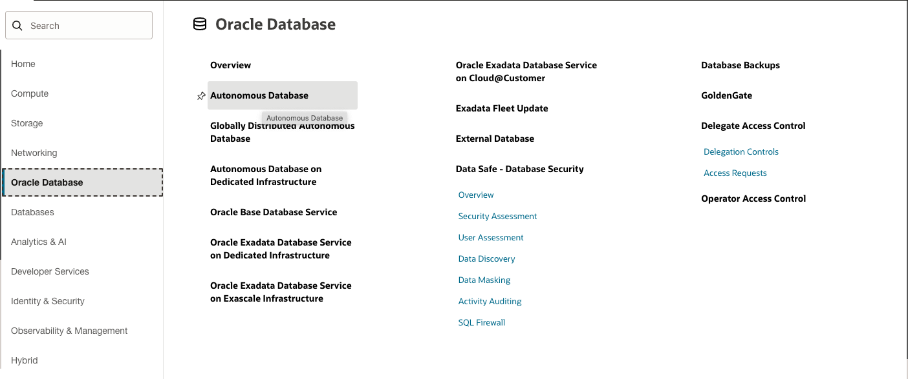
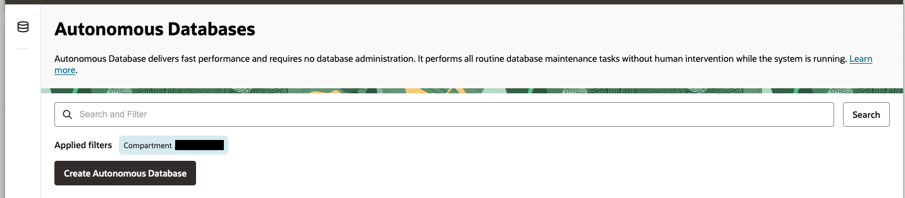
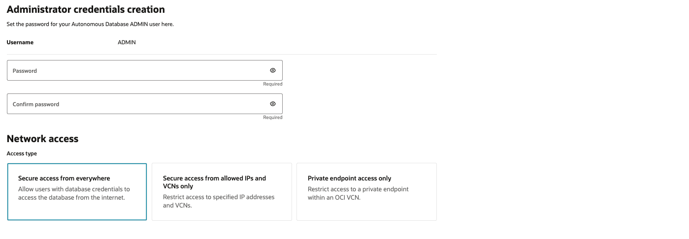
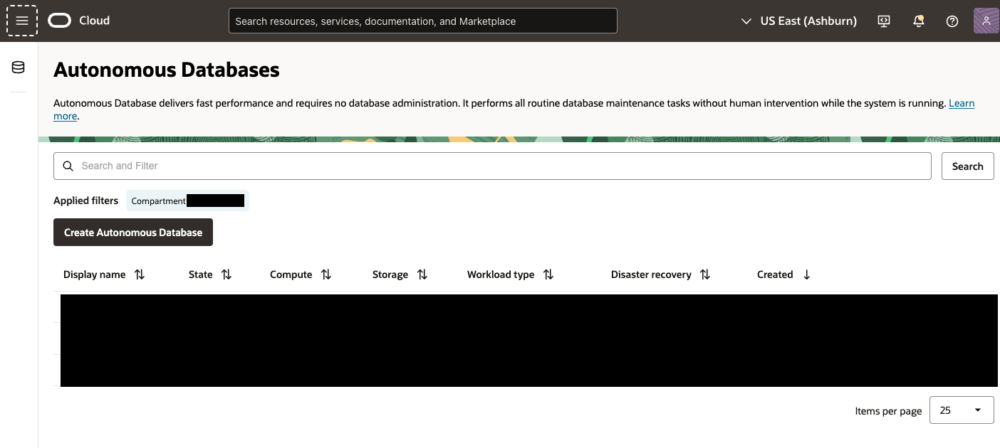
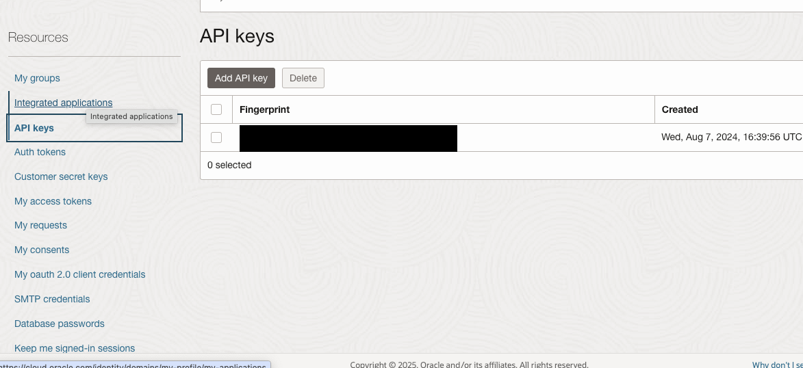
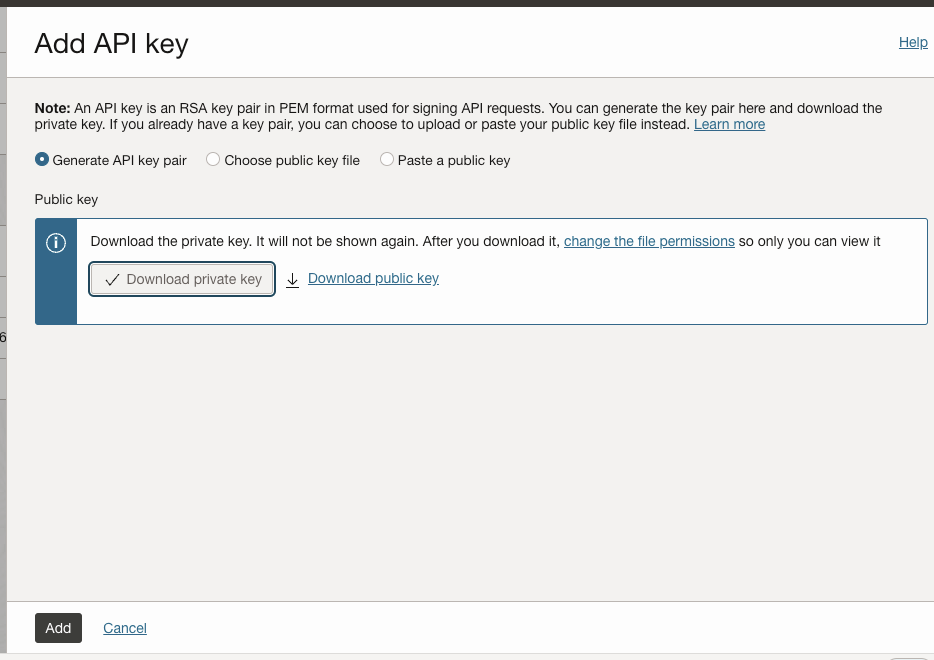
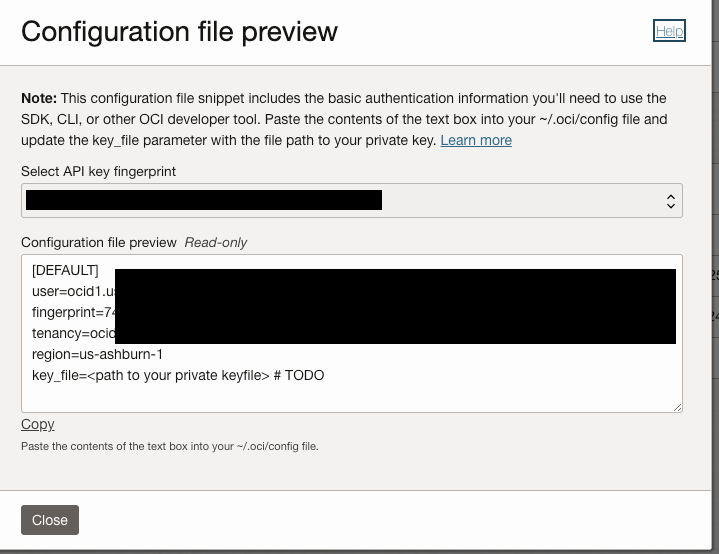
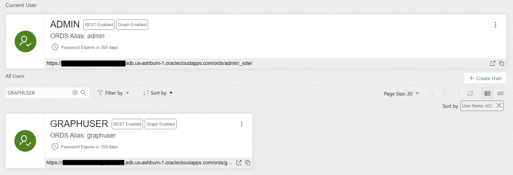

# Title of the Lab

## Introduction

*Describe the lab in one or two sentences, for example:* This lab walks you through the steps to ...

Estimated Time: -- minutes

### About <Product/Technology> (Optional)
Enter background information here about the technology/feature or product used in this lab - no need to repeat what you covered in the introduction. Keep this section fairly concise. If you find yourself needing more than two sections/paragraphs, please utilize the "Learn More" section.
## Introduction

In this lab you will create a database user with the appropriate roles and privileges required for using the graph capabilities of the Autonomous Database.

### Objectives

*List objectives for this lab using the format below*

In this lab, you will:
* Objective 1
* Objective 2
* Objective 3
 

Learn how to
-  create a database user with the appropriate roles and privileges required for accessing **Graph Studio**

### Prerequisites (Optional)

### Prerequisites

- The following lab requires an Autonomous Data Warehouse - Shared Infrastructure or Autonomous Transaction Processing - Shared Infrastructure account
 
This lab assumes you have:
* An Oracle Cloud account
* All previous labs successfully completed

*This is the "fold" - below items are collapsed by default*

## Task 1: Create Autonomous Database

This task involves creating Autonomous Database 23ai.

1. Locate Autonomous Databases under Oracle Databases. Click on Create Autonomous Database.

    
    

2. Provide information for Compartment, Display name, Database name. Also, choose workload type as Data Warehouse or Transaction Processing.
    
    
    
3. Choose database version as 23ai and disable Compute auto scaling.

    

4. Make sure Network Access is Secure access from everywhere, provide password, valid email ID and click the Create button.

    
    

5. After deployment is complete, check to make sure your autonomous database is available on the autonomous databases page with the specified compartment selected.

    

## Task 2: Create API Key in OCI

This task involves creating and API Key in OCI, the key will be used to implement Select AI.

1. Login the OCI Console and click the person icon on the top right.

    

2. Click API keys at the bottom left, then click the add API Key button.

    

3. Select the generate API Key Pair and click the add button. Make sure to download the private key.

    

4. Make note of the API configurations, it will be needed later.

    

## Task 3: Create the Graph User

1. Open the service detail page for your Autonomous Database instance in the OCI console.  

   Then click on **Database Actions** and select **View all database actions**. 

   

2. If necessary, login as the ADMIN user for your Autonomous Database instance.

    

3. Click  the **DATABASE USERS** tile under **Administration**.

   

4. Click the **+ Create User** icon.

    

5. Enter the required details, i.e. user name and password. Turn on the **Graph Enable** and **Web Access** radio buttons. And select a quota, e.g. **UNLIMITED**,  to allocate on the `DATA` tablespace.   

    >**Note:** The password should meet the following requirements:

    - The password must be between 12 and 30 characters long and must include at least one uppercase letter, one lowercase letter, and one numeric character.
    - The password cannot contain the username.
    - The password cannot contain the double quote (“) character.
    - The password must be different from the last 4 passwords used for this user.
    - The password must not be the same password that is set less than 24 hours ago.

    

    >**Note:** Please do not Graph Enable the ADMIN user and do not login to Graph Studio as the ADMIN user. The ADMIN user has additional privileges by default. 

    Click the **Create User** button at the bottom of the panel to create the user with the specified credentials.

    The newly created user will now be listed.

       

This concludes this lab. **You may now proceed to the next lab.**

## Acknowledgements

* **Author**
    * **Jadd Jennings**, Principal Cloud Architect, NACIE

* **Contributors**
    * **Kaushik Kundu**, Master Principal Cloud Architect, NACIE

* **Last Updated By/Date**
    * **Jadd Jennings**, Principal Cloud Architect, NACIE, April 2025