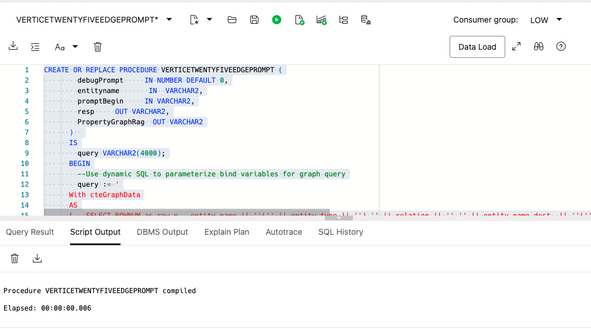
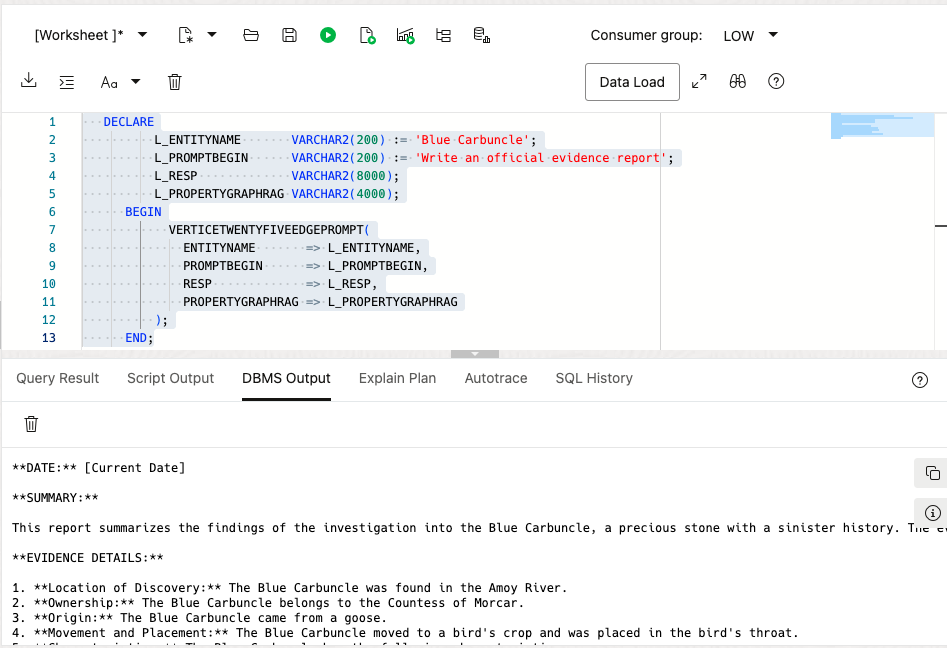
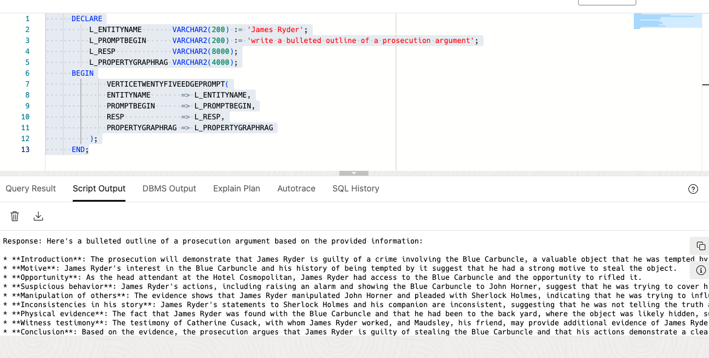
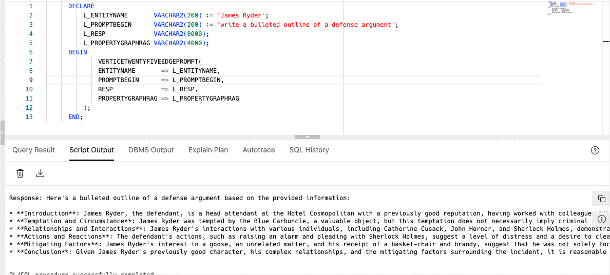
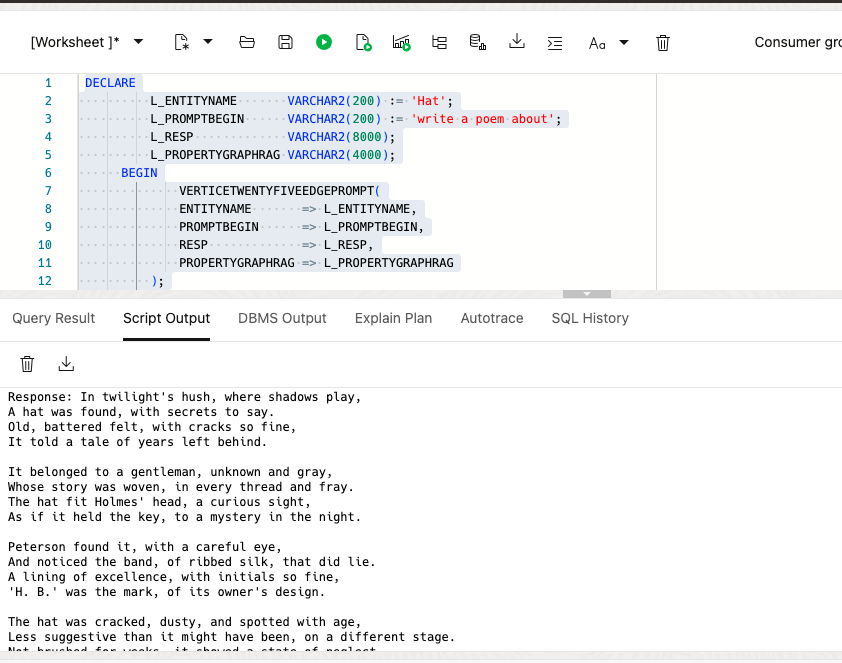

# Title of the Lab

## Introduction

In this lab you will create a PL/SQL stored procedure to serve as a utility for prompting the LLM. You will also run the stored procedure using different parameters to show retrieval augmented generation with property graph data.

Estimated Time: 30 minutes


### Objectives


In this lab, you will:
* Create PL/SQL Stored Procedure as prompting utility
* Run PL/SQL Stored Procedure for RAG use-cases


### Prerequisites  

This lab assumes you have:
* An Oracle Cloud account
* All previous labs successfully completed

 
## Task 1: Create Prompting Utility Scripts

 

1. Navigate to SQL Developer, either from Database Actions or from your Autonomous Database instance in the OCI console.  


   

   


2. Run the PL/SQL to a create stored procedure that will run basic queries on the property graph and use the results to send a prompt to the LLM.
   
    Paste the PL/SQL:

    ```text
        <copy>
         CREATE OR REPLACE PROCEDURE VERTICETWENTYFIVEEDGEPROMPT (
            debugPrompt     IN NUMBER DEFAULT 0,
            entityname       IN  VARCHAR2,
            promptBegin     IN VARCHAR2,
            resp     OUT VARCHAR2,
            PropertyGraphRag  OUT VARCHAR2
          )  
          IS
            query VARCHAR2(4000);
          BEGIN
            --Use dynamic SQL to parameterize bind variables for graph query
            query := '
          With cteGraphData
          AS
          (   SELECT ROWNUM as row_n,  entity_name || ''('' || entity_type || '') '' || relation || '' '' || entity_name_dest  || ''('' || entity_type_dest || '') ''  as INFORMATION
            FROM GRAPH_TABLE(PG_RAG_PGQL
                  MATCH (n IS Entity)-[e is Relation]->(n2 is Entity)
                  WHERE n.entity_name =:a
                  COLUMNS(n.entity_name as entity_name,n.entity_type as entity_type,e.relation,n2.entity_name as entity_name_dest,n2.entity_type as entity_type_dest))
              
              

          ),
          --pivot on 25 vertice edge relationships
          ctePivotGraphData AS
          (
          SELECT 
                  graphfact_1,  
                  graphfact_2,   
                  graphfact_3,  
                  graphfact_4,  
                  graphfact_5, 
                  graphfact_6,  
                  graphfact_7,  
                  graphfact_8,  
                  graphfact_9,  
                  graphfact_10,
                  graphfact_11,  
                  graphfact_12,   
                  graphfact_13,  
                  graphfact_14,  
                  graphfact_15, 
                  graphfact_16,  
                  graphfact_17,  
                  graphfact_18,  
                  graphfact_19,  
                  graphfact_20,
                  graphfact_21, 
                  graphfact_22,  
                  graphfact_23,  
                  graphfact_24,  
                  graphfact_25 
          FROM
          (SELECT 
                  row_n,
                  INFORMATION 
          FROM cteGraphData)
          PIVOT
          (max(INFORMATION) 
          FOR row_n IN (''1'' AS graphfact_1,''2'' AS graphfact_2, ''3'' AS graphfact_3, ''4'' AS graphfact_4,      ''5'' AS graphfact_5, ''6'' AS graphfact_6, ''7'' AS graphfact_7, ''8'' AS graphfact_8, ''9'' AS graphfact_9, ''10'' AS graphfact_10,
                      ''11'' AS graphfact_11,''12'' AS graphfact_12, ''13'' AS graphfact_13, ''14'' AS graphfact_14, ''15'' AS graphfact_15
                      , ''16'' AS graphfact_16, ''17'' AS graphfact_17, ''18'' AS graphfact_18, ''19'' AS graphfact_19, ''20'' AS graphfact_20, ''21'' AS graphfact_21, ''22'' AS graphfact_22, ''23'' AS graphfact_23, ''24'' AS graphfact_24, ''25'' AS graphfact_25
                      ) 
          )
          )
          --combined columns into one
          SELECT
                     REPLACE(JSON_OBJECT (

                                  graphfact_1, 
                                  graphfact_2, 
                                  graphfact_3, 
                                  graphfact_4,                         
                                  graphfact_5, 
                                  graphfact_6,
                                  graphfact_7, 
                                  graphfact_8,                         
                                  graphfact_9, 
                                  graphfact_10,
                                  graphfact_11, 
                                  graphfact_12, 
                                  graphfact_13, 
                                  graphfact_14,                         
                                  graphfact_15, 
                                  graphfact_16,
                                  graphfact_17, 
                                  graphfact_18,                         
                                  graphfact_19, 
                                  graphfact_20, 
                                  graphfact_21,
                                  graphfact_22, 
                                  graphfact_23,                         
                                  graphfact_24, 
                                  graphfact_25
                              ),''graphfact_'','''') as result
      from ctePivotGraphData';
          
          EXECUTE IMMEDIATE query INTO PropertyGraphRag USING entityname;
          
          IF debugPrompt = 1 THEN
              DBMS_OUTPUT.PUT_LINE(promptBegin || '  with the following INFORMATION  ' || PropertyGraphRag);
          END IF;

          --send prompt to llm with information from property graph
          SELECT DBMS_CLOUD_AI.GENERATE(prompt       => promptBegin || '  with the following INFORMATION  ' || PropertyGraphRag ,
                                        profile_name => 'GENAI_GRAPH',
                                        action       => 'chat')
          INTO resp
          FROM dual;

            --output LLM response
            DBMS_OUTPUT.PUT_LINE('Response: ' || resp);
          END;

        </copy>
    ```

   

## Task 2: Run Stored Procedure for Property Graph Rag

1. Create Evidence report using property graph query on the Blue Carbuncle Vertice.

    Paste the PL/SQL:

    ```text
        <copy>
            DECLARE
              L_ENTITYNAME       VARCHAR2(200) := 'Blue Carbuncle';
              L_PROMPTBEGIN      VARCHAR2(200) := 'Write an official evidence report';
              L_RESP             VARCHAR2(8000);
              L_PROPERTYGRAPHRAG VARCHAR2(4000);
          BEGIN
                VERTICETWENTYFIVEEDGEPROMPT(
                  ENTITYNAME       => L_ENTITYNAME,
                  PROMPTBEGIN      => L_PROMPTBEGIN,
                  RESP             => L_RESP,
                  PROPERTYGRAPHRAG => L_PROPERTYGRAPHRAG
              );
          END;
        </copy>
    ```
    

   


2. Write a prosecution argument outline against James Ryder.

    Paste the PL/SQL:

    ```text
        <copy>
          DECLARE
              L_ENTITYNAME       VARCHAR2(200) := 'James Ryder';
              L_PROMPTBEGIN      VARCHAR2(200) := 'write a bulleted outline of a prosecution argument';
              L_RESP             VARCHAR2(8000);
              L_PROPERTYGRAPHRAG VARCHAR2(4000);
          BEGIN
                  VERTICETWENTYFIVEEDGEPROMPT(
                  ENTITYNAME       => L_ENTITYNAME,
                  PROMPTBEGIN      => L_PROMPTBEGIN,
                  RESP             => L_RESP,
                  PROPERTYGRAPHRAG => L_PROPERTYGRAPHRAG
              );
          END;
        </copy>
    ```


   

3. Write a defense argument outline for James Ryder.

    Paste the PL/SQL:

    ```text
        <copy>
          DECLARE
              L_ENTITYNAME       VARCHAR2(200) := 'James Ryder';
              L_PROMPTBEGIN      VARCHAR2(200) := 'write a bulleted outline of a defense argument';
              L_RESP             VARCHAR2(8000);
              L_PROPERTYGRAPHRAG VARCHAR2(4000);
          BEGIN
                  VERTICETWENTYFIVEEDGEPROMPT(
                  ENTITYNAME       => L_ENTITYNAME,
                  PROMPTBEGIN      => L_PROMPTBEGIN,
                  RESP             => L_RESP,
                  PROPERTYGRAPHRAG => L_PROPERTYGRAPHRAG
              );
          END;
        </copy>
    ```

   


4. Write poem using property graph query on Hat.

    Paste the PL/SQL:

    ```text
        <copy>
          DECLARE
              L_ENTITYNAME       VARCHAR2(200) := 'Hat';
              L_PROMPTBEGIN      VARCHAR2(200) := 'write a poem about';
              L_RESP             VARCHAR2(8000);
              L_PROPERTYGRAPHRAG VARCHAR2(4000);
          BEGIN
                  VERTICETWENTYFIVEEDGEPROMPT(
                  ENTITYNAME       => L_ENTITYNAME,
                  PROMPTBEGIN      => L_PROMPTBEGIN,
                  RESP             => L_RESP,
                  PROPERTYGRAPHRAG => L_PROPERTYGRAPHRAG
              );
          END;
        </copy>
    ```


   


## Learn More

 
## Acknowledgements
* **Author** - <Name, Title, Group>
* **Contributors** -  <Name, Group> -- optional
* **Last Updated By/Date** - <Name, Month Year>
