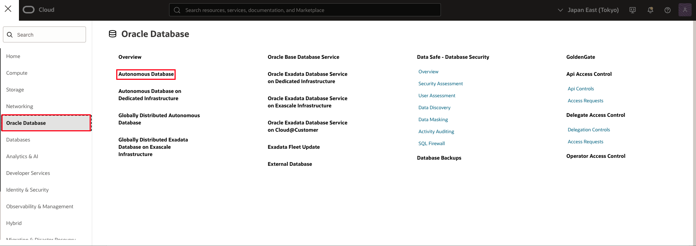
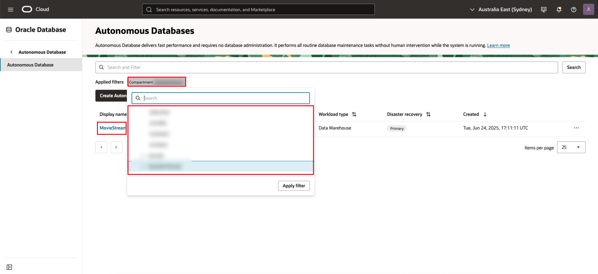

<!--
    {
        "name":"Create Graph",
        "description":"Login to Graph Studio and create a moviestream graph for when running the tenancy the lab."
    }
-->

# Create a Graph

## Introduction

In this lab you will create a graph from the `MOVIE, CUSTOMER\_SAMPLE`, and `WATCHED` tables using the Graph Studio guided user experience.

Estimated Time: 15 minutes.

### Objectives

Learn how to
- Use Graph Studio to create a graph from existing tables or views.

### Prerequisites

- The following lab requires an Autonomous Database Serverless instance.
- And that the Graph-enabled user exists. That is, a database user with the correct roles and privileges exists.

## Task 1: Access the Autonomous Database 

1. Click the **Navigation Menu** in the upper left, navigate to **Oracle Database**, and select **Autonomous Database**.

     

2. Select the compartment provided on **View Login Info**, and click on the **Display Name** for the **Autonomous Database**. 

     

## Task 2: Log into Graph Studio

## Task 3: Create a Movie Recommendations graph

## Acknowledgements
* **Author** - Melli Annamalai, Product Manager, Oracle Spatial and Graph
* **Contributors** -  Jayant Sharma
* **Last Updated By/Date** - Ramu Murakami Gutierrez, Product Manager, Oracle Spatial and Graph, February 2023
