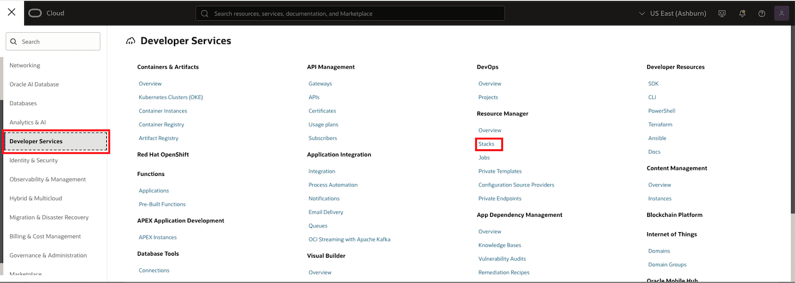
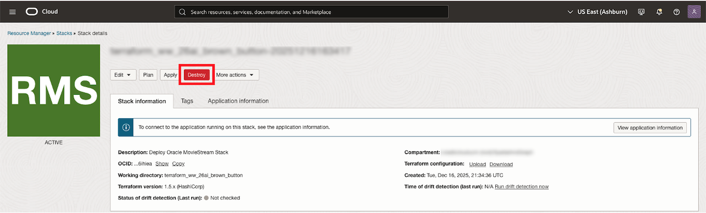
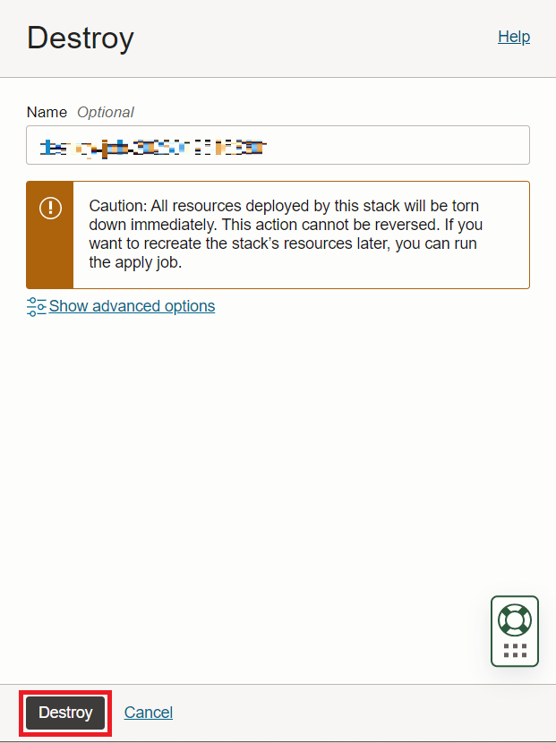
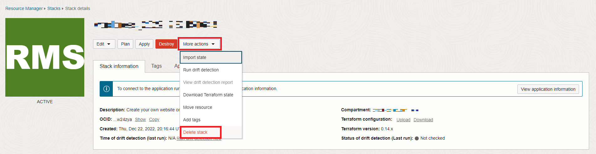

# Clean-up

## Introduction

In this lab you will destroy the environment created by the stack.

Estimated Time: 5 minutes.

Watch the video below for a quick walk-through of the lab.
[Clean up](videohub:1_uf4pv1t0)

### Objectives

Learn how to
- Destroy the job created by the stack
- Delete the Stack

## Task 1: Destroy job created by Stack

1. Click the navigation menu in the upper left to show navigation choices. Select **Developer Services** and then click on **Stacks**.

  

2. Click on your Stack, and click on **Destroy** to destroy the resources created when running the stack.

  

  Click **Destroy** in the pop up window. You will be taken to a Job Details page with an initial status shown in orange. The icon will become green once the job has successfully completed.

  

## Task 2: Delete Stack

1. Click on **Stack Details**.

  

2. Click on **More actions**, and **Delete Stack**. Then select **Delete** to permanently delete the Stack.

    

    After this your Autonomous database containing the graph user and the datasets will be deleted.

    This concludes this lab. Thank you!

## Acknowledgements
* **Author** - Ramu Murakami Gutierrez, Product Management
* **Contributors** - Ramu Murakami Gutierrez, Product Management
* **Last Updated By/Date** - Ramu Murakami Gutierrez, Product Management, February 2023  
