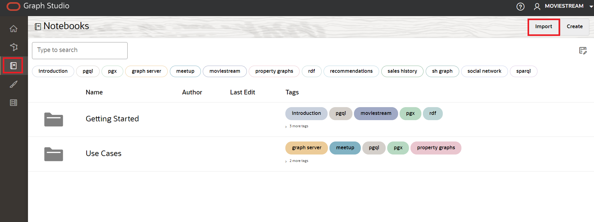
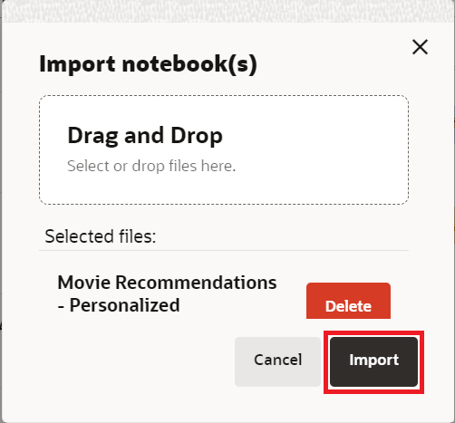
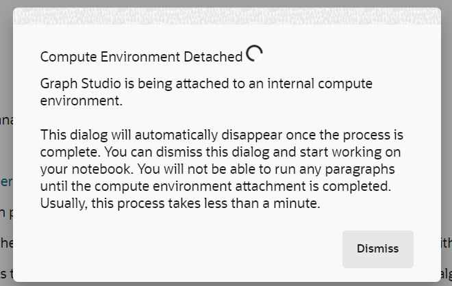
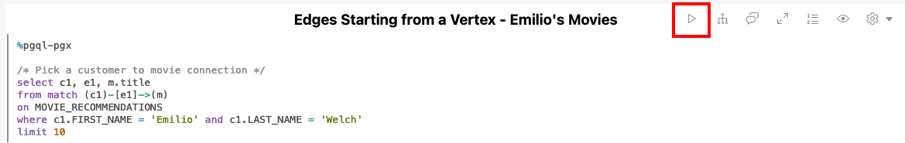
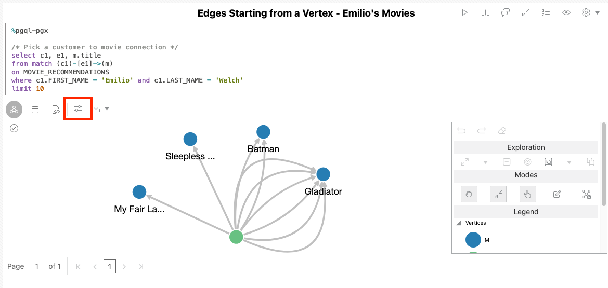
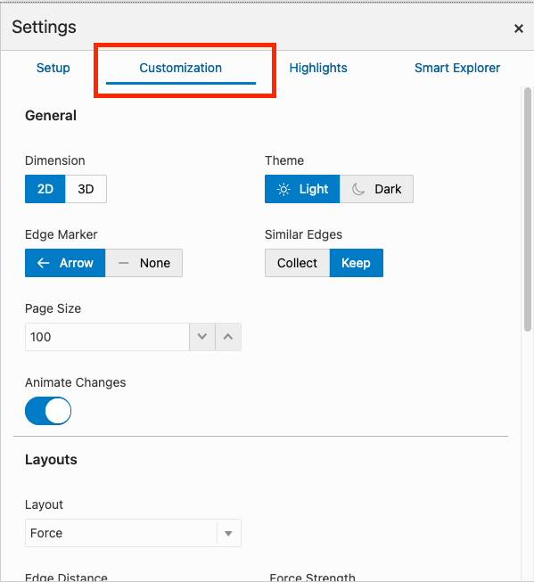

# Graph Studio: Query, visualize, and analyze a graph using PGQL and Python

## Introduction

In this lab you will query the newly create graph (that is, `moviestream`) in PGQL paragraphs of a notebook.

Estimated Time: 30 minutes.

### Objectives

Learn how to
- Import a notebook
- Create a notebook and add paragraphs
- use Graph Studio notebooks and PGQL and Python paragraphs to query, analyze, and visualize a graph.

### Prerequisites

- Earlier labs of this workshop. That is, the graph user exists and you have logged into Graph Studio.

## Task 1: Import the Notebook

 You can import a notebook that has the graph queries and analytics. Each paragraph in the notebook has an explanation.  You can review the explanation, and then run the query or analytics algorithm.   

  [Click here to download the notebook](files/movie_recommendations_psalsa.dsnb) and save it to a folder on your local computer.  This notebook includes graph queries and analytics for the MOVIE_RECOMMENDATIONS graph.

 1. Import a notebook by clicking on the notebook icon on the left, and then clicking on the **Import** icon on the far right.

    

 Click on the + sign and navigate to the folder where you just downloaded the notebook.  Select the notebook and click **Import**.

    

 A dialog pops up named **Environment Attaching"**. It will disappear when the compute environment finishes attaching, usuallly in less than one minute. Or you can click **Dismiss** to close the dialog and start working on your environment. Note that you will not be able to run any paragraph until the environment finishes attaching.

    

 2. Review the description before each paragraph.   Review the graph queries and analytics.   You can then run the query by clicking on the triangle on the top right if you would like to do so.  Below is an example of running a query in a paragraph.  

     

 You can click on the **Settings** icon to change the visualization parameters.

     

     

## Acknowledgements
* **Author** - Melli Annamalai, Product Manager, Oracle Spatial and Graph
* **Contributors** -  Jayant Sharma
* **Last Updated By/Date** - Ramu Murakami Gutierrez, Product Manager, Oracle Spatial and Graph, February 2023
