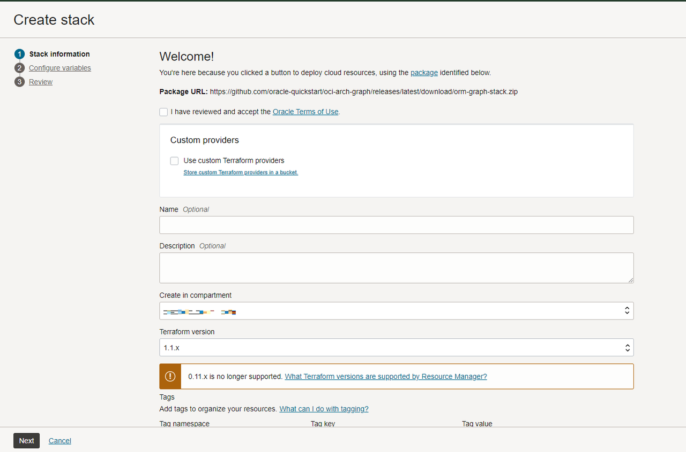
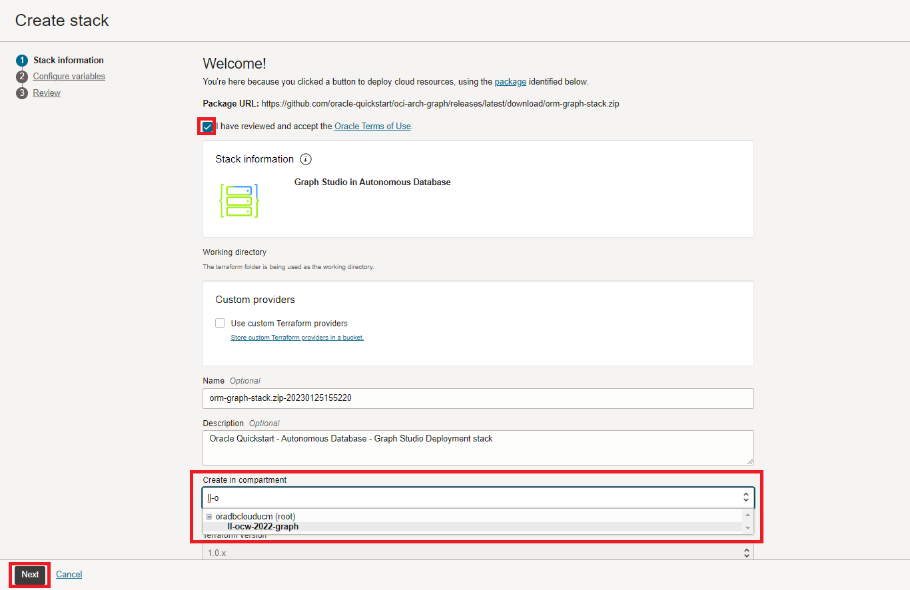
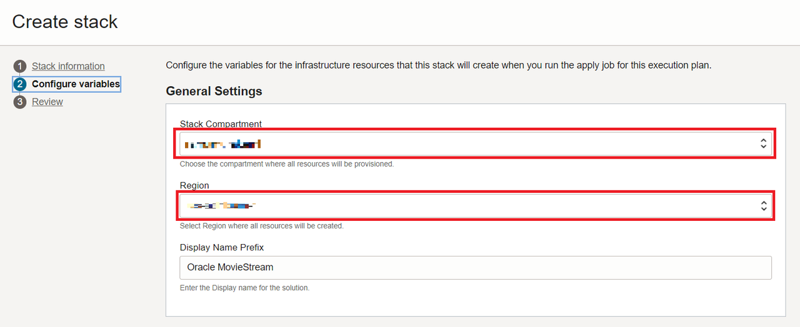
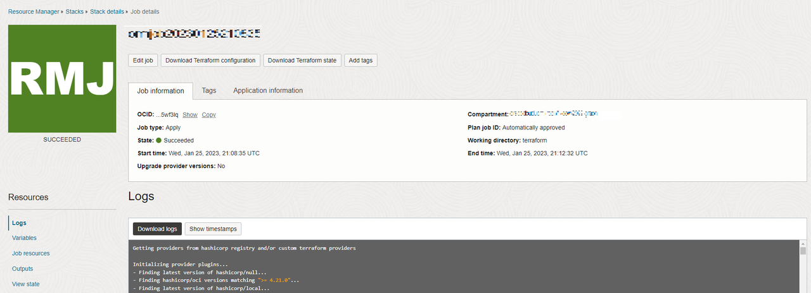

<!--
    {
        "name":"Setup: Run Stack",
        "description":"Running a stack that creates an autonomous ai database, creates graph user and loads the moviestream dataset "
    }
-->

# Setup: Run Stack

## Introduction

In this lab you will create a stack that will run a terraform script to generate an Autonomous AI Database, create a graph user, and upload the dataset that will be used.

Estimated Time: 5 minutes.

### Objectives

Learn how to

- Run the stack to create an Autonomous AI Database, graph user, and upload dataset
- Login to Graph Studio

## Task 1: Create OCI compartment

## Task 2: Run Stack

The instructions below will show you how to run a stack that will automatically create an Autonomous AI Database containing a graph user and the dataset needed for the property graph queries.

1. Login to the Oracle Cloud.

2. Once logged in, use this [link](https://cloud.oracle.com/resourcemanager/stacks/create?zipUrl=https://objectstorage.us-ashburn-1.oraclecloud.com/p/35oekyIFM-7s0Y5EoiBNStU3qU3LD3fJnTf0wxDl4d_eZUeGug_VEwlkbZSgkeCq/n/oradbclouducm/b/recommend_movies/o/terraform_ww_26ai_brown_button.zip) to create and run the Stack.

  > Note: the link will open in a new tab or window.

3. You will be directed to this page:

  

4.  Check the "I have reviewed and accept the Oracle Terms of Use" box and choose your **compartment**. Leave the rest as default. Click **Next**.

  

5. Select the **compartment** to create the Autonomous AI Database and the **region** you are currently creating the stack on to create all resources. Click **Next**. After that you will be taken to the Review page, click **Create**.

  

6. You will be taken to a Job Details page with an initial status shown in orange. The icon will become green once the job has successfully completed.

    

## Acknowledgements

- **Author** - Jayant Sharma, Ramu Murakami Gutierrez, Product Management
- **Contributors** -  Rahul Tasker, Jayant Sharma, Ramu Murakami Gutierrez, Product Management
- **Last Updated By/Date** - Denise Myrick, Product Manager, December 2025
