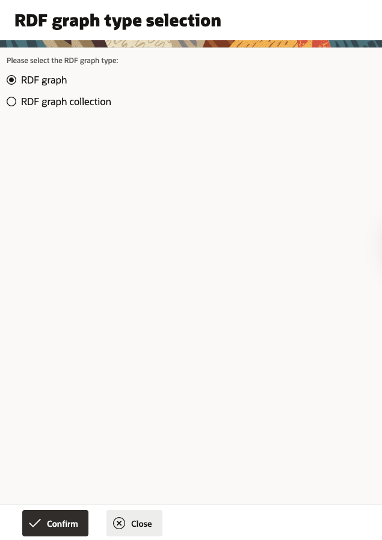
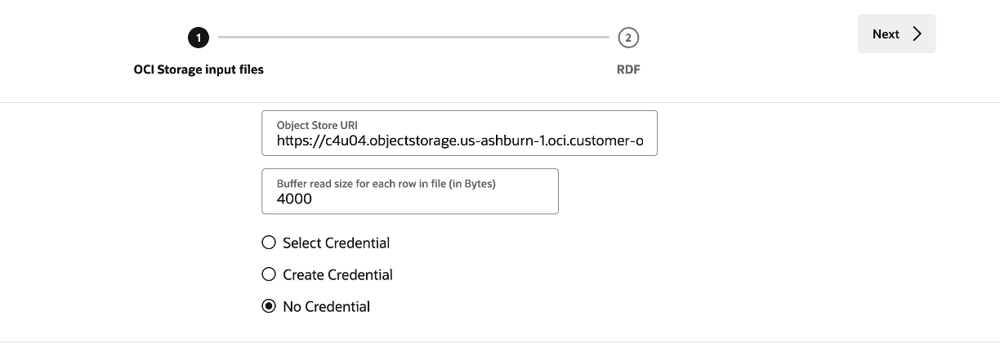
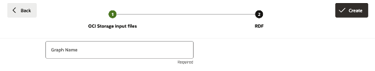
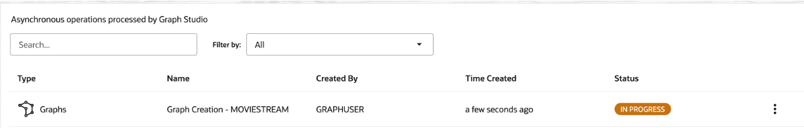
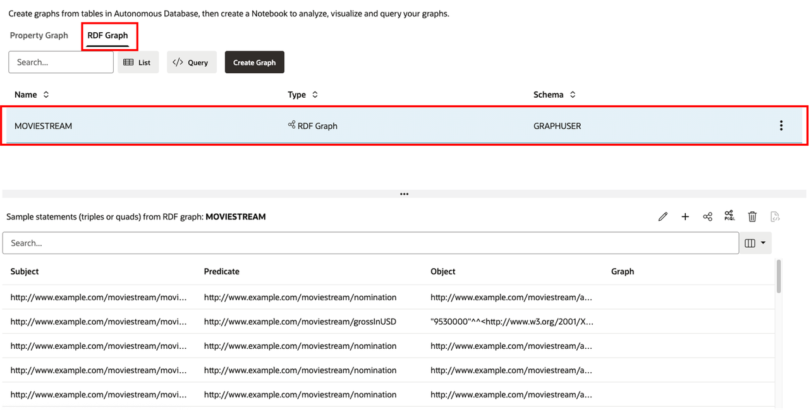
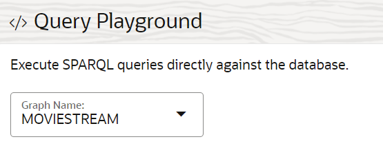
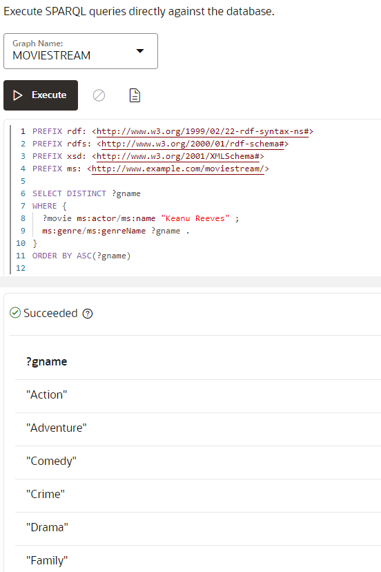

# Create and Validate an RDF Graph User in Graph Studio

## Introduction
In this lab, we will create and validate an RDF Graph User in Graph Studio.

Estimated Time: 10 minutes

### Objectives
- Create a Graph User to Access RDF in Graph Studio
- Enable RDF for the Graph User
- Create RDF Graph in Graph Studio
- Validate the RDF Graph
- Execute SPARQL Queries on the Playground Page

### Prerequisites
This lab assumes you have:
  - An Oracle Free Tier or Paid Cloud Account
  - You have completed:
      - Lab 1: Provision an ADB Instance

## Task 1: Create a graph user 
[](include:adb-create-user.md)

## Task 2: Access Graph Studio
[](include:adb-goto-graph-studio.md)

## Task 3: Create RDF Graph

1. Click on Graphs on the navigation menu from the left to navigate the Graphs page.

  

2. Select **RDF GRAPH** as the graph type, and click on **Create Graph**.

  

3. **RDF Graph** will be selected by default. Click **Confirm**

  

4. Create RDF Graph Wizard opens as shown:

  

5. Enter the OCI Object Storage URI path:

    ```
      <copy>https://c4u04.objectstorage.us-ashburn-1.oci.customer-oci.com/p/EcTjWk2IuZPZeNnD_fYMcgUhdNDIDA6rt9gaFj_WZMiL7VvxPBNMY60837hu5hga/n/c4u04/b/livelabsfiles/o/data-management-library-files/moviestream_rdf.nt
    ```

6. Select **No Credential** and click **Next**.

7. Enter **"MOVIESTREAM"** as the graph name. Then click **Create**.

  

7. Click on **Create**.

    The RDF graph creation job will be initiated. Since the RDF file contains 139461 records, the process may take 3 to 4 minutes. You can monitor the job on the **Jobs** page in Graph Studio.

  

## Task 3: Validate the RDF graph

You can explore and validate the newly created RDF graph on the **Graphs** page in Graph Studio as shown:

1. Navigate to the **Graphs** page and set the **Graph Type** to RDF using the dropdown menu. Select the MOVIESTREAM graph row from the available RDF graphs, sample statements (triples or quads should appear), use the three horizontal dots to resize these statements, and bring them into view. Sample statements (triples or quads) from the RDF Graph are displayed on the bottom panel as shown:

  

## Task 4: Execute SPARQL queries on the playground page

You can execute SPARQL Queries on the RDF Graph from the **Query Playground** page.

1. On the **Graphs** page select **RDF** as the graph type and click the **Query** button to navigate to the Query Playground page.

  

2. If you have multiple graphs in graph studio, you will have to choose the graph to query. In the Graph Name menu, select the MOVIESTREAM from the dropdown menu.

  

3. Execute the following query for the RDF Graph.

    ```
    <copy>PREFIX rdf: &lthttp://www.w3.org/1999/02/22-rdf-syntax-ns#&gt
    PREFIX rdfs: &lthttp://www.w3.org/2000/01/rdf-schema#&gt
    PREFIX xsd: &lthttp://www.w3.org/2001/XMLSchema#&gt
    PREFIX ms: &lthttp://www.example.com/moviestream/&gt

    SELECT DISTINCT ?gname
    WHERE {
      ?movie ms:actor/ms:name "Keanu Reeves" ;
      ms:genre/ms:genreName ?gname .
    }
    ORDER BY ASC(?gname)<copy>
    ```

      When the query is executed successfully the query output will be displayed as shown:

  

This concludes this lab. *You may now proceed to the next lab.*

## Acknowledgements

- **Author** -  Malia German, Ethan Shmargad, Matthew McDaniel Solution Engineers, Ramu Murakami Gutierrez Product Manager
- **Technical Contributor** -  Melliyal Annamalai Distinguished Product Manager, Joao Paiva Consulting Member of Technical Staff, Lavanya Jayapalan Principal User Assistance Developer
- **Last Updated By/Date** - Ramu Murakami Gutierrez Product Manager, June 2023
