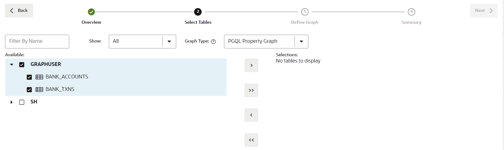
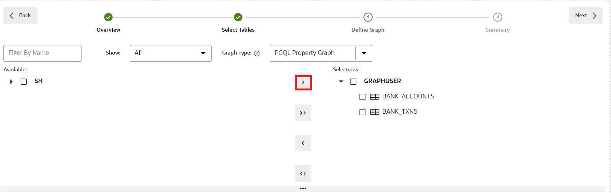
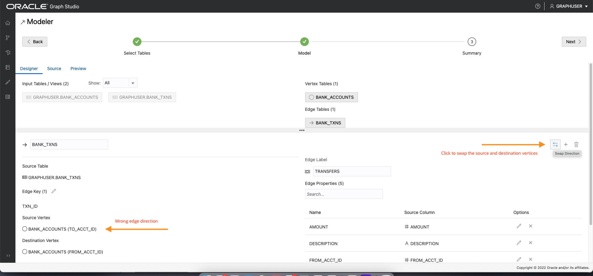
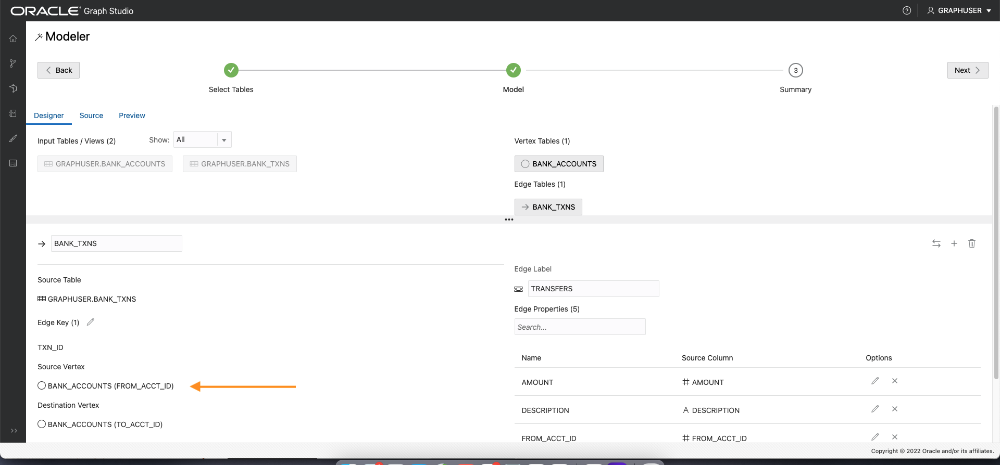
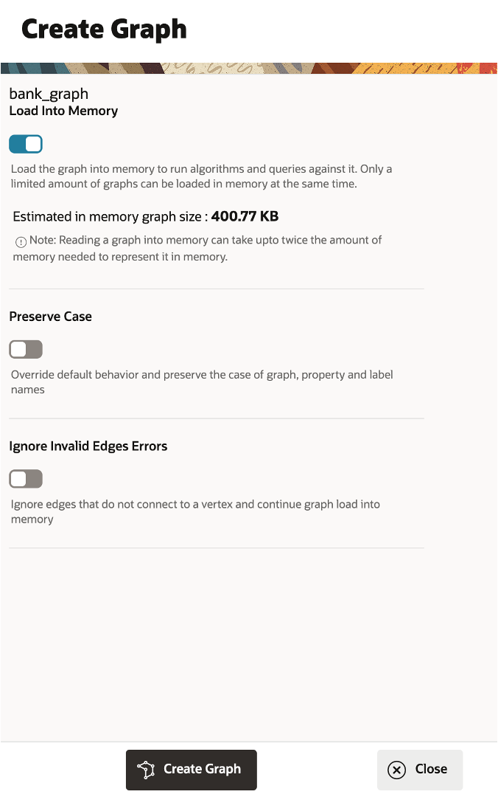

# Graph Studio: Create a graph using PGQL CREATE PROPERTY GRAPH statement

## Introduction

In this lab you will create a graph from the `bank_accounts` and `bank_txns` tables using Graph Studio and the CREATE PROPERTY GRAPH statement.

<!-- COMMENTED THE FOLLOWING OUT FOR DATABSE WORLD:
The following video shows the steps you will execute in this lab.

[](youtube:5g9i9HA_cn0) Graph Studio: Create a graph. -->

Estimated Time: 15 minutes.

Watch the video below for a quick walk through of the lab.

[](youtube:tNPY4xmVFMk)

### Objectives

Learn how to
- use Graph Studio and PGQL DDL (that is, CREATE PROPERTY GRAPH statement) to model and create a graph from existing tables or views.

### Prerequisites

- The following lab requires an Autonomous Database - Shared Infrastructure account.
- And that the Graph-enabled user (`GRAPHUSER`) exists. That is, a database user with the correct roles and privileges exists.

## Task 1: Access the Autonomous Database 

1. Click the **Navigation Menu** in the upper left, navigate to **Oracle Database**, and select **Autonomous Database**.

     

2. Select the compartment provided on **View Login Info**, and click on the **Display Name** for the **Autonomous Database**. 

     

## Task 2: Log into Graph Studio

Graph Studio is a feature of Autonomous Database. It is available as an option on the Database Actions Launchpad. You need a     graph-enabled user to log into Graph Studio. When you created the MOVIESTREAM user in Lab 2, you had graph-enabled that user.

1. In your **Autonomous Database Details page** page, click the **Database Actions**.

        

2. On the Database Actions panel, click **Graph Studio**.

    

3. Log in to Graph Studio. Use the credentials for the database user MOVIESTREAM.

    

    Graph Studio consists of a set of pages accessed from the menu on the left.

    The Home icon  takes you to the Home page.  
    The Models icon  takes you to the Models page where you start modeling your existing tables and views as a graph and then create, or instantiate, a graph.  
    The Graph page  lists existing graphs for use in notebooks.  
    The Notebook page  lists existing notebooks and lets you create a new one.  
    The Jobs page  lists the status of background jobs and lets you view the associated log if any.  


## Task 2: Create a graph of accounts and transactions

1. Click the **Graph** icon to navigate to create your graph.  
    Then click **Create Graph**.  
   
      

2. Enter `bank_graph` as the graph name, then click **next**. The description and tags fields are optional.   
    That graph name is used throughout the next lab.  
    Do not enter a different name because then the queries and code snippets in the next lab will fail.  
    
    

3. Expand **GRAPHUSER** and select the `BANK_ACCOUNTS` and `BANK_TXNS` tables. 

    

4. Move them to the right, that is, click the first icon on the shuttle control.   

    

5. Click **Next**. We will edit and update this graph to add an edge and a vertex label.  

    The suggested graph has the `BANK_ACCOUNTS` as a vertex table since there are foreign key constraints specified on `BANK_TXNS` that reference it.   

    And `BANK_TXNS` is a suggested edge table.

        

6. Now let's change the default Vertex and Edge labels.  

    Click the `BANK_ACCOUNTS` vertex table. Change the Vertex Label to **ACCOUNTS**. Then click the checkmark to confirm label and save the update.  

      

    Click the `BANK_TXNS` edge table and rename the Edge Label from `BANK_TXNS` to **TRANSFERS**. Then click the checkmark to confirm label and save the update. 

      

    This is **important** because we will use these edge labels in the next lab of this workshop when querying the graph. Click **Next**.   

<!---
6.  Since these are directed edges, a best practice is verifying that the direction is correct.  
    In this instance we want to **confirm** that the direction is from `from_acct_id` to `to_acct_id`.  

    >**Note:** The `Source Vertex` and `Destination Vertex` information on the left.  

      

    **Notice** that the direction is wrong. The Source Key is `to_acct_id` instead of what we want, which is `from_acct_id`.  

    Click the swap edge icon on the right to swap the source and destination vertices and hence reverse the edge direction.  

    >**Note:** The `Source Vertex` is now the correct one, i.e. the `FROM_ACCT_ID`.

    

7. Click the **Source** tab to verify that the edge direction, and hence the generated CREATE PROPERTY GRAPH statement, is correct.

      


  **An alternate approach:** In the earlier Step 5 you could have just updated the CREATE PROPERTY GRAPH statement and saved the updates. That is, you could have just replaced the existing statement with the following one which specifies that the SOURCE KEY is  `from_acct_id`  and the DESTINATION KEY is `to_acct_id`.  

    ```
    -- This is not required if you used swap edge in UI to fix the edge direction.
    -- This is only to illustrate an alternate approach.
    <copy>
    CREATE PROPERTY GRAPH bank_graph
        VERTEX TABLES (
            BANK_ACCOUNTS as ACCOUNTS
            KEY (ACCT_ID)
            LABEL ACCOUNTS
            PROPERTIES (ACCT_ID, NAME)
        )
        EDGE TABLES (
            BANK_TXNS
            KEY (FROM_ACCT_ID, TO_ACCT_ID, AMOUNT)
            SOURCE KEY (FROM_ACCT_ID) REFERENCES ACCOUNTS
            DESTINATION KEY (TO_ACCT_ID) REFERENCES ACCOUNTS
            LABEL TRANSFERS
            PROPERTIES (AMOUNT, DESCRIPTION)
        )
    </copy>
    ```

     

   **Important:** Click the **Save** (floppy disk icon) to commit the changes.
--->

7. In the Summary step, click on **Create Graph**. This will open a Create Graph tab, click on **Create Graph. 

      

    This will open a Create Graph tab, click on **Create Graph**. 

    

    After this, you will be taken to the Jobs page where the graph will be create it. Refresh the page to see how the status of the Graph is doing. 

    
    This concludes this lab. **You may now proceed to the next lab.**

## Acknowledgements
* **Author** - Jayant Sharma, Product Management
* **Contributors** -  Jayant Sharma, Product Management
* **Last Updated By/Date** - Ramu Murakami Gutierrez, Product Manager, June 2023

