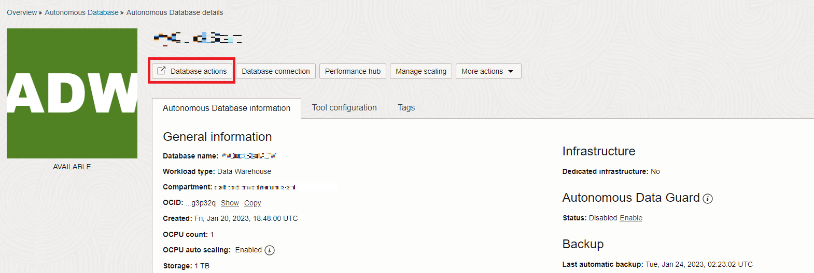
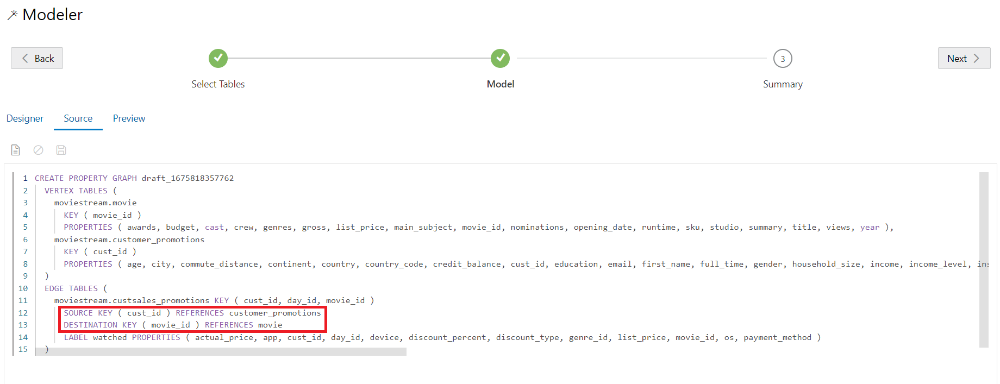

# Create Graph

## Introduction

In this lab you will create a graph from the `MOVIE, CUSTOMER\_PROMOTIONS`, and `CUSTSALES\_PROMOTIONS` tables using Graph Studio and the CREATE PROPERTY GRAPH statement.

Estimated Time: 15 minutes.

### Objectives

Learn how to
- use Graph Studio and PGQL DDL (that is, CREATE PROPERTY GRAPH statement) to model and create a graph from existing tables or views.

### Prerequisites

- The following lab requires an Autonomous Database - Shared Infrastructure account.
- And that the Graph-enabled user exists. That is, a database user with the correct roles and privileges exists.

## Task 1: Access the Autonomous Database 

1. Click the **Navigation Menu** in the upper left, navigate to **Oracle Database**, and select **Autonomous Database**.

     

2. Select the compartment provided on **View Login Info**, and click on the **Display Name** for the **Autonomous Database**. 

     

## Task 2: Log into Graph Studio

Graph Studio is a feature of Autonomous Database. It is available as an option on the Database Actions Launchpad. You need a graph-enabled user to log into Graph Studio. In this workshop, the graph user has already been created for you.

The graph user credentials are: 

**Username:** 


     <copy>MOVIESTREAM</copy>


**password:**


     <copy>watchS0meMovies#</copy>


1. In your **Autonomous Database Details page** page, click the **Database Actions**.

        

2. On the Database Actions panel, click **Graph Studio**.

    

3. Log in to Graph Studio. Use the credentials for the graph user "MOVIESTREAM".

    

## Task 3: Create Graph

1. Click the **Graph** icon to navigate to create your graph.  
    Then click **Create**.  
      

2. Then select the `CUSTOMER_PROMOTIONS`, `CUSTSALES_PROMOTIONS` and `MOVIE` tables.

    Click to expand list of available items and then select the tables

    

3. Move them to the right, that is, click the first icon on the shuttle control.   

    

4.  Click **Next** to get a suggested model. We will edit and update this model to add an edge and a vertex label.  

    The suggested model has the `MOVIE` and `CUSTOMER_PROMOTIONS`, as a vertex table since there are foreign key constraints specified on `CUSTSALES_PROMOTIONS` that reference it.   

    And `CUSTSALES_PROMOTIONS` is a suggested edge table.

        


5.  Now let's change the default Edge label.   

    Click the `MOVIE` edge table and rename the Edge Label from `MOVIE` to **WATCHED**.  
    Then click outside the input box on confirm label and save the update.  

      

    This is **important** because we will use these edge labels in the next lab of this workshop when querying the graph.  

6. Click the **Source** tab to verify that the edge direction, and hence the generated CREATE PROPERTY GRAPH statement, is correct.

      

<!---
  **An alternate approach:** In the earlier Step 5 you could have just updated the CREATE PROPERTY GRAPH statement and saved the updates. That is, you could have just replaced the existing statement with the following one which specifies that the SOURCE KEY is  `from_acct_id`  and the DESTINATION KEY is `to_acct_id`.  

    ```
    -- This is not required if you used swap edge in UI to fix the edge direction.
    -- This is only to illustrate an alternate approach.
    <copy>
    CREATE PROPERTY GRAPH bank_graph
        VERTEX TABLES (
            BANK_ACCOUNTS as ACCOUNTS
            KEY (ACCT_ID)
            LABEL ACCOUNTS
            PROPERTIES (ACCT_ID, NAME)
        )
        EDGE TABLES (
            BANK_TXNS
            KEY (FROM_ACCT_ID, TO_ACCT_ID, AMOUNT)
            SOURCE KEY (FROM_ACCT_ID) REFERENCES ACCOUNTS
            DESTINATION KEY (TO_ACCT_ID) REFERENCES ACCOUNTS
            LABEL TRANSFERS
            PROPERTIES (AMOUNT, DESCRIPTION)
        )
    </copy>
    ```

     

   **Important:** Click the **Save** (floppy disk icon) to commit the changes.
--->

8. Click **Next** and then click **Create Graph** to move on to the next step in the flow.   

    Enter `MOVIE_RECOMMENDATIONS` as the graph name.  
    That graph name is used throughout the next lab.  
    Do not enter a different name because then the queries and code snippets in the next lab will fail.  

    Enter a model name (for example, `movie_recommendations_model`), and other optional information and then click Create.
  
    

9. Graph Studio modeler will now save the metadata and start a job to create the graph.  
    The Jobs page shows the status of this job.

      

    You can then interactively query and visualize the graph in a notebook after it's loaded into memory.

   <!---
   ## Task 2: Load a graph into memory

   The MOVIE_RECOMMENDATIONS graph has been created for you from the tables CUSTOMER\_PROMOTIONS, CUSTSALES\_PROMOTIONS, and MOVIE (as explained earlier).  You will now load this graph from the database into the in-memory graph server.  

   1. Click the **Graphs** icon.

       

       You will see that the MOVIE_RECOMMENDATIONS graph is available.

       

   2. Click the **3 dots** on the right and click **Load Graph Into Memory**.

       

   3. Accept the defaults and click **Yes**.  

       

       Next see that the load into memory is in progress:  

       

       About two minutes later the load job should complete successfully.

       

       **Note:** If the load into memory fails, retry Steps 2 and 3.

    Click the Graphs icon again to see that the graph is now in memory.  

       
--->

## Acknowledgements
* **Author** - Melli Annamalai, Product Manager, Oracle Spatial and Graph
* **Contributors** -  Jayant Sharma
* **Last Updated By/Date** - Ramu Murakami Gutierrez, Product Manager, Oracle Spatial and Graph, February 2023
