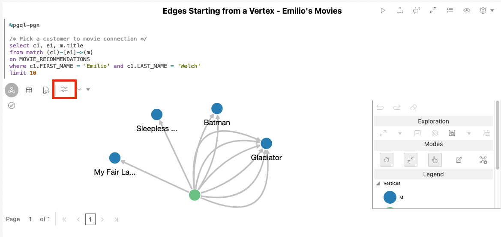
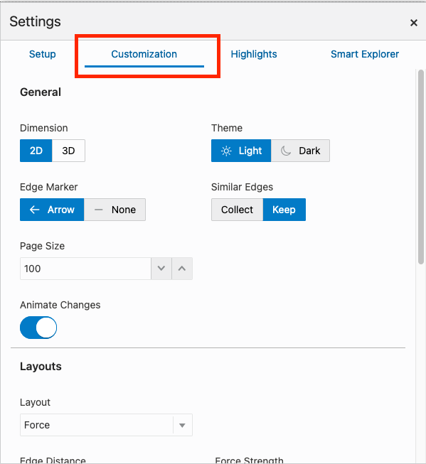
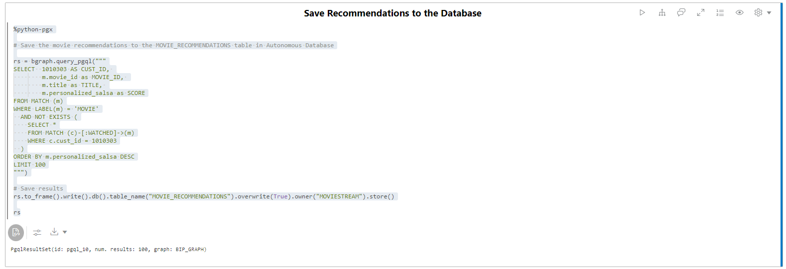

# Graph Studio: Query, visualize, and analyze a graph using PGQL and Python

## Introduction

In this lab you will query the newly create graph (that is, `moviestream`) in PGQL paragraphs of a notebook.

Estimated Time: 30 minutes.

### Objectives

Learn how to
- Import a notebook
- Create a notebook and add paragraphs
- use Graph Studio notebooks and PGQL and Python paragraphs to query, analyze, and visualize a graph.

### Prerequisites

- Earlier labs of this workshop. That is, the graph user exists and you have logged into Graph Studio.

## Task 1: Import the notebook

 You can import a notebook that has the graph queries and analytics. Each paragraph in the notebook has an explanation.  You can review the explanation, and then run the query or analytics algorithm.   

  [Click here to download the notebook.](files/movie_recommendations_psalsa.dsnb) and save it to a folder on your local computer.  This notebook includes graph queries and analytics for the MOVIE_RECOMMENDATIONS graph.

 1. Import a notebook by clicking on the notebook icon on the left, and then clicking on the **Import** icon on the far right.

    
    
    Select or drag and drop the noteboook and click **Import**.

    

    A dialog pops up named **Environment Attaching"**. It will disappear when the compute environment finishes attaching, usuallly in less than one minute. Or you can click **Dismiss** to close the dialog and start working on your environment. Note that you will not be able to run any paragraph until the environment finishes attaching.

    


 2. Review the description before each paragraph.   Review the graph queries and analytics.   You can then run the query by clicking on the triangle on the top right if you would like to do so.  Below is an example of running a query in a paragraph.  

    

    You can click on the **Settings** icon to change the visualization parameters.

    

    

    >**Note:** You can execute the paragraphs in sequence and experiment with visualizations settings as described in **Task 3** below.

## Task 2: Create a notebook and add paragraphs (optional if you haven't imported the notebook)

1. Go to the **Notebooks** page and click the **Create** button.

    

2. Enter the notebook Name. Optionally, you can enter Description and Tags. Click **Create**.

    

3. To add a paragraph, hover over the top or the bottom of an existing paragraph.

    

    There are 7 different interpreters. Each option creates a paragraph with a sample syntax that can be customized.

    

    In this lab, we will select the  **Add Paragraph** interpreter.

## Task 3: Load and query the "Moviestream" and visualize the results

>**Note:** *Execute the relevant paragraph after reading the description in each of the steps below*.
If the compute environment is not ready as yet and the code cannot be executed then you will see a blue line moving across the bottom of the paragraph to indicate that a background task is in progress.  


1. First, load the graph into the in-memory graph server if it is not already loaded since we will execute some graph algorithms.

    Run the first **%python-pgx** paragraph which uses the built-in session object to read the graph into memory from the database and creates a PgXGraph object which is a handle to the loaded graph.

    The code snippet in that paragraph is:  

     ```
     <copy>%python-pgx

     GRAPH_NAME="MOVIE_RECOMENDATIONS"
     # try getting the graph from the in-memory graph server
     graph = session.get_graph(GRAPH_NAME);
     # if it does not exist read it into memory
     IF (graph == None) :
         session.read_graph_by_name(GRAPH_NAME, "pg_view")
         print("Graph "+ GRAPH_NAME + " successfully loaded")
         graph = session.get_graph(GRAPH_NAME)
     ELSE :
         print("Graph '"+ GRAPH_NAME + "' already loaded")</copy>
     ```

      

2. Next, execute the paragraph which queries and displays 100 movies connected to a specific customer.    

     ```
     <copy>%pgql-pgx

     /* Pick a customer to movie connection */
     SELECT c1, e1, m.title
     FROM MATCH (c1)-[e1]->(m)
     ON MOVIE_RECOMMENDATIONS
     WHERE c1.FIRST_NAME = 'Emilio' and c1.LAST_NAME = 'Welch'
     LIMIT 100</copy>
     ```

    

3. This shows the number of movies Emilio has watched.

     ```
     <copy>%pgql-pgx

     /* Number of movies Emilio has watched */
     SELECT COUNT(distinct m.title) AS Num_Watched 
     FROM MATCH (c) -[e]-> (m) 
     ON MOVIE_RECOMMENDATIONS 
     WHERE c.cust_id = 1010303</copy>
     ```

    Change the view to table.

    

4. Let's get some details on the movies Emilio has watched ordered by number of times he has watched the movies  

    Run the paragraph with the following query.

     ```
     <copy>%pgql-pgx

    /* Pick a customer to movie connection */
     SELECT c1, e1, m.title
     FROM MATCH (c1)-[e1]->(m)
     ON MOVIE_RECOMMENDATIONS
     WHERE c1.FIRST_NAME = 'Emilio' AND c1.LAST_NAME = 'Welch'
     ORDER BY in_degree(m) desc
     LIMIT 100</copy>
     ```

     

5. It would be interesting to see the movies that Emilio and Floyd have both watched. 

    Run the paragraph with the following query. 

     ```
     <copy>%pgql-pgx

     /* Find movies that both customers are connecting to */
     SELECT c1, e1, m.title, e2, c2
     FROM MATCH (c1)-[e1]->(m)<-[e2]-(c2) 
     ON MOVIE_RECOMMENDATIONS
     WHERE c1.FIRST_NAME = 'Floyd' AND c1.LAST_NAME = 'Bryant' AND
     c2.FIRST_NAME = 'Emilio' AND c2.LAST_NAME = 'Welch'
     LIMIT 100</copy>
     ```

     

6. Let's get some details about Emilio by executing the next paragraph.
 
     ```
     <copy>%pgql-pgx

     /* Get some details about Emilio */
     SELECT  v.first_name, 
         v.last_name,
         v.income_level,
         v.gender,
         v.city
     FROM MATCH(v) ON MOVIE_RECOMMENDATIONS 
     WHERE v.cust_id = 1010303</copy>
     ```

     

7.  Now let's use python with graph algorithms to recommend movies.
    Let's list the graphs in memory before running some algorithms.

    Execute the following query.

     ```
     <copy>%python-pgx

     # List the graphs that are in memory
     session.get_graphs()</copy>
     ```

    

8. We need to first create a bipartite graph so that we can run algorithms such as PerSonalized SALSA which take a bipartite graph as input.  
    
    Execute the following query.

     ```
     <copy>%python-pgx

     # Get the MOVIE_RECOMMENDATIONS graph assuming it is in memory
     graph = session.get_graph("MOVIE_RECOMMENDATIONS")

     # Create a bipartite graph BIP_GRAPH from MOVIE_RECOMMENDATIONS so that we can run algorithms, such as Personalized SALSA, which take a bipartite graph as input
     bgraph = graph.bipartite_sub_graph_from_in_degree(name="BIP_GRAPH")</copy>
     ```

      

9. Let's apply the Personlized SALSA algorithm to recommend movies to Emilio

    Execute the paragraph containing the following code snippet.
 
     ```
     <copy>%python-pgx
     # Query the graph to get Emilio's vertex.
     rs = bgraph.query_pgql("SELECT v FROM MATCH(v) WHERE v.cust_id = 1010303")

     # set the cursor to the first row then get the vertex (element)
     rs.first()

     # get the element by its name in the query, i.e. get_vertex("v") or by its index as in get_vertex(1)
     cust = rs.get_vertex("v")

     # Use Personalized Salsa Assigns a score to
     analyst.personalized_salsa(bgraph, cust)</copy>
     ```

      

10. The following query will display the movies that have the highest personlized salsa scores and have not been previously watched by Emilio.

     ```
     <copy>%pgql-pgx

     /* Select the movies that have the highest personalized salsa scores
     and were not previously watched by Emilio */  
     SELECT m.title, m.personalized_salsa
     FROM MATCH (m) ON BIP_GRAPH
     WHERE LABEL(m) = 'MOVIE'
     AND NOT EXISTS (
      SELECT *
      FROM MATCH (c)-[:WATCHED]->(m) ON BIP_GRAPH
      WHERE c.cust_id = 1010303
      )
     ORDER BY m.personalized_salsa DESC
     LIMIT 20</copy>
     ```

    Change the view to treemap.

      

11. Lastly we will save the recommendations to the database.

     ```
     <copy>%python-pgx

     # Save the movie recommendations to the MOVIE_RECOMMENDATIONS table in Autonomous Database
     rs = bgraph.query_pgql("""
     SELECT  1010303 AS CUST_ID, 
         m.movie_id as MOVIE_ID, 
         m.title as TITLE, 
         m.personalized_salsa as SCORE
     FROM MATCH (m)
     WHERE LABEL(m) = 'MOVIE'
     AND NOT EXISTS (
      SELECT *
      FROM MATCH (c)-[:WATCHED]->(m)
      WHERE c.cust_id = 1010303
     )
     ORDER BY m.personalized_salsa DESC
     LIMIT 100
     """)

     # Save results
     rs.to_frame().write().db().table_name("MOVIE_RECOMMENDATIONS").overwrite(True).owner("MOVIESTREAM").store()

     rs</copy>
     ```  

      

12. By running this query we are listing the top 20 customers with similar viewing habits to Emilio based on the highest personalized salsa score.

     ```
     <copy>%%pgql-pgx

     /* List top 20 customers with similar viewing habits to Emilio, i.e. those with the highest score/rank */
     SELECT c.first_name, c.last_name, c.personalized_salsa 
     FROM MATCH (c) on BIP_GRAPH
     WHERE c.cust_id <> 1010303 
     ORDER BY c.personalized_salsa DESC 
     LIMIT 20</copy>
     ```

    Change the view to table.

     

13. Let's take a look at the movies Emilio has watched most often. 

    Execute the paragraph containing the following code snippet.
 
     ```
     <copy>%pgql-pgx

     /* Movies Emilio has watched most often */
     SELECT m.title, count (m.title) AS NumTimesWatched 
     FROM MATCH (c) -[e]-> (m) ON MOVIE_RECOMMENDATIONS
     WHERE c.cust_id = 1010303 
     GROUP BY m.title 
     ORDER BY NumTimesWatched DESC )</copy>
     ```

     

14. Now, let's take a look at the movies Timmy has watched more often. 

     ```
     <copy>%pgql-pgx

     /* Movies Emilio has watched most often */
     SELECT m.title, COUNT (m.title) AS NumTimesWatched 
     FROM MATCH (c) -[e]-> (m) ON MOVIE_RECOMMENDATIONS
     WHERE c.cust_id = 1010303 
     GROUP BY m.title 
     ORDER BY NumTimesWatched DESC)</copy>
     ```

     

15. Let's find the movies that have the highest personalized salsa score which Emilio haven't watched previously. 

     ```
     <copy>%pgql-pgx

     /* Select the movies that have the highest personalized salsa scores
     and were not previously watched by Emilio */
     SELECT m.title, m.personalized_salsa
     FROM MATCH (m) ON BIP_GRAPH
     WHERE LABEL(m) = 'MOVIE'
     AND NOT EXISTS (
     SELECT *
     FROM MATCH (c)-[:WATCHED]->(m) ON BIP_GRAPH
     WHERE c.cust_id = 1010303
     )
     AND EXISTS (
     SELECT *
     FROM MATCH (c)-[:WATCHED]->(m) ON BIP_GRAPH
     WHERE c.first_name = 'Timmy' and c.last_name = 'Gardner'
     )
     ORDER BY m.personalized_salsa DESC
     LIMIT 20</copy>
     ```

     

    This concludes this lab.

## Acknowledgements
* **Author** - Melli Annamalai, Product Manager, Oracle Spatial and Graph
* **Contributors** -  Jayant Sharma
* **Last Updated By/Date** - Ramu Murakami Gutierrez, Product Manager, Oracle Spatial and Graph, February 2023
