# Query and visualize the graph

## Introduction

In this lab you will query the newly create graph (that is, `bank_graph`) in PGQL paragraphs of a notebook.

Estimated Time: 30 minutes.

Watch the video below for a quick walk-through of the lab.
[Query and visualize the property graph](videohub:1_e7nc0l1w)

### Objectives

Learn how to
- Import a notebook
- Create a notebook and add paragraphs
- Use Graph Studio notebooks and PGQL and Python paragraphs to query, analyze, and visualize a graph

### Prerequisites

- Earlier labs of this workshop. That is, the graph user exists, you have logged into Graph Studio, and created a graph

## Task 1: Import the notebook (OPTION A)

The instructions below show you how to create each notebook paragraph, execute it, and change default visualization settings as needed.  
First **import** the sample notebook and then execute the relevant paragraph for each step in task 2.   

1. Download the exported notebook using this [link](https://objectstorage.us-ashburn-1.oraclecloud.com/p/KmTb9tbRVUUxgbPOoqbuMd4uWmZLUEvg251Q5vJ08JPOmhDdjxOxQ-4y7Q9Or89f/n/c4u04/b/livelabsfiles/o/labfiles/BANK_GRAPH.dsnb).

2. Click the **Notebooks** menu icon and then on the **Import** notebook icon on the top right.  

    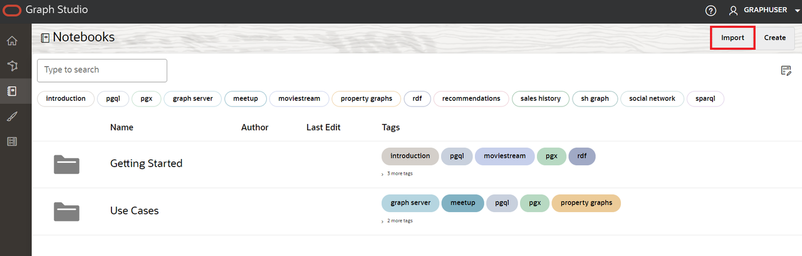  

3. Drag the downloaded file or navigate to the correct folder and select it for upload.  
    
    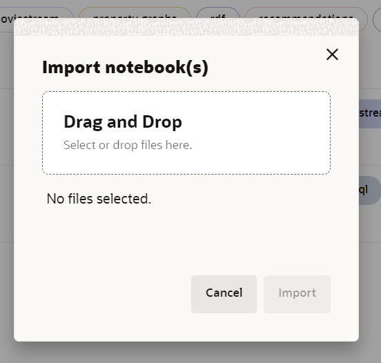  

4. Click **Import**.
  
    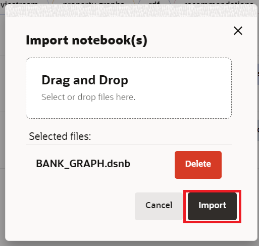 

5. Once imported, it should open in Graph Studio.  

    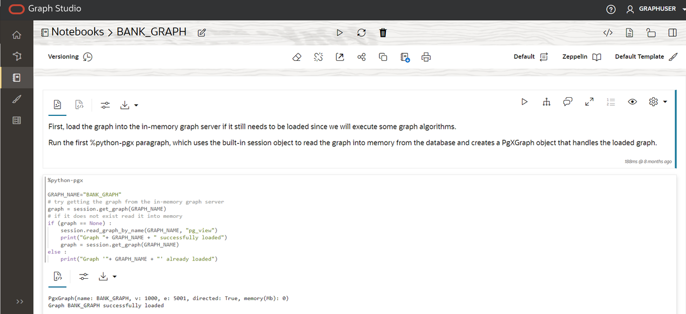  

    You can execute the paragraphs in sequence and experiment with visualizations settings as described in **Task 2** below.  

## Task 2: Create a notebook in Graph Studio and add a paragraph (OPTION B) 

1. Go to the **Notebooks** page and click the **Create** button.

    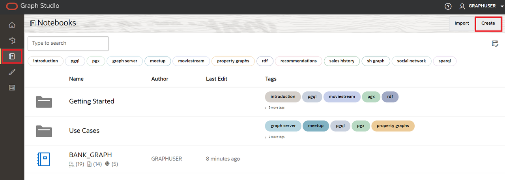

2. Enter the notebook Name. Optionally, you can enter Description and Tags. Click **Create**.

    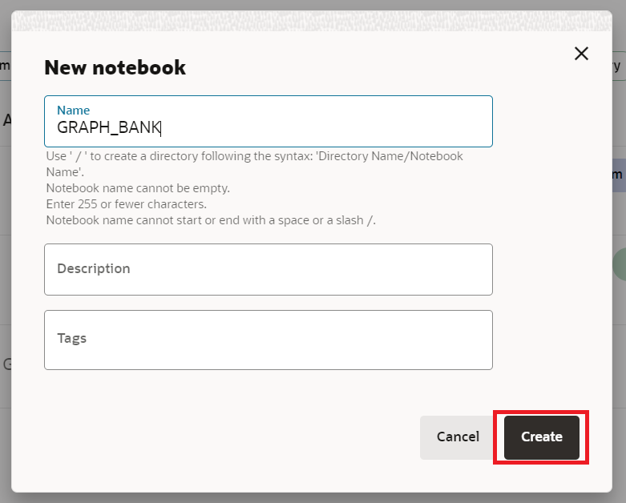

3. To add a paragraph, hover over the top or the bottom of an existing paragraph.

    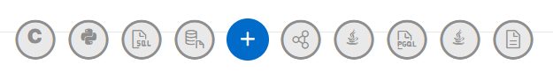

    There are 9 different interpreters. Each option creates a paragraph with a sample syntax that can be customized.

    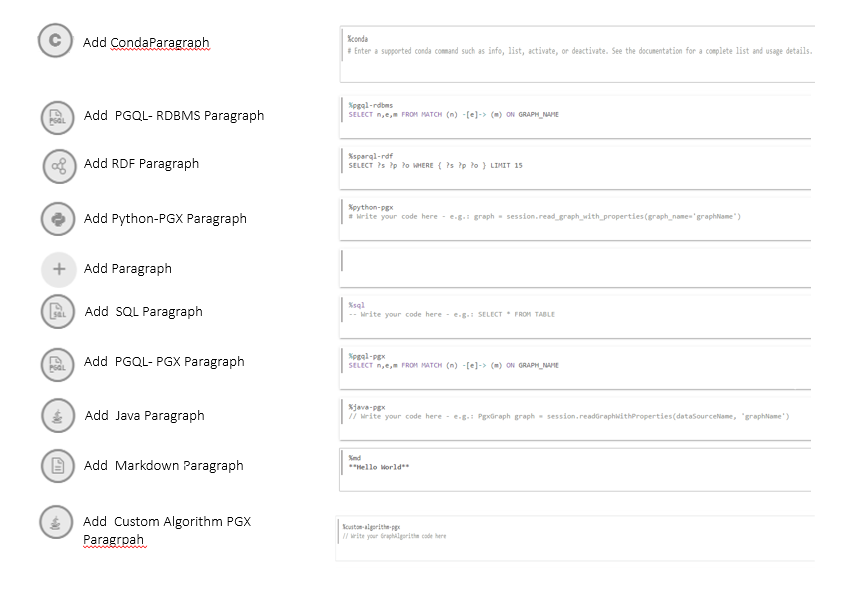

    In this lab, we will select the  **Add Paragraph** interpreter.

## Task 3: Load and query the `BANK_GRAPH` and visualize the results

In this task, we will run the graph queries and use the settings tool to customize the graphs. If you have imported the notebook in task 1, you do not need to customize the visualizations to achieve the end result. However, you can manipulate the settings to explore different available options.

>**Note:** *Execute the relevant paragraph after reading the description in each of the steps below*.
If the compute environment is not ready as yet and the code cannot be executed then you will see a blue line moving across the bottom of the paragraph to indicate that a background task is in progress.  

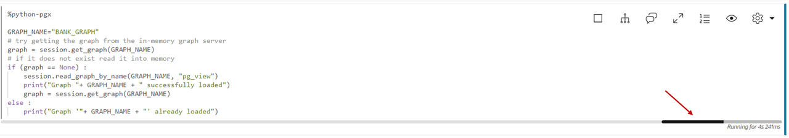

1. First, load the graph into the in-memory graph server if it still needs to be loaded since we will execute some graph algorithms.

    Run the first **%python-pgx** paragraph, which uses the built-in session object to read the graph into memory from the database and creates a PgXGraph object that handles the loaded graph.

    The code snippet in that paragraph is:  

     ```
     <copy>
     %python-pgx

    GRAPH_NAME="BANK_GRAPH"
    # try getting the graph from the in-memory graph server
    graph = session.get_graph(GRAPH_NAME)
    # if it does not exist read it into memory
    if (graph == None) :
         session.read_graph_by_name(GRAPH_NAME, "pg_view")
         print("Graph "+ GRAPH_NAME + " successfully loaded")
         graph = session.get_graph(GRAPH_NAME)
    else :
         print("Graph '"+ GRAPH_NAME + "' already loaded")</copy>
     ```

    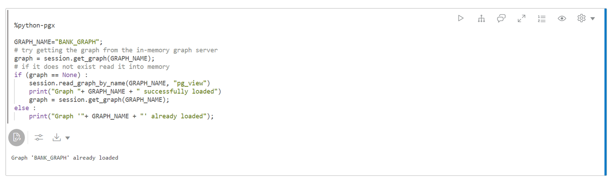  

2. Next, execute the paragraph that queries and displays 100 graph elements.   

     ```
     <copy>%pgql-pgx
     /* Query and visualize 100 elements (nodes and edges) of BANK_GRAPH */
     SELECT *
     FROM match (s)-[t]->(d) on bank_graph
     LIMIT 100</copy>
     ```

    The above PGQL query fetches the first 100 elements of the graph and displays them.  
    The **MATCH** clause specifies a graph pattern.  
    - `(s)` is the source node
    - `[t]` is an edge
    - `->` indicates the edge direction, that is, from the source `s` to a destination `d`
    - `(d)` is the destination node

    The **LIMIT** clause specifies the maximum of elements that the query should return.

    See the [PGQL site](https://pgql-lang.org) and specification for more details on the syntax and features of the language.  
    The Getting Started notebook folder also has a tutorial on PGQL.  

3. The result utilizes some features of the visualization component.
    The `acct_id` property is used for the node (or vertex) labels and the graph is rendered using a selected graph layout algorithm.  

    >**Note:** *You do not need to execute the following steps. They just outline the steps used. Feel free to experiment and modify the visualizations.*  

    Steps required for customizing the visualization:  

    Click the visualization `settings` icon

     (the fourth icon from the left at the top of the visualization panel).  

    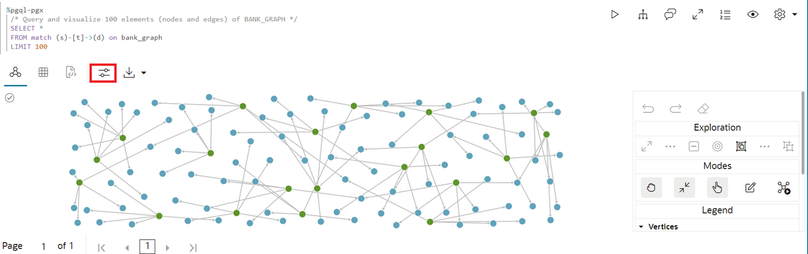 

    In this `Settings` dialog, click the **Customization** tab.
    Then scroll down and pick `ACCT_ID` from the `Labeling`, `Vertex Label` drop-down list (we do this for every visualization).  

    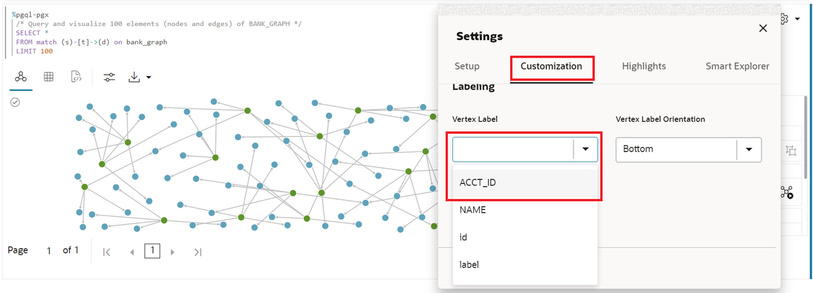  

    Click the **X** on the top-right to exit the Settings dialog. The resulting visualization should be similar to the screenshot below.   

    >**Note:** The colors and layout shown in the screenshots may differ from those in your results.

    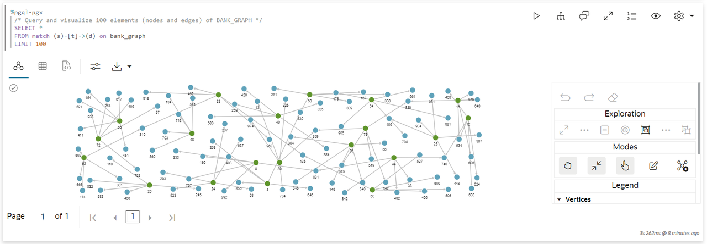   

    Now open the visualization settings again, click the **Customization** tab, and choose a different layout (**Concentric**) from the Layout drop-down    list. Exit the Settings dialog.

    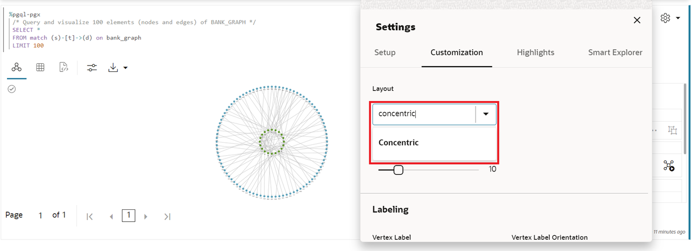

4. This shows the use of bind parameters in a query. The account id value is entered at runtime.
    Enter **534** as the account id, and execute the paragraph.

     ```
     <copy>%pgql-pgx
     /* Check if there are any circular payment chains of between 1 and 5 hops starting from the user-supplied account # */
     SELECT v,e,v2
     FROM MATCH ANY (a)-[:TRANSFERS]->{1,5}(b) ON bank_graph ONE ROW PER STEP (v,e,v2)
      WHERE a.acct_id=${account_id} AND id(a) = id(b)</copy>
    ```

    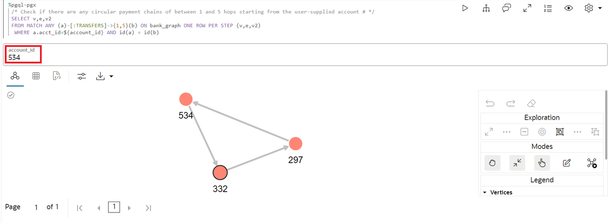

5. Next let's use PGQL to find the top 10 accounts regarding of number of transfers.  
    PGQL has built-in functions `IN_DEGREE` and `OUT_DEGREE`, which return the number of incoming and outgoing edges of a node. So we can use them in this query.   

    Run the paragraph with the following query.

     ```
     <copy>%pgql-pgx
     /* List 10 accounts with the most number of transactions (that is, incoming + outgoing edges) */
     SELECT a.acct_id, (in_degree(a) + out_degree(a)) AS num_transactions
     FROM MATCH (a) ON bank_graph
     ORDER BY num_transactions DESC
     LIMIT 10</copy>
     ```

    Change the view to table.

    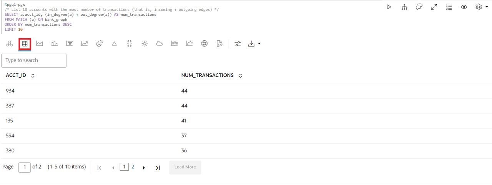  

    We see that accounts **934** and **387** are high on the list.  

6.  Now check if there are any **circular** transfers originating and terminating at account **934**.
    We start with the **number of hops equals 4** as specified as **[:TRANSFERS]->{4}**.
    **ONE ROW PER STEP** lets us see all the circles' vertices.  

     Execute the following query.

     ```
     <copy>%pgql-pgx
     /* Check if there are any circular payment chains of length 4 from acct 934 */
     SELECT v,e,v2
     FROM MATCH ALL (a)-[:TRANSFERS]->{4}(b) ON bank_graph ONE ROW PER STEP (v,e,v2)
     WHERE a.acct_id=934 AND id(a) = id(b)
     LIMIT 100</copy>
     ```

    >**Note:** *You do not need to execute the following steps. They just outline the steps used. Feel free to experiment and modify the visualizations.*   

    Steps required for customizing the visualization:  
    In this `Settings` dialog, click the **Highlights** tab.

    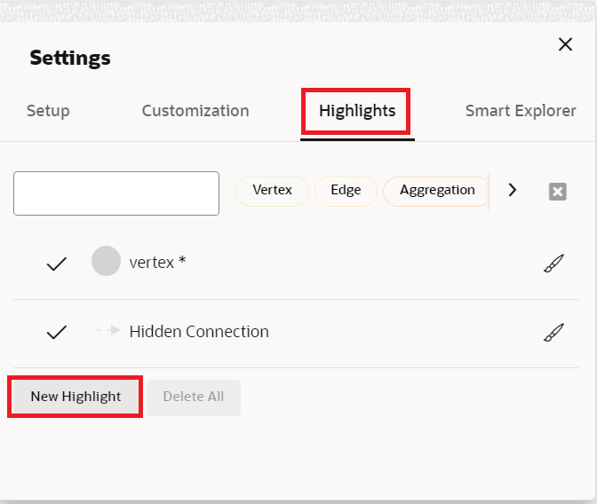

    Add a new highlight with **ACCT_ID = 934** as the condition, **size = 3.4X** and **color = red** as the visual effect. Click **Create** and then the **X** on the top-right to exit the Settings dialog.

    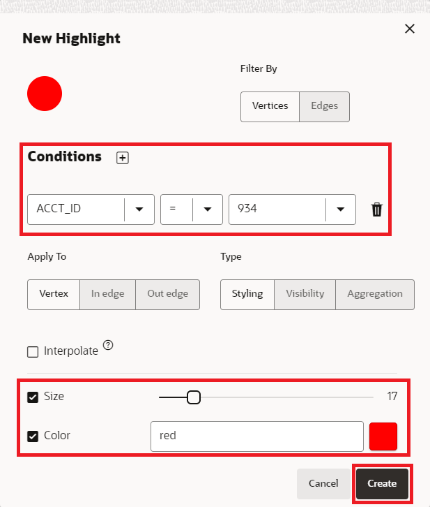

    drag the circles to arrange the visualization.

    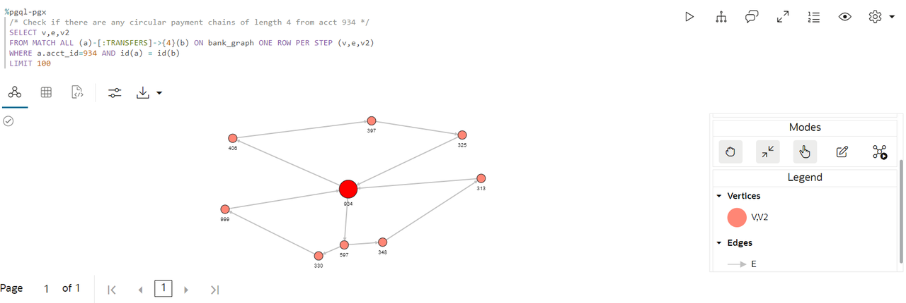

    Here `[:TRANSFERS]->{4}` is a [reachability path expression](https://pgql-lang.org/spec/1.3/#reachability). It only tests for the existence of the path.  
    `:TRANSFERS` specifies that all edges in the path must have the label `TRANSFERS`.  
    While `{4}` specifies a path length of exactly 3 hops.  

    We see there are circles **3** hops in length that start and end in account **934**.

7. We can change the above query to check what the number of circular payment chains are if we choose **5** hops.  
    Execute the following query.

     ```
     <copy>%pgql-pgx
     /* Check if there are any circular payment chains of length 5 from acct 934 */
     SELECT v,e,v2
     FROM MATCH ALL (a)-[:TRANSFERS]->{5}(b) ON bank_graph ONE ROW PER STEP (v,e,v2)
     WHERE a.acct_id=934 AND id(a) = id(b)
     LIMIT 100</copy>
     ```

    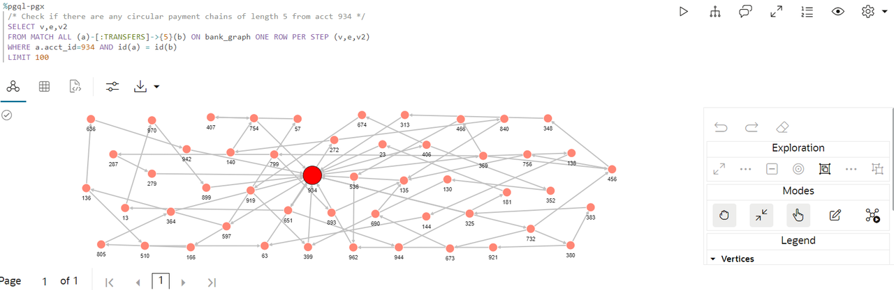  

    The number of circular payment chains that start and end in **934** makes that account look suspicious.

8. Let us continue our investigation using another algorithm, the **PageRank** graph algorithm. A **%python-pgx** paragraph lets you execute Python code snippets.
    We will use the Python API to execute the **PageRank** algorithm.
    The code snippet below creates a PgxGraph object containing a handle to the BANK_GRAPH loaded into the in-memory graph server. Then it executes the PageRank algorithm using the built-in **analyst** Python object. The **session** and **analyst** objects are created when the in-memory graph server is instantiated and when a notebook is opened.

    Execute the paragraph containing the following code snippet.

     ```
     <copy>%python-pgx
    graph = session.get_graph("BANK_GRAPH")
    analyst.pagerank(graph);</copy>
     ```

      

9. Now let's list the PageRank values in descending order to find the accounts with high PageRank values.
A high PageRank value indicates that that account is important, which in the context of BANK_GRAPH means a high number of transfers have flown through that account, or the account is connected to accounts that have a high number of transfers flowing through them.

     ```
     <copy>%pgql-pgx
     /* List accounts in descending order of pagerank values*/
     SELECT a.acct_id, a.pagerank as pageRank
     FROM MATCH (a) ON bank_graph
     ORDER BY PageRank DESC
     LIMIT 10</copy>
     ```

    Change the view to table.

    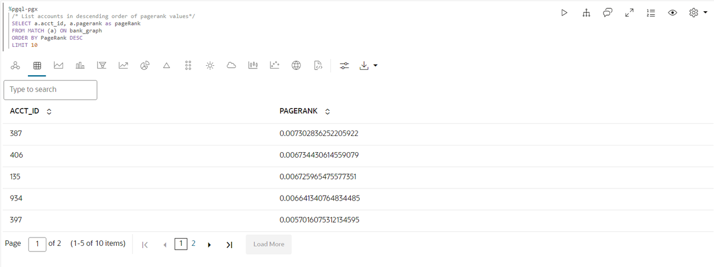  

10. We see that **934** is in the top 5. This metric also indicates that a large number of transactions flow through **934**.
    **387** is at the top of the list.
    Now let's use the computed PageRank value in visualizing the result of a PGQL query.  We use highlights to display the accounts with a high PageRank value with larger circles and red in color.
    Execute the paragraph with the following query, which finds the 6-hop payment chains starting at account #934.

     ```
     <copy>%pgql-pgx
     /* Add highlights to symbolize account nodes by PageRank values. This shows that 934 and highlights accounts with high PageRank  values that are connected to 934.
     Choose the hierarchical view. */
     SELECT v,e,v2
     FROM MATCH ANY (n)-[:Transfers]->{6}(m) ON bank_graph ONE ROW PER STEP (v,e,v2)
     WHERE n.acct_id = 934
     LIMIT 100</copy>
     ```  

    >**Note:** *You do not need to execute the following steps. They just outline the steps used. Feel free to experiment and modify the visualizations.*   

    Steps required for customizing the visualization:  

    Change the graph visualization layout to **Hierarchical**.

    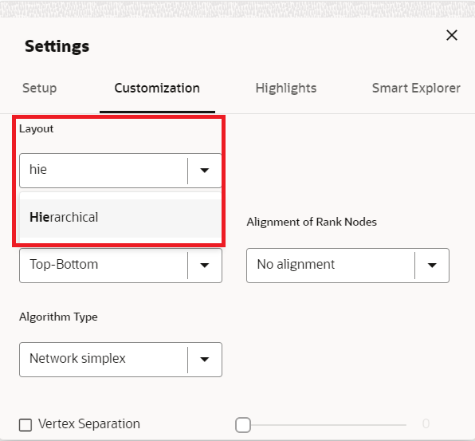  

    Add a new highlight with **pagerank >= 0.0035** as the condition, **size = 3X** as the visual effect and **color = red**, then click Create. Click **Create** and then the **X** on the top-right to exit the Settings dialog.  

    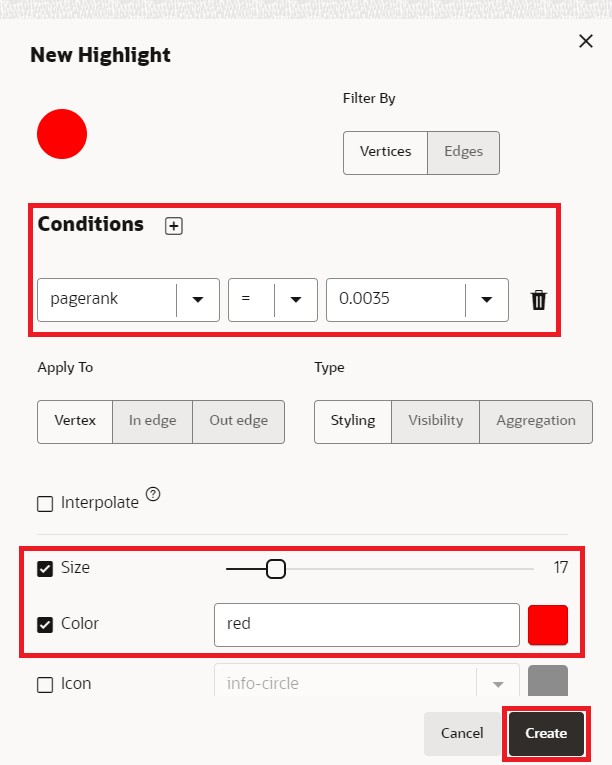   

    >**Note:** The colors and layout shown in the screenshots may differ from those in your results.

    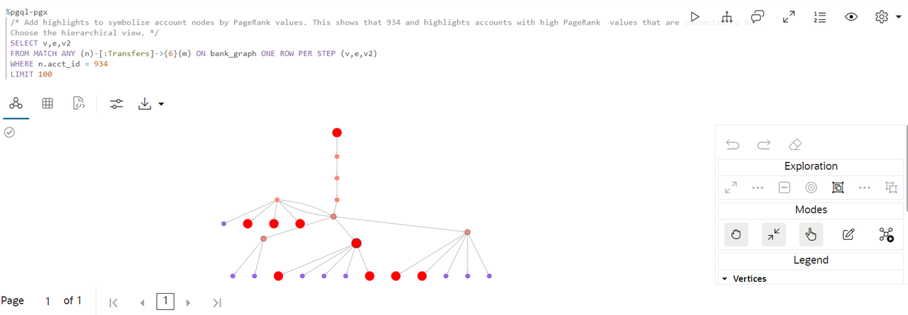

11. Now let us compare the **PageRank** values of accounts with the **number of transactions** going through those accounts (that we had looked at earlier).
    
    Change the view to table.

     ```
     <copy>%pgql-pgx
     /* List accounts in descending order of pagerank values*/
     SELECT a.acct_id, a.pagerank as pageRank
     FROM MATCH (a) ON bank_graph
     ORDER BY PageRank DESC
     LIMIT 5</copy>
     ```

    To display a table with the PageRank values.

     ```
     <copy>%pgql-pgx
     /* List 10 accounts with the most number of transactions (that is, incoming + outgoing edges) */
     SELECT a.acct_id, (in_degree(a) + out_degree(a)) as num_transactions
     FROM MATCH (a) ON bank_graph
     ORDER BY num_transactions DESC
     LIMIT 5</copy>
     ```

    To display a table with the number of transactions.

    The lists are not identical, because **PageRank** is a more complex measure of cash flow transactions.

    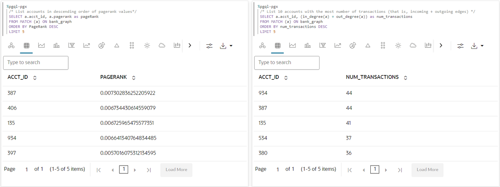

    **934,** which we already think is suspicious, is in the top 5, and **387** is at the top.  

12. Let us examine the paths that exist between **934** and **387**.   Other accounts on those paths might have to be investigated too.

     ```
     <copy>%pgql-pgx
     /* Check the shortest path between account 934 and account 387 */
     SELECT v,e,v2
     FROM MATCH SHORTEST (a)-[:TRANSFERS]->+(b) ON bank_graph ONE ROW PER STEP (v,e,v2)
     WHERE a.acct_id=934 AND b.acct_id=387</copy>
     ```

    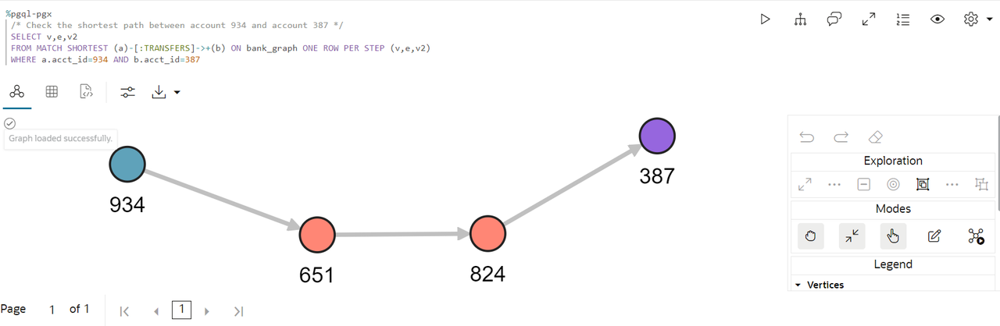

13. If you arrange the paths in ascending order by number of hops, these are the **top 3** and **top 5** paths.

     ```
     <copy>%pgql-pgx
     /* Find the top 3 shortest paths between account 934 and account 387 */
     SELECT v,e,v2
     FROM MATCH TOP 3 SHORTEST (a)-[:TRANSFERS]->+ (b) ON bank_graph ONE ROW PER STEP (v,e,v2)
     WHERE a.acct_id=934 AND b.acct_id=387</copy>
     ```

    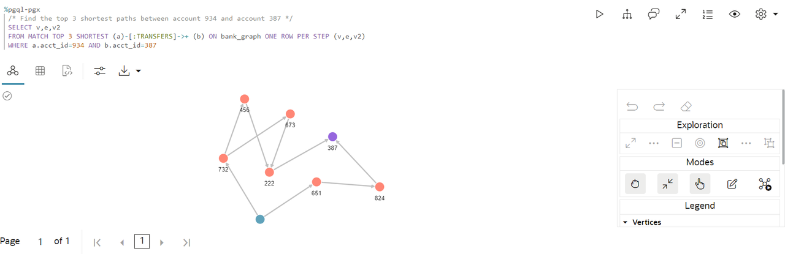

     ```
     <copy>%pgql-pgx
     /* Find the top 5 shortest path between account 934 and account 387 */
     SELECT v,e,v2
     FROM MATCH TOP 5 shortest (a)-[:TRANSFERS]->+ (b) ON bank_graph ONE ROW PER STEP (v,e,v2)
     WHERE a.acct_id=934 AND b.acct_id=387</copy>
    ```

    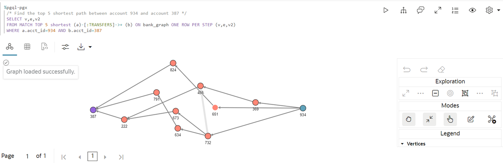

    The fraud department has now also confirmed that **934** and **387** might have been involved in illegal activities.
    Chances are, that accounts which received money from account **934** or **387**
    have also been part of the scheme, and also maybe the accounts that received money from them, too. The "closer" an account is to **934** or **387** the
    higher the risk.

14. We use the **Personalized PageRank algorithm**, which computes **PageRank** values _relative_ to a collection of vertices, which in this case is **934** and **387**.
    We use the Python API again.
    The code snippet uses the PgxGraph object **graph** containing a handle to the BANK_GRAPH that we got earlier.
    It invokes the **Personalized PageRank algorithm** with the built-in analyst python object.

     ```
     <copy>%python-pgx

    vertices = graph.create_vertex_set()
    vertices.add_all([graph.get_vertex("BANK_ACCOUNTS(934)"),graph.get_vertex("BANK_ACCOUNTS(387)")])

    analyst.personalized_pagerank(graph, vertices)</copy>
     ```

    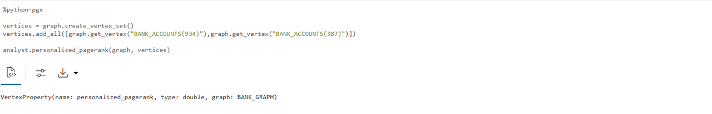

     ```
     <copy>%pgql-pgx
     SELECT a.acct_id, a.personalized_pagerank as risk FROM MATCH (a) ON bank_graph
     ORDER BY risk DESC</copy>
     ```

    Change the view to table.

    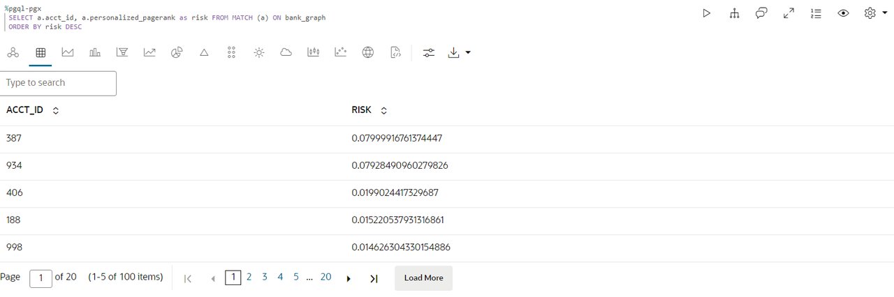

    **934** and **387** naturally have a high personalized rank value, the next account on the list is **406**.

15. Let us look at the immediate neighbors of account **406**.
    Execute the paragraph which queries and displays account **406** and its neighbors.  

     ```
     <copy>%pgql-pgx
     /* show the transactions for acct id 406 */
     SELECT *
     FROM MATCH (v1)-[e1]->(a)-[e2]->(v2) ON bank_graph
     WHERE a.acct_id=406</copy>
     ```

    >**Note:** *You do not need to execute the following steps. They just outline the steps used. Feel free to experiment and modify the visualizations.*   

    Steps required for customizing the visualization:  

    Change the graph visualization layout to **Grid**.

    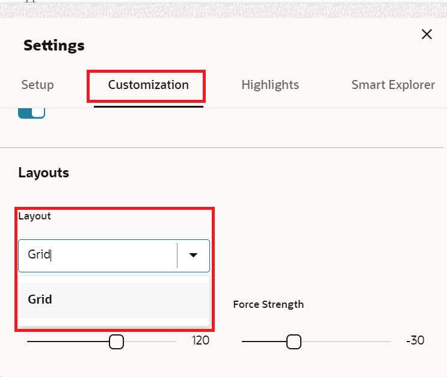    

    >**Note:** The colors and layout shown in the screenshots may differ from those in your results.

    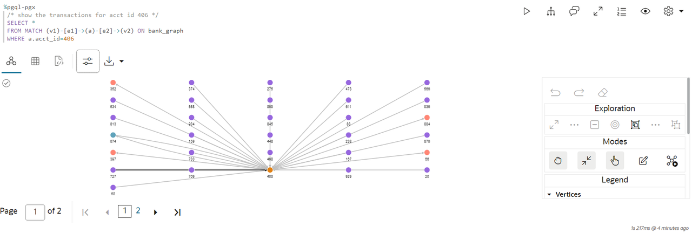

16. We can use another algorithm, the **``ShortestPathHopDist()``** analytics algorithm, to compute which accounts might be engaged in illegal activities because of their proximity to accounts **934** and **387**.
    **``ShortestPathHopDist()``** computes the minimum number of hops between **934** and **387** and every other account in the graph.  The higher the number of hops the farther away an account is from **934** and **387**, and hence lower the risk.
    We use the Python API again.

    The code snippet uses the PgxGraph object containing a handle to the BANK_GRAPH that we got earlier.

    It invokes the **``ShortestPathHopDist()``** algorithm with the built-in analyst python object.   It first obtains the vertex object corresponding to account **934** and then executes the algorithm.  Instead of using the default property name it specifies **hop\_dist\_from\_934** or **hop\_dist\_from\_387** as the respective properties to store the hop distances from these accounts.

    We repeat the same steps for account **387**.

    Execute the paragraphs containing the following code snippet.  

     ```
     <copy>%python-pgx
    #By default this is property refers to account #934
    vertex = graph.get_vertex("BANK_ACCOUNTS(934)")

    analyst.shortest_path_hop_distance(graph, vertex, "hop_dist_from_934")</copy>
     ```

    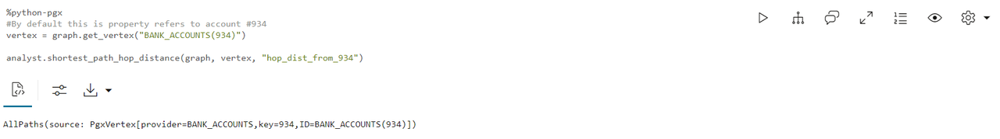  

     ```
     <copy>%python-pgx
    vertex = graph.get_vertex("BANK_ACCOUNTS(387)")

    analyst.shortest_path_hop_distance(graph, vertex, "hop_dist_from_387")</copy>
     ```

    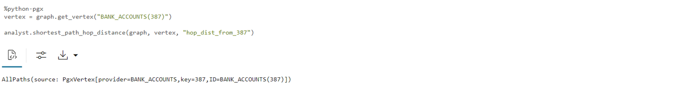  

17. We can GROUP BY the number of hops, and rank them in descending order.  

     ```
     <copy>%pgql-pgx
     /* show the number of accounts with a certain number of hops in descending order for #934*/
     SELECT COUNT(a.acct_id), a.hop_dist_from_934 AS hops FROM MATCH (a) ON bank_graph
     WHERE hops > 0
     GROUP BY hops
     ORDER BY hops</copy>
     ```

    Change the view to table.

     ```
     <copy>%pgql-pgx
     /* show the number of accounts with a certain number of hops in descending order for #387*/
     SELECT COUNT(a.acct_id), a.hop_dist_from_387 AS hops FROM MATCH (a) ON bank_graph
     WHERE hops > 0
     GROUP BY hops
     ORDER BY hops</copy>
     ```
    Change the view to table.

    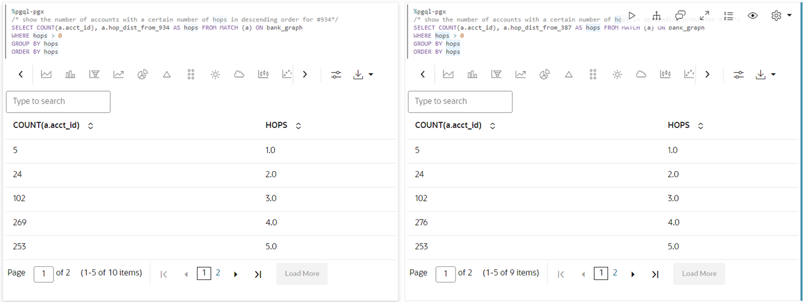    

18. Let's take a look at the number of transactions for accounts that have two hops or less from 932 or 387.

     ```
     <copy>%pgql-pgx
     SELECT a.acct_id, a.hop_dist_from_934 AS hops, in_degree(a) + out_degree(a) AS num_transactions FROM MATCH (a) ON bank_graph
     WHERE hops > 0 AND hops <=2
     ORDER BY num_transactions DESC</copy>
     ```

    Change the view to table.

     ```
     <copy>%pgql-pgx
     SELECT a.acct_id, a.hop_dist_from_387 AS hops, in_degree(a) + out_degree(a) AS num_transactions FROM MATCH (a) ON bank_graph
     WHERE hops > 0 AND hops <=2
     ORDER BY num_transactions DESC</copy>
     ```

    Change the view to table.

    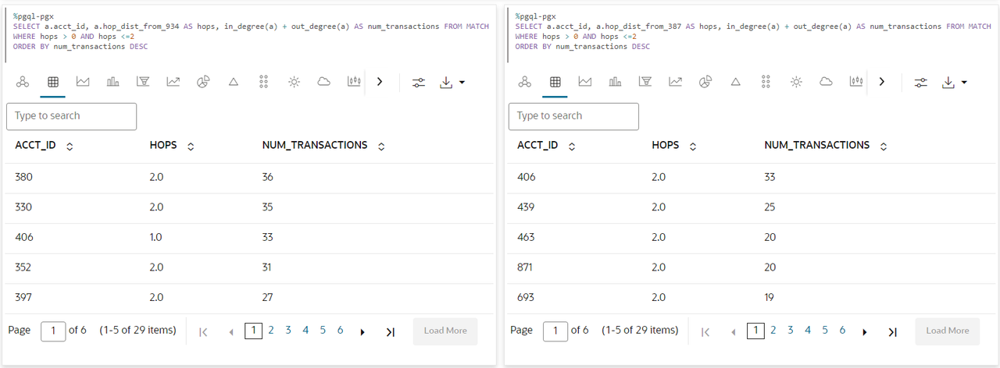   

19. We see account **406** reappearing with a high number of transactions and close to accounts **934** and **387**. 

    It also had a high **personalized PageRank** value.

    Now let's look at a graph showing 2-hops accounts from **934** and **387**. 

    Execute the paragraph that queries and displays how accounts **934** and **387** transfer directly to **406**.

     ```
     <copy>%pgql-pgx
     /* show 2-hop accounts from 934 and 387 */
     SELECT * FROM MATCH (a) -[e]-> (m)-[e1]->(d) ON BANK_GRAPH
     WHERE a.acct_id IN (934, 387)</copy>
     ```

    Steps required for customizing the visualization:  

    Change the graph visualization layout to **Hierarchical**.

    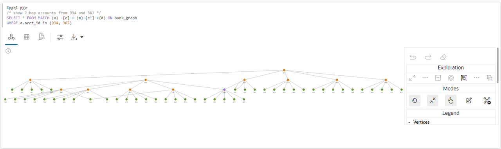  

    This concludes this lab.

## Acknowledgements
* **Author** - Jayant Sharma, Product Management
* **Contributors** -  Rahul Tasker, Jayant Sharma, Product Management
* **Last Updated By/Date** - Ramu Murakami Gutierrez, Product Management, June 2023 
