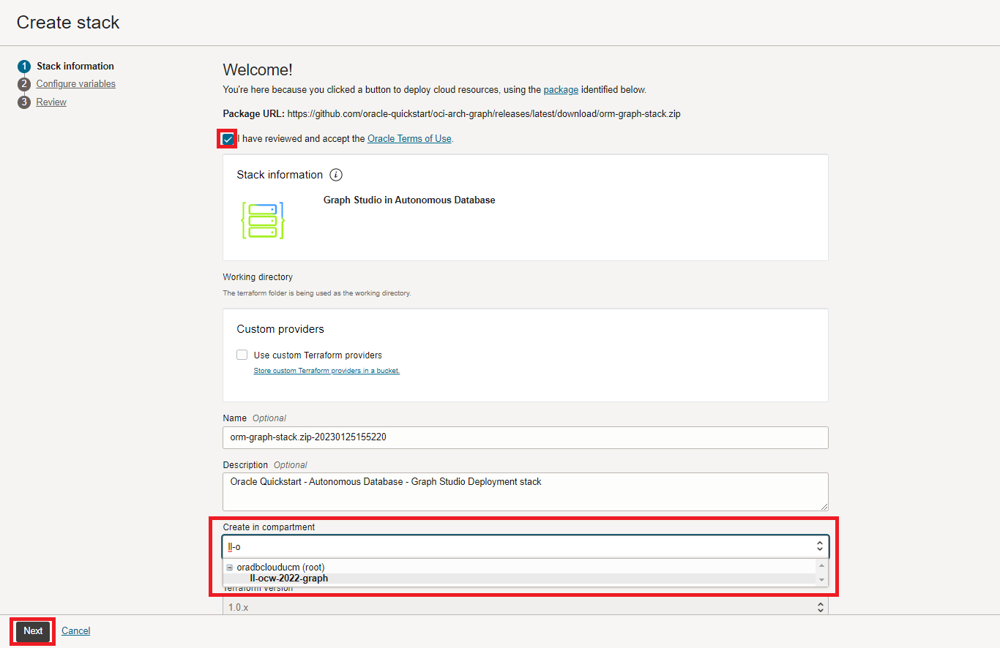
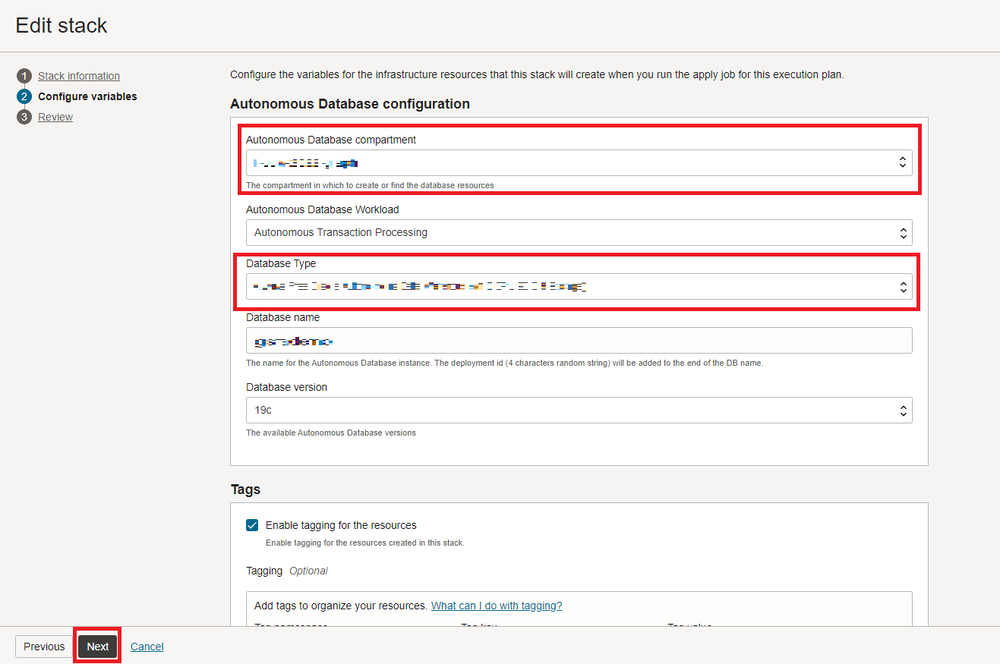

# Setup: Run stack

## Introduction

In this lab you will create a stack that will run a terraform script to generate an Autonomous Database, create a graph user, and upload the dataset that will be used.

Estimated Time: 5 minutes.

Watch the video below for a quick walk-through of the lab.
[Setup: Run stack](videohub:1_pjftt3v5)

### Objectives

Learn how to
- Run the stack to create an Autonomous Database, Graph user, and upload dataset
- Login to Graph Studio

## Task 1: Create OCI compartment

## Task 2: Run stack

The instructions below will show you how to run a stack that will automatically create an Autonomous Database containing a graph user and the dataset needed for the property graph queries.

1. Login to the Oracle Cloud.

2.  Once logged in, use this [link](https://cloud.oracle.com/resourcemanager/stacks/create?zipUrl=https://github.com/oracle-quickstart/oci-arch-graph/releases/latest/download/orm-graph-stack.zip) to create and run the Stack.
    > Note: the link will open in a new tab or window.

3. You will be directed to this page:

    

4.  Check the "I have reviewed and accept the Oracle Terms of Use" box and choose your compartment. Leave the rest as default. Click **Next**.

    

5. Select the **compartment** to create the Autonomous Database and the Database Type. Click **Next**. After that you will be taken to the Review page, click **Create**.

    

6. You will be taken to a Job Details page with an initial status shown in orange. The icon will become green once the job has successfully completed.

    

    To see information about your application click on **Application Information**. Save the graph username and password since you will be using it to login to Graph Studio.

    

## Task 3: Login to Graph studio

1. Click on **Open Graph Studio** under the Application Information. This will open a new page. Enter your graph username and password provided under Application Information, into the login screen.

    

2. Then click the **Sign In** button. You should see the studio home page.   

    

    Graph Studio consists of a set of pages accessed from the menu on the left.

    The **Home** icon takes you to the Home page.  
    The **Graph** page lists existing graphs for use in notebooks.  
    The **Notebook** page lists existing notebooks and lets you create a new one. 
    The **Templates** page let's you create templates for the graph visualizations.
    The **Jobs** page lists the status of background jobs and lets you view the associated log if any.
<!---
    The Home icon  takes you to the Home page.  
    The Graph page  lists existing graphs for use in notebooks.  
    The Notebook page  lists existing notebooks and lets you create a new one. 
    The Templates page   let's you create templates for the graph visualizations.
    The Jobs page  lists the status of background jobs and lets you view the associated log if any.
--->

This concludes this lab. **You may now proceed to the next lab.**  

## Acknowledgements
  * **Author** - Jayant Sharma, Ramu Murakami Gutierrez, Product Management
  * **Contributors** -  Rahul Tasker, Jayant Sharma, Ramu Murakami Gutierrez, Product Management
* **Last Updated By/Date** - Ramu Murakami Gutierrez, Product Manager, June 2023
