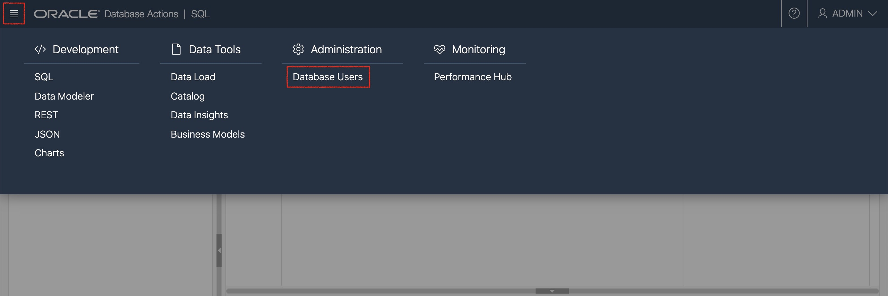
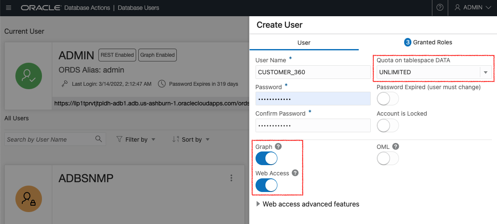
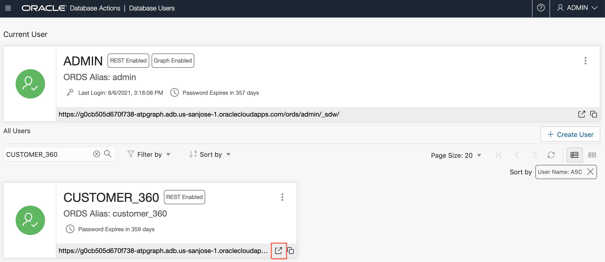

# Create and Enable a Database User in Database Actions

## Introduction

This lab walks you through the steps to get started with Database Actions. You will learn how to create a user in Database Actions and provide that user the access to Database Actions.

Estimated time: 3 minutes

### Objectives

- Learn how to setup the required database roles in Database Actions.
- Learn how to create a database user in Database Actions.

### Prerequisites

- Oracle cloud account
- Provisioned Autonomous Database

## Task 1: Login to Database Actions

Login as the Admin user in Database Actions of the newly created ADB instance.

Click the **Navigation Menu** in the upper left, navigate to **Oracle Database**, and select **Autonomous Transaction Processing**.


In Autonomous Database Details page, open **Tools** tab and click **Database Actions**. Make sure your brower allow pop-up windows.


Enter **ADMIN** as Username and go next.


Input the password (you set up at Lab 2) and sign in.


Go to **SQL** menu once you logged in as the **ADMIN** user. 


## Taks 2: Create database roles

Now create the roles required for the graph feature. Enter the following commands into the SQL Worksheet and run it while connected as the Admin user.

```
<copy>
DECLARE
  PRAGMA AUTONOMOUS_TRANSACTION;
  role_exists EXCEPTION;
  PRAGMA EXCEPTION_INIT(role_exists, -01921);
  TYPE graph_roles_table IS TABLE OF VARCHAR2(50);
  graph_roles graph_roles_table;
BEGIN
  graph_roles := graph_roles_table(
    'GRAPH_DEVELOPER',
    'GRAPH_ADMINISTRATOR',
    'PGX_SESSION_CREATE',
    'PGX_SERVER_GET_INFO',
    'PGX_SERVER_MANAGE',
    'PGX_SESSION_READ_MODEL',
    'PGX_SESSION_MODIFY_MODEL',
    'PGX_SESSION_NEW_GRAPH',
    'PGX_SESSION_GET_PUBLISHED_GRAPH',
    'PGX_SESSION_COMPILE_ALGORITHM',
    'PGX_SESSION_ADD_PUBLISHED_GRAPH');
  FOR elem IN 1 .. graph_roles.count LOOP
  BEGIN
    dbms_output.put_line('create_graph_roles: ' || elem || ': CREATE ROLE ' || graph_roles(elem));
    EXECUTE IMMEDIATE 'CREATE ROLE ' || graph_roles(elem);
  EXCEPTION
    WHEN role_exists THEN
      dbms_output.put_line('create_graph_roles: role already exists. continue');
    WHEN OTHERS THEN
      RAISE;
    END;
  END LOOP;
EXCEPTION
  when others then
    dbms_output.put_line('create_graph_roles: hit error ');
    raise;
END;
/
</copy>
```

Assign the default permissions to the roles, **GRAPH_ADMINISTRATOR** and **GRAPH_DEVELOPER**, to group multiple permissions together.
```
<copy>
GRANT PGX_SESSION_CREATE TO GRAPH_ADMINISTRATOR;
GRANT PGX_SERVER_GET_INFO TO GRAPH_ADMINISTRATOR;
GRANT PGX_SERVER_MANAGE TO GRAPH_ADMINISTRATOR;
GRANT PGX_SESSION_CREATE TO GRAPH_DEVELOPER;
GRANT PGX_SESSION_NEW_GRAPH TO GRAPH_DEVELOPER;
GRANT PGX_SESSION_GET_PUBLISHED_GRAPH TO GRAPH_DEVELOPER;
GRANT PGX_SESSION_MODIFY_MODEL TO GRAPH_DEVELOPER;
GRANT PGX_SESSION_READ_MODEL TO GRAPH_DEVELOPER;
</copy>
```

## Task 3: Create a database user

Now create the **CUSTOMER_360** user and provide Database Actions access for this user.

Open the main menu and click "Database Users".



Click **Create User** button, input user name and password. Enable **Web Access** and set the quota to **UNLILMITED**.



Go to **Granted Roles** tab and grant **`GRAPH_DEVELOPER`** role and **`PGX_SESSION_ADD_PUBLISHED_GRAPH`** role to this user. (Two roles **CONNECT** and **RESOURCE** are selected by default. Please keep them checked so they will be also granted.)


Proceed with **Create User**, and open the login window.



Confirm that you can login with the new user.


For details, see the ["Provide Database Actions Access to Database Users"](https://docs.oracle.com/en/cloud/paas/autonomous-data-warehouse-cloud/user/sql-developer-web.html#GUID-4B404CE3-C832-4089-B37A-ADE1036C7EEA) section in the documentation.

You may now proceed to the next lab.

## Acknowledgements

* **Author** - Jayant Sharma, Product Manager, Spatial and Graph
* **Contributors** - Arabella Yao, Jenny Tsai
* **Last Updated By/Date** - Ryota Yamanaka, April 2022
