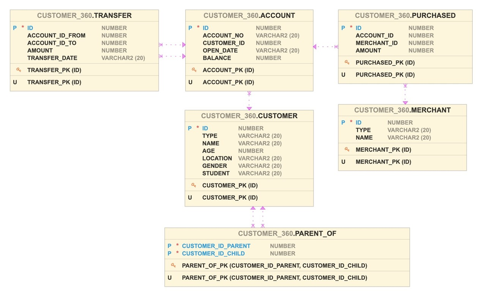
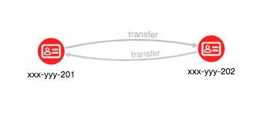
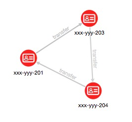
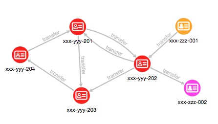

# Query and Analyze the Graph

## Introduction

This example shows how integrating multiple datasets and using a graph facilitate additional analytics and can lead to new insights. We will use three small datasets for illustrative purposes. The first contains accounts and account  owners. The second is purchases by the people who own those accounts. The third is transactions between these accounts.

The combined dataset is then used to perform the following common graph query and analyses: pattern matching, detection of cycles, finding important nodes, community detection.

The following ER diagram depicts the relationships between the datasets.



Estimated Lab Time: 10 minutes

### Objectives

- Learn how to analyze a graph using pattern-matching queries, and graph algorithms.

### Prerequisites

- The Python client up and running

## Task 1: Access the graph

Assuming that the **`customer_360`** graph was already loaded into memory in the previous lab. If you have published the graph, you can also access the graph from others sessions, too.

```python
<copy>
graph = session.get_graph("customer_360")
</copy>
```

Now we can query this graph and run some analyses on it.

## Task 2: Your first pattern-matching query

PGQL is convenient for detecting specific patterns in graphs.

Find accounts that had an inbound and an outbound transfer, of over 500, on the same day. The PGQL statement for this is:

```python
<copy>
graph.query_pgql("""
    SELECT a.account_no
         , a.balance
         , t1.amount AS t1_amount
         , t2.amount AS t2_amount
         , t1.transfer_date
    FROM MATCH (a)<-[t1 IS transfer]-(b)
       , MATCH (a)-[t2 IS transfer]->(c)
    WHERE t1.transfer_date = t2.transfer_date
      AND t1.amount > 500
      AND t2.amount > 500
""").print()
</copy>

+---------------------------------------------------------------+
| account_no  | balance | t1_amount | t2_amount | transfer_date |
+---------------------------------------------------------------+
| xxx-yyy-202 | 200.0   | 900.0     | 850.0     | 2018-10-06    |
+---------------------------------------------------------------+
```

## Task 3: Detect cycles in the graph

Next, we use PGQL to find a series of transfers that start and end at the same account, such as A to B to A, or A to B to C to A.

The first query could be expressed as:

```python
<copy>
graph.query_pgql("""
    SELECT a.account_no     AS a_account
         , t1.transfer_date AS t1_date
         , t1.amount        AS t1_amount
         , b.account_no     AS b_account
         , t2.transfer_date AS t2_date
         , t2.amount        AS t2_amount
    FROM MATCH (a)-[t1:transfer]->(b)-[t2:transfer]->(a)
    WHERE t1.transfer_date < t2.transfer_date
""").print()
</copy>

+-----------------------------------------------------------------------------+
| a_account   | t1_date    | t1_amount | b_account   | t2_date    | t2_amount |
+-----------------------------------------------------------------------------+
| xxx-yyy-201 | 2018-10-05 | 200.0     | xxx-yyy-202 | 2018-10-10 | 300.0     |
+-----------------------------------------------------------------------------+
```

This result will be visualized in the next section:



The second query just adds one more transfer to the pattern (list) and could be expressed as:

```python
<copy>
graph.query_pgql("""
    SELECT a.account_no  AS a_account
         , t1.amount     AS t1_amount
         , b.account_no  AS b_account
         , t2.amount     AS t2_amount
         , c.account_no  AS c_account
         , t3.amount     AS t3_amount
    FROM MATCH (a)-[t1:transfer]->(b)-[t2:transfer]->(c)-[t3:transfer]->(a)
    WHERE t1.transfer_date < t2.transfer_date
      AND t2.transfer_date < t3.transfer_date
""").print()
</copy>

+-----------------------------------------------------------------------------+
| a_account   | t1_amount | b_account   | t2_amount | c_account   | t3_amount |
+-----------------------------------------------------------------------------+
| xxx-yyy-201 | 500.0     | xxx-yyy-203 | 450.0     | xxx-yyy-204 | 400.0     |
+-----------------------------------------------------------------------------+
```

This result will be visualized in the next section:



## Task 4: Find influential accounts

Let's find which accounts are influential in the graph. There are various algorithms to score the importance and centrality of vertices in a graph. We'll use the built-in PageRank algorithm as an example. We will filter the graph to contain only accounts and transfers between (edges labeled as **TRANSFER**).

1. Create a subgraph using filter expressions (cf. [Filter Expressions](https://docs.oracle.com/cd/E56133_01/latest/prog-guides/filter.html)).

    ```python
    <copy>
    from pypgx.api.filters import EdgeFilter
    edge_filter = EdgeFilter.from_expression("edge.label() = 'TRANSFER'")
    graph.filter(edge_filter, vertex_properties=True, edge_properties=True, name='customer_360_txns')
    graph2 = session.get_graph("customer_360_txns")
    </copy>

    PgxGraph(name: customer_360_txns, v: 6, e: 8, directed: True, memory(Mb): 0)
    ```

2. Run [PageRank Algorithm](https://docs.oracle.com/cd/E56133_01/latest/reference/analytics/algorithms/pagerank.html). PageRank Algorithm assigns a numeric weight to each vertex, measuring its relative importance within the graph.

    ```python
    <copy>
    analyst.pagerank(graph2);
    </copy>

    VertexProperty(name: pagerank, type: double, graph: customer_360_txns)
    ```

3. Show the result.

    ```python
    <copy>
    graph2.query_pgql("""
        SELECT a.account_no, a.pagerank
        FROM MATCH (a)
        ORDER BY a.pagerank DESC
    """).print()
    </copy>

    +-------------------------------------+
    | a.account_no | a.pagerank           |
    +-------------------------------------+
    | xxx-yyy-201  | 0.18012007557258927  |
    | xxx-yyy-204  | 0.1412461615467829   |
    | xxx-yyy-203  | 0.1365633635065475   |
    | xxx-yyy-202  | 0.12293884324085073  |
    | xxx-zzz-212  | 0.05987452026569676  |
    | xxx-zzz-211  | 0.025000000000000005 |
    +-------------------------------------+
    ```

## Task 5: Community Detection

Let's find which subsets of accounts form communities. That is, there are more transfers among accounts in the same subset than there are between those and accounts in another subset. We'll use the built-in weakly/strongly connected components algorithm on the subgraph created in the previous task.

1. Run the [Weakly Connected Component](https://github.com/oracle-samples/pgx-samples/blob/master/built-in-algorithms/md/pgx_builtin_g3_weakly_connected_components.md) (WCC) algorithm. The resulting component ID is added as a new property named **WCC** for use in PGQL queries.

    ```python
    <copy>
    analyst.wcc(graph2)
    </copy>

    PgxPartition(graph: customer_360_txns, components: 1)
    ```

    Query the subgraph using the new property **wcc**.

    ```python
    <copy>
    graph2.query_pgql("""
        SELECT a.wcc AS component_id
             , COUNT(*) AS count
        FROM MATCH (a)
        GROUP BY a.wcc
        ORDER BY a.wcc
    """).print()
    </copy>

    +----------------------+
    | component_id | count |
    +----------------------+
    | 0            | 6     |
    +----------------------+
    ```

    In this case, all six accounts form one component by the WCC algorithm.

2. Run the [Strongly Connected Component](https://docs.oracle.com/cd/E56133_01/latest/reference//analytics/algorithms/scc.html) Kosaraju algorithm. The resulting component ID is added as a new property named **scc_kosaraju** for use in PGQL queries.

    ```python
    <copy>
    analyst.scc_kosaraju(graph2)
    </copy>

    PgxPartition(graph: customer_360_txns, components: 3)
    ```

    List the returned components and the number of vertices in each.

    ```python
    <copy>
    graph2.query_pgql("""
        SELECT a.scc_kosaraju AS component_id
             , COUNT(*) AS count
        FROM MATCH (a)
        GROUP BY a.scc_kosaraju
        ORDER BY a.scc_kosaraju
    """).print()
    </copy>

    +----------------------+
    | component_id | count |
    +----------------------+
    | 0            | 1     |
    | 1            | 4     |
    | 2            | 1     |
    +----------------------+
    ```

    List the other accounts in the same connected component as John's account (= **xxx-yyy-201**).

    ```python
    <copy>
    graph2.query_pgql("""
        SELECT a.account_no
        FROM MATCH (a)
           , MATCH (b)
        WHERE b.account_no = 'xxx-yyy-201'
        AND a.scc_kosaraju = b.scc_kosaraju
        ORDER BY a.account_no
    """).print()
    </copy>

    +-------------+
    | account_no  |
    +-------------+
    | xxx-yyy-201 |
    | xxx-yyy-202 |
    | xxx-yyy-203 |
    | xxx-yyy-204 |
    +-------------+
    ```

    

    In this case, the accounts **xxx-yyy-201** (John's account), **xxx-yyy-202**, **xxx-yyy-203**, and **xxx-yyy-204** form one partition, account **xxx-zzz-211** is a parition, and account **xxx-zzz-212** is a partition, by the SCC Kosaraju algorithm.

You may now proceed to the next Lab.

## Acknowledgements

- **Author** - Jayant Sharma
- **Contributors** - Arabella Yao, Jenny Tsai
- **Last Updated By/Date** - Karin Patenge, Oracle Database Product Management Spatial and Graph, July 2024
