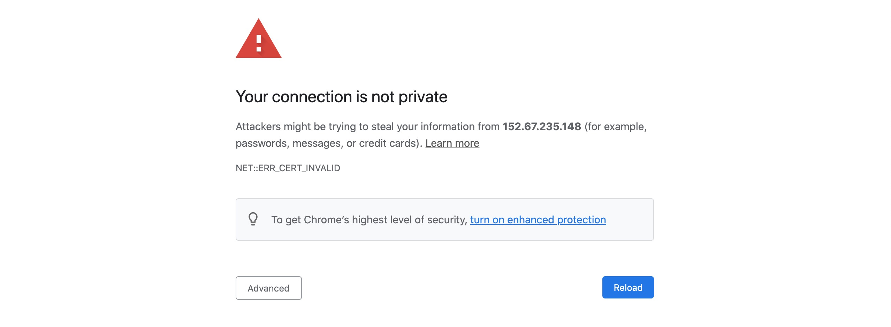
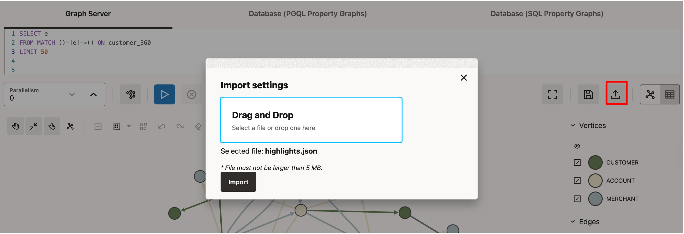

# Visualize the Graph

## Introduction

The results of the analyses done in the previous labs can easily be visualized using Graph Visualization feature.

Estimated time: 5 minutes

The following video provides an overview of the Graph Visualization component (= GraphViz).

[youtube](youtube:zfefKdNfAY4)

### Objectives

- Learn how to execute PGQL graph queries and visualize the results.

### Prerequisites

- The graph is created and published
- The Graph Server (with GraphViz) is up and running

## Task 1: Login to GraphViz

Open the GraphViz at **`https://<public_ip_for_compute>:7007/ui`** using a web browser. Replace **`<public_ip_for_compute>`** with the one for your Graph Server compute instance.

Since the marketplace image is distributed with a self-signed SSL certificate, you should change it for your own certificate in production use. Meanwhile, web browsers should show warnings, while we understand that it is safe.

If you use **Chrome**, type **thisisunsafe** in the warning window to move to the GraphViz screen.



Using **Firefox**, click **Advanced** and then **Accep the Risk and Continue**.


You should see a screen similar to the screenshot below. Enter the username (**customer_360**) and password, then click submit. **Graph Server** is the default in the Advanced Options, so you don't need to change it.


## Task 2: Modify query

Modify the query to get the first 5 rows, i.e. change **LIMIT 100** to **LIMIT 5**, and click Run.

You should see a graph similar to the screenshot below.


## Task 3: Add highlights

Now let's add some labels and other visual context. These are known as highlights. Click [here](https://objectstorage.us-ashburn-1.oraclecloud.com/p/VEKec7t0mGwBkJX92Jn0nMptuXIlEpJ5XJA-A6C9PymRgY2LhKbjWqHeB5rVBbaV/n/c4u04/b/livelabsfiles/o/data-management-library-files/highlights.json.zip) to download a zip file, highlights.json.zip. Unzip this file and note where it is unzipped.

Click on the Load button under **Settings** (on the right side of the screen). Browse to the appropriate folder and choose the file and click Open to load that.



The graph should now look like


## Task 4: Pattern matching with PGQL

1. Next let's run a few PGQL queries.

    The [pgql-lang.org](http://pgql-lang.org) site and [Specification](http://pgql-lang.org/spec/1.4) are the best references for details and examples. For the purposes of this lab, however, here are minimal basics.

    The general structure of a PGQL query is:

    ```
    SELECT <select_list>
    FROM MATCH <graph_pattern> ON <graph_name>
    WHERE <condition>
    ```

    PGQL provides a specific construct known as the **MATCH** clause for matching graph patterns. A graph pattern matches vertices and edges that satisfy the given conditions and constraints.  
    - **(v)** indicates a vertex variable **v**   
    - **-** indicates an undirected edge, as in (source)-(dest)  
    - **->** an outgoing edge from source to destination  
    - **<-** an incoming edge from destination to source  
    - **[e]** indicates an edge variable **e**

    Also, please omit the **graph_name** here, as it is selected from the GraphViz UI.

2. Let's find accounts that have had an outbound and and inbound transfer of over 500 on the same day.

    The PGQL query for this is:

    ```
    <copy>
    SELECT *
    FROM MATCH (a)-[t1:transfer]->(a1)
       , MATCH (a2)-[t2:transfer]->(a)
    WHERE t1.transfer_date = t2.transfer_date
      AND t1.amount > 500
      AND t2.amount > 500
    </copy>
    ```

    In the first **MATCH** clause above, **(a)** indicates the source vertex and **(a1)** the destination, while **[t1:transfer]** is the edge connecting them. The **:transfer** specifies that the **t1** edge has the label **TRANSFER**. The comma (,) between the two patterns is an AND condition.

3. Copy and paste the query into the PGQL Graph Query text input box of the GraphViz application. Click Run.

    The result should look as shown below. In the highlight settings, the accounts starting with **xxx-yyy-** are shown in red (= accounts of the bank), while **xxx-zzz-** are shown in orange (= accounts from another bank). 

    

4. The next query finds patterns of transfers to and from the same two accounts, i.e. from a1->a2 and back a2->a1.

    The PGQL query for this is:
    ```
    <copy>
    SELECT *
    FROM MATCH (a1)-[t1:transfer]->(a2)-[t2:transfer]->(a1)
    WHERE t1.transfer_date < t2.transfer_date
    </copy>
    ```

5. Copy and paste the query into the PGQL Graph Query text input box of the GraphViz application. Click Run.

    The result should look as shown below.

    

6. Let's add one more account to that query to find a circular transfer pattern between 3 accounts.

    The PGQL query becomes:
    ```
    <copy>
    SELECT *
    FROM MATCH (a1)-[t1:transfer]->(a2)-[t2:transfer]->(a3)-[t3:transfer]->(a1)
    WHERE t1.transfer_date < t2.transfer_date
      AND t2.transfer_date < t3.transfer_date
    </copy>
    ```

7. Copy and paste the query into the PGQL Graph Query text input box of the GraphViz application. Click Run.

    The result should look as shown below.

    

## Acknowledgements

* **Author** - Jayant Sharma
* **Contributors** - Arabella Yao, Jenny Tsai
* **Last Updated By/Date** - Ryota Yamanaka, April 2022
