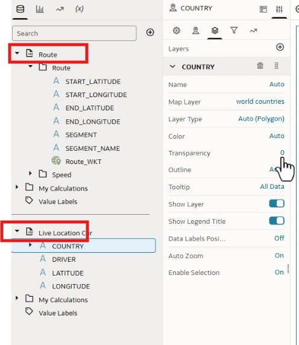
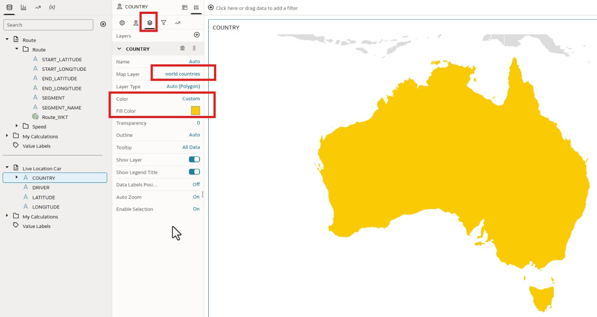
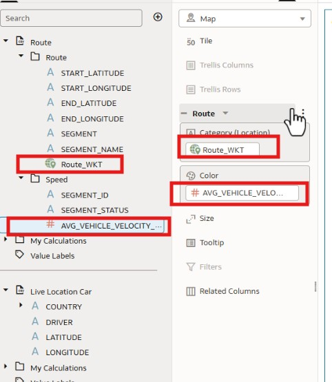
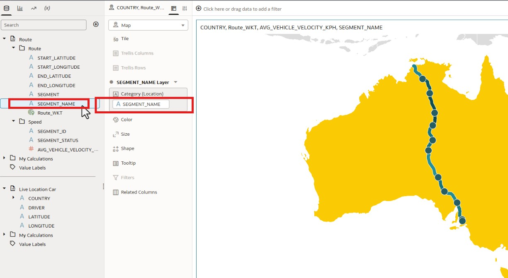
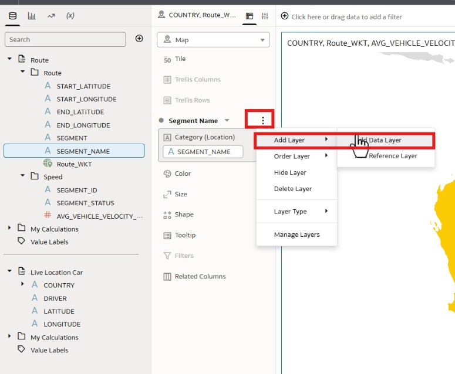
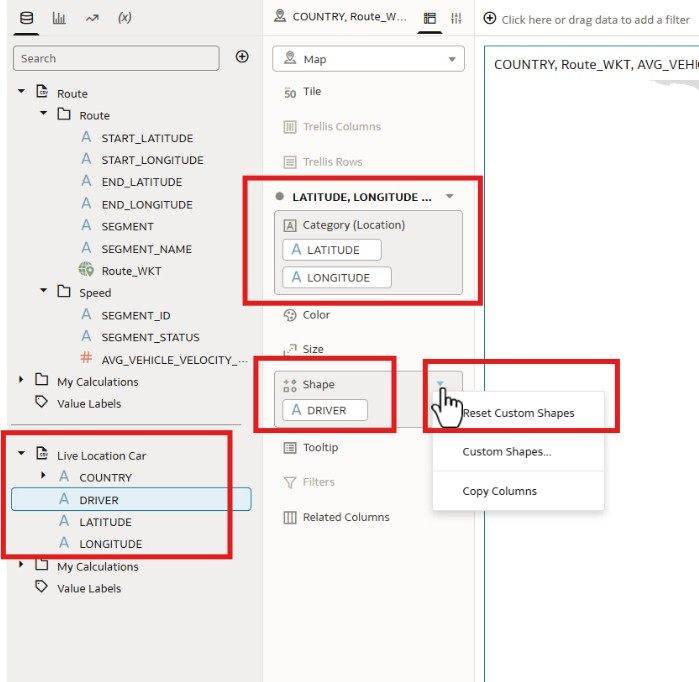
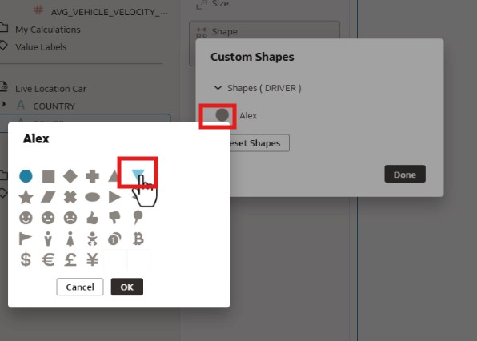
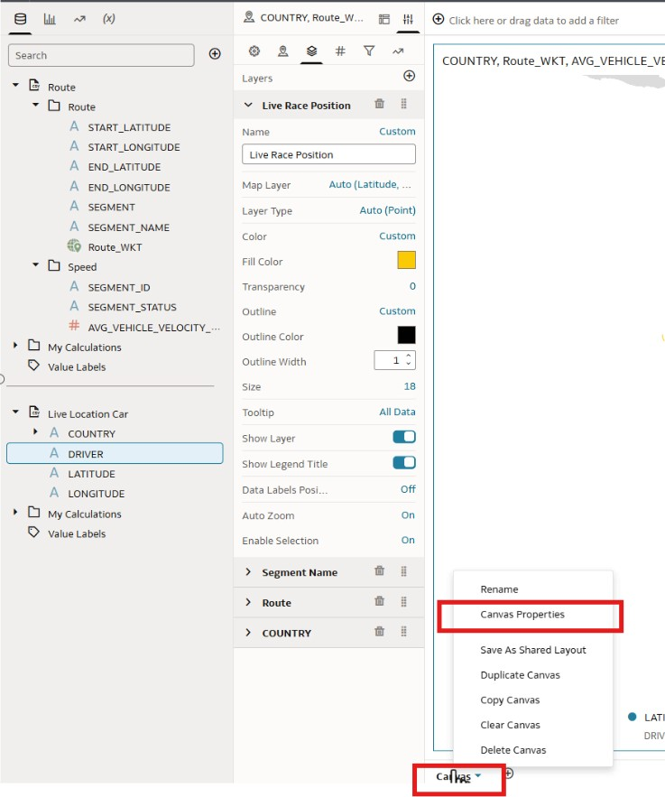

# Build Australia route race map: Add layers and background

## Introduction

In this exercise, you will generate a map of Australia and apply a background color. You will then add multiple layers to the map, including the route, speed, labels, and the car’s live location.

_Estimated Time:_ 30 minutes

### Objectives

In this lab, you will:

- Generate a map of Australia and give it a color
- Add multiple layers to the map
- Add layers to the map
- Add color background

### Prerequisites

This lab assumes you have:

- An Oracle Free Tier, Always Free, Paid or Live Labs Cloud Account
- Provisioned Oracle Analytics Cloud
- All previous labs successfully completed

## Task 1: Import the data sets created in lab 2

1. Go to Create and select workbook (**Create**)

    

2. Import the data sets created in lab 3 , using the + icon . **Use the Add Data to upload the data sets one by one in this workbook**

    

3. The data pane looks like this when the data sets get uploaded.

    

## Task 2: Create Australia map and add map color to it

1. Double Click Country column from live locations data set and change viz to maps

    

2. Select the Map layer and change it to world countries and change color to #fbcb05

    

    You have now created a map of Australia and applied color to it.
    Next we will layer it with speed, route and add labels.

## Task 3: Add layers to the map

1. Add a new layer to the map by selecting the three dots. Select add Data Layer

    

2. Add Route_WKT column in the category and Avg_vehicle_velocity to the Color section

    

3. Go to Layers and rename the layer to Route and change color to #0b4574

    

4. Add another layer by selecting the three dots

    

5. Add Segment name in the Category

    

6. Go to the layers and change the name to Segment Name , color to Black and outline to custom size of 8, change the data labels option to  right and set columns to SEGMENT_NAME

    

7. Add layer 4 to the map

    

8. Add latitude and longitude to layer 4

    

9. In the shape section, select the down arrow to reset the custom shapes and change the shape to down triangle

    

10. Go to layers and rename this layer to live race position, change color to #fbcb05, change outline to custom and size it to 18

    

## Task 4: Add color background

1. Go to canvas properties.

    

2. Select the custom option for the background and change the color as #0b4574

    

    Your visualization should look like this.

    

Congratulations on completing this workshop!

## **Acknowledgements**

- **Author** - Anita Gupta (Oracle Analytics Product Strategy)
- **Contributors** - Gautam Pisharam (Oracle Analytics Product Management)
- **Last Updated By/Date** -